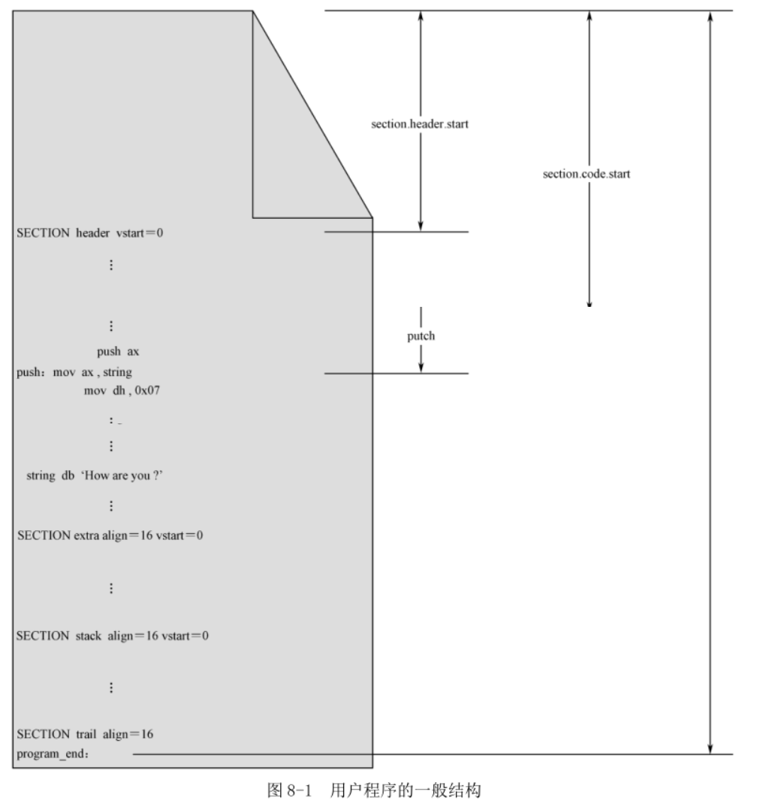
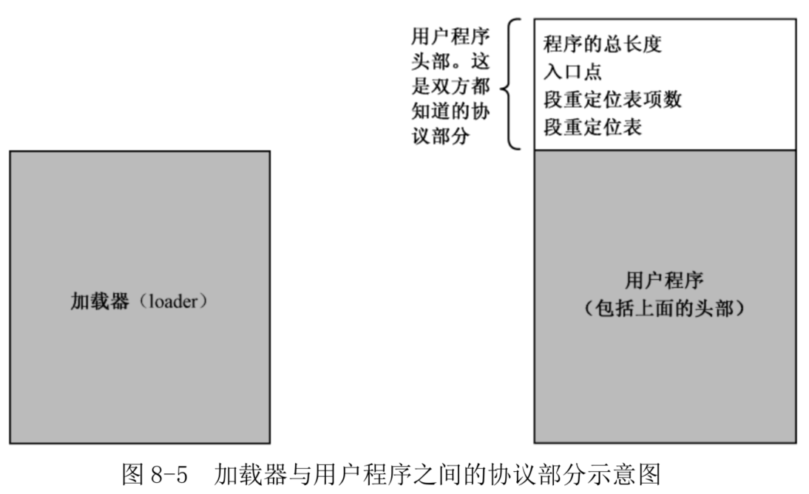
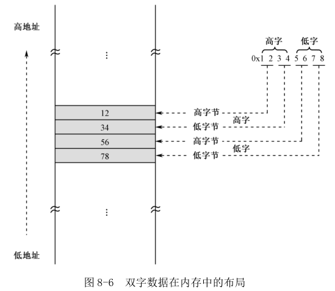

## 1. 分段、段的汇编地址和段内汇编地址

处理器的工作模式是将内存分成逻辑上的段, 指令的获取和数据的访问一律按"段地址: 偏移地址"的方式进行. 相对应地, 一个规范的程序, 应当包括代码段、数据段、附加段和堆栈段.

图 8-1 给出了整个源程序的组织结构.

NASM 编译器使用汇编指令"SECTION"或者"SEGMENT"来定义段.

```
SECTION 段名称
```

```
SEGMENT 段名称
```

**段名称, 它主要用来引用一个段, 可以是任意名字**.

NASM 编译器不关心段的用途, 可能也根本不知道段的用途, 不知道它是数据段, 还是代码段, 或是堆栈段. 事实上, 这都不重要, 段只用来分隔程序中的不同内容.



一旦定义段, 那么, 后面的内容就都属于该段, 除非又出现了另一个段的定义.

有时候, 程序并不以段定义语句开始. 在这种情况下, 这些内容默认地自成一个段. 最为典型的情况是, 整个程序中都没有段定义语句. 这时, 整个程序自成一个段.

NASM 对段的数量没有限制. 一些大的程序, 可能拥有不止一个代码段和数据段.

Intel 处理器要求**段在内存中的起始物理地址起码是 16 字节对齐**的. 这句话的意思是, 必须是 16 的倍数.

相应地, 汇编语言源程序中定义的各个段, 也有对齐方面的要求. 具体做法是, 在段定义中使用"align="子句, 用于指定某个 SECTION 的汇编地址对齐方式. 比如说, "align=16"就表示段是 16 字节对齐的, "align=32"就表示段是 32 字节对齐的.

在源程序编译阶段, 编译器将根据 align 子句确定段的起始汇编地址. 如下面所示, 这
里定义了三个段, 分别是 data1、data2 和 data3, 每个段里只有一个字节的数据, 分别是 0x55、0xaa 和 0x99.

```
section data1 align=16
    db 0x55

section data2 align=16
    db 0xaa

section data3 align=16
    db 0x99
```

理论上, 如果不考虑段的对齐方式, 那么段 data1 的汇编地址是 0, 段 data2 的汇编地址是 1, 段 data3 的汇编地址是 2.

查看文件大小, 有 33 字节

```
root@Gerry:/home/project/nasm# ll section
-rw-r--r-- 1 root root 33 Dec 17 00:13 section
```

编译并查看文件的 16 进制数据.

```
root@Gerry:/home/project/nasm# hexdump -C section
00000000  55 00 00 00 00 00 00 00  00 00 00 00 00 00 00 00  |U...............|
00000010  aa 00 00 00 00 00 00 00  00 00 00 00 00 00 00 00  |................|
00000020  99                                                |.|
00000021
```

每个段都有一个汇编地址, 它是相对于整个程序开头(0)的. 为了方便取得**该段的汇编地址**, NASM 编译器提供了以下的表达式, 可以用在你的程序中:

```
section.段名称.start
```

段"header"相对于整个程序开头的汇编地址是 section.header.start, 段"code"相对于整个程序开头的汇编地址是 section.code.start. 在这个例子中, 因为段"header"是在程序的一开始定义的, 它的前面没有其他内容, 故 section.header.start=0.

如图 8-1 所示, 段定义语句还可以包含"vstart="子句. 尽管定义了段, 但是, 引用某个标号时, 该标号处的汇编地址依然是从整个程序的开头计算的, 而不是从段的开头处计算的.

如图 8-1 所示, "putch"是段 code 中的一个标号, **原则上, 该标号代表的汇编地址应该从程序开头计算**. 但是, 因为段 code 的定义中有"vstart=0"子句, 所以, 标号"putch"的汇编地址要从它所在段的开头计算, 而且从 0 开始计算.

段 data 的定义中也有"vstart=0"子句, 因此, 当我们在段 code 中引用段 data 中的标号"string"时(mov ax,string), 尽管在图中没有标明, **标号"string"所代表的汇编地址是相对于其所在段 data 的**. 也就是说, 传送到寄存器 AX 中的数值是标号 string 相对于段 data 起始处的长度.

但是, 图中最后一个段 trail 的定义中没有包含"vstart=0"子句. 该段内有一个标号"program_end", 它的汇编地址就要从整个程序开头计算. 因为它是整个程序中的最后一行, 从这个意义上来说, 它所代表的汇编地址就是整个程序的大小(以字节计).

## 2. 用户程序头部

代码 8-2 定义了 7 个段.

一般, 加载器和用户程序是分开的. 加载器只需要了解一些信息, 足以知道如何加载用户程序.



经验表明, 把约定信息的地点放在用户程序的开头, 对双方, 特别是对加载器来说比较方便, 这就是用户程序头部.

头部需要在源程序以一个段的形式出现. 源码第 7 行.

```
SECTION header vstart=0
```

用户程序头部起码要包含以下信息.

1) 用户程序的尺寸, 即以字节为单位的大小. 这对加载器来说是很重要的, 加载器需要根据这一信息来决定读取多少个逻辑扇区(在本书中, 所有程序在硬盘上所占用的逻辑扇区都是连续的).

第 8 行, 伪指令 dd 用于声明和初始化一个双字, 即一个 32 位的数据. 用户程序可能很大, 16 位的长度不足以表示 65535 以上的数值.

程序的长度取自程序中的一个标号"program\_end", 这是允许的. 在编译阶段, 编译器将该标号所代表的汇编地址填写在这里. 该标号位于整个源程序的最后, 从属于段"trail". 由于该段并没有 vstart 子句, 所以, 标号"program\_end"所代表的汇编地址是从整个程序的开头计算的. 换句话说, **program_end 所代表的汇编地址, 在数值上等于整个程序的长度**.

类似于下面:

```
root@Gerry:/home/project/nasm/booktool/c08# cat label_1.asm
SECTION header align=16 vstart=0
    db 0x15
    db program_end

SECTION end align=16

program_end:

root@Gerry:/home/project/nasm/booktool/c08# nasm label_1.asm

root@Gerry:/home/project/nasm/booktool/c08# ll label_1
-rw-r--r-- 1 root root 2 Jan 14 16:36 label_1

root@Gerry:/home/project/nasm/booktool/c08# hexdump -C label_1
00000000  15 10                                             |..|
00000002

```

双字在内存中的存放也是按低端序的. 如图 8-6 所示, 低字保存在低地址, 高字保存在高地址. 同时, 每个字又按低端字节序, 低字节在低地址, 高字节在高地址.



2) 应用程序的入口点, 包括段地址和偏移地址. 加载器不清楚用户程序的分段情况, 更不知道**第一条指令在用户程序中的位置**. 因此, 必须在头部给出**第一条指令的段地址和偏移地址**, 这就是所谓的应用程序入口点(Entry Point).

第 11、12 行, 依次声明并初始化了入口点的偏移地址和段地址. 偏移地址取自代码段 code\_1 中的标号"start", 段地址是用表达式 section.code\_1.start 得到的.

段定义中包含了"vstart=0"子句, 故标号 start 所代表的汇编地址是相对于当前代码段 code\_1 的起始位置, 从 0 开始计算的.

入口点的段地址是用伪指令 dd 声明的, 并初始化为汇编地址 section.code_1.start, 这是一个 32 位的地址. 它仅仅是**编译阶段确定的汇编地址**, 在用户程序加载到内存后, 需要根据加载的实际位置**重新计算**(浮动).

尽管在 16 位的环境中, 一个段最长为 64KB, 但它却可以起始于任何 20 位的物理地址处. 你不可能用 16 位的单元保存 20 位的地址, 所以, 只能保存为 32 位的形式.

3) 段重定位表. 用户程序可能包含多个代码段, 多个数据段. 程序加载到内存后, 每个段的地址必须重新确定一下.

段的重定位是加载器的工作, 它需要知道每个段在用户程序内的位置, 即它们分别位于用户程序内的多少字节处. 为此, 需要在用户程序头部建立一张段重定位表.

用户程序可以定义的段在数量上是不确定的, 因此, 段重定位表的表项数是不确定的. 第 14 行, 声明并初始化了段重定位表的项目数. 因为段重定位表位于两个标号 header\_end 和 code\_1_segment 之间, 而且每个表项占用 4 字节, 故实际的表项数为

```
(header_end – code_1_segment) / 4
```