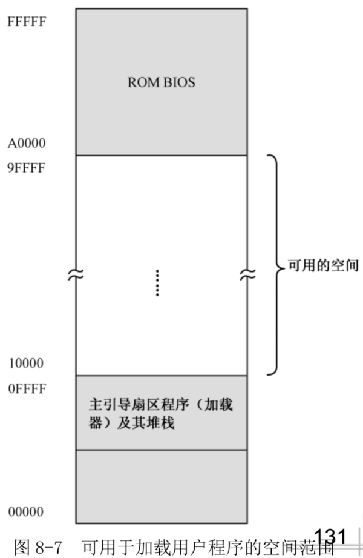
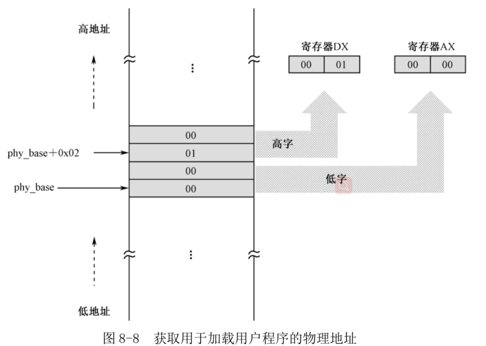
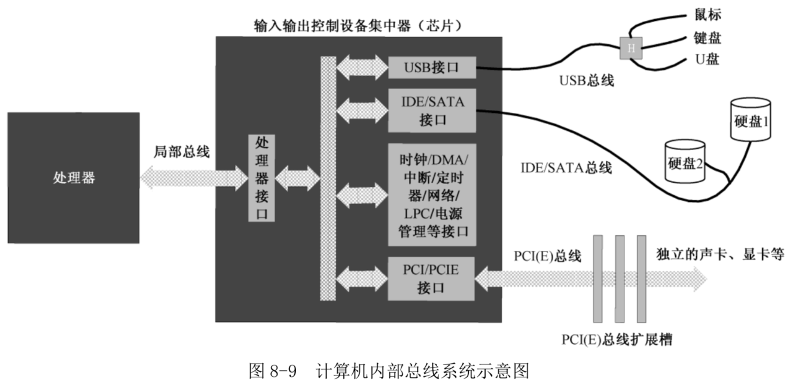
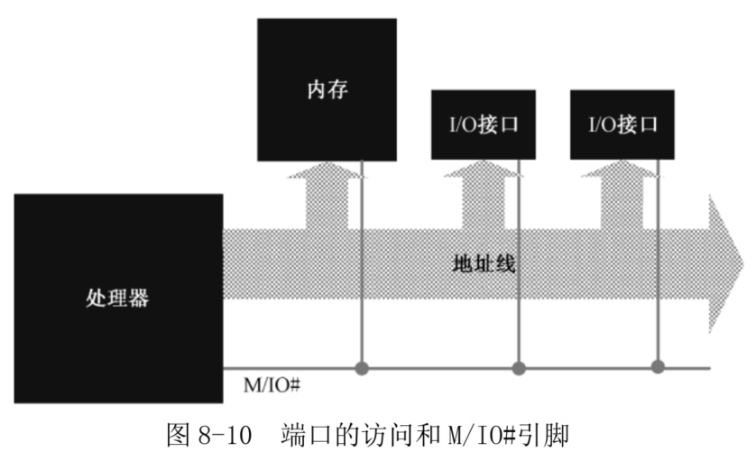
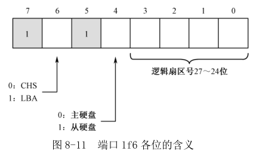
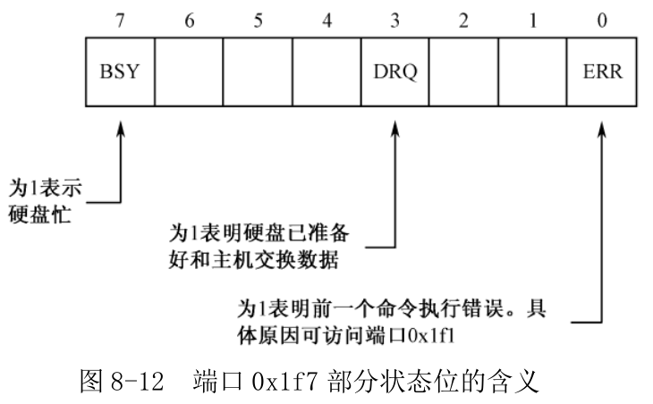
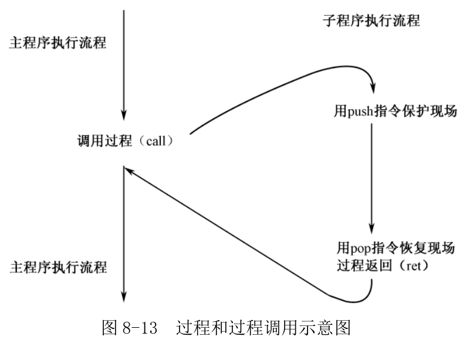
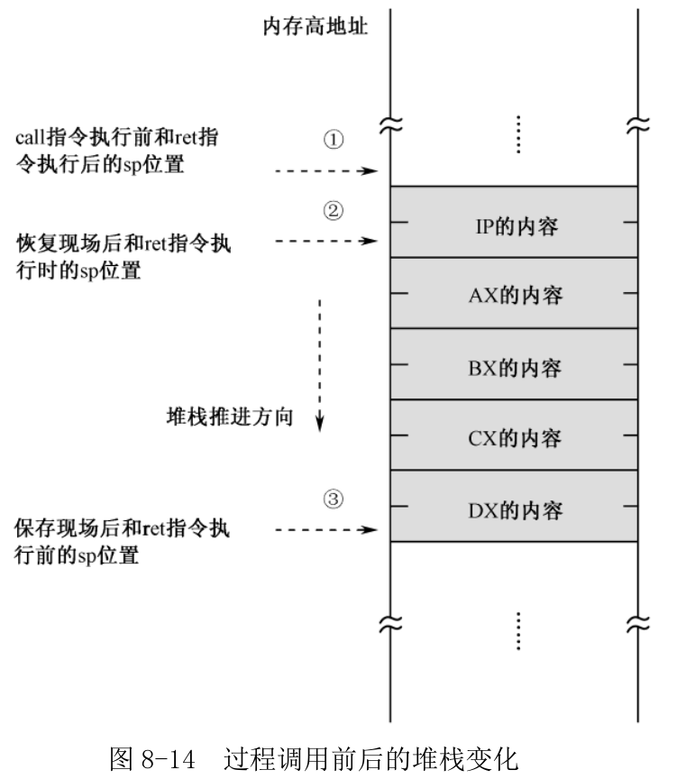
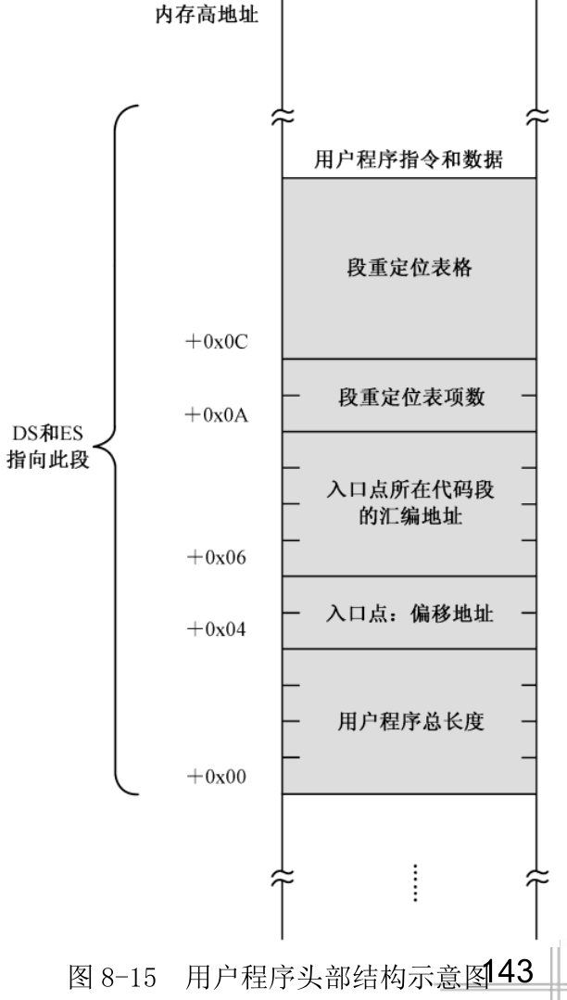

# 1. 初始化和决定加载位置

加载器要加载一个应用程序, 需要决定两件事情. 第一, 内存中什么位置是空闲的, 即从哪个物理内存地址开始加载用户程序; 第二, 用户程序位于硬盘上的什么位置, 它的起始逻辑扇区号是多少.

代码清单 8-1, 来看看加载器都做了哪些工作.

第 6 行, 加载器程序的一开始声明了一个常数(const):

```
app_lba_start equ 100
```

常数是用伪指令 equ 声明的, 它的意思是"等于". 当我们要用到 100 的时候, 可以这样写:

```
mov al,app_lba_star
```

和其他伪指令 db、dw、dd 不同, 用 equ 声明的数值**不占用任何汇编地址**, 也**不在运行时占用任何内存**位置. 它仅仅代表一个数值, 就这么简单.

```
root@Gerry:/home/project/nasm/booktool/c08# cat equ_q.asm
 SECTION mbr align=16 vstart=0x7c00

 app_lba_start equ 100

 mov al,app_lba_start

root@Gerry:/home/project/nasm/booktool/c08# nasm equ_q.asm

root@Gerry:/home/project/nasm/booktool/c08# hexdump -C equ_q
00000000  b0 64                                             |.d|
00000002
```

注: 不受 vstart 影响(类似于 C 中的宏定义), 64 即十进制 100.

加载用户程序需要确定一个**内存物理地址(不是偏移地址)**, 第 151 行用伪指令 dd 声明的, 并初始化为 0x10000 的(自己定义的). 和前面一样, 是用 32 位的单元来容纳一个 20 位的地址.

可以将这个数值改成 0x12340, 唯一的要求是该地址的最低 4 位必须是 0, 换句话说, 加载的起始地址必须是 16 字节对齐的.



如图 8-7 所示, 物理地址 0x0FFFF 以下, 是加载器及其堆栈的范围; **物理地址 A0000 以上, 是 BIOS 和外围设备的范围**, 有很多传统的老式设备将自己的存储器和只读存储器映射到这个空间.

# 2. 准备加载用户程序

将主引导扇区程序定义成一个段.

```
SECTION mbr align=16 vstart=0x7c00
```

即使你不定义这个段, 编译器也会自动把整个程序看成一个段. 因为该定义中有"vstart=0x7c00"子句, 所以, 它就不那么多余了.

第 12~14 行, 用于初始化堆栈段寄存器 SS 和堆栈指针 SP. 之后, 堆栈的段地址是 0x0000, 段的长度是 64KB, 堆栈指针将在段内 0xFFFF 和 0x0000 之间变化.

第 16、17 行, 用于取得一个地址, 用户程序将要从这个地址处开始加载.

该地址实际上是保存在标号 phy\_base 处的一个双字单元里. 如图 8-8 所示, 32 位数内存中的存放是按低端序列的, 高 16 位处在 phy\_base＋0x02 处, 可以放在寄存器 DX 中; 低 16 位处在 phy\_base 处, 可以用寄存器 AX 存放.



因为段寄存器 CS 的内容是 0x0000, 而且主引导扇区是位于 0x0000:0x7c00 处的, 所以, 理论上指令中的偏移地址应当是 0x7c00＋phy\_base. 不过, 因为我们定义段 mbr 的时候, 使用了"vstart=0x7c00"子句, 故段内所有汇编地址都是在 0x7c00 的基础上增加的, 就不用再加上这个 0x7c00 了, 直接是

```
mov ax,[cs:phy_base]
mov dx,[cs:phy_base+0x02]
```

第 18~21 行, 用于将该物理地址变成 16 位的段地址, 并传送到 DS 和 ES 寄存器. **因为该物理地址是 16 字节对齐的, 直接右移 4 位即可**. 实际上, 右移 4 位相当于除以 16(0x10), 所以程序中的做法将这个 32 位物理地址(DX:AX)除以 16(在寄存器 BX 中), 寄存器 AX 中的商就是得到的段地址(在本程序中是 0x1000).

# 3. 外围设备及其接口

一般来说, 我们把外围设备(Peripheral Equipment)分成两种, 一种是输入设备, 比如键盘、鼠标、麦克风、摄像头等; 另一种是输出设备, 比如显示器、打印机、扬声器等. 输入设备和输出设备统称输入输出(Input/Output, I/O)设备.

每种设备都有自己的工作方式. 比如, 扬声器需要的是模拟信号, 每个扬声器需要两根线, 用的插头也是无线电行业里的标准, 话筒也是如此; 老式键盘只用一根线向主机传送按键的 ASCII 码, 而且一直采用 PS/2 标准; 新式的 USB 键盘尽管也使用串行方式工作, 但信号却和老式键盘完全不同. 至于网络设施, 现在流行的是里面有 8 根线芯的五类双绞线, 里面的信号也有专门的标准.

这里需要一些**信号转换器和变速齿轮**, 这就是**I/O 接口**. 举几个例子, 麦克风和扬声器需要一个 I/O 接口, 即**声卡**, 才能与处理器沟通; 显示器也需要一个 I/O 接口, 即**显卡**, 才能与处理器沟通; USB I/O 接口, 即 USB 接口, 才能与处理器沟通. 很显然, 不同的外围设备, 都有各自不同的 I/O 接口.

**I/O 接口**可以是一个电路板, 也可能是一块小芯片, 这取决于它有多复杂. 在一边, 它按处理器的信号规程工作, 负责把处理器的信号转换成外围设备能接受的另一种信号; 在另一边, 它也做同样的工作, 把外围设备的信号变换成处理器可以接受的形式.

后面还有两个麻烦的问题.

1) 不可能将所有的 I/O 接口直接和处理器相连, 将来还有更多设备.

2) 每个设备的 I/O 接口都抢着和处理器通信, 不发生冲突都难.

第 1 个问题的解答是采用**总线技术**. 总线可以认为是一排电线, 所有的外围设备, 包括处理器, 都连接到这排电线上. 但是, 每个连接到这排电线上的器件都必须有拥有电子开关, 以使它们随时能够同这排电线连接, 或者从这排电线上断开(脱离). 这就好比是公共车道, 当路面上有车时, 你就必须退避一下, 不能硬冲上去. 因此, 这排公共电线就称为总线(Bus).

第 2 个问题的解答是使用**输入输出控制设备集中器(I/O Controller Hub, ICH)芯片**, 该芯片的作用是**连接不同的总线, 并协调各个 I/O 接口对处理器的访问**. 在个人计算机上, 这块芯片就是所谓的南桥.

如图 8-9 所示, 处理器通过局部总线连接到 ICH 内部的处理接口电路. 然后, 在 ICH 内部, 又通过总线与各个 I/O 接口相连.



在 ICH 内部, 集成了一些常规的外围设备接口, 如 USB、PATA(IDE)、SATA、老式总线接口(LPC)、时钟等, 这些东西对计算机来说必不可少, 故直接集成在 ICH 内, 我们后面还会详细介绍它们的功能.

不管是什么**设备**, 都必须**通过它自己的 I/O 接口电路同 ICH 相连**. 为了方便, 最好是在主板上做一些插槽, 同时, 每个设备的 I/O 接口电路都设计成插卡. 这样, 想接上该设备时, 就把它的 I/O 接口卡插上, 不需要时, 随时拔下.

为了支持更多的设备, ICH 还提供了对 PCI 或者 PCI Express 总线的支持, 该总线向外延伸, 连接着主板上的若干个扩展槽, 就是刚才说的插槽. 举个实例, 如果你想连接显示器, 那么就要先插入显卡, 然后再把显示器接到显卡上.

除了局部总线和 PCI Express 总线, 每个 I/O 接口卡可能连接不止一个设备. 比如 USB 接口, 就有可能连接一大堆东西: 键盘、鼠标、U 盘等. 因为同类型的设备较多, 也涉及线路复用和仲裁的问题, 故**它们也有自己的总线体系, 称为通信总线或者设备总线**. 比如图 8-9 所示的 USB 总线和 SATA 总线.

当处理器想同某个设备说话时, ICH 会接到通知. 然后, 它负责提供相应的传输通道和其他辅助支持, 并命令所有其他无关设备闭嘴. 同样, 当某个设备要跟处理器说话, 情况也是一样.

# 4. I/O 端口和端口访问

具体地说, **处理器是通过端口(Port)来和外围设备打交道的**. 本质上, **端口就是一些寄存器**, 类似于处理器内部的寄存器. 不同之处仅仅在于, 这些**叫做端口的寄存器位于 I/O 接口电路中**.

**端口是处理器和外围设备通过 I/O 接口交流的窗口, 每一个 I/O 接口都可能拥有好几个端口, 分别用于不同的目的**. 比如, 连接硬盘的 PATA/SATA 接口就有几个端口, 分别是**命令端口**(当向该端口写入 0x20 时, 表明是从硬盘读数据; 写入 0x30 时, 表明是向硬盘写数据)、**状态端口**(处理器根据这个端口的数据来判断硬盘工作是否正常, 操作是否成功, 发生了哪种错误)、**参数端口**(处理器通过这些端口告诉硬盘读写的扇区数量, 以及起始的逻辑扇区号)和**数据端口**(通过这个端口连续地取得要读出的数据, 或者通过这个端口连续地发送要写入硬盘的数据).

端口只不过是位于 I/O 接口上的寄存器, 所以, **每个端口有自己的数据宽度**.

端口在不同的计算机系统中有着不同的实现方式. 在一些计算机系统中, 端口号是映射到内存地址空间的(memory mapping I/O). 当访问这部分地址时, 实际上是在访问 I/O 接口.

而在另一些计算机系统中, 端口是独立编址的, 不和内存发生关系. 如图 8-10 所示, 在这种计算机中, **处理器的地址线既连接内存, 也连接每一个 I/O 接口**. 但是, 处理器还有一个特殊的**引脚 M/IO#**, 在这里, "#"表示低电平有效. 也就是说, 当处理器访问内存时, 它会让 M/IO#引脚呈高电平, 这里, 和内存相关的电路就会打开; 相反, 如果处理器访问 I/O 端口, 那么 M/IO#引脚呈低平, 内存电路被禁止. 与此同时, 处理器发出的地址和 M/IO#信号一起用于打个某个 I/O 接口, 如果该 I/O 接口分配的端口号与处理器地址相吻合的话.

在本章中, 我们只讲独立编址的端口.

**所有端口都是统一编号的**, 比如 0x0001、0x0002、0x0003、.... 每个 I/O 接口电路都分配了若干个端口, 比如, I/O 接口 A 有 3 个端口, 端口号分别是 0x0021~0x0023; I/O 接口 B 需要 5 个端口, 端口号分别是 0x0303~0x0307. 一个现实的例子是个人计算机中的 PATA/SATA 接口(图 8-9), 每个 PATA 和 SATA 接口分配了 8 个端口. 但是, ICH 芯片内部通常集成了两个 PATA/SATA 接口, 分别是主硬盘接口和副硬盘接口. 这样一来, 主硬盘接口分配的端口号是 0x1f0~0x1f7, 副硬盘接口分配的端口号是 0x170~0x177.



在 Intel 的系统中, 只允许**65536(十进制数)个端口**存在, 端口号从 0 到 65535(0x0000~0xffff). 因为是独立编址, 所以, 端口的访问不能使用类似于 mov 这样的指令, 取而代之的是 in 和 out 指令.

in 指令是**从端口读**, 它的一般形式是

```
in al,dx
```

或者
```
in ax,dx
```

这就是说, **in 指令的目的操作数必须是寄存器 AL 或者 AX**, 当访问 8 位的端口时, 使用寄存器 AL; 访问 16 位的端口时, 使用 AX. in 指令的源操作数应当是寄存器 DX.

in al,dx 的机器指令码是 0xEC, in ax,dx 的机器指令码是 0xED, 都是一字节的. 之所以如此简短, 是因为 in 指令不允许使用别的通用寄存器, 也不允许使用内存单元作为操作数.

**in 指令还有两字节的形式**. 此时, 前一字节是操作码 0xE4 或者 0xE5, 分别用于指示 8 位或者 16 位端口访问; **后一字节是立即数, 指示端口号**.

因此, 机器指令 E4 F0 就相当于汇编语言指令
```
in al,0xf0
```
而机器指令 E5 03 就相当于汇编语言指令
```
in ax,0x03
```
很显然, 因为**这种指令形式**的操作数部分只允许一字节, 故只能访问 0~255(0x00~0xff)号端口, **不允许访问大于 255 的端口号**. 所以, 下面的汇编语言指令就是非法的:

```
in ax,0x5fd
```

in 指令不影响任何标志位.

相应地, 如果要**通过端口向外围设备发送数据, 则必须通过 out 指令**.

out 指令正好和 in 指令相反, 目的操作数可以是 8 位立即数或者寄存器 DX, 源操作数必须是寄存器 AL 或者 AX. 下面是一些例子:

```
out 0x37,al ;写 0x37 号端口(这是一个 8 位端口)
out 0xf5,ax ;写 0xf5 号端口(这是一个 16 位端口)
out dx,al ;这是一个 8 位端口, 端口号在寄存器 DX 中
out dx,ax ;这是一个 16 位端口, 端口号在寄存器 DX 中
```

out 指令不影响任何标志位.

# 5. 通过硬盘控制器端口读扇区数据

硬盘读写的基本单位是扇区. 就是说, 要读就至少读一个扇区, 要写就至少写一个扇区, 不可能仅读写一个扇区中的几个字节. 数据交换是成块的, 硬盘是典型的块设备.

从硬盘读写数据, 最经典的方式是向硬盘控制器分别发送**磁头号**、**柱面号**和**扇区号**(**扇区在某个柱面上的编号**), 这称为 CHS 模式. 这种方法最原始.

实际上, 在很多时候, 我们并**不关心扇区的物理位置**, 所以希望**所有的扇区都能统一编址**. 这就是**逻辑扇区**, 它把硬盘上所有可用的扇区都一一从 0 编号, 而不管它位于哪个盘面, 也不管它属于哪个柱面(**不用关心物理位置, 写数据使用逻辑扇区号, 读也是一样！！！**).

关于硬盘和逻辑扇区的知识前面已经有所介绍, 这里不再赘述. 最早的**逻辑扇区编址方法**是**LBA28**, 使用**28 个比特来表示逻辑扇区号**, 从逻辑扇区 0x0000000 到 0xFFFFFFF, 共可以表示 2\^28＝268435456 个扇区. 每个扇区有 512 字节, 所以 LBA28 可以管理 128GB 的硬盘.

业界又共同推出了 LBA48, 采用 48 个比特来表示逻辑扇区号. 如此一来, 就可以管理 131072TB 的硬盘容量了.

在本章中, 我们将采用 LBA28 来访问硬盘.

个人计算机上的**主硬盘控制器**被分配了 8 位端口, 端口号从 0x1f0 到 0x1f7. 假设现在要从硬盘上读逻辑扇区, 那么, 整个过程如下.

第 1 步, 设置要读取的扇区数量. 这个数值要写入 0x1f2 端口. 这是个 8 位端口, 因此每次只能读写 255 个扇区:

```
mov dx,0x1f2
mov al,0x01 ;1 个扇区
out dx,al
```

注意, 如果**写入的值为 0**, 则表示要**读取 256 个扇区**. 每读一个扇区, 这个数值就减一. 因此, 如果在读写过程中发生错误, **该端口包含着尚未读取的扇区数**.

第 2 步, 设置起始 LBA 扇区号. **扇区的读写是连续的, 因此只需要给出第一个扇区的编号就可以了**. 28 位的扇区号太长, 需要将其分成 4 段, 分别写入端口 0x1f3、0x1f4、0x1f5 和 0x1f6 号端口. 其中, 0x1f3 号端口存放的是 0~7 位; 0x1f4 号端口存放的是 8~15 位; 0x1f5 号端口存放的是 16~23 位, 最后 4 位在 0x1f6 号端口. 假定我们要读写的起始逻辑扇区号为 0x02, 可编写代码如下:

```
mov dx,0x1f3
mov al,0x02
out dx,al ;LBA 地址 7~0
inc dx ;0x1f4
mov al,0x00
out dx,al ;LBA 地址 15~8
inc dx ;0x1f5
out dx,al ;LBA 地址 23~16
inc dx ;0x1f6
mov al,0xe0 ;LBA 模式, 主硬盘, 以及 LBA 地址 27~24
out dx,al
```

注意以上代码的最后 4 行, 在现行的体系下, 每个 PATA/SATA 接口允许挂接两块硬盘, 分别是主盘(Master)和从盘(Slave). 如图 8-11 所示, 0x1f6 端口的低 4 位用于存放逻辑扇区号的 24~27 位, 第 4 位用于指示硬盘号, 0 表示主盘, 1 表示从盘. 高 3 位是"111", 表示 LBA 模式.



第 3 步, 向端口 0x1f7 写入 0x20, 请求硬盘读. 这也是一个 8 位端口:

```
mov dx,0x1f7
mov al,0x20 ;读命令
out dx,al
```

第 4 步, 等待读写操作完成. 端口 0x1f7 既是命令端口, 又是状态端口. 如图 8-12 所示, 在它内部操作期间, 它将 0x1f7 端口的第 7 位置"1", 表明自己很忙. 一旦硬盘系统准备就绪, 它再将此位清零, 说明自己已经忙完了, 同时将第 3 位置"1", 意思是准备好了, 请求主机发送或者接收数据(图 8-12).

```
    mov dx,0x1f7
.waits:
    in al,dx
    and al,0x88
    cmp al,0x08
    jnz .waits ;不忙, 且硬盘已准备好数据传输
```



0x88 的二进制形式是 10001000, 保留住寄存器 AL 中的第 7 位和第 3 位, 其他无关的位都清零. 说明可以退出等待状态, 继续往下操作, 否则继续等待.

第 5 步, 连续取出数据. 0x1f0 是硬盘接口的数据端口, 而且还是一个 16 位端口. 一旦硬盘控制器空闲, 且准备就绪, 就可以连续从这个端口写入或者读取数据. 下面的代码假定是从硬盘读一个扇区(512 字节, 或者 256 字节), 读取的数据存放到由段寄存器 DS 指定的数据段, 偏移地址由寄存器 BX 指定:

```
    mov cx,256 ;总共要读取的字数
    mov dx,0x1f0
.readw:
    in ax,dx
    mov [bx],ax
    add bx,2
    loop .readw
```
最后, 0x1f1 端口是错误寄存器, 包含硬盘驱动器最后一次执行命令后的状态(错误原因).

# 6. 过程调用

如果每次读写硬盘都按上面的 5 个步骤写一堆代码.

好在处理器支持一种叫过程调用的指令执行机制.

如图 8-13 所示, 这是过程和过程调用的示意图.



常量 app_lba_start, 它代表的值是 100, 也就是用户程序在硬盘上的起始逻辑扇区号. 24~27 行用于从硬盘上读取这个扇区的内容. 先读它的第一个扇区. 该扇区包含了用户程序的头部, 而用户程序头部又包含了该程序的大小、入口点和段重定位表. 所以, 通过分析头部, 就知道接着还要再读多少个扇区才能完全加载用户程序.

代码清单 8-1 的第 79 行开始, 一直到第 131 行结束, 这就是调用过程.

每次读硬盘时的起始逻辑扇区号和数据保存位置都不相同.

参数传递最简单的办法是通过寄存器. 在这里, 主程序把起始逻辑扇区号的高 16 位存放在寄存器 DI 中(只有低 12 位是有效的, 高 4 位必须保证为"0"), 低 16 位存放在寄存器 SI 中(没办法, 16 位的处理器无法直接处理 28 位的数据); 并约定将读出来的数据存放到由段寄存器 DS 指向的数据段中, 起始偏移地址在寄存器 BX 中.

在调用过程前, 程序会用到一些寄存器, 在过程返回之后, 可能还要继续使用. 为了不失连续性, 在过程的开头, 应当将本过程要用到(内容肯定会被破坏)的寄存器临时压栈, 并在返回到调用点之前出栈恢复. 代码清单 8-1 的第 82~85 行, 用于将过程中用到的寄存器压入堆栈保存.

第 87~89 行, 是向 0x1f2 端口写入要读取的扇区数. 显而易见, 每次读的扇区数是 1 个.

第 91~101 行, 用于向硬盘接口写入起始逻辑扇区号的低 24 位. 低 16 位在寄存器 SI 中, 高 12 位在寄存器 DI 中, 需要不停地倒换到寄存器 AL 中, 以方便端口写入.

第 105 行, 程序执行到这里时, 寄存器 AH 的低 4 位是起始逻辑扇区号的 27~24 位, 高 4 位是全"0"; 寄存器 AL 中是 0xe0. 执行 or 指令后, 将会在寄存器 AL 中得到它们的组合值, 高 4 位是 0xe, 低 4 位是逻辑扇区号的 27~24 位.

第 118~124 行, 用于反复从硬盘接口那里取得 512 字节的数据, 并传送到段寄存器 DS 所指向的数据区中. 每传送一个字, BX 的值就增 2, 以指向下一个偏移位置.

第 126~129 行, 用于把调用过程前各个寄存器的内容从堆栈中恢复.

最后, 因为处理器是没有大脑的, 所以需要一个明确的指令 ret 促使它离开过程, 从哪里来回哪里去, 这条指令稍后就会讲到.

第 24、25 行, 用于指定用户程序在硬盘上的起始逻辑扇区号. 过程要求用 DI:SI 来提供这个扇区号, 既然它是常数 100, 很小的数值, 可以直接传送到寄存器 SI, 并将 DI 清零即可.

26 行用于指定存放数据的内存地址. 前面已经将段寄存器 DS 设置好了, 将寄存器 BX 清零, 以指向该段内偏移地址为 0 的地方.

第 27 行, 开始调用过程 read_hard_disk_0.

调用过程的指令是"call". 8086 处理器支持**四种调用方式**.

第一种是 16 位相对近调用. 被调用的目标过程位于当前代码段内, 所以只需要得到偏移地址即可.

16 位相对近调用是三字节指令, 操作码为 0xE8, 后跟 16 位的操作数, 因为是相对调用, 故该操作数是当前 call 指令相对于目标过程的偏移量. 计算过程如下: 用目标过程的汇编地址减去当前 call 指令的汇编地址, 再减去当前 call 指令以字节为单位的长度(3), 保留 16 位的结果.

```
call near proc_1
```

近调用的特征是在指令中使用关键字"near". "proc\_1"是程序中的一个标号. 在编译阶段, 编译器用标号 proc\_1 处的汇编地址减去本指令的汇编地址, 再减去 3, 作为机器指令的操作数.

关键字"near"不是必需的, 如果 call 指令中没有提供任何关键字, 则编译器认为该指令是近调用. 因此, 上面的指令与这条指令等效:

```
call proc_1
```

第二种是 16 位间接绝对近调用. 这种调用也是近调用, 只能调用当前代码段内的过程, 指令中的操作数不是偏移量, 而是被调用过程的真实偏移地址, 故称为绝对地址. 不过, 这个偏移地址不是直接出现在指令中, 而是由 16 位的通用寄存器或者 16 位的内存单元给出.

```
call cx ;目标地址在 CX 中. 省略了关键字"near", 下同
call [0x3000] ;要先访问内存才能取得目标偏移地址
call [bx] ;要先访问内存才能取得目标偏移地址
call [bx+si+0x02] ;要先访问内存才能取得目标偏移地址
```

第三种是 16 位直接绝对远调用. 这种调用属于**段间调用**, 即调用另一个代码段内的过程, 所以称为远调用(Far Call). 很容易想到, 远调用既需要被调用过程所在的段地址, 也需要该过程在段内的偏移地址.

```
call 0x2000:0x0030
```

第四种是 16 位间接绝对远调用. 属于段间调用, 被调用过程位于另一个代码段内, 而且, 被调用过程所在的段地址和偏移地址是间接给出的. 还有, 这里的"16 位"同样是用来限定偏移地址的. 下面是这种调用方式的几个例子:

```
call far [0x2000]
call far [proc_1]
call far [bx]
call far [bx+si]
```

间接远调用必须使用关键字"far".

第 27 行

```
call read_hard_disk_0
```

16 位相对近调用, 编译后的机器指令操作数是一个相对偏移量. 由于这是段内调用, 处理器执行这条指令时, 用指令指针寄存器 IP 的内容加上指令中的偏移量, 以及当前指令的长度, 算出被调用过程的绝对偏移地址. 接着, 将 IP 的现行值压栈. 最后, 用刚刚计算出的偏移地址替代 IP 的当前内容.

返回到调用点继续执行下一条指令, 这称为过程返回(Procedure Return).

返回指令 ret 和 retf.

ret 和 retf 经常用做 call 和 call far 的配对指令. ret 是近返回指令, 当它执行时, 处理器只做一件事, 那就是从堆栈中弹出一个字到指令指针寄存器 IP 中.

etf 是远返回指令(return far), 它的工作稍微复杂一点点. 当它执行时, 处理器分别从堆栈中弹出两个字到指令指针寄存器 IP 和代码段寄存器 CS 中.

如图 8-14 所示, 在 call read\_hard\_disk_0 执行前, 堆栈指针位于箭头1)所指示的位置; call 指令执行后, 由于压入了 IP 的内容, 故堆栈指针移动到箭头2)所指示的位置处; 进入过程后, 出于保护现场的目的, 压入了 4 个通用寄存器 AX、BX、CX、DX, 此时, 堆栈指针继续向低地址方向推进到箭头3)所指示的位置.

在过程的最后, 是恢复现场, 连续反序弹出 4 个通用寄存器的内容. 此时, 堆栈指针又回到刚进入过程内部时的位置, 即箭头2)处. 最后, ret 指令执行时, 由于处理器自动弹出一个字到 IP, 故, 过程返回后的瞬间, 堆栈指针仍旧回到过程调用前, 即箭头1)所指示的位置.





尽管 call 指令通常需要 ret/retf 和它配对, 遥相呼应, 但 ret/retf 指令却并不依赖于 call 指令, 这一点你马上就会看到.

call 指令在执行过程调用时不影响任何标志位, ret/retf 指令对标志位也没有任何影响.

# 7. 加载用户程序

第一次读硬盘将得到用户程序最开始的 512 字节, 这 512 字节包括最开始的用户程序头部, 以及一部分实际的指令和数据.

# 10. 8086 处理器的无条件转移指令

(1)相对短转移

