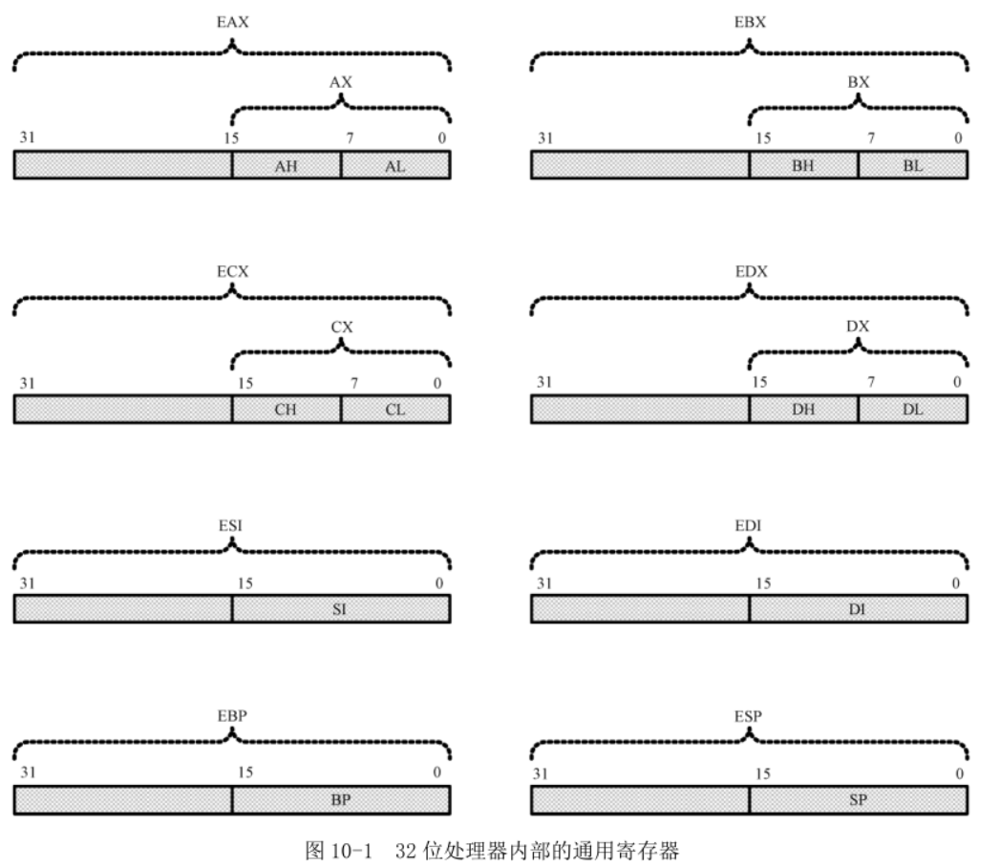
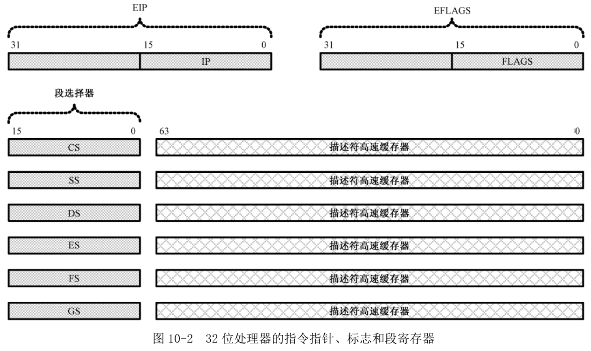
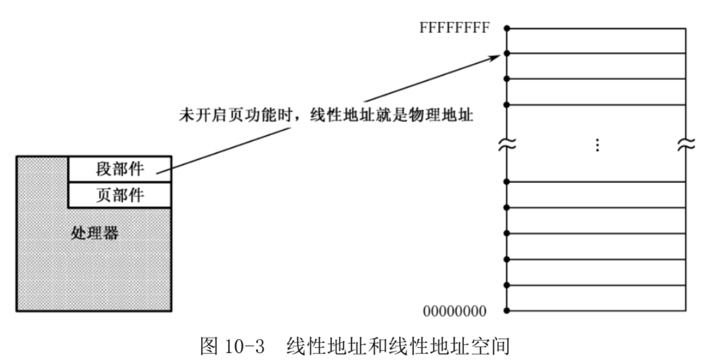

```
    10.1.1 寄存器的扩展
    10.1.2 基本的工作模式
    10.1.3 线性地址
```

Intel 32 位处理器架构简称 IA-32(Intel Architecture, 32-bit), 是以 1978 年的 8086 处理器为基础发展起来的.

8086 有 20 根地址线, 可以寻址 1MB 内存. 但是, 它内部的寄存器是 16 位的, 无法在程序中访问整个 1MB 内存. 所以, 它也是第一款支持内存分段模型的处理器. 还有, 8086 处理器只有一种工作模式, 即实模式. 当然, 在那时, 还没有实模式这一说.

尽管 8086 是 16 位的处理器, 但它也是 32 位架构内的一部分. 原因在于, 32 位的处理器架构是从 8086 那里发展来的, 是基于 8086 的, 具有延续性和兼容性.

32 位的处理器有 32 根地址线, 数据线的数量是 32 根或者 64 根. 特别是最近最新的处理器, 都是 64 根. 因此, 它可以访问 2\^32 = 4GB 的内存, 而且每次可以读写连续的 4 字节或者 8 字节, 这称为双字(Double Word)或者 4 字(Quad Word)访问. 当然, 如果你要按字节或者字来访问内存, 也是允许的.

32 位处理器不单单是地址线和数据线的扩展, 实际上还有更多的部分, 包括高速缓存、流水线、浮点处理部件、多处理器(核)管理、多媒体扩展、乱序执行、分支预测、虚拟化、温度和电源管理等.

## 1. 寄存器的扩展

如图 10-1 所示, 32 位处理器在 16 位处理器的基础上, 扩展了这 8 个通用寄存器的长度.



可以在程序中使用这些寄存器, 即使是在实模式下:

```
mov eax,0xf0000005
mov ecx,eax
add edx,ecx
```

但是, 指令的源操作数和目的操作数必须具有相同的长度, 个别特殊用途的指令除外. 因此, 下面搭配是不允许的, 在程序编译时, 编译器会报告错误:

```
mov eax,cx ;错误的汇编语言指令
```

如果目的操作数是 32 位寄存器, 源操作数是立即数, 那么, 立即数被视为 32 位的:

```
mov eax,0xf5 ;EAX←0x000000f5
```

**32 位通用寄存器的高 16 位是不可独立使用的, 但低 16 位保持同 16 位处理器的兼容性**. 因此, 在任何时候它们都可以照往常一样使用:

```
mov ah,0x02
mov al,0x03
add ax,si
```

可以在 32 位处理器上运行 16 位处理器上的软件.

但是, 32 位处理器并不是 16 位处理器的简单增强. 有自己的 32 位工作模式, 在本书中, 32 位模式特指 32 位保护模式. 在这种模式下, 可以完全、充分地发挥处理器的性能. 同时, 在这种模式下, 处理器可以使用它全部的 32 根地址线, 能够访问 4GB 内存.

如图 10-2 所示, 在 32 位模式下, 为了生成 32 位物理地址, 处理器需要使用**32 位的指令指针寄存器**. 为此, 32 位处理器扩展了 IP, 使之达到 32 位, 即 EIP. **当它工作在 16 位模式下时, 依然使用 16 位的 IP; 工作在 32 位模式下时, 使用的是全部的 32 位 EIP**. 和往常一样, 即使是在 32 位模式下, **EIP 寄存器也只由处理器内部使用, 程序中是无法直接访问的**.

**对 IP 和 EIP 的修改通常是用某些指令隐式进行的**, 这此指令包括 JMP、CALL、RET 和 IRET 等等.



在 16 位处理器中, 标志寄存器 FLAGS 是 16 位的, 在 32 位处理器中, 扩展到了 32 位, 低 16 位和原先保持一致.

32 位模式下, 对内存的访问理论上不需要分段了. 但是, IA-32 架构的处理器是基于分段模型的, 因此, 32 位处理器依然需要以段为单位访问内存, 即使它工作在 32 位模式下.

变通方案是, 只分一个段, 段的基地址是 0x00000000, 段大小 4GB. 这种即平坦模式(Flat Mode).

每个程序都有属于自己的内存空间. 在 16 位模式下, 一个程序可以自由地访问不属于它的内
存位置, 甚至可以对那些地方的内容进行修改. 这种是不安全的. 在 32 位模式下, **处理器要求在加载程序时, 先定义该程序所拥有的段**. 定义段时, 除了基地址(起始地址)外, 还附加了段界限、特权级别、类型等属性. 当程序访问一个段时, 处理器将用固件实施各种检查工作, 以防止对内存的违规访问.

如图 10-2, 在 32 位模式下, 传统的段寄存器, 如 CS、SS、DS、ES, 保存的不再是 16 位段基地址, 而是段的选择子, 又叫做段选择器. 除了段选择器之外, **每个段寄存器还包括一个 64 位的不可见部分, 称为描述符高速缓存器**, 里面有**段的基地址和各种访问属性**. 这部分内容程序不可访问, 由处理器自动使用.

32 位处理器增加了两个额外的段寄存器 FS 和 GS.

## 2. 基本的工作模式

8086 有 16 位的段寄存器、指令指针寄存器和通用寄存器(CS、SS、DS、ES、IP、AX、BX、CX、DX、SI、DI、BP、SP), 由于只能使用 16 位的段内偏移量, 故段最大长度是 64KB. 8086 只有一种工作模式, 即实模式.

1982 年, 80286 处理器. 16 位的处理器, 大部分的寄存器都和 8086 处理器一样. 因此, 80286 和 8086 一样, 在实模式下只能使用 64KB 的段; 尽管它有 24 根地址线, 理论上可以访问 2\^24, 即 16MB 的内存,但依然只能分成多个段来进行.

但是, 80286 和 8086 不一样的地方在于, 它第一次提出了**保护模式**的概念. 在保护模式下, 段寄存器中保存的不再是段地址, 而是段选择子, 真正的**段地址位于段寄存器的描述符高速缓存中(80286 处理器)**, 是 24 位的. 因此, 运行在保护模式下的 80286 处理器可以访问全部 16MB 内存.

在 80286 情况下, 不再需要段地址左移, 段可以在 16MB 内存空间任何位置, 也不用 16 字节对齐. 但其通用寄存器是 16 位的, 即使运行在保护模式下, 段长度依然最大 64KB. 所以 16 位保护模式很少使用.

实模式等同于 8086 模式. 在 16 位模式下, 数据的大小是 8 位或者 16 位的; 控制转移和内存访问时, 偏移量也是 16 位的.

1985 年, 80386 处理器. Intel 第一款 32 位产品, 也是后面所有 32 位产品基础. 80386 处理器的寄存器是 32 位的, 而且拥有 32 根地址线, 可以访问 2\^32 , 即 4GB 的内存.

80386, 以及所有后续的 32 位处理器, 都兼容实模式, 可以运行实模式下的 8086 程序. **在刚加电时, 这些处理器都自动处于实模式下(处理器层面)**. 只有在进行一番设置之后, 才能运行在保护模式下.

保护模式下, 可以使用平坦模型. 32 位保护模式兼容 80286 的 16 位保护模式.

32 位处理器还提供虚拟 8086 模式(V86 模式), 在这种模式下, IA-32 处理器被模拟成多个 8086 处理器并行工作. V86 模式是保护模式的一种, 可以在保护模式下执行多个 8086 程序. 传统上, 要执行 8086 程序, 处理器必须工作在实模式下. 在这种情况下, 为 32 位保护模式写的程序就不能运行. 但是, V86 模式提供了让它们在一起同时运行的条件.

V86 模式曾经很有用, 曾经 8086 程序很多, 而 32 位应用很少. 现在这种工作模式已经基本无用了.

本书中, 32 位模式特指 IA-32 处理器上的 32 位保护模式. 不存在所谓的 32 位实模式, 实模式的概念实质上就是 8086 模式.

## 3. 线性地址

传统上, 段地址和偏移地址称为逻辑地址, 偏移地址叫做有效地址(Effective Address, EA), 在指令中给出有效地址的方式叫做寻址方式(Addressing Mode).

**段的管理是由处理器的段部件负责进行的**, 段部件将段地址和偏移地址相加, 得到访问内存的地址. 一般来说, 段部件产生的地址就是物理地址.

IA-32 处理器支持多任务. 在多任务环境下, **任务的创建需要分配内存空间**; 当任务终止后, 还要回收它所占用的内存空间. 在分段模型下, 内存的分配是不定长的, 程序大时, 就分配一大块内存; 程序小时, 就分配一小块. 时间长了, 内存空间就会碎片化, 就有可能出现一种情况: **内存空间是有的, 但都是小块, 无法分配给某个任务**. 为了解决这个问题, IA-32 处理器支持分页功能, **分页功能将物理内存空间划分成逻辑上的页**. 页的大小是固定的, 一般为 4KB, 通过使用页, 可以简化内存管理.

如图 10-3 所示, 当页功能开启时, 段部件产生的地址就不再是物理地址了, 而是线性地址(Linear Address), 线性地址还要经页部件转换后, 才是物理地址.



线性地址的概念用来描述任务的地址空间. 如图 10-3 所示, IA-32 处理器上的每个任务都拥有 4GB 的虚拟内存空间, 这是一段长 4GB 的平坦空间, 就像一段平直的线段, 因此叫线性地址空间. 相应地, 由段部件产生的地址, 就对应着线性地址空间上的每一个点, 这就是线性地址.