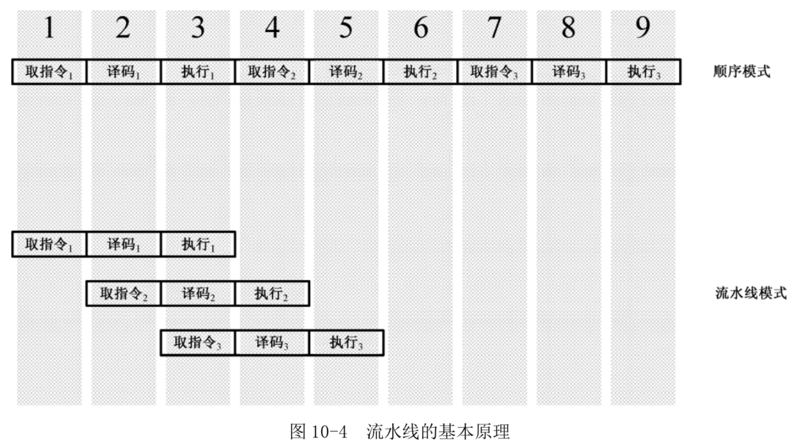

<!-- @import "[TOC]" {cmd="toc" depthFrom=1 depthTo=6 orderedList=false} -->

<!-- code_chunk_output -->

- [1. 流水线](#1-流水线)
- [2. 高速缓存](#2-高速缓存)
- [3. 乱序执行](#3-乱序执行)
- [4. 寄存器重命名](#4-寄存器重命名)
- [5. 分支目标预测](#5-分支目标预测)

<!-- /code_chunk_output -->

## 1. 流水线

在 8086 时代, 处理器就已经有了指令预取队列. 当指令执行时, 如果总线是空闲的(没有访问内存的操作), 就可以在指令执行的同时预取指令并提前译码.

执行一条指令需要从内存中取指令、译码、访问操作数和结果, 并进行移位、加法、减法、乘法以及其他任何需要的操作.

为了提高处理器的执行效率和速度, 把一条指令的执行过程分解成若干个步, 并分配给相应的单元来完成. **各个单元的执行是独立的、并行的**. 这种执行指令的方法就是流水线(Pipe-Line)技术.



2000 年之后推出的 Pentium 4 处理器采用了 NetBurst 微结构, 它进一步分解指令的执行过程, 采用了 31 级超深流水线.

## 2. 高速缓存

影响处理器速度的另一个因素是存储器. 从处理器内部向外看, 它们分别是寄存器、内存和硬盘. 当然, 现在有的计算机已经用上了固态磁盘.

高速缓存(Cache)是处理器与内存(DRAM)之间的一个静态存储器, 容量较小, 但速度可以与处理器匹配.

高速缓存的用处源于程序在运行时所具有的局部性规律. 首先, 程序常常访问最近刚刚访问过的指令和数据, 或者与它们相邻的指令和数据.

利用程序运行时的局部性原理, 可以把处理器正在访问和即将访问的指令和数据块从内存调入高速缓存中. 每当处理器要访问内存时, 首先检索高速缓存. 在不中(Miss)时, **处理器在取得需要的内容之前必须重新装载高速缓存, 而不只是直接到内存中去取那个内容**. 高速缓存的装载是以块为单位的, 包括那个所需数据的邻近内容. 为此, 需要额外的时间来等待块从内存载入高速缓存, 在该过程中所损失的时间称为不中惩罚(Miss Penalty).

每一款处理器的高速缓存可能都有不同的实现. 在一些复杂的处理器内部, 会存在多级 Cache, 分别应用于各个独立的执行部件.

## 3. 乱序执行

为了实现流水线技术, 需要将指令拆分成更小的可独立执行部分, 即拆分成微操作(Micro-Operations).

有些指令非常简单, 因此只需要一个微操作. 比如:

```
add eax,ebx
```

再比如:

```
add eax,[mem]
```

可以拆分成两个微操作, 一个用于从内存中读取数据并保存到临时寄存器, 另一个用于将 EAX 寄存器和临时寄存器中的数值相加.

再:

```
add [mem],eax
```

拆分成三个微操作, 一个从内存中读数据, 一个执行相加的动作, 第 3 个用于将相加的结果写
回到内存中.

一旦将指令拆分成微操作, 处理器就可以在必要的时候乱序执行(Out-Of-Order Execution)程序.

```
mov eax,[mem1]
shl eax,5
add eax,[mem2]
mov [mem3],eax
```

指令 add eax,[mem2]可以拆分为两个微操作. 如此一来, 在执行逻辑左移指令的同时, 处理器可以提前从内存中读取 mem2 的内容. 典型地, 如果数据不在高速缓存中(不中), 那么处理器在获取 mem1 的内容之后, 会立即开始获取 mem2 的内容, 与此同时, shl 指令的执行早就开始了.

## 4. 寄存器重命名

```
mov eax,[mem1]
shl eax,3
mov [mem2],eax
mov eax,[mem3]
add eax,2
mov [mem4],eax
```

以上代码做了两件事, 但互不相干: 将 mem1 里的内容左移 3 次(乘以 8), 并将 mem3 里的内容加 2. 事实上, 处理器会为最后三条指令使用了另一个不同的临时寄存器, 因此, 左移(乘法)和加法可以并行地处理.

在处理器内部, 有大量的临时寄存器可用, 处理器可以重命名这些寄存器以代表一个逻辑寄存器, 比如 EAX.

寄存器重命名以一种完全自动和非常简单的方式工作. 每当指令写逻辑寄存器时, 处理器就为
那个逻辑寄存器分配一个新的临时寄存器.

```
mov eax,[mem1]
mov ebx,[mem2]
add ebx,eax
shl eax,3
mov [mem3],eax
mov [mem4],ebx
```

假定现在 mem1 的内容在高速缓存里, 可以立即取得, 但 mem2 的内容不在高速缓存中. 所以, 左移操作可以在加法之前开始(使用临时寄存器代替 EAX). 为左移结果使用新的临时寄存器, 好处是 EAX 寄存器仍然是以前的内容, 它将一直保持这个值, 直到 EBX 寄存器中内容就绪, 然后再做加法.

那个临时寄存器内容被写入真实 EAX 寄存器, 该过程称为引退(Retirement).

所有通用寄存器, 堆栈指针、标志、浮点寄存器, 甚至段寄存器都有可能被重命名.

## 5. 分支目标预测

有很多潜在因素会导致流水线不能达到最佳效率. 典型情况, 遇到一条转移指令, 后面已经进入流水线的指令就无效了, 必须清空(Flush)流水线, 从要转移到的目标位置处重新取指令放入流水线.

在处理器内部, 有一个小容量的高速缓存器, 叫分支目标缓存器(Branch Target Buffer, BTB). 当处理器执行了一条分支语句后, 它会在 BTB 中记录当前指令的地址、分支目标的地址, 以及本次分支预测的结果. 下一次, 在那条转移指令实际执行前, 处理器会查找 BTB, 看有没有最近的转移记录.