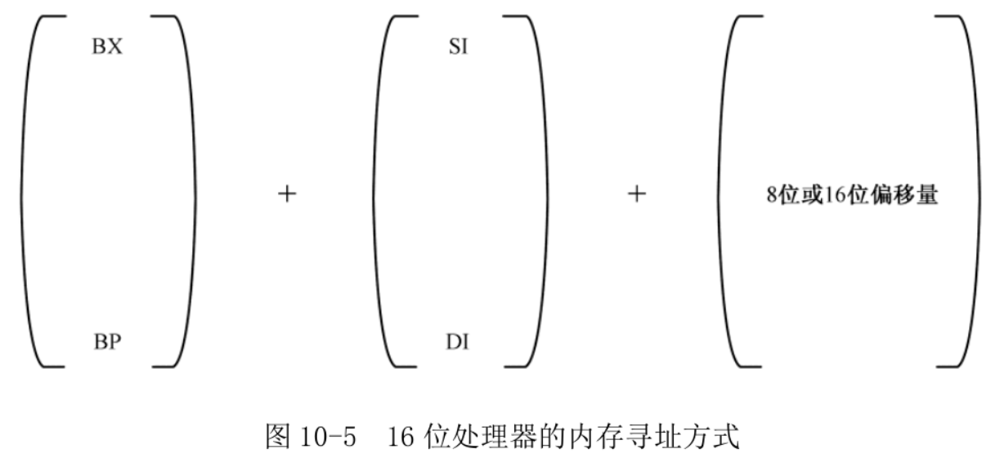
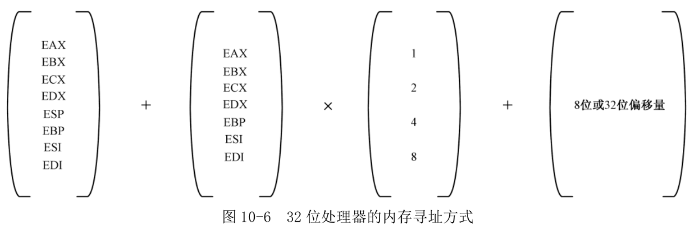
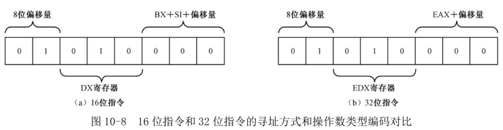

<!-- @import "[TOC]" {cmd="toc" depthFrom=1 depthTo=6 orderedList=false} -->

<!-- code_chunk_output -->

- [1. 32 位处理器的寻址方式](#1-32-位处理器的寻址方式)
- [2. 操作数大小的指令前缀](#2-操作数大小的指令前缀)
- [3. 一般指令的扩展](#3-一般指令的扩展)

<!-- /code_chunk_output -->

# 1. 32 位处理器的寻址方式

在 16 位处理器上, 指令中的操作数可以是 8 位或者 16 位的寄存器、指向 8 位或者 16 位实际操作数的 16 位内存地址, 以及 8 位或 16 位的立即数.

如果指令中包含了内存地址操作数, 这个操作数**必定是一个 16 位的段内偏移地址**, 即有效地址. 通过有效地址, 可以间接取得 8 位或者 16 位的实际操作数. 指定有效地址可以使用基址寄存器 BX、BP, 变址(索引)寄存器 SI 和 DI. 同时还可以加上一个 8 位或 16 位的偏移量.

如:

```
mov ax,[bx]
mov ax,[bx+di]
mov al,[bx+si+0x02]
```



在 32 位模式下, 默认使用 32 位宽度的寄存器.

```
mov eax,ebx
```

如果指令中使用了立即数, 那么, 该数值默认是 32 位的:

```
mov ecx,0x55   ;ECX←0x00000055
```

如果指令中的操作数是指向内存单元的地址, 那么, 该地址默认是 32 位的段内偏移地址, 或者叫段内偏移量

```
mov edx,[mem] ;mem 是一个 32 位的段内偏移地址
```

这就是说, 如果指令中包含了内存地址操作数, 那么, 它必然默认地是一个 32 位的有效地址. 通过有效地址, 可以间接取得 32 位的实际操作数. 如图 10-6, 指定有效地址可以使用全部的 32 位通用寄存器作为基址寄存器. 同时, 还可以再加上一个除 ESP 之外的 32 位通用寄存器作为变址寄存器. 变址寄存器还允许乘以 1、2、4 或者 8 作为比例因子. 最后, 还允许加上一个 8 位或者 32 位的偏移量.



```
add eax,[0x2008]           ;有效地址为 0x00002008
sub eax,[eax+0x08]         ;有效地址是 32 位的
mov ecx,[eax+ebx*8+0x02]   ;有效地址是 32 位的
```

在 16 位模式下, 内存寻址方式的操作数不允许使用堆栈指针寄存器 SP. 所以下面指令不正确:

```
mov ax,[sp]
```

在 32 位模式下, 允许在内存操作数中使用堆栈指针寄存器 ESP. 下面合法:

```
mov eax, [esp]
```

# 2. 操作数大小的指令前缀

Intel 处理器的指令系统比较复杂, 这种复杂性来源于两个方面, 一是指令的数量较多, 二是寻址方式也很多.

如图 10-7, 每一条处理器指令都可以拥有前缀, 比如重复前缀(REP/REPE/REPNE)、段超越前缀(如 ES: )、总线封锁前缀(LOCK)等. 前缀是可选的, **每个前缀的长度是 1 字节**, 每条指令可以有 1~4 个前缀, 或者不使用前缀.

前缀(如果有的话)的后面是**操作码**部分, **指示执行什么样的操作**. 根据指令的不同, 操作码的长度是 1~3 字节. 同时, 操作码还可以用来**指示操作的字长**, 即数据宽度为字节还是字.

操作码之后是**操作数类型和寻址方式部分**. 这部分是可选的, 简单的指令不包含这一部分, 稍微复杂一点的指令, 这一部分只有 1 字节; 最复杂的指令, 可能有 2 字节. 这部分给出了指令的寻址方式, 以及寄存器的类型(用的是哪个寄存器).

指令的**最后是立即数和偏移量**. 如果指令中使用了立即数, 那么立即数就在这一部分给出; 如果指令使用了带偏移量的寻址方式, 如:

```
mov cx,[0x2000]
mov ecx,[eax+ebx*8+0x02]
```

那么, 偏移量 0x2000 和 0x02 也在这部分出现. 取决于具体的指令, 立即数可以是 1、2 或者 4 字节, 偏移量部分与此相同.


该格式源自 16 位处理器时代, 在 32 位处理器后做了修改, 主要是扩展了数据的宽度, 其他不变. 兼容性是首要考虑的因素. 上图很重要

但是, 这也有一些问题.

```
mov dx,[bx+si+0x02]
```

在 16 位指令编码格式中, 这种内存单元到寄存器的传送指令使用了操作码 0x8B. 如图 10-8(a)所示, 在操作码 0x8B 之后是 1 字节的寻址方式和操作数类型部分. 位 7 和位 6 的值是 01, 表示使用了基地址变址的寻址方式, 而且带有 8 位偏移量; 位 5~位 3 的值是 010, 指示目的操作数为寄存器 DX; 位 2~位 0 的值是 000, 表示寻址方式为"BX+SI+8 位偏移量". 在该字节之后, 是 1 字节的偏移量 0x02. 因此, 这条指令编译后的机器代码是

```
8B 50 02
```



32 位处理器使用相同的编码格式, 但是, **寻址方式和寄存器的定义却完全不同于 16 位指令**. 如图 10-8(b)所示, 在 32 位处理器上, 位 7 和位 6 的值是 01, 表示使用了基址寻址方式, 而且带有 8 位偏移量; 位 5~位 3 的值是 010, 指示目的操作数为寄存器 EDX; 位 2~位 0 的值是 000, 表示寻址方式为 EAX+8 位偏移量. 在该字节之后, 是 1 字节的偏移量 0x02. 因此, 同样的机器指令码, 却对应着不同的 32 位指令:

```
mov edx,[eax+0x02]
```

所以, 相同的机器指令, 在 16 位模式下和 32 位模式下的解释和执行效果是不同的. 但是, 32 位处理器可以执行 16 位的程序, 包括实模式和 16 位保护模式. **在 16 位模式下, 处理器把所有指令都看成是 16 位的**. 举个例子, 机器指令码 0x40 在 16 位模式下的含义是

```
inc ax
```

当处理器在 16 位模式下运行时, 也可以使用 32 位的寄存器, 执行 32 位的运算. **必须使用指令前缀 0x66 来临时改变这种默认状态**, 因为同一个指令码, 在 16 位模式下和 32 位模式下具有不同的解释. 因此, 当处理器在 16 位模式下运行时, 机器指令码

```
66 40
```

对应的指令不再是 inc ax, 而是

```
inc eax
```

相反地, 如果运行在 32 位模式下, 那么, 处理器认为指令的操作数都是 32 位的, 如果你加了前缀, 这个前缀就用来指示指令是 16 位的. 因此, **指令前缀 0x66 具有反转当前默认操作数大小的作用**.

在编写程序的时候, 就应当考虑到指令的运行环境. 编译器提供了伪指令**bits**, 用于**指明其后的指令应该被编译成 16 位的**, 还是 32 位的.

```
bits 16
mov cx,dx ;89 D1
mov eax,ebx ;66 89 D8

bits 32
mov cx,dx ;66 89 D1
mov eax,ebx ;89 D8
```

bits 16 或者 bits 32 可以放在方括号中, 也可以没有方括号. 以下两种方式都是允许的:

```
[bits 32]
mov ecx,edx

bits 16
mov ax,bx
```

16 位模式是默认的编译模式. 如果没有指定指令的编译模式, 则默认是"bits 16"的.

```
root@Gerry:/home/project/nasm# cat 16_t.asm
inc ax

root@Gerry:/home/project/nasm# nasm 16_t.asm

root@Gerry:/home/project/nasm# hexdump -C 16_t
00000000  40                                                |@|
00000001
```

默认是 16 位模式, 要使用 32 位寄存器, 必须使用指令前缀 0x66 临时改变.

```
root@Gerry:/home/project/nasm# cat 32_t.asm
inc eax

root@Gerry:/home/project/nasm# nasm 32_t.asm

root@Gerry:/home/project/nasm# hexdump -C 32_t
00000000  66 40                                             |f@|
00000002
```

加上 bits 32, 因为运行在 32 模式下, 所以不用使用指令前缀:

```
root@Gerry:/home/project/nasm# cat 32_t.asm
[bits 32]
inc eax

root@Gerry:/home/project/nasm# nasm 32_t.asm

root@Gerry:/home/project/nasm# hexdump -C 32_t
00000000  40                                                |@|
00000001
```

在 16 位模式下, 默认的操作数大小是字(2 字节). 在 32 位模式下, 默认的操作数大小是双字(4 字节).

有前缀的和没有前缀的相比, 处理器在执行时会多花一个额外的时钟周期. 问题在于, 这样的指令用得很频繁, 而且牵扯到内存段的访问, 自然也很重要. 因此, **16 位模式和 32 位模式下的机器指令被设计为相同(CPU 层面)**.

```
root@Gerry:/home/project/nasm# cat mode_test.asm
[bits 16]
mov ds,ax ;8E D8
mov ds,eax ;8E D8
inc eax ;66 40

[bits 32]
mov ds,ax ;8E D8
mov ds,eax ;8E D8

root@Gerry:/home/project/nasm# nasm mode_test.asm

root@Gerry:/home/project/nasm# hexdump -C mode_test
00000000  8e d8 8e d8 66 40 8e d8  8e d8                    |....f@....|
0000000a
```

# 3. 一般指令的扩展

