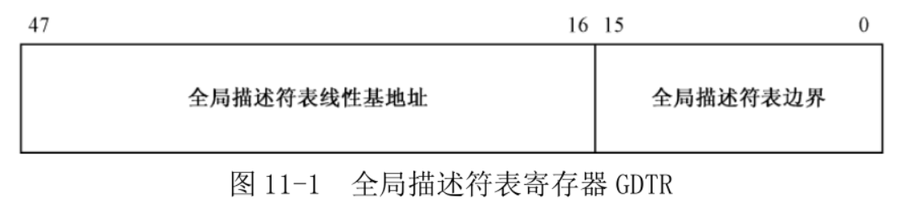
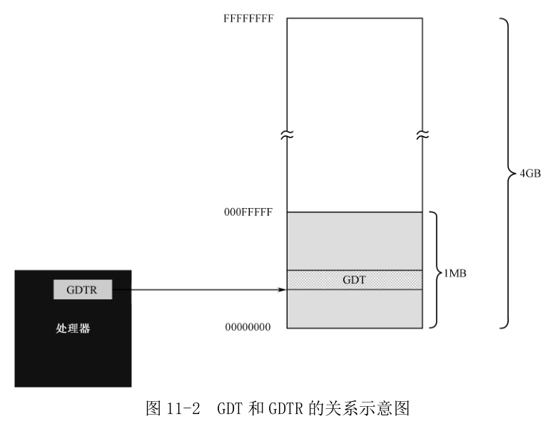

处理器将**内存**划分成**逻辑上的段**, 并在**指令中**使用**段内的偏移地址**.

在**保护模式**下, **对内存的访问**仍然使用**段地址**和**段内偏移地址**. 但是, 在**每个段能够访问之前**, 必须先进行登记. 登记的信息包括**段的起始地址**、**段的界限**等各种访问属性. 当你访问的偏移地址超出段的界限时, 处理器就会阻止并产生内部异常的中断.

和一个段有关的信息需要 **8 个字节**来描述, 所以称为**段描述符**(Segment Descriptor), 每个段都需要一个描述符. 在内存中开辟出**一个段空间**, 在这段空间里, 所有的描述符都是挨在一起, 集中存放的, 这就构成一个**描述符表**.

在**进入保护模式前**, 必须要**定义全局描述符表**.

为了跟踪全局描述符表, 处理器内部有一个 **48 位的寄存器**, 称为全局描述符表寄存器(**GDTR**). 该寄存器分为两部分, 分别是 **32 位的线性地址**和 **16 位的边界**.

* 32 位线性基地址部分保存的是**全局描述符表**在内存中的**起始线性地址**;
* 16 位边界部分保存的是全局描述符表的边界(界限), 其在数值上等于表的大小(**总字节数**)减一.

第 1 字节的偏移量是 0, 最后 1 字节的偏移量是表大小减一. 如果界限值为 0, 表示表的大小是 1 字节.

GDT 界限是 16 位, 该表最大是 `2^16` 字节, 也就是 65536 字节(64KB). 因为一个描述符占 8 字节, 故最多可以定义 8192(`2^13`, 刚好是 16 位选择符中 13 位表示 identifier)个描述符.

理论上, 全局描述符表可以位于内存中的任何地方. 但是, 如图 11-2 所示, 由于在**进入保护模式之后**, 处理器**立即要按新的内存访问模式工作**, 所以, **必须在进入保护模式之前定义 GDT**. 但是, **由于在实模式下只能访问 1MB 的内存, 故 GDT 通常都定义在 1MB 以下的内存范围中**. 当然, 允许在进入保护模式之后换个位置重新定义 GDT.

