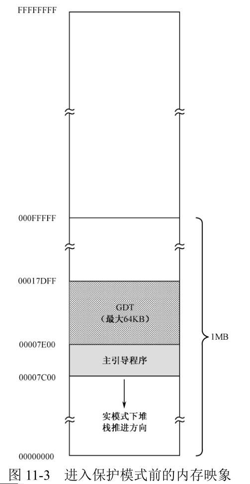
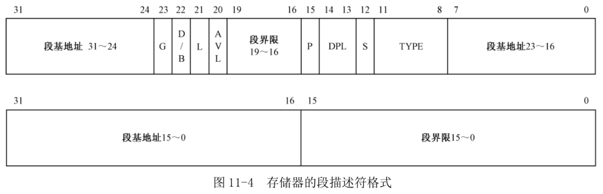
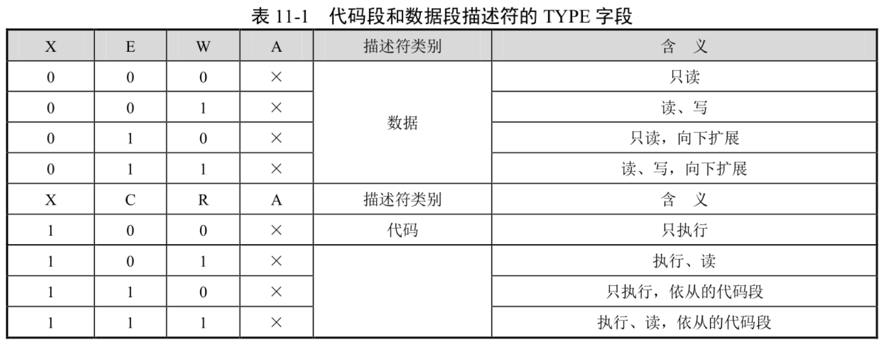
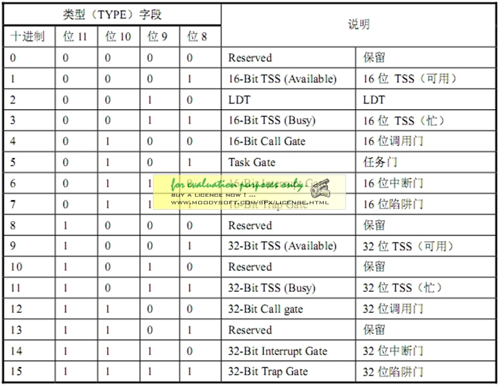

源码第 7~9 行用于初始化堆栈, 使堆栈段的逻辑段地址和代码段相同, 并使堆栈指针寄存器 SP 指向 0x7c00. 这是个分界线, 从这里, 代码向上扩展, 而堆栈向下扩展.

下面开始定义主引导扇区代码所使用的数据段、代码段和堆栈段. 在保护模式下, 内存的访问机制完全不同, 即, 必须通过描述符来进行. 所以, 这些段必须重新在 GDT 中定义.

先是确定 GDT 的起始线性地址. 第 96 行, 声明了标号 gdt_base 并初始化了一个双字 0x00007e00, 我们决定从这个地方开始创建全局描述符表(GDT). 这是有意的, 如图 11-3 所示, 在实模式下, 主引导程序的加载位置是 0x0000:0x7c00, 也就是物理地址 0x07c00. 因为现在的地址是 32 位的, 所以它现在对应着物理地址 0x00007c00. 主引导扇区程序共 512(0x200)字节, 所以, 我们决定把 GDT 设在主引导程序之后, 也就是物理地址 0x00007e00 处. 因为 GDT 最大可以为 64KB, 所以, 理论上, 它的尺寸可以扩展到物理地址 0x00017dff 处.

因为堆栈指针寄存器 SP 被初始化为 0x7c00, 和 CS 一样, 堆栈段寄存器 SS 被初始化为 0x0000, 而且堆栈是向下扩展的, 所以, 从 0x00007c00 往下的区域是实际上可用的堆栈区域. 只不过, 该区域包含了很多 BIOS 数据, 包括实模式下的中断向量表, 所以一定要小心. 在实模式下, 处理器不会为此负责, 只能靠你自己.

实模式和保护模式在内存访问上是有区别的, 保护模下, 在访问之前, 必须先在 GDT 内定义要访问的内存段.

想访问哪段内存, 就在 GDT 中定义一个描述符, 这和直接访问有什么区别?反正也能随心所欲, 只不过多了一道手续, 这又谈何限制和保护呢?

实际上并非如此. 如果整个计算机系统中只有一个程序在工作, 那当然是正确的. 问题在于, 会有很多程序共同在操作系统上运行. 所以, 描述符不是由用户程序自己建立的, 而是在加载时, 由**操作系统根据你的程序结构而建立的**, 而**用户程序通常是无法建立和修改 GDT 的**. 在这种情况下, 操作系统为你的程序建立了几个段, 你就只能在这些段内工作, 超出这个范围, 或者未按预定的方法访问这些段, 都将被处理器阻止.

一旦**确定了 GDT 在内存中的起始位置**, 下一步的工作就是**确定要访问的段**, 并**在 GDT 中为这些段创建各自的描述符**.

如图 11-4 所示, **每个描述符**在 GDT 中占 8 字节. 图中, 下面是低 32 位, 上面是高 32 位.

描述符中指定了**32 位的段起始地址**, 以及**20 位的段边界**. 在实模式下, 段地址并非真实的物理地址, 在计算物理地址时, 还要左移 4 位(乘以 16). 和实模式不同, 在 32 位保护模式下, 段地址是 32 位的线性地址, 如果未开启分页功能, 该线性地址就是物理地址. 我们先不考虑分页.

描述符中的段基地址和段界限不是连续的, 把它们分成几段似乎不科学. 这是从 80286 处理器上带来的后遗症. 80286 也是 16 位的处理器, 也有保护模式, 但属于 16 位的保护模式. 而且, 其地址是 24 位的, 允许访问最多 16MB 的内存. 32 位处理器为了保持同 80286 的兼容, 只能在旧描述符的格式上进行扩充, 这是不得已的做法.

段基地址可以是 0~4GB 范围内的任意地址, 不过, 还是建议应当选取那些 16 字节对齐的地址. 尽管对于 Intel 处理器来说, 允许不对齐的地址, 但是, 对齐能够使程序在访问代码和数据时的性能最大化.

20 位的段界限用来限制段的扩展范围.

G 位是粒度(Granularity)位, 用于解释段界限的含义. **当 G 位是"0"时, 段界限以字节为单位**. 此时, 段的扩展范围是从 1 字节到 1 兆字节(1B~1MB), 因为描述符中的界限值是 20 位的. **如果该位是"1", 段界限是以 4KB 为单位的**. 这样, 段的扩展范围是从 4KB 到 4GB.

S 位用于指定描述符的类型(Descriptor Type). 当该位是"0"时, 表示是一个系统段; 为"1"时, 表示是一个代码段或者数据段(堆栈段也是特殊的数据段, TYPE 里面的 E 位表示扩展方向), 即存储器的段描述符. 系统段将在以后介绍.

DPL 表示描述符的特权级(Descriptor Privilege Level, DPL). 这两位用于指定段的特权级. 在这里, 描述符的特权级用于指定要访问该段所必须具有的最低特权级. 现在一律将特权级设定为最高的 0.

P 是段存在位(Segment Present). P 位用于指示描述符所对应的段是否存在. 一般, 描述符所指示的段都位于内存中. 但是, 当内存空间紧张时, 有可能只是建立了描述符, 对应的内存空间并不存在, 这时, P 位清零, 表示段并不存在. 另外, 内存空间紧张时, 会把很少用到的段换出到硬盘中, 腾出空间给当前急需内存的程序使用(当前正在执行的), 这时, 同样要把段描述符的 P 位清零. 当再次轮到它执行时, 再装入内存, 然后将 P 位置 1.

P 位是由处理器负责检查的. 每当通过描述符访问内存中的段时, 如果 P 位是"0", 处理器就会产生一个**异常中断**. 通常, 该中断处理过程是由操作系统提供的, 该处理过程的任务是负责将该段从硬盘换回内存, 并将 P 位置 1. 在多用户、多任务的系统中, 这是一种常用的虚拟内存调度策略. 当内存很小, 运行的程序很多时, 如果计算机的运行速度变慢, 并伴随着繁忙的硬盘操作时, 说明这种情况正在发生.

D/B 位是"默认的操作数大小"(Default Operation Size)或者"默认的堆栈指针大小"(Default Stack Pointer Size), 又或者"上部边界"(Upper Bound)标志.

设立该标志位, 主要是为了能够在 32 位处理器上兼容运行 **16 位保护模式(不是实模式)**的程序.

该标志位对不同的段有不同的效果. 对于代码段, 此位称做"D"位, 用于指示指令中默认的偏移地址和操作数尺寸. D＝0 表示指令中的偏移地址或者操作数是 16 位的; D＝1, 指示 32 位的偏移地址或者操作数.

举例子来说, 如果代码段描述符的 D 位是 0, 那么, 当处理器在这个段上执行时, 将使用 16 位的指令指针寄存器 IP 来取指令, 否则使用 32 位的 EIP.

对于堆栈段来说, 该位被叫做"B"位, 用于在进行隐式的堆栈操作时, 是使用 SP 寄存器还是
ESP 寄存器. 隐式的堆栈操作指令包括 push、pop 和 call 等. 如果该位是"0", 在访问那个段时, 使用 SP 寄存器, 否则就是使用 ESP 寄存器. 同时, B 位的值也决定了堆栈的上部边界. 如果 B＝0, 那么堆栈段的上部边界(也就是 SP 寄存器的最大值)为 0xFFFF; 如果 B＝1, 那么堆栈段的上部边界(也就是 ESP 寄存器的最大值)为 0xFFFFFFFF.

L 位是 64 位代码段标志(64-bit Code Segment), 保留此位给 64 位处理器使用. 目前, 我们将此位置"0"即可.

TYPE 字段共 4 位, 用于指示描述符的子类型, 或者说是类别. 如表 11-1 所示, 对于数据段来说, 这 4 位分别是 X、E、W、A 位; 而对于代码段来说, 这 4 位则分别是 X、C、R、A 位.

X 表示是否可以执行(eXecutable). **数据段总是不可执行的**, X＝0; **代码段总是可以执行的**, 因此, X＝1.

对于数据段来说, E 位指示段的扩展方向. E＝0 是向上扩展的, 也就是向高地址方向扩展的, 是普通的数据段; E＝1 是向下扩展的, 也就是**向低地址方向扩展的, 通常是堆栈段**.

W 位指示段是否可写, W＝0 的段是不允许写入的, 否则会引发处理器异常中断; W＝1 的段是可以正常写入的.

对于代码段, C 位指示段是否为特权级依从的(Conforming). C＝0 表示非依从的代码段, 这样的代码段可以**从与它特权级相同的代码段调用**, 或者**通过门调用**; C＝1 表示允许从低特权级的程序转移到该段执行. 关于特权级和特权级检查的知识将在第 14 章介绍.

R 位指示代码段是否允许读出. 代码段总是可以执行的, 但是, 为防止被破坏, 它是**不能写入的**. 是否读出, 由 R 位指定. R＝0 表示不能读出, 如果企图去读一个 R＝0 的代码段, 会引发处理器异常中断; 如果 R＝1, 则代码段是可以读出的, 即可以把这个段的内容当成 ROM 一样使用.

既然代码段是不可读的, 那处理器怎么从里面取指令执行呢?事实上, **这里的 R 属性并非用来限制处理器, 而是用来限制程序和指令的行为**. 一个典型的例子是使用段超越前缀"CS:"来访问代码段中的内容.

数据段和代码段的 A 位是已访问(Accessed)位, 用于指示它所指向的段最近是否被访问过. 在描述符创建的时候, 应该清零. 之后, 每**当该段被访问时, 处理器自动将该位置"1"**. **对该位的清零是由软件(操作系统)负责的**, 通过定期监视该位的状态, 就可以统计出该段的使用频率. 当内存空间紧张时, 可以把不经常使用的段退避到硬盘上, 从而实现虚拟内存管理.

AVL 是软件可以使用的位(Available), 通常由操作系统来用, 处理器并不使用它.