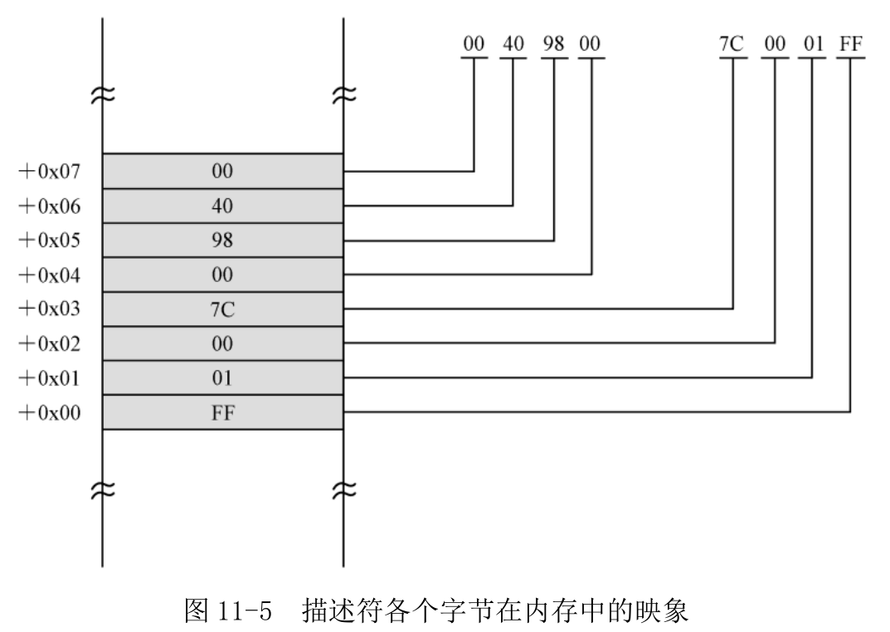

现在开始安装各个描述符, **现在还处于实模式下**. 因此, 在 GDT 中安装描述符, 必须**将 GDT 的线性地址转换成段地址和偏移地址**. 第 12 行, 将 GDT 线性基地址的低 16 位传送到寄存器 AX 中. 又因为主引导程序的实际加载位置是逻辑地址 0x0000:0x7c00, 故标号 gdt\_base 处的偏移地址是 gdt\_base+0x7c00.

第 13 行将 GDT 线性基地址的高 16 位传送到寄存器 DX.

第 14~17 行将线性基地址转换成逻辑地址, 方法是将 DX:AX 除以 16, 得到的商是逻辑段地址, 余数是偏移地址. 接着, 将 AX 中的逻辑段地址传送到数据段寄存器 DS 中, 将偏移地址传送到寄存器 BX 中.

**处理器规定, GDT 中的第一个描述符必须是空描述符, 或者叫哑描述符或 NULL 描述符**.

很多时候, 寄存器和内存单元的初始值会为 0, 再加上程序设计有问题, 就会在无意中用全 0 的索引来选择描述符. 因此, 处理器要求将第一个描述符定义成空描述符.

20、21 行将两个全 0 的双字分别写入偏移地址为 BX 和 BX+4 的地方.

进入保护模式之后必然要从一个代码段开始执行. 现在就来定义代码段描述符.

24、25 行, 安装代码段描述符, 该描述符的低 32 位是 0x7c0001ff, 高 32 位是 0x00409800.

对着段描述符字节内容, 分析

```
线性基地址为 0x00007C00.
段界限为 0x001FF, 粒度为字节(G＝0). 该段的长度为 512 字节.
属于存储器的段(S＝1).
这是一个 32 位的段(D＝1).
该段目前位于内存中(P＝1).
段的特权级为 0(DPL＝00).
这是一个只能执行的代码段(TYPE=1000).
```

该描述符所指向的段, 就是现在正在执行的主引导程序所在的区域. 如图 11-5 所示, 这是描述符各字节在内存中的映象. Intel 处理器是低端字节序的, 所以**低双字**在低地址端, **高双字**在高地址端; **低字**在低地址端, **高字**在高地址端; **低字节**在低地址端, **高字节**在高地址端(每次操作只要按照从右向左逐字节存放).



28、29 行, 用于安装一个数据段的描述符.

```
线性基地址为 0x000B8000.
段界限为 0x0FFFF, 粒度为字节(G＝0). 即, 该段的长度为 64KB.
属于存储器的段(S＝1).
这是一个 32 位的段(D＝1).
该段目前位于内存中(P＝1).
段的特权级为 0(DPL＝00).
这是一个可读可写、向上扩展的数据段(TYPE=0010).
```

在屏幕上显示内容, 线性地址 0x000b8000 就是显存的起始地址.

32、33 行, 用于安装堆栈段的描述符.

```
线性基地址为 0x00000000.
段界限为 0x07A00, 粒度为字节(G＝0).
属于存储器的段(S＝1).
这是一个 32 位的段(D＝1).
该段目前位于内存中(P＝1).
段的特权级为 0(DPL＝00).
这是一个可读可写、向下扩展的数据段, 即堆栈段(TYPE=0010).
```

段界限的值 0x07a00 加上 1(0x07a01), 就是 ESP 寄存器所允许的最小值. 当执行 push、call 这样的隐式堆栈操作时, **处理器会检查 ESP 寄存器的值**, 一旦发现它小于等于这里指定的数值, 会**引发异常中断**. 关于堆栈界限的讨论将在本章的后面接着进行.

接下来是加载描述符表的线性基地址和界限到 GDTR 寄存器, 这要使用 lgdt 指令, 该指令的格式为

```
lgdt m48 ;lgdt m16&m32
```

该指令的操作数是一个**内存地址**, 指向一个包含了 48 位(6 字节)数据的内存区域. **在 16 位模式下, 该地址是 16 位的**; 在 32 位模式下, 该地址是 32 位的. 该指令在实模式和保护模式下都可以执行.

**在这 6 字节的内存区域中, 前 16 位是 GDT 的界限值, 高 32 位是 GDT 的基地址**. 在初始状态
下(计算机启动之后), **GDTR 的基地址被初始化为 0x00000000; 界限值为 0xFFFF**.

该指向不影响任何标志位.

第 36 行, 将 GDT 表的界限值 31 写入标号 gdt_size 所在的内存单元. 这里共有 4 个描述符(包括空描述符), 每个描述符占 8 字节, 一共是 32 字节. GDT 表的界限值是表的总字节数减去一, 所以是 31.

38 行, 把从标号 gdt_size 开始的 6 字节加载到 GDTR 寄存器. 注意, 到目前为止, 我们依然工作在实模式下, 而且, 指令中的偏移地址都要加上 0x7c00.