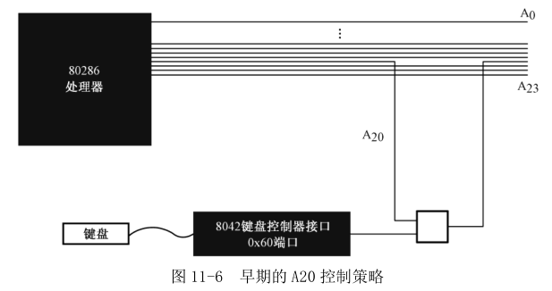

进入保护模式之前, 这里还涉及一个历史遗留问题, 那就是处理器的第 21 根地址线, 编号 A20. "A"是 Address 的首字符, 就是地址, A0 是第一根地址线. 在 8086 处理器上运行程序不存在 A20 问题, 因为它只有 20 根地址线.

实模式下的程序只能寻址 1MB 内存. 当逻辑段地址达到最大值 0xFFFF 时, 再加一, 就会因进位而绕回到 0x0000.

到了 80286 时代, 处理器有**24 条地址线**, 地址回绕不灵了. 比 0x0FFFFF 大的数是 0x100000, 80286 处理器可以维持 24 位的地址数据, 进位不会被丢弃. **为了能在 80286 处理器上运行 8086 程序而不会因地址线产生问题**, IBM 决定在主板上动手脚.

问题的解决办法很简单, 只需要强制**第 21 根地址线(A20)恒为"0"就可以**了. 这样, 0x0FFFFF 加 1 的进位被强制为"0", 结果是 0x000000(24 位地址线); 再加 1, 是 0x000001, ······, 永远和实模式一样.

如图 11-6 所示, IBM 公司使用一个**与门来控制第 21 根地址线 A20**, 并把这个与门的控制阀门放在**老式键盘控制器内(刚好有个空闲引脚, 现在的 USB 键盘已经不适用)**, 端口号是 0x60. 向该端口写入数据时, 如果第 1 位是"1", 那么, 键盘控制器通向与门的输出就为"1", 与门的输出就取决于处理器 A20 是"0"还是"1". **当它是 0, 则位 20 以及以上地址都被清除, 就能实现兼容性**.

不过这种方式很麻烦, 因为要访问键盘控制器, 需要先判断状态, 要等待键盘控制器不忙, 至少需要十几个步骤, 需要的指令数量很多.

所以从 80486 处理器开始, 处理器本身就有了 A20M#引脚, 意思是 A20 屏蔽(A20 Mask), 它是低电平有效的.

如图 11-7 所示, 输入输出控制器集中芯片 ICH 的处理器接口部分, 有一个用于兼容老式设备的端口 0x92, 第 7~2 位保留未用, 第 0 位叫做 INIT\_NOW, 意思是"现在初始化", 用于初始化处理器, 当它从 0 过渡到 1 时, ICH 芯片会使处理器 INIT#引脚的电平变低(有效), 并保持至少 16 个 PCI 时钟周期. 通俗地说, 向这个端口写 1, 将会使处理器复位, 导致**计算机重新启动**.

端口 0x92 的位 1 用于控制 A20, 叫做替代的 A20 门控制(Alternate A20 Gate, ALT\_A20\_GATE), 它和**来自键盘控制器的 A20 控制线**一起, 通过**或门**连接到处理器的 A20M#引脚. 和使用键盘控制器的端口不同, 通过 0x92 端口显得非常迅速, 也非常方便快捷, 因此称为 Fast A20.

**当 INIT\_NOW 从 0 过渡到 1 时, ALT\_A20\_GATE 将被置"1"**. 这就是说, **计算机启动时, 第 21 根地址线是自动启用的**. **A20M#信号仅用于单处理器系统**, 多核处理器一般不用. 特别是考虑到**传统的键盘控制器正逐渐被 USB 键盘代替**, 这些老式设备也许很快就会消失.

端口 0x92 是可读写的, 第 40~42 行, **先从该端口读出原数据, 接着, 将第 2 位(位 1)置"1", 然后再写入该端口, 这样就打开了 A20**. 为了能够访问和使用 1MB 以上的物理内存, 我们需要开启 A20 地址线.