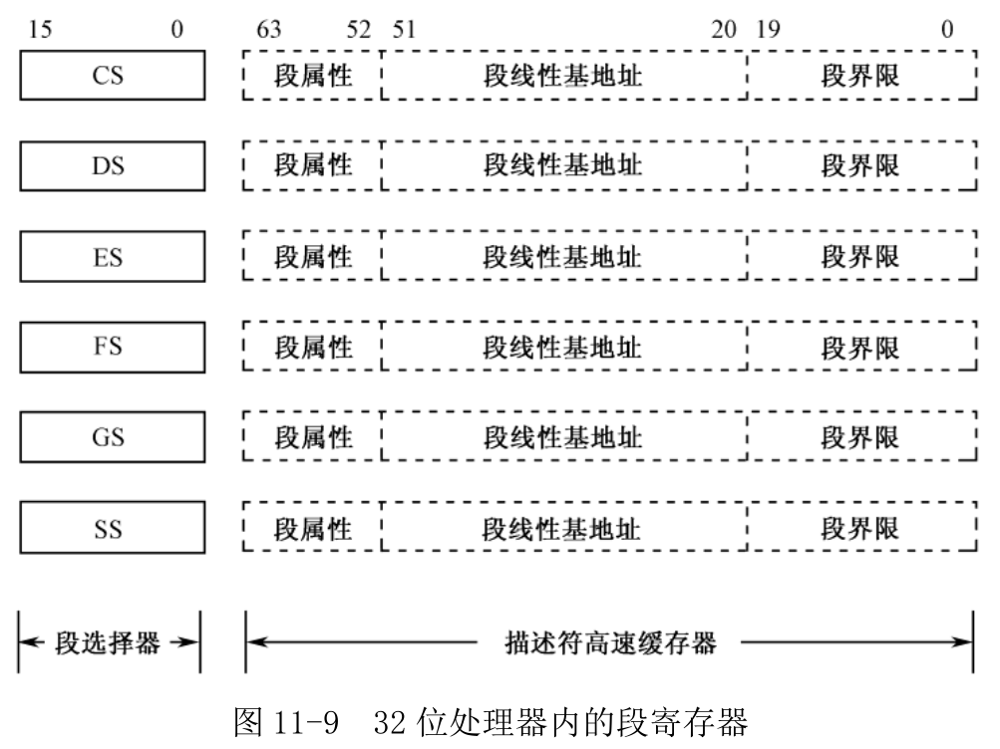
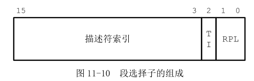
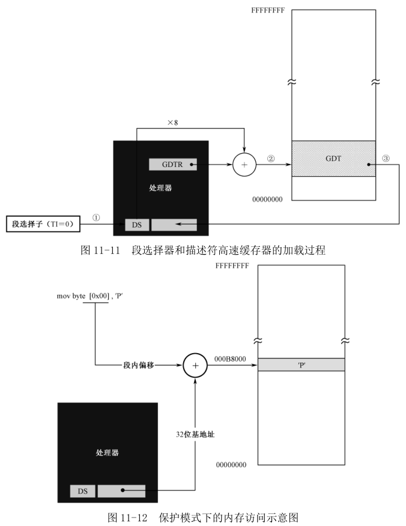

控制两种模式切换的开关原是在一个叫 CR0 的寄存器. 它的第 1 位(位 0)是保护模式允许位(Protection Enable, PE).

**CR0 是 32 位的寄存器**, 包含了一系列用于控制处理器操作模式和运行状态的标志位. 它的第 1 位(位 0)是保护模式允许位(Protection Enable, PE).

保护模式下的中断机制和实模式不同, 因此, 原有的中断向量表不再适用.

**在保护模式下, BIOS 中断都不能再用, 因为它们是实模式下的代码**. 在重新设置保护模式下的中断环境之前, 必须关中断, 这就是第 44 行的用意.

46 行, 将 CRO 寄存器中的原有内容传送到寄存器 EAX, 准备修改它; 第 47 行, 将它的第 1 位(位 0)置"1", 其他各位保持原来的状态不变; 第 48 行, 修改后的内容重新写回 CR0, 直接**导致处理器的运行变成保护模式**.

在实模式下, 处理器访问内存的方式是将段寄存器的内容左移 4 位, 再加上偏移地址, 以形成 20 位的物理地址.

8086 处理器的段寄存器是 16 位的, 4 个: CS、DS、ES 和 SS. 而在 32 位处理器内, 段寄存器是 80 位的(16 位段选择器和 64 位描述符高速缓存器). 而且, 在原先的基础上又增加了两个段寄存器 FS 和 GS.

如图 11-9 所示, 32 位处理器的 6 个段寄存器又分为两部分, 前 16 位和 8086 相同, 在实模式下, 它们用于按传统的方式寻址 1MB 内存, 使用方法也没有变化, 所以使得 8086 的程序可以继续在 32 位处理器上运行. 同时, **每个段寄存器还包括一个不可见的 64 位部分**, 称为**描述符高速缓存器**, 用来存放段的线性基地址、段界限和段属性. 事实上, 我们**没有任何办法来访问这些不可见的部分**, 它是由**处理器内部使用**的.



**实模式下, 访问内存用的是逻辑地址, 即将段地址乘以 16, 再加上偏移地址**.

```
mov cx,0x2000
mov ds,cx
mov [0xc0],al
mov cx,0xb800
mov ds,cx
mov [0x02],ah
```

以上, 首先将段寄存器 DS 的内容置为 0x2000, 这是逻辑段地址. 接着, 向该段内偏移地址为 0x00c0 的地方写入 1 字节(在寄存器 AL 中), 写入时, 处理器将 DS 的内容左移 4 位, 加上偏移地址, 实际写入的物理地址是 0x200c0.

在 8086 处理器上, 这是正确的. 但是, 在 32 位处理器(**不是说 32 位模式, 32 位处理器的实模式**)上, 这个过程稍有不同. 首先, 每当引用一个段时, 处理器自动**将段地址左移 4 位**, 并**传送到描述符高速缓存器**. 此后, 就一直**使用描述符高速缓存器的内容作为段地址**. 所谓**引用一个段, 就是执行将段地址传送到段寄存器的指令**.

```
jmp 0xf000:0x5000
```

以上是引用代码段的一个例子, 因为代码段的修改通常是用转移和调用指令进行的.

引用数据段, 则一般采用以下形式:

```
mov ax,0x2000
mov ds,ax
```

只要**不改变段寄存器 DS**, 以后**每次内存访问都直接使用 DS 描述符高速缓存器中的内容**. 但是, 在实模式下只能向段寄存器传送 16 位的逻辑段地址, 故, 处理器仍然只能访问 1MB 内存. 也就是说, **在实模式下**, **段寄存器描述符高速缓存器**的内容仅**低 20 位有效**, 高 12 位全部是零.

实模式下的 6 个段寄存器 CS、DS、ES、FS、GS 和 SS, 在保护模式下叫做段选择器. 在保护模式下, 尽管访问内存时也需要指定一个段, 但传送到段选择器的内容不是逻辑段地址, 而是段描述符在描述符表中的索引号.

如图 11-10 所示, 在保护模式下访问一个段时, 传送到段选择器的是段选择子. 它由三部分组成, 第一部分是**描述符的索引号**, 用来在描述符表中选择一个段描述符. TI 是描述符表指示器(Table Indicator), TI＝0 时, 表示描述符在 GDT 中; TI＝1 时, 描述符在 LDT 中. RPL 是请求特权级, 表示**给出当前选择子的那个程序的特权级别**. 现在设为"00"即可.



前面已经创建了全局描述符表(GDT), 而且在表中定义了 4 个段描述符. 数据段描述符在 GDT 中的顺序是第 3 个, 因为**编号都是从 0 开始的**, 所以它的**索引号(或者叫编号、槽位号)是 2**.

56、57 行, 将描述符选择子 0x0010(二进制数 0000\_0000\_ 00010\_0\_00)传送到段选择器 DS 中. 从选择子的二进制形式可以看出, 指定的描述符索引号是 2, 指定的描述符表是 GDT, 请求特权级 RPL 是 00.

GDT 的线性基地址在 GDTR 中, 每个描述符占 8 字节, 因此, **描述符在表内的偏移地址是索引号乘以 8**. 如图 11-11 所示, 当处理器在执行任何改变段选择器的指令时(比如 pop、mov、jmp far、call far、iret、retf), 就将指令中提供的索引号乘以 8 作为偏移地址, 同 GDTR 中提供的线性基地址相加, 以访问 GDT. 如果没有发现什么问题(比如超出 GDT 的界限), 就自动将找到的**描述符加载到不可见的描述符高速缓存**部分.

加载的部分包括段的线性基地址、段界限和段的访问属性. 在当前的例子中, 线性基地址是 0x000b8000, 段界限是 0x0ffff, 段的属性是向上扩展, 可读写的数据段, 粒度为字节.

此后, 每当有访问内存的指令时, 就不再访问 GDT 中的描述符, 直接用当前段寄存器描述符高速缓存器提供线性基地址. 因此, 第 60 行, 因为指令中没有段超越前缀, 故默认使用数据段寄存器 DS. 如图 11-12 所示, 执行这条指令时, 处理器用 DS 描述符高速缓存中的线性基地址加上指令中给出的偏移量 0x00, 形成 32 位物理地址 0x000b8000, 并将字符"P"的 ASCII 码写入该处.



处理器取指令执行时, 也采用了相同的方法.