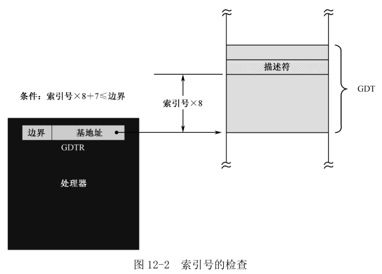
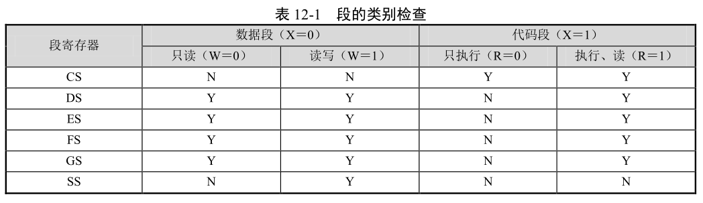

处理器在变更段寄存器以及隐藏的描述符高速缓存器的内容时, 要检查其代入值的合法性.

在当前程序中, 选择子的 TI 位都是 0, 故所有的描述符都在 GDT 中. 如图 12-2 所示, **GDT 的基地址和界限, 都在寄存器 GDTR 中**. **描述符在内存中的地址**, 是用**索引号乘以 8**, 再和**描述符表的线性基地址**相加得到的, 而这个地址必须在描述符表的地址范围内. 换句话说, 索引号乘以 8 得到的数值, 必须位于描述符表的边界范围之内. 换句话说, 处理器从 GDT 中取某个描述符时, 就要求描述符的 8 个字节都在 GDT 边界之内, 也就是 索引号×８＋7 小于等于边界.

如果检查到指定的段描述符, 其位置超过表的边界时, 处理器中止处理, **产生异常中断 13**, 同时段寄存器中的原值不变.

以上仅仅是检查的第一步.

通过了上述检查, 并从表中取得描述符后, 紧接着还要对描述符的类别进行确认. 举个例子来说, 若描述符的类别是只执行的代码段(表 11-1), 则不允许加载到除 CS 之外的其他段寄存器中.

具体地说, 首先, 描述符的类别字段必须是有效的值, 0000 是无效值的一个例子.

然后, 检查描述符的类别是否和段寄存器的用途匹配. 其规则如表 12-1 所示.

最后, 除了按表 12-1 进行段的类别检查外, 还要**检查描述符中的 P 位**. 如果 P＝0, 表明虽然描述符已被定义, 但该段实际上并不存在于物理内存中. 此时, 处理器中止处理, **引发异常中断 11**. 一般来说, 应当定义一个中断处理程序, 把该描述符所对应的段从硬盘等外部存储器调入内存, 然后置 P 位. 中断返回时, 处理器将再次尝试刚才的操作.

如果 P＝1, 则处理器将描述符加载到段寄存器的描述符高速缓存器, 同时置 A 位(仅限于当前讨论的存储器的段描述符).
