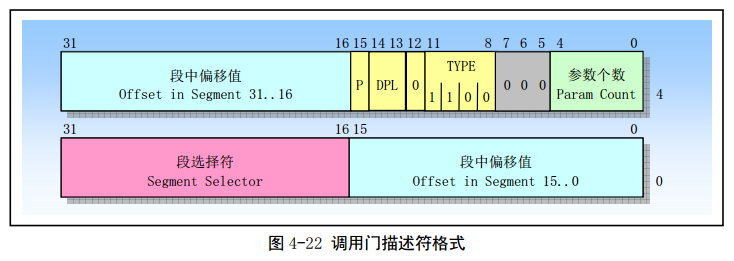
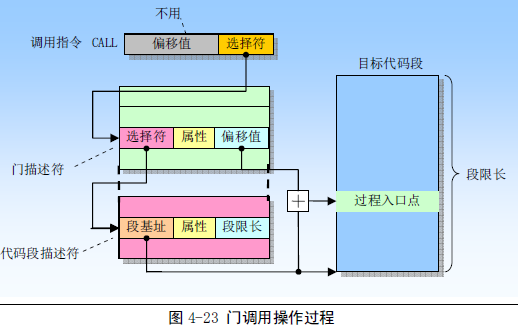
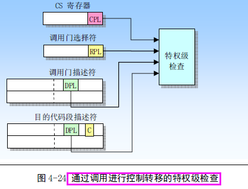
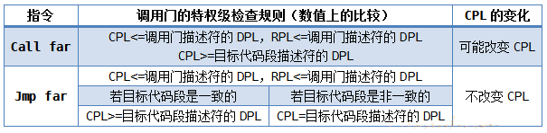

# 1. 调用门

处理器**禁止将控制从特权级低的程序转移到特权级高的程序**, 因此直接调用内核例程, 一定会引发处理器异常中断.

调用门(Call-Gate)用于**在不同特权级的程序之间进行控制转移**, 通常**仅用于使用特权级保护机制的操作系统中**. 本质上, 它只是一个描述符, 一个不同于代码段和数据段的描述符, **可以安装在 GDT 或 LDT 中**. 格式如图(图片来自赵炯的《Linux 内核完全剖析》).



- **调用门描述符给出了代码段的选择子**, 有了段选择子, 就可以访问 GDT 或者 LDT 得到代码段的基地址.
- **调用门描述符中给出了偏移量**, 因此通过调用门进行控制转移时, **不使用指令中给出的偏移量(！！！**).
- s=0, 表明是系统段; TYPE 字段用于标识门的类型, 1100 表示调用门.
- 描述符中的 P 位是有效位, 通常是 1. 当它为 0 时, 调用这样的门会导致处理器产生异常. 对于操作系统来说, 这个可能会很有用. 比如, 为了统计调用门的使用频率,  可以将它置为"0". 每当因为调用该门而产生异常中断, 在中断处理程序中将该门的调用次数加一, 同时把 P 置为"1". 可以在该调用门所对应的例程中将 P 位清零.
- DPL 字段指明调用门的特权级, 从而指定通过调用门访问特定过程所要求的特权级.
- 参数个数字段指明在发生堆栈切换时从调用者堆栈复制到新堆栈中的参数个数.
- 门调用的操作过程如下图所示(图片来自赵炯的《Linux 内核完全剖析》).



为了访问调用门, 我们需要为 CALL 或者 JMP 指令的操作数提供一个远指针. **该指针中的选择子用于指定调用门(调用门在 LDT 或 GDT 中)**, 而指针中的偏移值虽然需要, 但是 CPU 不会使用它. 该偏移值可以设置为任意值. 当处理器访问调用门时, 它会使用调用门中的段选择子来定位目标代码段的段描述符. 然后 CPU 会把代码段描述符中的基地址和调用门中的偏移值进行组合, 形成代码段中指定程序入口点的线性地址.

通过调用门实施特权级之间的控制转移时, 可以使用 jmp far 指令或 call far 指令, call far 会改变当前特权级 CPL. **因为栈段的特权级必须与当前特权级保持一致**, 所以, 还要切换栈. 栈段切换(**因为特权级切换, 不是任务切换, 任务切换不用考虑这个, 因为每个任务有自己的栈段. 同一任务内的控制转移 CPU 肯定会进行堆栈切换！！！**)原因:

1. 因为栈段的特权级必须同 CPL 保持一致;
2. 防止高特权级程序由于栈空间不足而崩溃;
3. 防止低特权级程序通过共享的栈有意或无意地干扰高特权级程序.

**为了切换栈, 每个任务除了自己的固有栈, 还需额外定义的几套栈**, 具体数量取决于任务的特权级别. 0 特权级不需要额外的, 自己固有的就足够使用了, 因为**除了调用返回外(！！！)**, 不可能将控制转移到低特权级的段; 1 级需要一个额外定义一个描述符特权级 DPL 为 0 的栈, 以便将控制转移到 0 特权级时使用; 2 级需要额外两个栈, 描述符特权级 DPL 分别是 0 和 1, 在控制转移到 0 和 1 特权级时使用; 3 特权级的任务最多额外定义了 3 个栈, 描述符特权级 DPL 分别时 0、1、2.

这些**额外的栈**, 一般操作系统自动创建. **其描述符位于任务自己的 LDT 中**. 同时, 还要在任务的 TSS 中登记, 原因是, 栈切换是由处理器固件自动完成的, 处理器需要根据 TSS 中的信息来完成这一过程. 查看 TSS 的构成, 偏移 4~24 登记特权级 0 到 2 的栈段选择子, 以及相应的 ESP 初始值. 任务自己固有的栈信息存在偏移 56(ESP)和 80(SS)的地方.

**任务寄存器 TR 总是指向当前任务状态段 TSS, 其内容为该 TSS 的基地址和界限(TR 永远指向当前正在执行的任务). 在切换栈时, 处理器可以用 TR 找到当前任务的 TSS, 并从 TSS 中获取新栈的信息. **

**通过调用门使用高特权级的例程服务时, 调用者会传递一些参数给例程**. 可以通过寄存器传递, 更常用做法是通过栈进行. **调用者将参数入栈(调用者的动作, 非处理器, 处理器需要知道参数个数)**, 例程从栈中获取.

例程需要什么参数, 先压入哪个参数, 后压入哪个参数, 这是调用者和例程之间的约定. 例程为获取参数, 必须将参数从旧栈复制到新栈.

**参数复制工作是由处理器固件完成, 但是需要知道参数个数, 并根据数量决定复制多少内容**. 所以, 调用门描述符中还有一个参数个数字段, 共 5 比特, 也就是说最多 31 个参数.

栈切换前, 段寄存器 SS 指向的是旧栈, ESP 指向旧栈的栈顶, 即最后一个被压入的过程参数; 栈切换后, 处理器自动替换 SS 和 ESP 内容, 使它们分别为新栈的选择子和新栈的栈顶(最后一个被复制的参数). 这一切, 对程序的编写者来说是透明的, 程序员不关心. 因为在栈切换之前:

```
pop edx
```

可以得到最后一个被压入栈的参数, 在栈切换后, 这条指令同样可以得到那个参数, 尽管栈段和栈顶指针已经改变.

通过调用门进行控制转移时, CPU 会检查以下字段:

1. 当前特权级 CPL
2. 调用指令中的调用门选择子的 RPL
3. 调用门描述符中的 DPL
4. 目标代码段描述符中的 DPL
5. 目标代码段描述符中的一致性标志 C



调用门描述符中的 DPL 和目标代码段描述符中的 DPL 用于决定哪些特权级的程序可以访问此门. **必须符合下面两个条件才行(同时符合！！！)**:

- 当前特权级 CPL 和请求特权级 RPL 高于, 或者和调用门描述符特权级 DPL 相同. 即, 数值上,

```
CPL<=调用门描述符的 DPL
RPL<=调用门描述符的 DPL
```

- 当前特权级 CPL 低于, 或和目标代码段描述符特权级 DPL 相同. 在数值上

```
CPL>=目标代码段描述符的 DPL
```

总结如下:



需要说明的是: 如果通过调用门把控制转移到了更高特权级的非一致代码段中, 那么 CPL 就会被设置为目标代码段的 DPL 值, 并且会引起堆栈切换.

