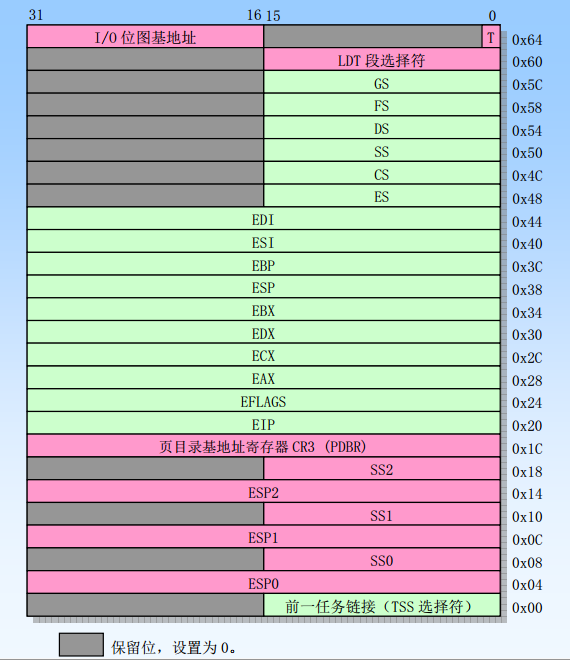
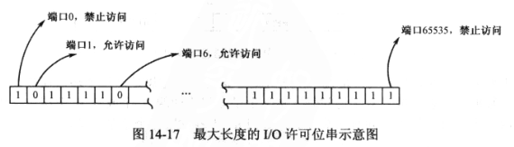
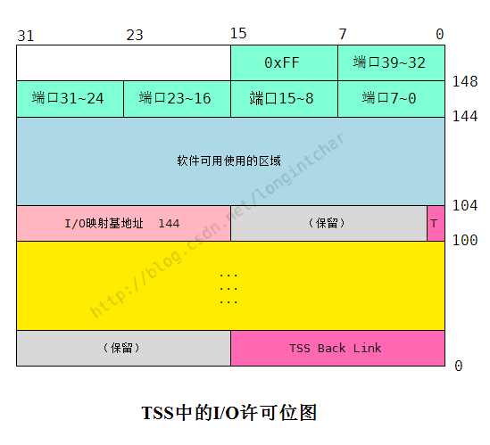
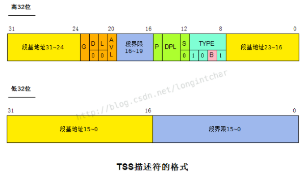

# 1. 任务控制块和 TCB 链

把控制权从较低的特权级转移到较高的特权级, 通过调用门可以, 但是直接控制转移是不允许的.

内核初始化完成后, 接下来加载和重定位用户程序(应用程序), 并移交控制权. 按处理器的要求, **要使一个程序成为"任务", 并且能够参与任务切换和调度, 必须要有 LDT 和 TSS**.

加载程序并创建一个任务, 需要用到很多数据, 比如程序的大小、加载的位置等等. 当任务执行结束, 还要依据这些信息回收所占用的内存空间. 还有, 多任务系统是多个任务同时运行的, 特别是在一个单处理器(核)的系统中, **为了任务切换和轮转**, 必须能追踪到**所有正在运行的任务**, 记录它们的状态, 或根据它们的当前状态来采取合适操作(16 章学习任务切换和轮转).

为满足以上要求, 内核应该为每一个任务创建一个内存区域, 来记录任务的信息和状态, 称为任务控制块(Task Control Block, TCB). **TCB 不是处理器要求**, 是我们自己为方便发明的.

为追踪到所有任务, 应当把每个人物控制块 TCB 串起来, 形成一个链表.

# 3. 加载用户程序

**当用户程序被读入内存, 并处于运行或等待运行的状态时, 就视为一个任务**. 每个任务允许有自己的 LDT, 而且可以定义在任何内存位置. 所以, 我们需要做三件事:

- 分配一块内存, 作为 LDT 使用, 为创建用户程序各个段的描述符准备;
- 将 LDT 的大小和起始线性地址登记在任务控制块 TCB 中;
- 分配内存并加载用户称故乡, 并将它的大小和起始线性地址登记到 TCB 中.

# 7. 安装 LDT 描述符到 GDT 中

**LDT 和 GDT 都用来存放各种描述符, 因为它们用于系统管理, 所以称为系统的段或系统段**. 《ComputerArchitecture/x86/CPU/实模式和保护模式区别及寻址方式》可以查看所有系统段.

GDT 是唯一的, 所以**只需要用 GDTR 寄存器存放其线性地址和段界限即可(不需要设置 GDT 描述符<指向 GDT 的描述符>)**; 但 LDT 不同, 每个任务一个, 所以为了追踪它们, 处理器要求**在 GDT 中安装每个 LDT 的描述符(每个 LDT 都有相应的描述符在 GDT 中)**.

**当要使用这些 LDT(即执行该任务时, TSS 中有一个 IDT 选择子)**时, 可以**用它们的选择子来访问 GDT**, **将 LDT 描述符加载到 LDTR 寄存器**. 其实主要用来做寄存器和特权级的保护工作.

下图是**LDT 描述符**(意思是在**GDT 中的指向相应 LDT 的描述符**)的格式.

LDT 本身时一种特殊的段, 最大尺寸是 64KB. 段基地址指示 LDT 在内存的起始地址, 段界限指示 LDT 的范围; 描述符的 G 是颗粒度, 适用于 LDT, **即使 4KB 的颗粒度, 也不能超过 64KB 的大小**.

D 位(或叫 B 位)和 L 位对 LDT 描述符来说没有意义, 固定为 0.

AVL 和 P 位含义和存储器的段描述符相同.

LDT 描述符中的 S 位固定为 0, 表示系统的段描述符或门描述符, 以相对于存储器的段描述符(S=1), 因为 LDT 描述符属于系统的段描述符.

在描述符为系统的段描述符时, 即, S=0 的前提下, TYPE 字段为 0010(二进制)表明这是一个 LDT 描述符.

## 8. 任务状态段 TSS 的格式

TSS 内偏移 0 处是前一个任务的 TSS 描述符选择子. 当系统多个任务同时存在, 可以从一个任务切换到另一个任务执行, 此时称任务是嵌套的. 被嵌套的任务用这个指针指向前一个任务, 控制返回时, 处理器需要这个指针. 当 Call 指令、中断或者异常造成任务切换, 处理器会把旧任务的 TSS 选择子复制到新任务的 TSS 的 Back Link 字段中, 并且设置**新任务的 NT**(EFLAGS 的 bit14)为 1, 以表明新任务嵌套于旧任务中. 关于这点我们会在第 15 章学习. 在创建一个任务的时候, 这个字段可以填写 0.

SS0、SS1 和 SS2 分别是 0、1 和 2 特权级的**栈段选择子**, ESP0、ESP1 和 ESP2 分别是 0、1 和 2 特权级栈的栈顶指针. 这些内容由当前任务的创建者填写, 且填写后一般不变的静态部分, 当通过门进行特权级之间的控制转移时, 处理器使用这些信息来切换栈.

CR3 和分页有关, 16 章讲述. 此处一般由任务的创建者填写.

偏移 32~92 区域是处理器各个寄存器的快照部分, 用于在进行任务切换时, 保存处理器的状态以便恢复现场. 在一个多任务环境中, 每次创建一个任务, 操作系统至少要填写 EIP、EFLAGS、ESP、CS、DS、SS、ES、FS 和 GS, 当任务第一次执行, 处理器从这里加载初始执行环境, 并从 CS:EIP 处开始执行任务的第一条指令. 此后运行期间, 该区域内容由处理器固件进行更改.

LDT 选择子是当前任务的 LDT 描述符选择子. 由内核填写, 指向当前任务的 LDT. 该信息由处理器在任务切换时使用, 在任务运行期间保持不变.

T 位用于软件调试. 多任务环境中, T=1, 每次切换到该任务时, 将**引发一个调试异常中断**. 调试程序可以接管该中断并显示任务的状态.

I/O 映射基地址用于决定当前任务是否可以访问特定的硬件端口.

#### I/O 许可位图(I/O Permission Bit Map)

EFLAGS 寄存器的 IOPL 位决定了当前任务的 I/O 特权级别. 如果在数值上 CPL<=IOPL, 那么所有的 I/O 操作都是允许的, 针对任何硬件端口的访问都可以通过; 如果在数值上 CPL>IOPL, 也并不是说就不能访问硬件端口. 事实上, 处理器的意思是总体上不允许, 但个别端口除外. 至于个别端口是哪些端口, 要找到当前任务的 TSS, 并检索 I/O 许可位图.

I/O 许可位图(I/O Permission Bit Map)是一个比特序列, 因为处理器最多可以访问 65536 个端口, 所以这个比特序列最多允许 65536 比特(即 8KB).

如下图中的绿色部分, 第一个字节代表端口 0~7, 第二个字节代表端口 8~15, 以此类推. 每个比特的值决定了相应的端口是否允许访问. 为 1 时禁止访问, 为 0 时允许访问.

在 TSS 内偏移为 102 字节的那个字单元, 是 I/O 位图基地址字段, 它指明了 I/O 许可位图相对于 TSS 起始处的偏移, 例如下图中这个字段的值是 144.

有几点需要说明:

1. 如果 I/O 位图基地址的值>=TSS 的段界限(就是 TSS 描述符中的段界限), 就表示没有 I/O 许可位图.
2. 处理器要求 I/O 位图的末尾必须附加一个全 1 的字节, 即 0xFF.
3. 处理器不要求为每一个 I/O 端口都提供位映射, 对于那些没有在位图中映射的位, 处理器假定它对应的比特是 1(禁止访问).
4. TSS 描述符中的界限值包括 I/O 许可位图在内, 也包括最后附加的 0xFF. 以下图为例, TSS 的界限值是 149(总大小 150 减去 1).

## 9. 创建任务状态 TSS

TSS 的界限值必须至少 103, 小于改值的 TSS, 执行任务切换时, 会引发处理器异常中断.

## 10. 安装 TSS 描述符到 GDT 中(TSS 描述符)

和 LDT 一样, **必须在全局描述符表(GDT)中创建每一个 TSS 的描述符(还是在 GDT 中！！！)**. 一方面为了对 TSS 进行段和特权级的检查; 另一方面, 也是执行任务切换的需要. **当 call far 和 jmp far 指令的操作数是 TSS 描述符选择子时, 处理器执行任务切换操作**.

TSS 描述符格式和 LDT 描述符差不多(也是系统段), 除了 TYPE 位.

B 位是"忙"位(Busy). 在任务刚刚创建的时候, 它应该为 0, 表明任务不忙. 当任务开始执行时, 或者处于挂起状态(临时被中断执行)时, 由处理器固件把 B 位置 1.

任务是不可重入的. 就是说在多任务环境中, 如果一个任务是当前任务, 那么它可以切换到其他任务, 但是不能从自己切换到自己. 在 TSS 描述符中设置 B 位, 并由处理器固件进行管理, 可以防止这种情况的发生.