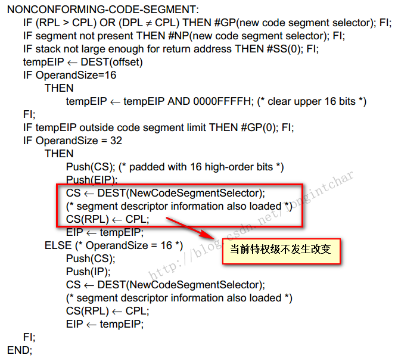
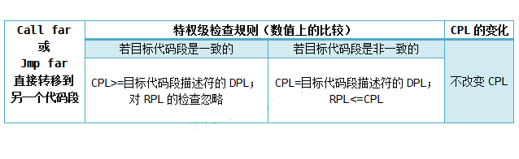
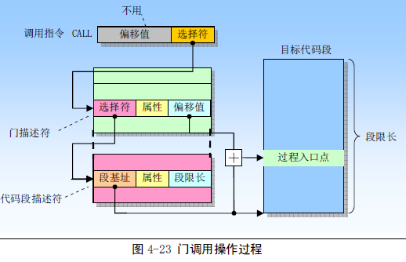
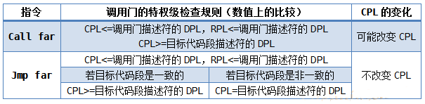
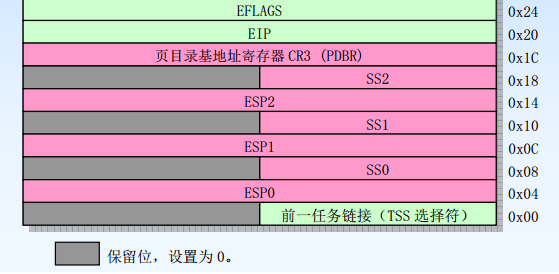
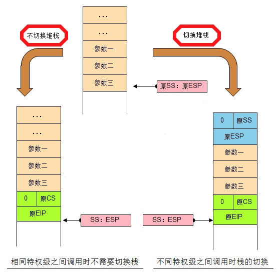
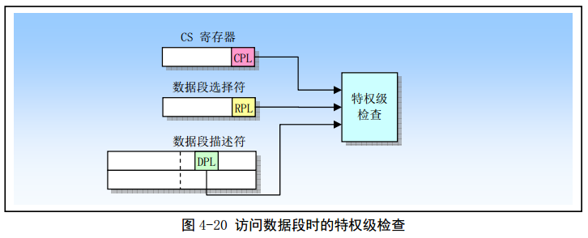

# 1. 代码段间转移控制时的特权级检查

在保护模式下, JMP 或 CALL 指令可以用以下四种方法之一来引用另外一个代码段:

1. 目标操作数含有目标代码段的段选择子和偏移
2. 目标操作数指向一个调用门描述符
3. 目标操作数指向一个 TSS
4. 目标操作数指向一个任务门

## 直接调用或跳转到另一个代码段

JMP、CALL、RET 指令的近转移只是在当前代码段中执行程序的控制转移, 因此不会执行特权级检查. JMP、CALL、RET 指令的远转移形式会把控制转移到另外一个代码段中, 因此处理器一定会执行特权级检查.

当目标代码段的描述符中的 C 字段为 1 时, 表示这是一个一致代码段; 为 0 时, 表示这是一个非一致代码段.

### 转移到一致代码段(C=1)

要求调用者的 CPL 在数值上大于等于目标代码段的 DPL. 仅当 CPL 的数值小于 DPL 时, 处理器才会产生一般保护异常. 处理器忽略对 RPL 的检查.

CPL 并不改变, 由于 CPL 没有改变, 因此堆栈也不会切换.

### 转移到非一致代码段(C=0)

要求调用者的 CPL 的数值必须等于目标代码段的 DPL, RPL 在数值上小于等于目标代码段的 DPL;

当目标代码段的段选择子被加载进 CS 寄存器中时, CS 的 RPL 字段在数值上等于调用者的 CPL.

下图摘自《Intel Architecture Software Developer's Manual Volume 2: Instruction Set Reference》中的 CALL 指令, 对于我们理解这个过程很有帮助.



注意画红框的部分: 第一行表示把目标代码段的选择子传到 CS 寄存器; 第三行表示用当前特权级(不改变)修正 CS 寄存器的 RPL 字段.

### 总结



大多数代码段都是非一致代码段. 对于这些代码段, 程序的控制权只能转移到具有相同特权级的代码段中, 除非转移是通过一个调用门进行, 见下文.

## 通过调用门进行控制转移

### 调用门描述符的格式

调用门用在不同特权级之间实现受控的程序控制转移, 通常仅用于使用特权级保护机制的操作系统中. 本质上, 它只是一个描述符, 一个不同于代码段和数据段的描述符, 可以安装在 GDT 或者 LGT 中, 但是不能安装在 IDT(中断描述符表)中.

注意: Linux Kernel 0.12 中并没有用到调用门.


上图就是调用门描述符的格式(图片来自赵炯的《Linux 内核完全剖析》).

- 调用门描述符给出了代码段的选择子, 有了段选择子, 就可以访问 GDT 或者 LDT 得到代码段的基地址.
- 调用门描述符中给出了偏移量, 因此通过调用门进行控制转移时, 不使用指令中给出的偏移量.
- TYPE 字段用于标识门的类型, 1100 表示调用门.
- 描述符中的 P 位是有效位, 通常是 1. 当它为 0 时, 调用这样的门会导致处理器产生异常.
- DPL 字段指明调用门的特权级, 从而指定通过调用门访问特定过程所要求的特权级.
- 参数个数字段指明在发生堆栈切换时从调用者堆栈复制到新堆栈中的参数个数.
- 门调用的操作过程如下图所示(图片来自赵炯的《Linux 内核完全剖析》).



为了访问调用门, 我们需要为 CALL 或者 JMP 指令的操作数提供一个远指针. 该指针中的选择子用于指定调用门, 而指针中的偏移值虽然需要, 但是 CPU 不会使用它. 该偏移值可以设置为任意值. 当处理器访问调用门时, 它会使用调用门中的段选择子来定位目标代码段的段描述符. 然后 CPU 会把代码段描述符中的基地址和调用门中的偏移值进行组合, 形成代码段中指定程序入口点的线性地址.


### 通过调用门访问代码段时的特权级检查

通过调用门进行控制转移时, CPU 会检查以下字段:

1. 当前特权级 CPL
2. 调用指令中的调用门选择子的 RPL
3. 调用门描述符中的 DPL
4. 目标代码段描述符中的 DPL
5. 目标代码段描述符中的一致性标志 C


### 总结



需要说明的是: 如果通过调用门把控制转移到了更高特权级的非一致代码段中, 那么 CPL 就会被设置为目标代码段的 DPL 值, 并且会引起堆栈切换.

### 关于堆栈切换

如果通过调用门把控制转移到了更高特权级的非一致代码段中, 那么 CPL 就会被设置为目标代码段的 DPL 值, 并且会引起堆栈切换. 为什么要切换堆栈呢?原因有以下几点:

1. 因为栈段的特权级必须同 CPL 保持一致;
2. 防止高特权级程序由于栈空间不足而崩溃;
3. 防止低特权级程序通过共享的栈有意或无意地干扰高特权级程序.

为了切换栈, 每个任务除了自己的固有栈之外, 还必须额外定义一套或多套栈, 具体是多少取决于任务的特权级别.
0 特权级的任务不需要额外的栈, 因为除了从调用高特权级的例程(通常是操作系统例程)返回外, 不允许将控制从特权级高的代码段转移到特权级低的代码段——操作系统不会引用可靠性比自己低的代码; 1 特权级的任务需要额外定义一个 DPL 为 0 的栈, 以便将控制转移到 0 特权级时使用; 2 特权级的任务需要额外定义两个栈, 其 DPL 分别为 0 和 1; 3 特权级的任务最多额外定义三个栈, 其 DPL 分别为 0、1、2.

以下文字摘自《Intel Architecture Software Developer's Manual Volume 3:System Programming》的 4.8.5 节——Stack Switching.

```
Each task must define up to 4 stacks: one for applications code (running at privilege level 3) and one for each of the privilege levels 2, 1, and 0 that are used. (If only two privilege levels are used[3 and 0], then only two stacks must be defined.)
```

操作系统负责为任务用到的所有特权级分配栈空间和创建栈段描述符, 并且在任务的 TSS 中填写栈段的选择子和 ESP 的初始值(下图是 TSS 的一部分).



有几点需要注意:

1. 每个栈必须可读可写, 并且具有足够的空间来存放以下信息:

(1)调用过程的 SS、ESP、CS 和 EIP 寄存器的内容

(2)被调用过程的参数和临时变量所需使用的空间

(3)当隐含调用一个异常或者中断过程时标志寄存器 EFLAGS 和出错码使用的空间

2. 由于一个过程可以调用其他过程, 因此每个栈必须有足够的空间来容纳多帧信息

3. TSS 中的中的 SSx、ESPx(x=0,1,2)字段是静态的, 除非软件进行修改, 处理器从来不会改变它们. 举例来说, 假设操作系统为一个用户任务的 TSS 填写了 ESP0, 其值为 0x800; 当这个任务通过调用门进入 0 特权级的代码段时, 会切换到 0 特权级堆栈, 堆栈指针 ESP 的初始值就是 0x800; 返回时, 假设 ESP 变成了 0x808, 处理器并不会把 0x808 更新到 TSS 中的 ESP0 域; 下次再通过调用门进入 0 特权级代码段时, 使用的还是当初设置的静态值 0x800.

### 通过调用门进行控制转移和返回的具体过程

#### 转移的过程

首先, 通过调用门进行控制转移, 可以使用 jmp far 或者 call far 指令. 指令执行时, 段选择子必须指向调用门, 32 偏移量可以是任意值(会被 CPU 忽略).

其次, 必须符合下表的特权级检查规则.


再次, 当使用 call far 指令通过调用门转移控制时, 如果改变了 CPL, 则必须切换栈, 即从当前任务的固有栈切换到与目标代码段特权级相同的栈上. 栈的切换是由处理器固件自动进行的.

当前栈是由 SS 和 ESP 的当前内容所指示的. 要切换到的新栈的相关信息位于当前任务的 TSS 中, 处理器知道如何找到它. 栈切换过程如下:

1. 根据目标代码段的 DPL(也就是新的 CPL)到当前任务的 TSS 中读取新栈的选择子和栈指针. 在读取栈选择子、栈指针或者栈段描述符的过程中, 任何违反段界限的错误都将导致产生一个无效 TSS 异常.
2. 检查栈段描述符的特权级和类型是否有效, 若无效同样产生一个无效 TSS 异常.
3. 临时保存 SS 和 ESP 的当前值, 把新栈的选择子和栈指针加载到 SS 和 ESP 中. 然后把临时保存的 SS 和 ESP 的内容压入新栈中.
4. 根据调用门描述符中"参数个数"字段, 把旧栈中的所有参数复制到新栈中. 如果参数个数为 0, 则不复制参数.
5. 将当前 CS 和 EIP 的内容压入新栈. 通过调用门实施的控制转移一定是远转移, 所以要压入 CS 和 EIP.
6. 从调用门描述符中把目标代码段的选择子和段内偏移值传送到 CS 和 EIP 中, 开始执行被调用过程.

相反, 如果没有改变特权级别, 则不切换栈, 继续使用调用者当前的栈, 只是在原来的基础上压入当前 CS 和 EIP 的内容.



另外, 如果通过调用门的控制转移是 jmp far 指令发起的, 结果就是"肉包子打狗——有去无回", 且没有特权级变化, 也不需要切换栈. 相反, 如果是 call far 指令发起的, 则可以使用远返回指令 retf 把控制返回到调用者.

#### 返回的过程

对于相同特权级的返回, CPU 从堆栈中弹出 EIP 和 CS; 会发生特权级改变的远返回仅允许返回到低特权级程序中, 即返回到的代码段的 DPL 在数值上要大于 CPL. 返回的全部过程如下:

1. 检测被调用者栈中 CS 寄存器的 RPL 字段值, 以确定在返回时特权级是否发生改变.
2. 弹出并使用被调用过程栈上的值加载 EIP 和 CS 寄存器. 在此过程中会对代码段描述符和代码段选择子的 RPL 进行特权级与类型检查.
3. 如果远返回指令是带参数的, 则将参数和 ESP 寄存器的当前值相加, 以跳过被调用者栈中的参数部分, 最后的结果是 ESP 寄存器指向调用者 SS 和 ESP 的压栈值. 注意, retf 指令的参数必须等于调用门中所有参数的总字节数之和.
4. 如果返回时需要改变特权级, 则从栈中将 ESP 和 SS 弹出, 并把值代入寄存器 ESP 和 SS, 切换到调用者的栈.
5. 如果远返回指令是带参数的, 则将参数和 ESP 寄存器的当前值相加, 以跳过调用者栈中的参数部分, 最后的结果是调用者的栈恢复平衡.
6. 如果返回时需要改变特权级, 则检查 DS,ES,FS 和 GS 的内容, 如果段选择子指向数据段或者非一致代码段且段描述符的 DPL 在数值上小于返回后的新 CPL, 那么就把数值 0 传送到该段寄存器.

# 2. 访问数据段时的特权级检查

为了访问数据段, 数据段的选择子必须被加载进段寄存器(ES,ES,FS,GS,SS). 在把一个段选择子加载进段寄存器之前, 处理器会进行特权级检查(如下图所示).



在数值上必须满足以下两点:

1. CPL<=数据段描述符的 DPL
2. RPL<=数据段描述符的 DPL

否则, 会产生一个一般保护异常.

# 3. 修改 SS 时的特权级检查

处理器要求, 在任何时候, 栈段的特权级必须和 CPL 相同. 因此, 随着程序的执行, 要对段寄存器 SS 的内容进行修改时, 必须进行特权级检查. 在数值上必须满足以下两点:

1. CPL=堆栈段描述符的 DPL
2. RPL=堆栈段描述符的 DPL

否则也会产生一般保护异常.