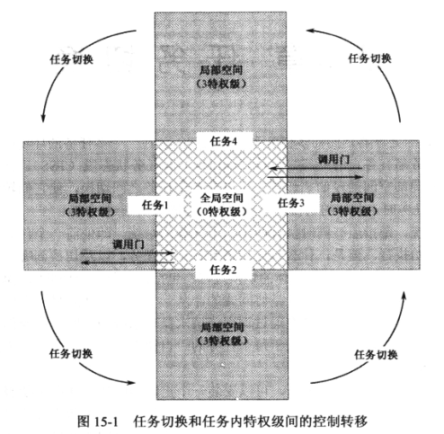

控制权转移和任务转移是两回事.

如图, 所有任务共享一个全局空间, 这是内核提供的, 包含系统服务程序和数据; 同时, 每个任务有自己的局部空间, 包含的是私有代码和数据.

在一个任务中, 全局空间和局部空间有不同的特权级别. 使用门, 可以在任务内将控制从 3 特权级的局部空间转移到 0 特权级的全局空间, 以使用内核提供的服务.

任务切换是以任务为单位的, 是指离开一个任务, 转到另一个任务中去执行. 任务转移相对复杂的多.

处理器刚进入保护模式中, 是以 0 特权级运行, 并且执行的一般是操作系统代码, 也必须是 0 特权级, 这样才能方便控制整个计算机. 而且**任务并不一定非得是特权级 3 的, 也可以是特权级 0 的**. 特别是, 操作系统出了为每个任务提供服务外, 也会有一个作为任务而独立存在的部分, 并且是 0 特权级的任务, 以完成一些管理和控制功能, 比如提供一个界面和用户交互.

任务状态段(TSS)是一个任务存在的标志, 没有它, 无法执行任务切换, 因为任务切换时需要保存旧任务的各种状态数据. 所以先创建 TSS 所需的内存, 为了追踪 TSS, 需要保存它的基地址和选择子, 可以保存在内存数据段.

**任务可以没有自己的 LDT**.

**必须创建 TSS 的描述符, 而且只能安装在 GDT 中**.

**最后将当前任务的 TSS 描述符选择子传送到任务寄存器 TR 中. ltr cx(cx 是该 TSS 描述符的选择子), 执行这条指令的话, 处理器使用该选择子访问 GDT, 找到对应的 TSS 描述符, 将其"B"设为 1, 表示任务正在执行(或挂起)状态. 同时, 还要将该描述符传送到 TR 寄存器的描述符高速缓存器中**.

