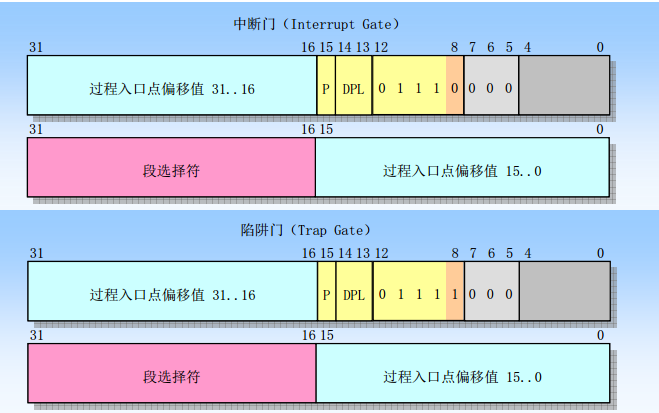
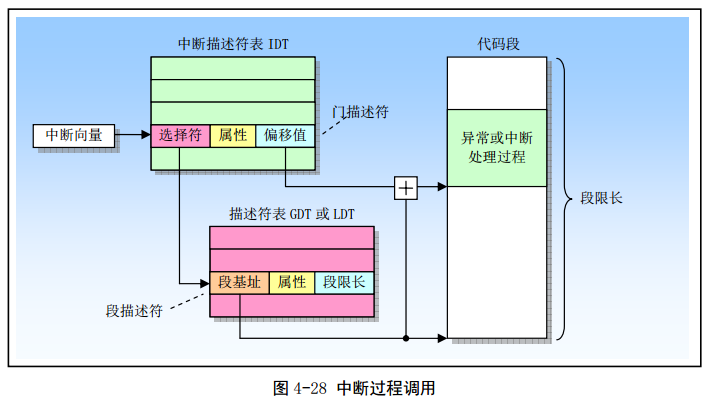
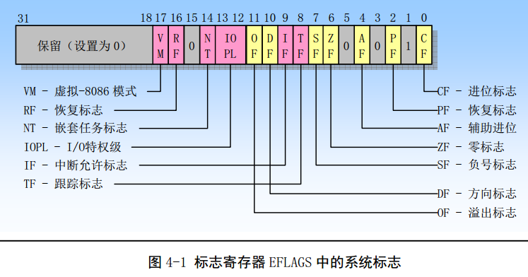
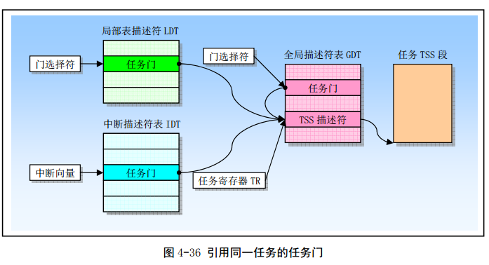
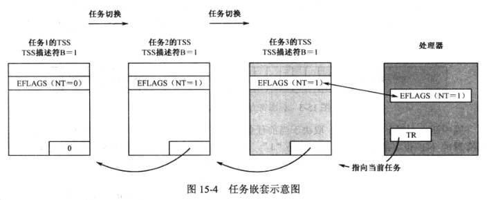

多任务支持是现代 CPU 的标志之一. Intel 提供了多种方法.

第一种任务切换的方法是**借助于中断**, 这也是现代抢占式多任务的基础. 因为, 只要中断没有被屏蔽, 随时可以发生. 特别是定时器中断, 能够准确时间间隔发生, 可以用来强制实施任务切换.

在实模式下, 内存最低地址端的 1KB 是中断向量表, 保存着 256 个中断处理过程的段地址和偏移地址. 当中断发生时, 处理器把中断号乘以 4, 作为表内索引号访问中断向量表. 从相应位置取出中断处理过程的段地址和偏移地址, 并转移到那里执行.

保护模式下, 中断向量表不再使用, 使用中断描述符表. 和 GDT、LDT 一样, 用来保存描述符. 唯一不同在于, 它保存的是门描述符, 包括中断门、陷阱门和任务门. 这些门和调用门很类似.

# 中断门和陷阱门

中断门和陷阱门的格式如下图:



当中断发生, 处理器用中断号乘以 8(因为每个描述符占 8 字节), 作为索引访问中断描述符表, 取出门描述符. 如果是中断门或陷阱门, 那么就取出门描述符中的段选择子和段内偏移量, 然后转移到相应的位置去执行. 这个过程可以用下图说明:



一般的中断处理可以使用中断门和陷阱门. 回忆下**调用门原理, 它只是从任务的局部空间转移到更高级别的全局空间去执行, 本质是是一种任务内的控制转移行为**. 与此相同, 中断门和陷阱门允许在任务内实施中断处理, 转到全局空间执行一些系统级的管理工作. 本质上, **也是任务内的控制转移行为**.

# 通过中断执行任务切换

但是, 如果访问 IDT 时, **该中断号对应的门是任务门, 就必须任务切换**. 即, 要中断当前任务的执行并保护现场, 然后后切换到另一个任务去执行.

任务门的格式如下图:


相对于其他描述符, 任务们描述符中的多数区域没有使用.

1. 任务门描述符中最重要的字段是段选择子. 任务门用于在中断发生时执行任务切换, 执行任务切换时必须找到新任务的 TSS. 所以, 任务门应该指向任务的 TSS. 为了指向任务的 TSS, 只需要在任务门描述符中给出任务的 TSS 选择子;
2. P 位指示该门是否有效, 当 P=0 时, 不允许通过此门实施任务切换;
3. DPL 是**任务门描述符的特权级, 但是对于因中断而发起的任务切换不起作用**.

注意: **任务门描述符可以安装在 IDT、GDT 和 LDT 中**.

通过中断执行任务切换的过程, 可以参考《Intel Architecture Software Developer's Manual Volume 3:System Programming》的 TASK SWITCHING 这一节.

当中断发生, 处理器用中断号乘以 8 作为索引去访问中断描述符表. 当发现这是一个任务门(描述符)时, 就知道应当发起任务切换. 于是, 它取出任务门描述符; 再从任务门描述符中取出新任务的 TSS 选择子; 接着, 用 TSS 选择子访问 GDT, 取出新任务的 TSS 描述符. 在转到新任务执行前, 处理器会把当前任务的状态保存起来. 当前任务的 TSS 是由任务寄存器 TR 的当前内容指向的, 所以, 处理器把每个寄存器的"快照"保存到由 TR 保存的 TSS 中. 然后, 处理器访问新任务的 TSS, 从中恢复各个寄存器的内容. 最终, TR 会指向新任务的 TSS, 而处理器立马开始执行新的任务. 一旦新任务开始执行, 处理器会自动将 TSS 描述符的 B 位置"1", 表示该任务忙.

# iret 指令

**当中断发生时, 可以执行常规的中断处理过程, 也可以执行任务切换. 尽管性质不同, 但是它们都要使用 iret 指令返回**. 前者是返回到同一任务内的断点处; 后者是返回到上一层任务. 你也许会问: 处理器如何区分这两种截然不同的返回类型呢?

如下图所示, 32 位的 EFLAGS 寄存器有一个 NT 位(bit14)—— 嵌套任务标志(Nested Task Flag).



每个任务的 TSS 中都有一个任务链接域, 其内容可以是前一个任务的 TSS 描述符的选择子. 如果当前任务 EFLAGS 寄存器的 NT 位是 1, 则表示当前正在执行的任务嵌套于其他任务内, 并且能够通过 TSS 任务链接域的指针返回到前一个任务.

因为中断而引发任务切换时, 取决于当前任务(旧任务)是否嵌套于其他任务中. 当前任务(旧任务)肯定处于"忙"状态, 其 TSS 描述符的 B 位一定是"1", 在任务切换后同样保持不变.

对于新任务, 要把旧任务的 TSS 选择子填写到新任务 TSS 的任务链接域中, 同时, 将新任务 EFLAGS 的 NT 设为"1", 以允许返回(转换)到前一个任务(旧任务)继续执行. 同时, 要将新任务 TSS 描述符的 B 位置"1".

可以使用 iret 指令从当前任务返回(切换)到前一个任务, 前提是当前任务的 NT 位必须是 1.无论何时处理器遇到 iret 指令, 它都要检查 NT 位, 如果是 0, 表明是一般中断过程, 则按照一般的中断返回处理; 如果是 1, 则表明当前任务之所以能够执行, 是因为它打断了别的任务. 因此, 应当返回到原先被中断的任务继续执行, 并且由处理器固件把当前任务 EFLAGS 的 NT 位改成 0, 并把 TSS 描述符的 B 位改成 0.在保存了当前任务的状态后, 接着用被中断的任务的 TSS 恢复现场.

**除了因中断引发的任务切换外, 还可以用远过程调用指令 CALL, 或远跳转指令 JMP 直接发起任务切换**.

# 通过 call 或者 jmp 指令发起任务切换

在这两种情况下, call 指令或者 jmp 指令的操作数是任务的 TSS 描述符选择子或者任务门. 例如:

```
call 0x10:0x00000000
jmp 0x10:0x00000000
```

当处理器执行这两条指令时, 首先用指令中的选择子索引 GDT(对于本例, 是 GDT), 分析得到的描述符类型

1. 对于代码段描述符, 就按照普通的段间转移执行;
2. 对于调用门, 按照调用门的规则执行;
3. 对于**TSS 描述符或者任务门**(下图中粉色部分), 则执行任务切换. 此时, 指令中给出的 32 位偏移量被忽略, 因为在执行任务切换时, 所有处理器的状态都可以从 TSS 中获得.



注意, **任务门描述符可以安装在中断描述符表(IDT)中, 也可以安装在全局描述符表(GDT)或者局部描述符表(LDT)中**.

如果是用于发起任务切换, call 指令和 jmp 指令也有不同. 使用 CALL 指令发起的任务切换类似于因中断发起的任务切换. 也就是说, 由 CALL 指令发起的任务切换是"嵌套"的, 当前任务(旧任务)TSS 描述符的 B 位保持原来的"1"不变, EFLAGS 寄存器的 NT 也不变化; 新任务 TSS 描述符的 B 位置"1", EFLAGS 寄存器的 NT 位也置"1", 表示此任务嵌套于其他任务中. 同时, TSS 任务链接域内容也改为旧任务的 TSS 描述符选择子.

如下图所示:



使用 CALL 指令发起的任务切换, 通过 iret 指令返回前一个任务. 此时, 旧任务 TSS 描述符的 B 位, 以及 EFLAGS 寄存器的 NT 都恢复到"0".

与 call 不同, 使用 jmp 发起的任务切换, 不会形成任务之间的嵌套关系. 执行切换时, 当前任务(旧任务)TSS 描述符的 B 位清零, 变为非忙, EFLAGS 寄存器的 NT 位不变; 新任务 TSS 描述符的 B 位置"1", 进入忙状态, EFLAGS 中的 NT 位不变.

# 任务是不可重入的

任务不可重入的本质是, 执行任务切换时, 新任务的状态不能为忙.

处理器通过 TSS 描述符的 B 位检测重入的. 由中断、iret、call 和 jmp 指令发起任务切换时, 处理器固件会检测新任务 TSS 描述符的 B 位, 如果为 1, 则不允许执行这样的切换.