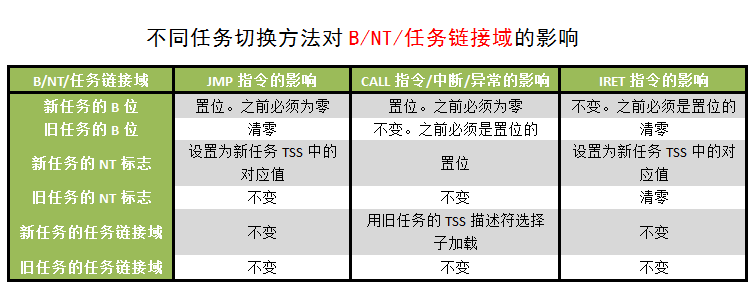

处理器可以通过以下**四种方法实施任务切换**:

1. call 指令或者 jmp 指令的操作数是 GDT 内的某个**TSS 描述符**;
2. call 指令或者 jmp 指令的操作数是 GDT 或者 LDT 内某个**任务门描述符**;
3. 一个**异常或者中断**发生时, 中断号指向 IDT 内的某个任务门;
4. 在 EFLAGS 寄存器的 NT 位置位的情况下, 当前任务执行了一个 iret 指令.

对于这四种方法, 首先都可以得到一个 TSS 描述符的选择子:
- 对于 1, 指令的操作数直接就是 TSS 选择子;
- 对于 2 和 3, 任务门里包含了 TSS 选择子;
- 对于 4, 当前任务的 TSS 的任务链接域内就是 TSS 选择子.

这个 TSS 选择子就决定了要切换到哪个任务.

在任务切换时, 处理器执行以下操作:
1. 取得新任务的 TSS 描述符的选择子(如上文所述).
2. 检查是否允许从当前任务切换到新任务.

(1)数据访问的特权级检查规则适用于**JMP 和 CALL 指令**, 当前(旧)任务的 CPL 和新任务段选择子(TSS 描述符的选择子或者任务门的选择子)的 RPL 必须在数值上<=目标 TSS 描述符或者任务门的 DPL;

(2)**异常、中断(int n 指令发起的中断除外)和 IRET 指令**引起的任务切换**忽略**目标任务门或者 TSS 描述符的 DPL;

(3)对于 int n 指令发起的中断, 要检查 DPL, 要求在数值上, CPL<=任务门描述符的 DPL;

3. 检查新任务的 TSS 描述符是否已经标记为有效(P=1), 并且界限也有效(>=103);
4. 检查新任务是否可用. 对于以 CALL,JMP,异常或者中断发起的任务切换, 要求 B=0; 对于 IRET 发起的任务切换, 要求 B=1;
5. 检查当前任务和新任务的 TSS, 以及所有在任务切换时用到的段描述符已经安排到系统内存中;
6. 如果任务切换是由 JMP 或者 IRET 发起的, 处理器清除当前任务的 B 标志; 如果是由 CALL 指令、异常或者中断发起的, 当前任务的 B 位保持原来的状态(=1);
7. 处理器建立 EFLAGS 寄存器的一个临时副本. 如果任务切换由 IRET 指令发起, 则清除副本中的 NT 标志; 如果是由 CALL、JMP、异常或者中断发起的, 则保持副本中 NT 标志不变.
8. 保存当前任务的状态到它的 TSS 中: 所有通用寄存器、段寄存器中的段选择子、刚才那个 EFLAGS 的副本, 以及 EIP;
9. 加载新任务的 EFLAGS 寄存器. 如果任务切换是由 CALL、异常或者中断发起的, 处理器把 EFLAGS 的 NT 标志置位; 如果是由 IRET 或 JMP 发起的, NT 位不变.
10. 如果任务切换是由 CALL、JMP、异常或者中断发起的, 处理器将新任务 TSS 描述符中的 B 标志置位; 如果由 IRET 发起, B 保持原来的状态(=1);
11. 用新任务的 TSS 选择子和 TSS 描述符加载 TR;
12. 新任务的 TSS 状态数据被加载到处理器: 包括 LDTR 寄存器、CR3、EFLAGS、EIP、通用寄存器、段选择子;
13. 与段选择子相对应的描述符在验证后也被加载;
14. 开始执行新任务.

任务切换时, 新任务的特权级别并不是从那个被挂起的任务继承来的. 新任务的特权级别是由其段寄存器 CS 的低 2 位决定的, 而该寄存器的内容取自新任务的 TSS. 因为每个任务都有自己独立的地址空间和任务状态段 TSS, 所以任务之间是彼此隔离的, 只需要用特权级规则控制对 TSS 的访问就行, 软件不需要在任务切换时进行显式的特权级检查.

下图是不同任务切换方法对 B、NT 和任务链接域的影响

