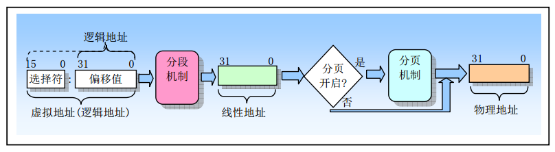
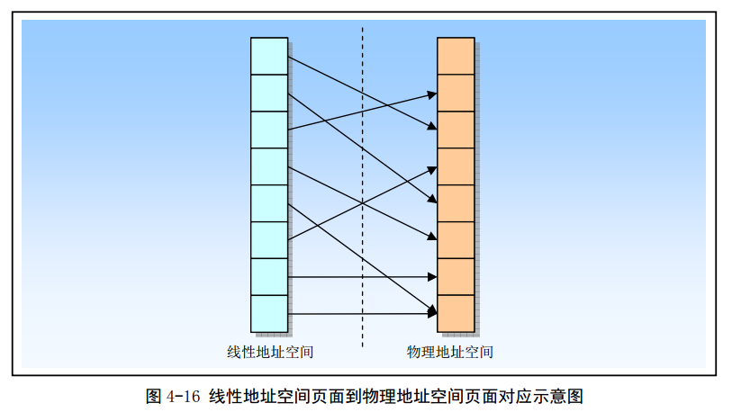
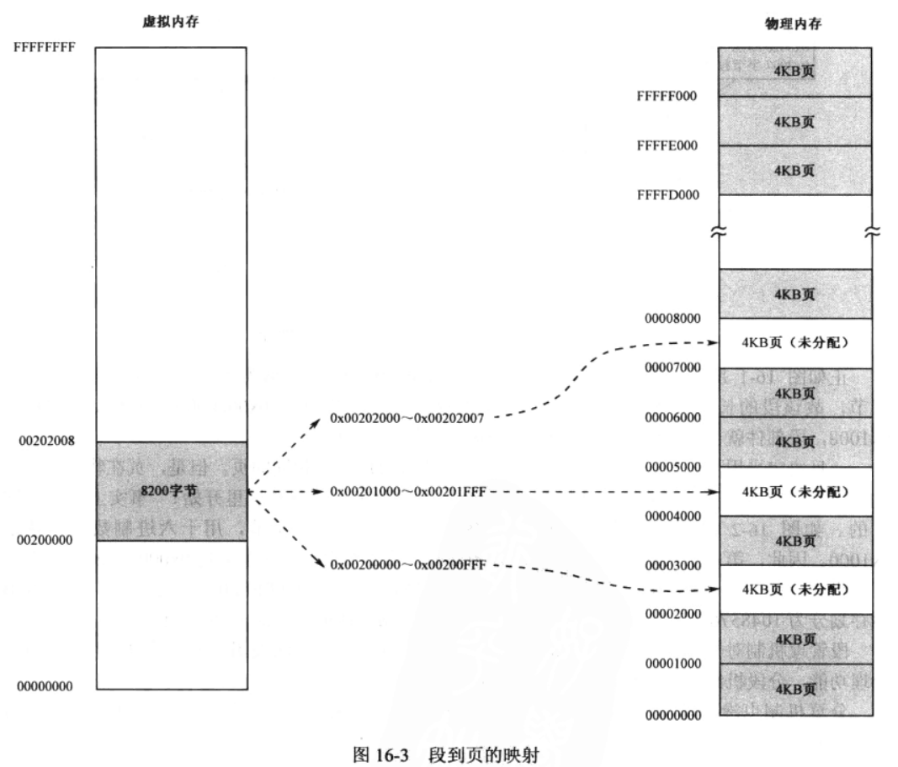
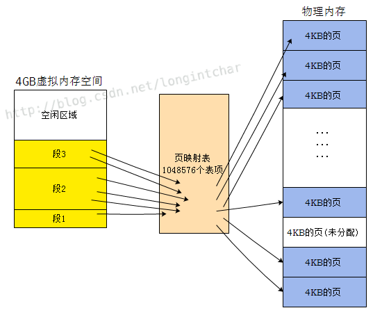
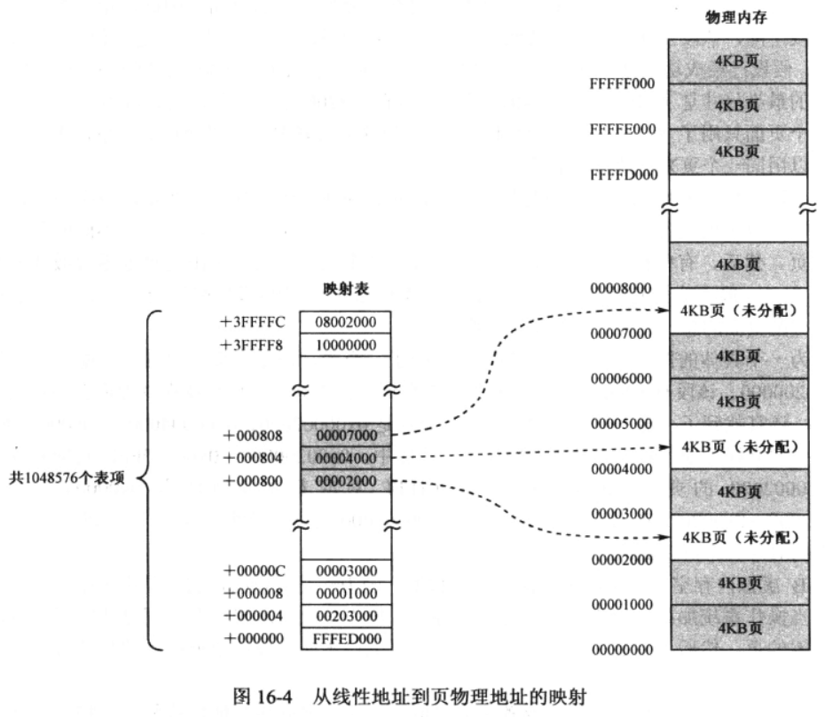
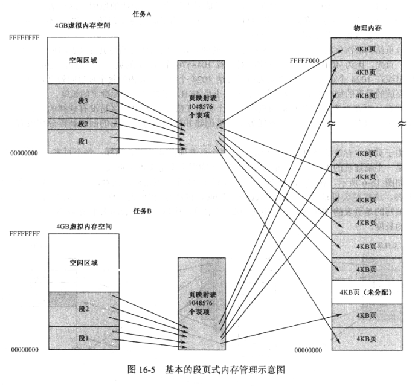
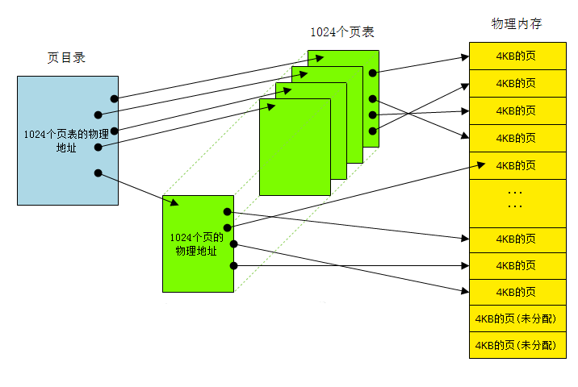
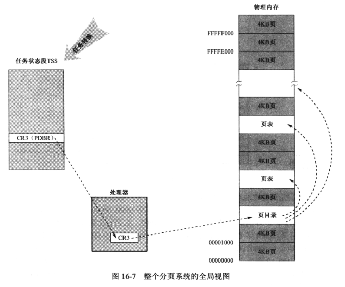
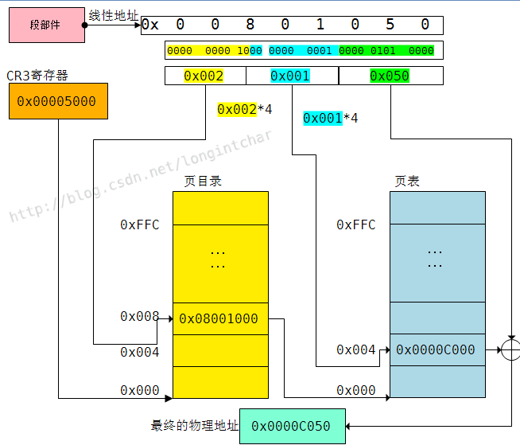

<!-- @import "[TOC]" {cmd="toc" depthFrom=1 depthTo=6 orderedList=false} -->

<!-- code_chunk_output -->

- [从虚拟地址到物理地址](#从虚拟地址到物理地址)
- [1. 简单的分页模型](#1-简单的分页模型)
- [2. 页目录、页表和页](#2-页目录-页表和页)
  - [页表](#页表)
  - [页目录(Page Directory Table, PDT)](#页目录page-directory-table-pdt)
- [3. 地址变换的具体过程](#3-地址变换的具体过程)

<!-- /code_chunk_output -->

Intel 处理器访问内存的基本策略是分段. 在 16 位实模式下, 段的起始位置必须 16 字节对齐, 而且段的长度最大是 64KB.

进入 32 位保护模式之后, 强化了分段功能, 并提供了保护机制. 此时, 段可以起始于任何位置, 段长度可以扩展到处理器的最大寻址范围边界. 典型, 早期 32 位处理器由 32 根地址总线, 因此, 段的长度可以扩展到 4GB.

在 32 位保护模式下, 对段的访问本着"先登记, 后访问"的原则进行. 登记就是在 GDT 或者 LDT 中登记段的描述符, 规定了段的地址和边界, 以及访问权限; 访问时, 需要使用段描述符的选择子. 处理器用段界限和特权级别审查对段的访问, 任务非法访问都会被处理器阻止, 并立即产生异常中断.

一般情况下, 先安装一个操作系统. 这时, 段是由操作系统负责管理的. 操作系统加载应用程序, 根据程序的要求, 为它创建一个或多个段, 然后将控制权交给它.

有些资料说是为了实现"虚拟内存", 真的是这样吗?如果没有分页机制, 能否实现"虚拟内存"?答案是肯定的.

当同时运行的程序和任务很多时, 内存可能就不够用了. 这时, 操作系统的价值就体现出来了, 每个段描述符有 A 位, 每当访问一个段时, 处理器会将其置位. A 位的清零由操作系统定时进行, 它借此统计段的访问频度. 当内存不够用时, 它可以将那些较少访问的段换出到磁盘上, 以腾出空间来给马上运行的段使用. 一旦某个段被换到磁盘上, 操作系统应将描述符的 P 位清零. 当这个段又被访问, 因描述符 P 位是"0", 处理器引发段**不存在异常(中断号为 11)**. 这类中断通常由操作系统负责处理的, 它会同样方法腾出空间, 将这个段的内容从磁盘调入内存. 当这类中断返回, 处理器会再次执行引发异常的那条指令(而不是下条指令), 于是程序又能继续执行了.

由此可见, 即使没有分页机制, 利用"分段"也可以实现"虚拟内存".

但是, 因为段的长度不定, 分配内存时, 可能发生内存空闲区域小于要加载的段, 或空闲区域远远大于要加载的段. 前一种情况, 需要寻找合适的空闲区域; 后一种, 分配成功, 但过于浪费. 为解决这个问题, 从 80386 开始, 引入了分页机制.

分页机制简单来说, 是用长度固定的页来代替长度不定的段, 以解决因段的长度不同带来的内存空间管理变得复杂的问题.

尽管操作系统也可以利用纯软件来实施固定长度的内存分配, 但是太过于复杂. 由处理器固件来做这件事情, 可以省去很多麻烦, 速度也可以提高.

# 从虚拟地址到物理地址

分页机制是 80x86 内存管理机制的第二部分. 它在分段机制的基础上完成虚拟(逻辑)地址到物理地址转换的过程. 分段机制把逻辑地址转换成线性地址, 而分页则把线性地址转换成物理地址.



分页机制会把**线性地址空间**(段已映射到其中)划分成页面, 然后这些线性地址空间的页面被映射到物理地址空间的页面上.



80x86 使用 4K(2 的 12 次方)字节固定大小的页面. 每个页面均是 4KB, 且对齐于 4K 地址边界处(地址的低 12 位全是 0).

# 1. 简单的分页模型

一旦决定采用页式内存管理, 就应**把 4GB 内存分成大小相同的页**, 不是在内存中随意找个位置让页从那儿开始.

分页机制也没有增加程序员的负担, 程序依然按照段来组织. 问题在于, 如何将较大的段, 映射到大小相同的页面上呢?

如图 16-3, 内存的分配涉及段空间的分配和页分配. 左边是虚拟的 4GB 内存空间, 称为虚拟内存; 右边是实实在在的内存, 被分成 1048576 个 4KB 页面.



在分页模式下, 操作系统可以创建一个为所有任务共用的 4GB 虚拟内存空间, 也可以为每个任务创建独立的 4GB 虚拟内存空间. 当一个程序加载时, **操作系统既要在左边的虚拟内存中分配段空间, 又要在右边的物理内存中分配相应的页面**. 因此, **第一个步骤是寻找空闲的段空间**, 该段空间既没有被其他程序使用, 也没有被同一程序的其他段使用. 比如图 16-3, 假设已经找到并分配一个段空间, 基地址是 0x00200000, 长度是 8200 字节.

页最小 4KB, 即 4096 字节. 因此, 8200 字节的段, 需要占用 3 个页面(**所以内存分页管理机制的基本原理是将 CPU 整个线性内存区域(！！！线性地址是 32 位, 可寻址范围 4GB)划分成 4KB 为 1 页的内存页面**), 其中最后一个页面只用了 8 个字节, 其他都浪费着, 如果允许页共享, 多个段或多个程序可以用同一个页来存放各自数据.

在分段之后, 操作系统将段拆分, 并分别映射到物理页. 注意, **段必须是连续的, 但不要求所分配的页都是连续的**. 分配页面时, 操作系统会搜索那些空闲的页, 并分配给程序使用, 所分配页面的总长度要大于等于段长度.

图中是个具体的例子.

4GB 虚拟内存空间不可能用来保存任何数据, 因为是虚拟的. 它只是指示内存的使用情况. **当操作系统加载一个程序并创建为任务时, 操作系统在虚拟内存空间寻找空闲的段, 并映射到空闲的页. 然后, 当真正开始加载程序时, 再把原本属于段的数据按页的尺寸拆分, 分开写入对应的页中**.

4GB(2 的 32 次方)的线性地址空间可以划分为 1048576(2 的 20 次方, 即 1M)个页面. 为了根据线性地址找到对应的物理地址, 操作系统必须维护一张表(如下图所示).



这个表暂且叫做"页映射表", 它一共有 1048576 个表项. 这是一个一维表格, **每个表项占 4 个字节**, 其内容是某个页的起始物理地址(共 32 比特, 低 12 位全为 0). 页映射表是这样使用的: **因为页的尺寸是 4KB, 所以线性地址的低 12 位可以作为页内偏移, 高 20 位可以用来索引一个表项, 找到了这个表项, 就找到了对应的物理页. 因此, 线性地址的高 20 位为索引, 乘以 4, 作为表内偏移量, 从表中取出一个双字, 那就是该线性地址对应的页的物理地址**.

如图 16-4, 如果执行指令

```
mov edx, [0x2002]
```

段部件使用段地址 0x00200000 加上指令中给出的偏移量 0x2002, 得到线性地址 0x00202002. 线性地址的高 20 位是表格索引, 即 0x00202. 将索引乘以 4, 得到 0x00808, 这就是表内偏移. 看图, 从该单元可以取出一个双字 0x00007000, 这就是页物理地址.

线性地址低 12 位是页内偏移量, 用页物理地址加上页内偏移量, 就是最终的物理地址. 0x00007000 加上 0x002, 得到 0x00007002, 这就是实际要访问的物理内存地址.



问题是, 为什么表内偏移量为 0x00808 的地方, 会恰好是页地址 0x00007000, 而不是其他页地址?

**当程序加载时**, 操作系统会首先在虚拟内存中分配段. 然后, 根据段需要分成多少页, 来搜索空闲页面. 当段较大时, 要按页的尺寸分成好几个地址区段, 操作系统用每个区段的首地址, 取高 20 位, 乘以 4, 作为偏移量访问表格, 并将分配给该区段的**页的物理地址**写入该表项. 最后, 将原本需要写入每个区段的程序数据, 写到对应的页中.

注意, 在页式内存管理中, 页面的管理和分配是独立的, 和分段以及段地址没有关系. **操作系统所做的,  就是寻找空闲页面, 把它分配给需要的段, 并将页的物理地址填写到映射表内**.

基于上面特点, 一般, **每个任务都可以拥有 4GB 的虚拟内存空间; 同时, 每个任务有自己的页映射表**, 如图 16-5.



# 2. 页目录、页表和页

第一个支持分页内存管理模式的 Intel 处理器是 80386, 那时候, 分页机制很简单.

上文提到的页映射表, 一共有 1048576(=1M)个表项, 每个表项占 4 个字节, 所以表的大小是 4MB, 在当时看来要占用相当一部分内存. 考虑到在实践中, 没有哪个任务会真的用到所有表项, 充其量只是很小一部分, 所以内存中放一个 4MB 的表格确实很浪费. 也许你会建议, 能不能先划出一小片内存, 只存表格用到的部分, 然后根据需要动态扩展. 的确, 这个方法可行. 但是因为特殊原因(后面我们会学习到, 整个映射表的前一半对应全局地址空间, 后一半对应局部地址空间), 这张表从一开始就必须完全定义(留够空间), 所以不可避免地要占用 4MB 的内存空间. 为了解决这个问题, 同时又不会浪费宝贵的内存空间, 处理器设计了层次化的分页结构.

分页结构层次化的主要手段是不采用单一映射表, 使用页目录和页表.

如图.



## 页表

4GB(2 的 32 次方)的线性地址空间可以划分为 1048576(2 的 20 次方, 即 1M, 也可以看成是 1024\*1024)个页面, 所以, 可以**随机地抽取这些页面, 每 1024 个页面是一组,可以分成 1024 组**. 对于每组中 1024 个页面的物理地址, 按某种顺序排列可以构成一张表(每个表项都是一个页面的物理地址), 这个表就是**页表**. **页表的大小是 1024\*4 字节=4KB, 刚好是一个物理页的大小**.

注意, 页在页表中的分布是随机的, 哪个页在哪个页表中, 这是没有规律的.

## 页目录(Page Directory Table, PDT)

因为已经分成了 1024 组, 每组都有一个页表(大小为 4KB), 所以**这 1024 个页表又可以用一张表来指向, 这就是页目录**. 类似于页表, 页目录共有 1024 个表项(称作页目录项), 每个页目录项的内容是某个页表的物理地址. 页表的大小是 1024*4 字节=4KB, 刚好是一个物理页的大小.

需要注意的是:

1. 这样的层次化分页结构是每个任务都有的, 或者说**每个任务都有自己的页目录和页表**. 在处理器内部, 有一个控制寄存器叫 CR3, 存放着**当前任务的页目录的物理地址**, 故 CR3 又叫做页目录基址寄存器(Page Directory Base Register, PDBR).
2. **每个任务都有自己的 TSS**, 其中就包括了**CR3 寄存器域**, 存放着任务自己的页目录的物理地址. 当任务切换时, CR3 寄存器的内容也会被更新, 更新为新任务的页目录的物理地址.
3. **页目录和页表也是普通的页, 混迹于全部的物理页中**. 它们和普通的页没有什么区别, 无非就是功能不一样. 当任务被操作系统撤销后, 它们和任务所占用的**普通的物理页一样会被回收**.
4. **页目录总是在物理内存中, 页表可以在需要时再分配, 这样就大大节省了物理内存**.



# 3. 地址变换的具体过程

对于 Intel 处理器而言, 有关分页, 最简单和最基本的机制就是这些: **CR3 寄存器给出页目录的物理基地址; 页目录给出所有页表的物理地址, 而每个页表也给出了它所包含的页的物理地址(都是物理地址！！！)**.

具体怎么变换, 举例子来说明吧.

假设某个任务加载后, 操作系统根据实际情况, 在其 4GB 的虚拟地址空间里创建了一个段, 段的起始地址是 0x00800000, 界限值是 0x5000, 字节粒度. 当该任务执行时, 段寄存器 DS 指向该段. 执行指令:

```
mov edx, [0x1050]
```

此时, 段部件输出的线性地址是 0x00801050,如果没有开启分页, 那么这个地址就是物理地址; 但是现在开启了分页, 所以要经过页部件的转换, 才能得到物理地址.

处理器的页部件专门负责线性地址到物理地址的转换工作. 它**首先将 32 位的线性地址分成 3 段**, 分别是高 10 位, 中间 10 位和低 12 位. **高 10 位用来索引页目录, 中间 10 位用来索引页表, 低 12 位作为页内偏移**.

1. 当前任务的页目录的物理地址在 CR3 寄存器中, 假设是 0x00005000;
2. 段部件输出的线性地址是 0x00801050,按照高 10 位, 中间 10 位和低 12 位分为三段, 分别是 0x002,0x001,0x050;
3. 0x002 乘以 4(**因为每个表项占 4 个字节**)得到 0x008,作为偏移访问页目录, 得到了 0x08001000,这就是页表的物理地址.
4. 0x001 乘以 4(因为每个表项占 4 个字节)得到 0x004,作为偏移访问页表, 得到了 0x0000c000,这就是我们要找的那个物理页的起始地址.
5. 0x050 作为页内偏移, 和物理页的起始地址 0x0000c000 相加, 得到 0x0000c050,这就是最终的物理地址, 要访问的数据就在这里.



注意, 这种变换不是无缘无故的, 而是事先安排好的. 当任务加载时, 操作系统先创建虚拟的段, 并根据段地址的高 20 位决定使用哪些页目录和页表项. 然后, 寻找空闲的页, 将原本该写入段中的数据写入到一个或多个页中, 并将页的物理地址填写到相应的页表项中. 只有这样, 当程序运行时, 才能以相反顺序进行正确的地址变换.