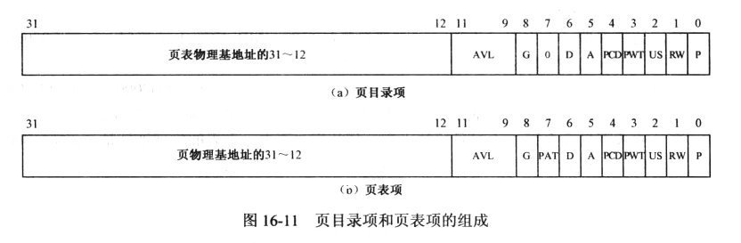

# 1. 创建内核的页目录表和页表

必须在保护模式下才能启用页功能.

首先必须创建页目录和页表. 每个任务有自己的页目录和页表, 内核也一样, 尽管内核是所有任务共有的, 但也**包含作为任务而独立存在的部分, 以执行必要的系统管理工作**. 因此, 要想内核正常工作, 必须创建自己的页目录和页表.

一个理想的分页系统中, 要加载程序, 必须先搜索可用的页, 并将它们与段对应起来. 这时, 段部件输出的线性地址和页部件输出的物理地址不同.

然而, 内核是在开启页功能之前加载的, 段在内存中位置已经固定. 这种情况下, 即使开启了页功能, 线性地址也必须和物理地址相同才行. 比如, 开启页功能之前, GDT 在内存中的基地址是 0x00007E00, 就是全局描述符表的物理地址. 开启功能以后, 它还在那个内存位置, 这就要求页部件输出的物理地址和段部件输出的线性地址相同.

注意, 进入分页模式之后, 所有东西的地址都变成了线性地址, 包括 GDT、LDT 和 TSS 地址等等.

因为我们的内核很小, 将其加载到内存后, 连低端的 1MB 空间都没有占完全, 所以**只需要将低端 1MB 内存做特殊处理**, 使这部分内存的线性地址和物理地址相同即可. 这样做的好处是: 内核不用做任何变动即可在分页模式下继续正常工作, 再也不会担心"跑飞"了.

对于页目录和页表在内存中的位置没有什么限制, 必须在可用内存范围. 页目录必须在内存中, 页目录和页表必须各自占用一个自然页, 也就是说它们的物理地址的低 12 位必须全零.

在页目录中, 一个目录项对应着一个页表, 而一个页表可以容纳 1024 个页, 也就是 4MB 内存. 所以, 对于内核而言, 只需要一个页表即可. 也就是说, 一个页目录和一个页表就够了.

## 页目录项和页表项

上图就是页目录项和页表项的格式. 可以看出, 由于页表或者页的物理地址都是 4KB 对齐的(低 12 位全是零), 所以上图中只保留了物理基地址的高 20 位(bit[31:12]). 低 12 位可以安排其他用途.

【P】: 存在位. 为 1 表示页表或者页位于内存中. 否则, 表示不在内存中, 必须先予以创建或者从磁盘调入内存后方可使用.

【R/W】: 读写标志. 为 1 表示页面可以被读写, 为 0 表示只读. 当处理器运行在 0、1、2 特权级时, 此位不起作用. 页目录中的这个位对其所映射的所有页面起作用.

【U/S】: 用户/超级用户标志. 为 1 时, 允许所有特权级别的程序访问; 为 0 时, 仅允许特权级为 0、1、2 的程序访问. 页目录中的这个位对其所映射的所有页面起作用.

【PWT】: Page 级的 Write-Through 标志位. 为 1 时使用 Write-Through 的 Cache 类型; 为 0 时使用 Write-Back 的 Cache 类型. 当 CR0.CD=1 时(Cache 被 Disable 掉), 此标志被忽略. 对于我们的实验, 此位清零.

【PCD】: Page 级的 Cache Disable 标志位. 为 1 时, 物理页面是不能被 Cache 的; 为 0 时允许 Cache. 当 CR0.CD=1 时, 此标志被忽略. 对于我们的实验, 此位清零.

【A】: 访问位. 该位由处理器固件设置, 用来指示此表项所指向的页是否已被访问(读或写), 一旦置位, 处理器从不清这个标志位. 这个位可以被操作系统用来监视页的使用频率.

【D】: 脏位. 该位由处理器固件设置, 用来指示此表项所指向的页是否写过数据.

【PS】: Page Size 位. 为 0 时, 页的大小是 4KB; 为 1 时, 页的大小是 4MB(for normal 32-bit addressing )或者 2MB(if extended physical addressing is enabled).

【G】: 全局位. 如果页是全局的, 那么它将在高速缓存中一直保存. 当 CR4.PGE=1 时, 可以设置此位为 1, 指示 Page 是全局 Page, 在 CR3 被更新时, TLB 内的全局 Page 不会被刷新.

【AVL】: 被处理器忽略, 软件可以使用.

# 2. 任务全局空间和局部空间的页面映射

接下来加载用户程序, 并创建一个任务.

每个任务有自己独立的 4GB 虚拟地址空间.

每个任务都有自己的页目录表和页表, 当任务创建时, 它们一同被创建. 当任务执行时, 页部件使用它们访问任务自己的私有内存空间(页面). 但是, **任务的页目录表和页表不能只包含任务的私有页面**. 如果不是这样, 当任务调用内核服务时(进入 0 特权级的全局地址空间执行), 地址转换将无法进行, 因为任务的页目录表和页表中没有登记内核所占用的那些物理页面.