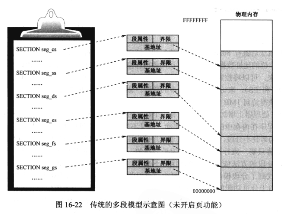
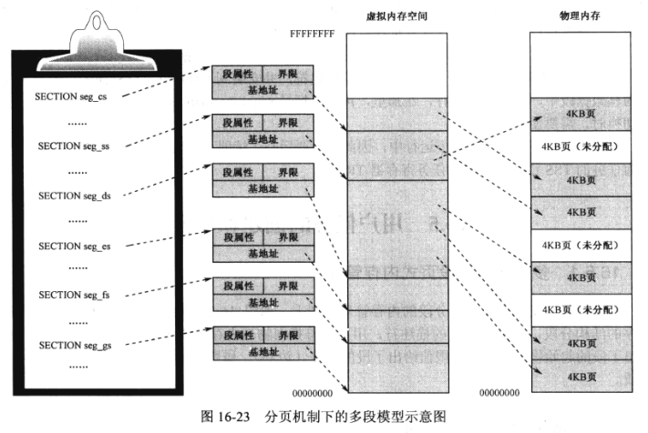

## 1. 多段模型和段页式内存管理

分段的内存管理模型. 如下图, 保护模式下, 首先按程序的结构分段, 创建各个段的描述符, 用描述符指向物理内存的各个段. 描述符中的基地址给出了段的其实物理地址, 界限值给出段的长度(边界), 属性值指示段的类型和特权级等性质.

传统的多段模型(Multi-segment Model)适用于开启了页功能之后的系统环境. 如图 16-23, 首先依然时按程序结构分段, 创建各个段的描述符. 但是, **段在任务自己的虚拟地址空间内分配的, 而不是在物理内存中分配的**. 因此, 段描述符中的基地址是段的线性地址, 或者说是虚拟地址.

因为开启了页功能, 虚拟地址空间上的段要映射到物理内存中的一个或多个页. 段是连续的, 但它所占的页不要求是相邻的.

为什么要分段呢?

分段起源于 8086. 后来到了 32 位时代, 处理器设计者找到了分段模型的好处, 就是可以防止一个程序访问不属于自己的段.

但, 由于分页功能出现, 弱化了分段机制. 内存的访问通过页目录表和页表进行的, 每个任务有自己的页目录和页表, 操作系统控制着物理页的分配权, 除非它把一个页分配给某个任务, 并填写到那个任务的页目录和页表里, 否则, 那个任务不可能访问那个内存.

## 2. 平坦模型和用户程序的结构

平坦模型(Flat Model).

所谓平坦模型, 如图, 就是将全部 4GB 内存整体上作为一个大段来处理, 而不是分成多个小段. **这种模型下, 所有段都是 4GB, 每个段的描述符都指向 4GB 的段, 段的基地址都是 0x00000000, 段界限都是 0xFFFFF, 粒度为 4KB**.

平坦模型, 程序编写时候不分段, 只有一个段, 代码和数据都在这个段内, 相互邻接, 但一般不交叉. 显然, 这种模式下, 不能享受到段保护机制, 段界限和数据访问检查仍然在, 但不会有非法情况. 原因很简单, 每个段描述符的基地址都是 0, 实际段界限都是 0xFFFFFFFF, 就任务内的地址空间而言, 对任何内存位置的访问都是合法的.

## 3. 用户任务的虚拟地址空间分配

