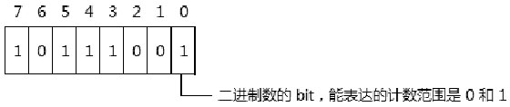
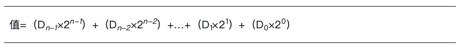
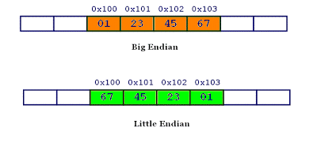

<!-- @import "[TOC]" {cmd="toc" depthFrom=1 depthTo=6 orderedList=false} -->

<!-- code_chunk_output -->

- [1. 数字](#1-数字)
  - [1.1. 二进制数字](#11-二进制数字)
  - [1.2. 八进制数字](#12-八进制数字)
  - [1.3. 十进制数字](#13-十进制数字)
  - [1.4. 十六进制数字](#14-十六进制数字)
  - [1.5. base 值](#15-base-值)
- [2. 二进制数](#2-二进制数)
- [3. 二进制数的排列](#3-二进制数的排列)
  - [3.1. 什么是 MSB?什么是 LSB?](#31-什么是-msb什么是-lsb)
  - [3.2. 小端序与大端序: 以字节为单位的排序方式](#32-小端序与大端序-以字节为单位的排序方式)

<!-- /code_chunk_output -->

# 1. 数字

>各个进制数的数字

## 1.1. 二进制数字

包括 0 和 1

## 1.2. 八进制数字

包括 0, 1, 2, 3, 4, 5, 6, 7.

## 1.3. 十进制数字

包括 0, 1, 2, 3, 4, 5, 6, 7, 8, 9.

## 1.4. 十六进制数字

包括 0, 1, 2, 3, 4, 5, 6, 7, 8, 9 及字母 A, B, C, D, E, F.

## 1.5. base 值

**各个进制**以相应的数字表达的计数范围作为 base 值, 如: 二进制的 base 值是 2, 八进制的 base 值是 8, 十进制的 base 值是 10, 十六进制的 base 值是 16.

# 2. 二进制数

二进制数是**计算机运算的基础**, 无论**何种制式的数**, 在计算机中都是以**二进制形式存放**的.

由**二进制数字**组成的**数字序列**是**二进制数**, 如下所示.



二进制数组合里, 每个数位被称为 bit(位), 能表达值 0 和 1. 二进制数的 base 值是 2, 那么在 n 个二进制数字的序列中, 其值为



这是一个数学上的算式. 这个值是十进制值.

# 3. 二进制数的排列

在**日常的书写或表达**上, **最左边**的位是**最高位**. 数的位排列从左到右, 对应的值从高到低.

可是在**机器的数字电路**上, 数的**高低位**可以**从左到右**进行排列, 也可以**从右到左**进行排列. 这样就产生了**MSB**和**LSB**的概念.

## 3.1. 什么是 MSB?什么是 LSB?

以一个自然的二进制表达序列上**32 位**的二进制数为例, **最右边**是`bit 0`, **最左边**是`bit 31`. 那么

* `bit 0`就用**LSB(Least Significant Bit, 最低有效位**)来表示,
* `bit 31`就用**MSB(Most Significant Bit, 最高有效位**)来表示.

MSB 也用做符号位(1 为负, 0 为正), 但若在**无符号数**上, 则 MSB 就是**数的最高位**, LSB 是数的最低位.

无论一个数在机器上是从左到右排列, 还是从右到左排列, 使用 MSB 和 LSB 的概念都很容易对其二进制形式进行描述说明.

## 3.2. 小端序与大端序: 以字节为单位的排序方式

**二进制数**在计算机的**组织存放**中, **地址**由**低位**到**高位**对应着两种排列.

1) **低位字节**在前, **高位字节**在后, 这就是**小端字节序**(little-endian)排法.

2) **高位字节**在前, **低位字节**在后, 这就是**大端字节序**(big-endian)排法, 这是人类读写数值的方法.

举例来说, `0x1234567`的**大端字节序**和**小端字节序**的写法如下图.



注: 计算机中的**地址**都是以**字节(8bit)为单位**进行**编址**的, 也就是说**一个地址**(比如 0x100)存放的是**一个字节的数字**(共 8 bit). 而这里的大小端都是**一个字节一个字节排序**, **字节**本身**内部的排序**这里先不涉及.

在**x86/x64**体系中使用的是**小端序存储格式**, 也就是: **MSB**对应着**存储器地址的高位**, **LSB**对应着**存储器地址的低位**.

在有些 RISC(精简指令集计算机)体系里, 典型的如 Power/PowerPC 系列, 使用大端序排法. 即在由低到高的地址位里, 依次存放 MSB 到 LSB. 亦即: MSB 存放在存储器地址的低位, LSB 存放在高位.

代码清单 1-1:

```
mov dword [Foo], 1
test byte [Foo], 1                                ;  测试 LSB 是否存放在低端上
jnz IS_little_endian                              ;  是小端序
```

上面的代码将**1**存放在**32 位**的**内存**里, 通过**读取内存的低字节**来判断 1 到底存放在**低字节**还是**高字节**, 从而区分是小端序还是大端序.

某些 RISC 机器上是可以在大端序与小端序存储序列之间做选择的. 大端序格式看上去更符合人类表达习惯, 而小端序看上去不那么直观, 不过这对于计算机的处理逻辑并无影响.

>实验 1-1: 测试字节内的位排列

**字节内的位**是否有**大端序**和**小端序之分**?这似乎没有定论, 我们不是硬件设计人员, 很难做出判断. 笔者倾向于认为位的排列是区分的.

从代码清单 1-1 我们可以测试机器是属于小端序还是大端序, 原理是根据**字节**在**内存**中的**存储序列**进行判断. 对代码稍做修改, 即可用来测试位的排列, 如代码清单 1-2 所示.

代码清单 1-2(topic01\ex1-1\boot.asm):