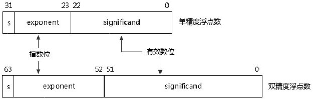

# 指令处理的数据类型

在 x86/x64 体系中, **指令处理的数据**分为`fundamental`(基础)和`numeric`(数值)两大类.

## fundamental 基础类型

- **基础类型**包括: `byte`(8 位), `word`(16 位), `doubleword`(32 位), 以及`quadword`(64 位), 它们代表指令能一次性处理的**数据宽度**.

## numeric 数值类型

- **numeric 数据类型**使用在**运算类指令**上, 总结来说 x86/x64 体系的**运算类指令**能处理下面**四大类数据**.

    1) `integer(整型数)`: 包括**unsigned 类型**和**singed 类型**.

    2) `floating-point(浮点数)`: 包括`single-precision floating-point`(单精度浮点数), `double-precision floating-point`(双精度浮点数), 以及`double extended-precision floatingpoint`(扩展双精度浮点数).

    3) `BCD(binary-code decmial integer)`: 包括`non-packed BCD 码`和`packed-BCD 码`.

    4) `SIMD(single instruction, multiple data)`: 这是属于`packed 类型`的数据.

SIMD 数据是在一个 operand(操作数)里集成了多个 integer、floating-point 或者 BCD 数据. SIMD 指令可以一性次同时处理这些数据.

# integer 数

在计算机处理中, **整数**会区分**signed**(`有符号数`)和**unsigned**(`无符号数`)两种情况, 数值的**MSB 值**被作为**符号位**. 每个数值类型有自己的取值范围, 如下所示.


可是在计算机中根本无法判断一个整数是 signed 数还是 unsigned 数. 例如 0ABh 这个整数就无法知道它是 signed 数还是 unsigned 数.

计算机能做到的是: 在整数的使用中, 在应该使用 signed 数的场合下认为它是 signed 数, 而在使用 unsigned 数的场合下认为它是 unsigned 数.

在这种假定下, 即使不是 signed 数也会被当做 signed 数进行处理. 既然这样, 在计算机运算中就无须判断是 signed 数还是 unsigned 数, 只需假定它是 signed 数或是 unsigned 数.

而在浮点数上, 每个浮点数都有符号位, 因此浮点数能够清楚地识别它就是 signed 数. 所以浮点数不存在 unsigned 数的情况.

在 x86 机器上, 对整数的加减法运算过程中不会识别 signed 数与 unsigned 数, 而根据 signed 与 unsigned 两种运算结果进行相应的 eflags 标志位设置.

代码清单 1-3:

```asm
mov eax, 0x70000000
mov ebx, 0x80000000
sub eax, ebx
```

上面的代码中, 0x70000000 和 0x80000000 是 signed 数还是 unsigned 数呢?

二进制运算结果值是 0xF0000000, 指令会同时对结果进行两种分析设置.

## 为 signed 时

假定运算双方是 signed 数时, 这个结果是错误的, 它产生了溢出. 它会置 eflags 寄存器的 OF(Overflow Flag)标志为 1, 以及 SF(Sign Flag)标志为 1, 表示结果为负数.

## 为 unsigned 时

假定双方是 unsigned 数时, 它会置 CF(Carry Flag)标志为 1, 表示产生了借位.

因此: 这条指令会同时对 OF、SF 及 CF 标志置位. 而对这个结果如何运用那是程序员的职责.

另外, RISC 体系的机器普遍会在指令层上做假定运算, 如在 MIPS 机器上 add 是进行 signed 数相加, addu 是进行 unsigned 数相加, 对指令进行了区分, 明确了使用场合.

x86 的乘法和除法指令也进行了区分, mul 是无符号数乘法, imul 是符号数乘法, div 是无符号除法, idiv 是符号数除法. 另外, 所有的条件转移、条件传送、条件设置指令会对指令运算的结果进行 signed 与 unsigned 的区分.

## 整数运算规则

当假定它是 signed 数时, 这个数需要使用另一种形式去解析, 这就产生了 signed 数的表示方法. signed 的表示法是以 MSB(Most Significant Bit)作为符号位, MSB 为 1 时是负数, MSB 为 0 时为正数.


以 32 位的数为例: 0 是正数的最小值, 0x7FFFFFFF 是正数的最大值, 0x80000000 是负数的最小值, 0xFFFFFFFF 是负数的最大值, 超过这个表达范围就产生了溢出情况.

>0x7FFFFFFF+0x00000001 结果为 0x80000000, 这个结果超过了 32 位正数能表达的最大值, 于是就产生了溢出. 两个正数相加, 32 位的结果为负数(负数的最小值). 这个结果是错误的.

signed 数是以二进制的补码来表示, 以 4 位二进制数为例, 求出-7 的二进制补码形式.


-7 的补码形式是 1001B, 它的计算过程是: ~7+1=-7. 那么反过来, 1001B 这个值是多少呢?从-7 的求值过程可以推出: ~((-7)-1), 从而得出


由于 1001B 表达的是负数, 求值后要加上负号, 这就是我们所知道的十进制的 signed 数.

# floating-point 数

现在的计算机浮点数格式都遵循`IEEE754`标准.

在 x86/x64 体系中有**三种浮点数**.

1) `single-precision floating point`(单精度浮点数): 使用 23 位的精度.

2) `double-precision floating point`(双精度浮点数): 使用 52 位的精度.

3) `double extended-precision floating point`(扩展双精度浮点数): 使用 64 位的精度.

x87 FPU 的硬件上使用扩展双精度浮点类型, 所有浮点数最终都要转为扩展双精度浮点数进行处理(使用 64 位精度).

## 二进制格式

在计算机上, 浮点数需要换化为二进制格式进行处理, 分为 3 个部分: sign(符号位), exponent(指数位), 以及 significand(有效数位), 如下所示.



最高位为符号位, 单精度浮点数的 exponent 位是 8 位, significand 位是 23 位; 双精度浮点数的 exponent 位是 11 位, significand 位是 52 位.

在单精度和双精度浮点数里, 它们的 significand 部分有一个隐式的 integer 位(或被称为 J-bit), 这个位的值固定为 1. 因此, 单精度浮点数的精度实际为 24 位, 而双精度浮点数的精度实际为 53 位.

## 扩展双精度浮点数

在扩展双精度浮点数里, significand 部分为 64 位, exponent 为 15 位, 如下所示.


在扩展双精度浮点数里, 它的 integer 位是显式的, 在 normal(合规的)数里, 这个位必须为 1, 否则属于 denormal(不合规的)数.

## normalized(规格化)

在 IEEE754 里, 规格化是浮点数的基础. 正常情况下机器中的浮点数使用规格化的格式, 这类浮点数被称为 normal 数.

看看这个浮点数: 0.625, 在机器中是如何表示的呢?

首先需要转化为规格化的科学计数形式.


于是 0.625 的二进制科学计数法表达是`1.01×2^-1`.

在 IEEE 754 中规定规格化数的 significand(有效数)部分第 1 位是 1, 不能是 0. 如下所示.


接下来, 这个浮点数被转化为单精度的二进制形式, 其值为 0x3F200000. 如下所示.


由于单精度浮点数的 significand 部分含有隐式的 1 值, 因此在二进制数格式里, significand 部分的值为 01000000...(即 1.01 中前面的 1 去掉).

指数部分需要加上一个 127 值, 这个值被称为 biased notation(移码或校正值).

## biased notation(校正值)

biased notation 用来解决浮点数使用 integer 方法进行比较时出现的问题. 我们看看下面这两个浮点数大小的比较: 1.00×2-1 和 1.00×21.

前面的指数为-1, 后面的指数为 1, 指数大的那个必定会大. 因此 1.0×21 的值是大于 1.0×2-1 的. 在指数相同的情况下才需要对有效数部分进行比较.

基于这种考虑, IEEE 754 在浮点数的格式中, 将指数部分安排在有效数前面, 这样就可以使用快速的整数比较方法来比较浮点数.

可是当指数是负数时, 按照这样的比较方法, 会得出比指数为正数还要大的结论, 这是错误的.

>`1.0×2^-1`会比`1.0×2^1`要大！(因为: -1 的二进制 8 位值为 11111111)

为了解决这个问题, 于是引入了 biased notation 值, 如下所示.


单精度的 biased 码是 127, 双精度的 biased 码是 1023, 扩展双精度的 biased 码是 16383. 这个 biased 码值加上指数值, 就得出了一个浮点数格式中的指数值: -1+127=126, 1+127=128.

算一下.

`1.0×2^-1`的二进制序列是: 001111110000000000000000000000000(0x3F000000).

`1.0×2^1`的二进制序列是: 010000000000000000000000000000000(0x40000000).

这样就解决了在使用整数进行比较时, 负的指数会比正的指数要大的问题.

在 nasm 汇编语言语法里, 可以使用一系列的宏来获得浮点数以整数形式表现的常量值.
代码清单 1-4:

```
mov eax, __float32__(0.625)                    ;  获得浮点数的整数形式值
```

`__float32__(0.625)`这个宏的求值结果是`0x3f200000`, 即 0.625 的浮点数值是 0x3f200000.

# real number(实数)与 NaN(not a number)

IEEE754 标准定义了多种实数的编码格式, 它们包括以下面几种格式.

1) zero: 包括`+0.0`和`-0.0`编码.

2) denormal 数字: 不合规格的数, denormal 数有时候被称为 tiny(极小)数.

3) normal 数字: 合规的普通浮点数, 这是一个 finite(有限的)取值范围.

4) infinite(无限)数字: 包括`+∞`(正无穷大数)和`-∞`(负无穷大数).

5) NaN(not a number): 包括 SNaN 和 QNaN.

其编码值如下所示.


## zero

在 0 的编码里, exponent 和 significand 都为 0. +0(正零)和-0(负零)的值是相等的.

## denormal(不合规)数

denormal 数是一个极小的数(即 tiny 数), 接近于 0 值. 它是一种不合规的表示方法. denormal 数的 exponent 部分为 0 值. 不同于 zero 值, 它的 significand 部分不为 0 值(在扩展双精度下 exponent 为 0 值, J 位为 0 值也属于 denormal 数). 因此, 下面的数是 denormal 数.

1) 00000001H: exponent 为 0, significand 不为 0.

2) 007FFFFFH: exponent 为 0, significand 不为 0.

normal(合规)数

normal 数是在 finite(有限)集合里的一个数. 在 normal 数编码中, J 位的值必须为 1(在扩展双精度下). 在单精度和双精度里, J 位(或称 integer 位)是隐式的, 固定为 1 值.


上面列出了三种浮点格式的 exponent 和 significand 取值范围, 于是有以下结论.

1) 单精度的表达范围, 正数是 0x00800000~0x7F7FFFFF, 负数是 0x80800000~FF7FFFFF.

2) 双精度的表达范围, 正数是 0x00100000_00000000~0x7FEFFFFF_FFFFFFFF, 负数是 0x80100000_00000000~0xFFEFFFFF_FFFFFFFF.

3) 扩展双精度的表达范围, 正数是 0x0001_800000000_00000000~0x7FFE_FFFFFFFF_FFFFFFFF, 负数是 0x8001_80000000_00000000~0xFFFE_FFFFFFFF_FFFFFFFF.

用科学计数法表示如下.

1) 单精度: 2-126 到 2127×1.11...(23 个 1), 因此 X 的取值就是 2-126<=X<2128.

2) 双精度: 2-1022 到 21023×1.11...(52 个 1), 因此 X 的取值就是 2-1022<=X<21024.

3) 扩展双精度: 2-16382 到 216383×1.11...(64 个 1), 因此 X 的取值就是 2-16382<=X<216384.

infinite(无穷大)数

显然, 这是与 finite 数相对的. 在无穷大数里值是固定的, 分为+∞(正无穷大)和-∞(负无穷大). exponent 和 significand 的值如下所示.


对于扩展双精度来说, 由于它的 J 位是显式的, 必须为 1 值(否则是 unsupported 类型), 因此 significand 的值为 0x80000000_00000000.

NaN(not a number)数

如果一个数超出 infinite, 那就是一个 NaN(not a number)数. 在 NaN 数中, 它的 exponent 部分为可表达的最大值, 即 FF(单精度)、7FF(双精度)和 7FFF(扩展双精度).

NaN 数与 infinite 数的区别是: infinite 数的 significand 部分为 0 值(扩展双精度的 bit63 位为 1). 而 NaN 数的 significand 部分不为 0 值.

NaN 数包括下列两类.

1) SNaN(Signaling NaN)数: SNaN 数表示是一种比较严重的错误值.

2) QNaN(Quiet NaN)数: 在一般情况下, QNaN 数是可接受的.

SNaN 和 QNaN 数的编码区别在于 significand 部分的不同, 如下所示.


.....