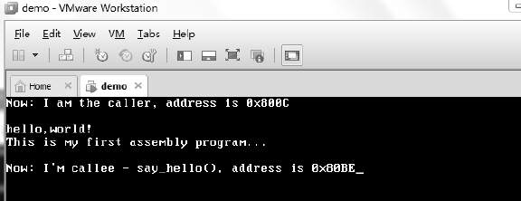
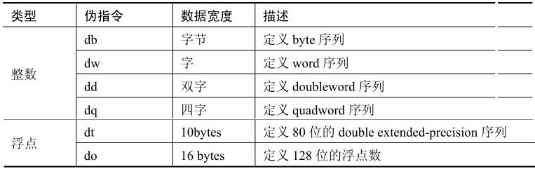

按照惯例, 先看看"Hello, World"的汇编版.

>实验 2-1: hello world 程序

下面的代码相当于 C 语言`main()`里的代码.

代码清单 2-1(topic02\ex2-1\setup.asm):

```assembly
main:                                                                      ;这是模块代码的入口点.
      mov si, caller_message
      call puts                                                          ;  打印信息
      mov si, current_eip
      mov di, caller_address
current_eip:
      call get_hex_string          ;  转换为 hex
      mov si, caller_address
      call puts
      mov si, 13                                                          ;  打印回车
      call putc
      mov si, 10                                                          ;  打印换行
      call putc
      call say_hello           ;  打印信息
      jmp $
caller_message        db 'Now: I am the caller, address is 0x'
caller_address        dq 0
hello_message         db 13, 10, 'hello, world！', 13, 10 db 'This is my first assembly program...', 13, 10, 13, 10, 0
callee_message        db "Now: I'm callee - say_hello(), address is 0x"
callee_address        dq 0
```

实际上这段汇编语言相当于下面的几条 C 语言语句.

```cpp
int main()
{
      printf("Now: I am the caller, address is 0x%x", get_hex_string(current_eip));
      printf("
      ");
      say_hell0();                 /* 调用 say_hello() */
}
```

相比而言, 汇编语言的代码量就大得多了. 下面是 say\_hello()的汇编代码.

代码清单 2-2(topic02\ex2-1\setup.asm):

```
; -------------------------------------------;  say_hello()
; -------------------------------------------
say_hello:
      mov si, hello_message
      call puts
      mov si, callee_message
      call puts
      mov si, say_hello
      mov di, callee_address
      call get_hex_string
      mov si, callee_address
      call puts
      ret
```

这个 say_hello()也仅相当于以下几条 C 语句.

```cpp
void say_hello()
{
    printf("hello, world, This is my first assembly program...");
    printf("Now: I'm callee - say_hello(), address is 0x%x", get_hex_string(say_hello));
}
```

代码清单 2-1 和 2-2 就组成了我们这个**16 位实模式**下的汇编语言版本的 hello world 程序, 它在 VMware 上的运行结果如下所示.



当然仅这两段汇编代码还远远不能达到上面的运行结果, 这个例子中背后还有 boot.asm 和 lib16.asm 的支持, boot.asm 用来启动机器的 MBR 模块, lib16.asm 则是 16 位实模式下的库(在 lib\目录下), 提供类似于 C 库的功能.

main()的代码被加载到内存 0x8000 中, lib16.asm 的代码被加载到 0x8a00 中, 作为一个共享库的形式存在. 这个例子里的全部代码都在`topic02\ex2-1\`目录下, 包括 boot.asm 源文件和 setup.asm 源文件, 而 lib16.asm 则在`x86\source\lib\`目录下. main()所在的模块是 setup.asm.

>16 位?32 位?还是 64 位?

在**机器启动时**处理器工作于**16 位实模式**. 这个 hello world 程序工作于 16 位实模式下, 在**编写代码**时, 需要给 nasm 指示为 16 位的代码编译, 在代码的开头使用`bits 16`指示字声明.

>bits 32 指示编译为 32 位代码, bits 64 指示编译为 64 位代码.

# 使用寄存器传递参数

C 语言中的`__stdcall`和`__cdecl`调用约定会使用 stack 传递参数.

```cpp
printf("hello, world. This is my first assembly program...");
```

C 编译器大概会如下这样处理.

```
push hello_message
call printf
```

在汇编程序里尽量采用寄存器传递参数, 正如前面的 hello world 程序那样:

```
mov si, hello_message  ;  使用 si 寄存器传递参数
call puts
```

使用寄存器传递参数能获得更高的效率. 要注意在程序中修改参数值时, 是否需要参数的不变性, 按照惯例传递的参数通常是 volatile(可变)的, 可是在某些场合下保持参数的 nonvolatile(不变)能简化代码, 应尽量统一风格.

# 调用过程

call 指令用来调用一个过程, 可以直接给出一个目标地址值作为操作数, 编译器生成的机器指令如下.

```
e8 c2 00           ;  call puts
```

e8 是指令 call 的 opcode 操作, c200 是目标地址偏移量的 little-endian 排列, 它的值是 0x00c2, 因而目标地址就在地址 ip+0x00c2 上. ip 指示出了下一条指令地址.

instruction pointer 在 16 位下表示为 ip, 32 位下表示为 eip, 64 位下表示为 rip.

调用过程的另外一些常用形式如下.

```
        mov ax, puts
       call ax                               ;  寄存器操作数
; ; ;  或者是:
        call word [puts_pointer]         ;  内存操作数
```

这些是 near call 的常用形式, [puts_pointer]存放 puts 过程的地址值, puts_pointer 相当于 C 语言中的函数指针！是不是觉得很熟悉. 它们的机器指令形式如下.

```
ff d0              ;  call ax
ff 16 10 80       ;  call word [0x8010]
```

如上所示, 在 0x8010 地址上存放着 puts 过程的地址.

# 定义变量

在 nasm 的汇编源程序里, 可以使用**db 系列伪指令**来定义初始化的变量, 如下所示.



例如, 我们可以这样使用 db 伪指令.

```
hello_message         db 13, 10, 'hello, world！', 13, 10
```

这里为`hello_message`定义了一个字符串变量, 相当于如下 C 语句.

```cpp
hello_message[]="hello, world！";
```

十进制数字 13 是 ASCII 码中的回车符, 10 是换行符, 当然也可以使用十六进制数 0x0d 和 0x0a 来赋初值. 在 nasm 中可以使用单引号或双引号表达字符串常量.

```
callee_message        db "Now: I'm callee - say_hello(), address is 0x"
```