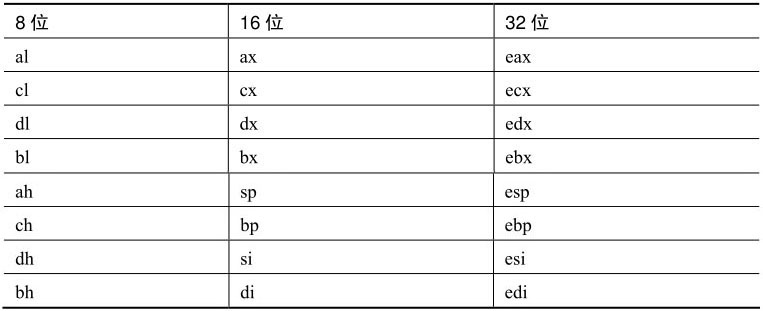
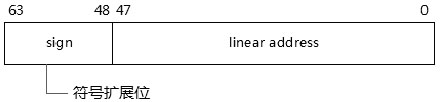
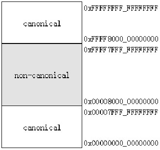

在 nasm 中可以在同一个源代码文件里同时指出 16 位代码、32 位代码, 以及 64 位代码.

```
bits 16
... ...                               ; 以下是 16 位代码
bits 32
... ...                               ; 以下是 32 位代码
bits 64
... ...                               ; 以下是 64 位代码
```

不用担心这里会有什么问题, **编译器**会为**每部分**生成**正确的机器指令**. 关于 16 位机器码、32 位机器码以及 64 位机器码, 详见笔者个人网站里的《x86/x64 指令系统》篇章, 地址为 http://www.mouseos.com/x64/default.html .

>16 位编程、32 位编程, 以及 64 位编程有什么不同之处?

这确实需要简单了解一下.

# 通用寄存器

## 16 位和 32 位

在 16 位和 32 位编程里, 可以使用的通用寄存器是一样的, 如下所示.



在**16 位编程**里可以使用**32 位的寄存器**, 在**32 位编程**里也可以使用**16 位的寄存器**, 编译器会生成**正确的机器码**.

```
bits 16      ;  为 16 位代码而编译
mov eax, 1                   ;  机器码是: 66 b8 01 00 00 00
```

上面这段代码为**16 位代码编译**, 使用了**32 位的寄存器**, 编译器会自动加上`default operand-size override prefix`(66H 字节), 这个`66H`字节用来调整为正确的操作数.

```
bits 32      ;  为 32 位代码而编译
mov eax, 1                   ;  机器码是: b8 01 00 00 00
```

这段代码的汇编语句是完全一样的, 只不过是为 32 位代码而编译, 它们的机器码就是不一样的.

## x64 体系

在**x64 体系**里, 在原来的**8 个通用寄存器**的基础上**新增了 8 个寄存器**, 并且原来的寄存器也得到了扩展.

在 64 位编程里可以使用的通用寄存器如下表所示.


在 64 位编程里可以使用**20 个 8 位寄存器**, 和**16 个 16 位**、**32 位**及**64 位寄存器**, 寄存器体系得到了完整的补充.

**所有的 16 个寄存器**都可以分割出相应的 8 位、16 位或 32 位寄存器. 在 16 位编程和 32 位编程里, sp、bp、si 及 di 不能使用低 8 位. 在 64 位编程里, 可以使用分割出的 spl、bpl、sil 及 dil 低 8 位寄存器.

64 位的 r8~r15 寄存器分割出相对应的 8 位、16 位及 32 位寄存器形式为: r8b~r15b、r8w~r15w, 以及 r8d~r15d.

```
bits 64      ;  为 64 位代码编译
mov r8b, 1
mov spl, r8b
```

比如上面这两条指令必须在 64 位下使用, r8b 和 spl 寄存器在 16 位和 32 位下是无效的.

# 操作数大小

在 16 位编程和 32 位编程下, 寄存器没有使用上的不便, 32 位的操作数依旧可以在 16 位编程里使用, 而 16 位的操作数也可以在 32 位编程下使用.

```
bits 16
push word 1                         ;  16 位操作数
push dword 1                        ;  32 位操作数
call ax       ;  16 位操作数
call eax       ;  32 位操作数
bits 32
push word 1                         ;  16 位操作数
push dword 1                        ;  32 位操作数
call ax       ;  16 位操作数
call eax       ;  32 位操作数
```

上面的代码完全可以用在 16 编程和 32 位编程里. 在 64 位编程里操作数可以扩展到 64 位.

```
bits 64
mov rax, 0x1122334455667788 ;  机器码是: b8 8877665544332211
```

这条指令直接使用了 64 位立即操作数.

# 64 位模式下的内存地址

在 64 位编程里可以使用宽达**64 位的地址值**.

## canonical 地址形式

然而, 在 x64 体系里只实现了**48 位的 virtual address**, 高 16 位被用做符号扩展. 这高 16 位必须要么全是 0, 要么全是 1, 这种形式的地址被称为 canonical 地址, 如下所示.



与 canonical 地址形式相对的是`non-canoncial`地址形式, 如下所示. 在 64 位模式下 non-canonical 地址形式是不合法的.



在 64 位的线性地址空间里,

1) 0x00000000_00000000 到 0x00007FFF_FFFFFFFF 是合法的 canonical 地址.

2) 0x00008000_00000000 到 0xFFFF7FFF_FFFFFFFF 是非法的 non-canonical 地址.

3) 0xFFFF8000_00000000 到 0xFFFFFFFF_FFFFFFFF 是合法的 canonical 地址.

在 non-canonical 地址形式里, 它们的符号扩展位出现了问题.

2.4.4 内存寻址模式

在 16 位和 32 位编程里, 16 位和 32 位的寻址模式都可以使用. 在 64 位下, 32 位的寻址模式被扩展为 64 位, 而且不能使用 16 位的寻址模式.

16 位内存寻址模式

在 16 位编程里, 内存操作数的寻址模式如下所示.


在 16 位寻址模式里基址只能使用 bx 和 bp 寄存器, 变址只能使用 si 和 di 寄存器, displacement 值使用 8 位或 16 位的偏移量.

32 位内存寻址模式

在 32 位编程里, 内存操作数的寻址模式如下所示.

基址和变址可以是 8 个通用寄存器. displacement 的值是 8 位或 32 位.

如以下指令中地址操作数的使用:

mov eax, [eax + ecx*4 + 0x1c]

这是典型的"基址(base)加变址(index)寻址加上偏移量寻址".

64 位内存寻址模式

64 位寻址模式形式和 32 位寻址模式是一致的, 基址和变址寄存器默认情况下使用 64 位的通用寄存器.

64 位寻址模式新增了一个 RIP-Relative 寻址形式.

RIP-Relative 寻址: [rip+disp32]

这个 displacement 值是 32 位宽, 地址值依赖于当前的 RIP(指令指针)值. 可是 nasm 的语法并不支持直接使用 rip, 像下面的用法是错误的.

```
mov rax, [rip + 0x1c]     ;  error: symbol 'rip' undefined
```

rip 是处理器内部使用的寄存器, 并不是外部编程可用的资源, 但在 yasm 语法上是支持的. nasm 中的解决方案是使用 rel 指示字.

```
mov rax, [rel table]        ;  rel 指示字后面跟上一个地址 label
```

这样就将编译为 RIP-Relative 寻址模式. RIP-Relative 寻址最直接的好处是很容易构造 PIC 代码结构.

什么是 PIC?PIC 是指 Position-Independent Code(不依赖于位置的代码).
假设有一条指令调用了 GetStdHandle()函数.

```
00073BEC     FF15 DC810700      call  dword ptr [__imp__GetStdHandle]
```

call 指令从 `[__imp__GetStdHandle]` 里读取 `Kernel32.dll` 库里的 `GetStdHandle()` 入口地址, 这里的 `__imp__GetStdHandle` 是绝对地址, 地址值为 0x000781DC.

```
__imp__ReadFile: 000781D4   A3 3E 4D 75__imp__XXXX: 000781D8   2C 3F 4D 75__imp__GetStdHandle: 000781DC   83 51 4D 75
```

在 0x000781DC(__imp__GetStdHandle)里放着的就是 GetStdHandle()在库里的地址 0x754D5183.

那么这条 call 指令就属于 PDC(Position-Dependent Code, 依赖于位置的代码).

```
FF15   DC810700            call   dword ptr [__imp__GetStdHandle@4 (781DCh)]     ----------  依赖于这个绝对地址
```
由于使用了绝对地址, 当__imp__GetStdHandle 的位置因重定位而有可能改变时, 这条 call 指令就会出错, 这个绝对地址已经不是__imp__GetStdHandle 的地址了.
在 x64 体系的 64 位环境下, 使用 RIP-Relative 很容易得到改善.

```
00073BEC  48 8d 85 e1 45 00 00  lea rbx, [rip + 0x45e1]  ;  得到 __IMP_FUNCTION_TABLE 的地址 00073BF3  48 03 1c c3              add rbx, [rbx + rax * 8] ;  得到 __imp_GetStdHandle 的地址 00073BF7  ff 13                      call [rbx]                   ;  call [__imp_GetStdHandle]... ...__IMP_FUNCTION_TABLE:                                ;   函数表地址在 0x000781D4000781D4   A3 3E 4D 75000781D8   2C 3F 4D 75000781DC   83 51 4D 75                                ;  GetStdHandle()的入口地址
```

在 nasm 里应该是`lea rbx, [rel__IMP_FUNCTION_TABLE]`, 这里使用 rip 是为了便于理解. 使用 lea 指令配合 RIP-Relative 寻址得到的__IMP_FUNCTION_TABLE 的地址不会因为重定位改变而改变, 因为这里使用基于 RIP 的相对地址, 没什么绝对地址, 而这个代码的相对地址是不会变的.

内存寻址模式的使用

在 16 位编程和 32 位编程下依旧可以使用 16 位地址模式和 32 位地址模式.

```
bits 16mov ax, [bx+si]                        ;  使用 16 位地址模式 mov eax, [eax+ecx*4]                 ;  使用 32 位地址模式 bits 32mov ax, [bx+si]                        ;  使用 16 位地址模式 mov eax, [eax+ecx*4]                 ;  使用 32 位地址模式
```

指令的默认地址(16 位或 32 位)依赖于 CS.D 标志位(在保护模式章节会有详细的描述), CS.D=1 时使用 32 位的寻址模式, CS.L=0 使用 16 位的寻址模式.

上面的代码中, 编译器会生成正确的机器指令, 当改变 default address-size(默认的地址尺寸)时, 生成的机器指令会相应地插入 67H(address-size override prefix)这个前缀值.

在 64 位模式下, 也可以使用 67H 改变默认的 64 位寻址模式, 改变为 32 位的寻址模式.

2.4.5 内存寻址范围

在正常的情况下, 16 位实模式编程里, 虽然可以使用 32 位的寻址模式, 可是依然逃不过 64K 内存空间的限制(实际上可以改变地址值大小, 在后面实模式的章节里进行探讨).
假如在 16 位实模式下写出如下代码.

```
mov eax, 0x200000                       ;  2M 地址 mov eax, [eax]                           ;  错误: > 64Kmov eax, 0x2000mov ecx, 1mov eax, [eax + ecx * 4]              ;  正确: <= 64K
```

在 32 位保护模式下, 可以寻址 4G 的线性空间, OS 通常的做法会使用最大的 4G 寻址空间; 而在 64 位环境, 寻址空间增加到了 64 位, 这个空间大小是不会改变的.
2.4.6 使用的指令限制

有些指令在 64 位环境里是不可用的, 在编程过程中应避免, 典型的如 push cs/ds/es/ss 指令和 pop ds/es/ss 指令, 这些在 16 位和 32 位下常用的指令在 64 位模式下是无效的.

```
call 0x0018: 0x00100000               ;  无效 jmp  0x0018: 0x00100000                ;  无效
```

这些常用的 direct far call/jmp(直接的远程 call/jmp)也是无效的. 此外还需要注意是否有权限去执行指令, 像 cli/sti 这类指令需要 0 级的执行权限, in/out 指令需要高于 eflags.IOPL 的执行权限. 这里不再一一列举.