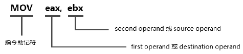
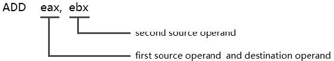
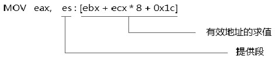
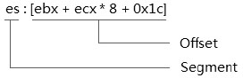
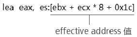

<!-- @import "[TOC]" {cmd="toc" depthFrom=1 depthTo=6 orderedList=false} -->

<!-- code_chunk_output -->

- [1. 操作数寻址](#1-操作数寻址)
  - [1.1. 寄存器寻址](#11-寄存器寻址)
  - [1.2. 内存操作数寻址](#12-内存操作数寻址)
  - [1.3. 立即数寻址](#13-立即数寻址)
  - [1.4. I/O 端口寻址](#14-io-端口寻址)
- [2. 内存地址形式](#2-内存地址形式)
  - [2.1. virtual address(虚拟地址)](#21-virtual-address虚拟地址)
  - [2.2. logical address(逻辑地址)](#22-logical-address逻辑地址)
    - [2.2.1. effective address(有效地址)](#221-effective-address有效地址)
  - [2.3. linear address(线性地址)](#23-linear-address线性地址)
  - [2.4. physical address(物理地址)](#24-physical-address物理地址)
- [3. 传送数据指令](#3-传送数据指令)
  - [3.1. mov 指令](#31-mov-指令)

<!-- /code_chunk_output -->

在 x86/x64 平台上, 大多数汇编语言(如: nasm)源程序的一行可以组织为

```
label:       instruction-expression             ;  comment
```

一行有效的汇编代码主体是 instruction expression(指令表达式), label(标签)定义了一个地址, 汇编语言的 comment(注释)以"; "号开始, 以行结束为止.



最前面是指令的 mnemonic(助记符), 在通用编程里 x86 指令支持最多 3 个 operand(操作数), 以逗号分隔. 前面的操作数被称为 first operand(第 1 个操作数)或者目标操作数, 接下来是 second operand(第 2 个操作数)或源操作数.

有的时候, first operand 会被称为 first source operand(第 1 个源操作数), second operand 会被称为 second source operand(第 2 个源操作数):



两个操作数都是源操作数, 并且第 1 个源操作数是目标操作数, 可是还有另外一些情况.

>在一些指令中并没有显式的目标操作数, 甚至也没有显式的源操作数. 而在 AVX 指令中 first source operand 也可能不是 destination operand.

例如 mul 指令的目标操作数是隐含的, lodsb 系列指令也不需要提供源操作数和目标操作数, 它的操作数也是隐式提供的. 使用 source 和 destination 来描述操作数, 有时会产生迷惑. 使用 first operand(第 1 个操作数)、second operand(第 2 个操作数)、third operand(第 3 个操作数), 以及 fourth operand(第 4 个操作数)这些序数来描述操作数更清晰.

# 1. 操作数寻址

数据可以存放在寄存器和内存里, 还可以从外部端口读取. 操作数寻址(operand addressing)是一个寻找数据的过程.

## 1.1. 寄存器寻址

>register addressing: 在寄存器里存/取数据.

x86 编程可用的寄存器操作数有 GPR(通用寄存器)、flags(标志寄存器)、segment register(段寄存器)、system segment register(系统段寄存器)、control register(控制寄存器)、debug register(调试寄存器), 还有 SSE 指令使用的 MMX 寄存器和 XMM 寄存器, AVX 指令使用的 YMM 寄存器, 以及一些配置管理用的 MSR.

系统段寄存器: GDTR(全局描述符表寄存器), LDTR(局部描述符表寄存器), IDTR(中断描述符表寄存器), 以及 TR(任务寄存器). 使用在系统编程里, 是保护模式编程里的重要系统数据资源.

系统段寄存器操作数是隐式提供的, 没有明确的字面助记符, 这和 IP(Instruction Pointer)有异曲同工之处.

```
LGDT [GDT_BASE]         ;  从内存 [GDT_BASE] 处加载 GDT 的 base 和 limit 值到 GDTR
```

x86 体系里还有更多的隐式寄存器, MSR(Model Specific Register)能提供对处理器更多的配置和管理. 每个 MSR 有相应的编址. 在 ecx 寄存器里放入 MSR 的地址, 由 rdmsr 指令进行读, wdmsr 指令进行写.

```
mov ecx, 1bH             ;  APIC_BASE 寄存器地址 rdmsr                      ;  读入 APIC_BASE 寄存器的 64 位值到 edx: eaxmov ecx, C0000080h      ;  EFER 地址 rdmsr                      ;  读入 EFER 原值 bts eax, 8                ;  EFER.LME=1wdmsr                      ;  开启 long mode
```

用户编程中几乎只使用 GPR(通用寄存器), sp/esp/rsp 寄存器被用做 stack top pointer(栈顶指针), bp/ebp/rbp 寄存器通常被用做维护过程的 stack frame 结构. 可是它们都可以被用户代码直接读/写, 维护 stack 结构的正确和完整性, 职责在于程序员.

## 1.2. 内存操作数寻址

>memory addressing: 在内存里存/取数据.

内存操作数由一对[]括号进行标识, 而在 AT&T 的汇编语法中使用()括号进行标识. x86 支持的内存操作数寻址多种多样, 参见前面所述内存寻址模式.

>内存操作数的寻址如何提供地址值?

直接寻址是 memory 的地址值明确提供的, 是个绝对地址.

```
mov eax, [0x00400000]                    ;  明确提供一个地址值
```

直接寻址的对立面是间接寻址, memory 的地址值放在寄存器里, 或者需要进行求值.

```
mov eax, [ebx]                             ;  地址值放在 ebx 寄存器里 mov eax, [base_address + ecx * 2]     ;  通过求值得到地址值
```

地址值的产生有多种形式, x86 支持的最复杂形式如下.



在最复杂的形式里, 额外提供了一个段值, 用于改变原来默认的 DS 段, 这个地址值提供了 base 寄存器加上 index 寄存器, 并且还提供了偏移量.

上面的内存地址值是一个对有效地址进行求值的过程. 那么怎么得到这个地址值呢?如下所示.

```
lea eax, [ebx + ecx*8 + 0x1c]
```

使用 lea 指令可以很容易获得这个求出来的值, lea 指令的目的是 load effective address(加载有效地址).

## 1.3. 立即数寻址

>immediate: 立即数无须进行额外的寻址, immediate 值将从机器指令中获取.

在机器指令序列里可以包括 immediate 值, 这个 immediate 值属于机器指令的一部分.

```
b8 01 00 00 00            ;  对应 mov eax, 1
```

在处理器进行 fetch instruction(取指)阶段, 这个操作数的值已经确定.

## 1.4. I/O 端口寻址

x86/x64 体系实现了独立的 64K I/O 地址空间(从 0000H 到 FFFFH), IN 和 OUT 指令用来访问这个 I/O 地址.

>一些数据也可能来自外部 port.

in 指令读取外部端口数据, out 指令往外部端口写数据.

```
in al, 20H                 ;  从端口 20H 里读取一个 byte
```

in 和 out 指令是 CPU 和外部接口进行通信的工具. 许多设备的底层驱动还是要靠 in/out 指令. 端口的寻址是通过 immediate 形式, 还可以通过 DX 寄存器提供 port 值. immediate 只能提供 8 位的 port 值, 在 x86 上提供了 64K 范围的 port, 访问 0xff 以上的 port 必须使用 DX 寄存器提供.

在 x86/x64 体系中 device(设备)还可以使用 memory I/O(I/O 内存映射)方式映射到物理地址空间中, 典型的如 VGA 设备的 buffer 被映射到物理地址中.

# 2. 内存地址形式

在 x86/x64 体系里, 常见的有下面几种地址形式.

1) logical address(逻辑地址).

2) linear address(线性地址).

3) physical address(物理地址).

## 2.1. virtual address(虚拟地址)

virtual address 并不是独立存在的, 非特指哪一种地址形式, 而是泛指某一类地址形式.

physical address 的对立面是 virtual address, 实际上, logical address 和 linear address(非 real 模式下)都是 virtual address 的形式.

## 2.2. logical address(逻辑地址)

**逻辑地址**是我们的程序**代码中使用的地址**, 逻辑地址最终会被处理器转换为**linear address**(线性地址), 这个 linear address 在 real 模式以及非分页的保护模式下就是物理地址.



逻辑地址包括**两部分**: **segment** 和 **offset**(`segment:offset`), 这个 offset 值就是段内的 **effective address**(有效地址值).

segment 值可以是显式或隐式的(或者称为默认的). 逻辑地址在 real 模式下会经常使用到, 保护模式下在使用 far pointer 进行控制权的切换时显式使用 segment 值.

在高级语言层面上(典型的如 C 语言)我们实际上使用的是逻辑地址中的 effective address(有效地址)部分, 例如: 变量的地址或者指针都是有效地址值. 因此, 在我们的程序中使用的地址值可以称为逻辑地址或虚拟地址.

### 2.2.1. effective address(有效地址)

如前面所述, effective address 是 logical address 的一部分, 它的意义是段内的有效地址偏移量.

logic addres(逻辑地址): Segment: Offset. Offset 值是在一个 Segment 内提供的有效偏移量(displacement).

这种地址形式来自早期的 8086/8088 系列处理器, Offset 值基于一个段内, 它必须在段的有效范围内, 例如实模式下是 64K 的限制. 因此, effective address 就是指这个 Offset 值.



如上所示, 这条 lea 指令就是获取内存操作数中的 effective address(有效地址), 在这个内存操作数里, 提供了显式的 segment 段选择子寄存器, 而最终的有效地址值为

```
effective_address=ebx + ecx * 8 + 0x1c
```

因此, 目标操作数 eax 寄存器的值就是它们计算出来的结果值.

## 2.3. linear address(线性地址)

有时 linear address(线性地址)会被直接称为 virtual address(虚拟地址), 因为 linear address 在之后会被转化为 physical address(物理地址). 线性地址是不被程序代码中直接使用的. 因为 linear address 由处理器负责从 logical address 中转换而来(由段 base+段内 offset 而来). 实际上线性地址的求值中重要的一步就是: 得到段 base 值的过程.

典型地, 对于在 real 模式下一个逻辑地址 `segment:offset`, 有

```
linear_address=segment << 4 + offset
```

这个 real 模式的线性地址转换规则是 segment*16+offset, 实际上段的 base 值就是 segment<<4. 在 protected-mode(保护模式)下, 线性地址的转化为

```
linear_address=segment_base + offset
```

段的 base 值加上 offset 值, 这个段的 base 值由段描述符的 base 域加载而来. 而在 64 位模式下, 线性地址为

```
linear_address=offset     ;  base 被强制为 0 值
```

在 64 位模式下, 除了 FS 与 GS 段可以使用非 0 值的 base 外, 其余的 ES、CS、DS 及 SS 段的 base 值强制为 0 值. 因此, 实际上线性地址就等于代码中的 offset 值.

## 2.4. physical address(物理地址)

linear address(或称 virtual address)在开启分页机制的情况下, 经过处理器的分页映射管理转换为最终的物理地址, 输出到 address bus. 物理地址应该从以下两个地址空间来阐述.

1) 内存地址空间.

2) I/O 地址空间.

在这些地址空间内的地址都属于物理地址. 在 x86/x64 体系里, 支持 64K 的 I/O 地址空间, 从 0000H 到 FFFFH. 使用 IN/OUT 指令来访问 I/O 地址, address bus 的解码逻辑将访问外部的硬件.

物理内存地址空间将容纳各种物理设备, 包括: VGA 设备, ROM 设备, DRAM 设备, PCI 设备, APIC 设备等. 这些设备在物理内存地址空间里共存, 这个 DRAM 设备就是机器上的主存设备.

在物理内存地址空间里, 这些物理设备是以 memory I/O 的内存映射形式存在. 典型地 local APIC 设置被映射到 0FEE00000H 物理地址上.

在 Intel 上, 使用 MAXPHYADDR 这个值来表达物理地址空间的宽度. AMD 和 Intel 的机器上可以使用 CPUID 的 80000008 leaf 来查询"最大的物理地址"值.

# 3. 传送数据指令

x86 提供了非常多的 data-transfer 指令, 在这些传送操作中包括了: load(加载), store(存储), move(移动). 其中, mov 指令是最常用的.

## 3.1. mov 指令

mov 指令形式如下.


目标操作数只能是 register 或者 memory, 源操作数则可以是 register、memory 或者 immediate. x86/x64 上不支持 memory 到 memory 之间的直接存取操作, 只能借助第三方进行.

```
mov eax, [mem1]mov [mem2], eax               ;  [mem2] <- [mem1]
```

还要注意的是将 immediate 操作数存入 memory 操作数时, 需要明确指出 operand size(操作数大小).


这是错误的！编译器不知道立即数 1 的宽度是多少字节, 同样也不知道[mem]操作数到底是多少字节. 两个操作数的 size 都不知道, 因此无法生成相应的机器码.

mov eax, [mem1]               ;  OK！ 目标操作数的 size 是 DWORD

编译器知道目标操作数的 size 是 DWORD 大小, [mem1]操作数无须明确指示它的大小.

mov dword [mem1], 1          ;  OK！ 给目标操作数指示 DWORD 大小 mov [mem1], dword 1          ;  OK！ 给源操作数指示 DWORD 大小

nasm 编译器支持给立即数提供 size 的指示, 在有些编译器上是不支持的, 例如: masm 编译器.

mov dword ptr [mem1], 1     ;  OK！ 只能给 [mem1] 提供 size 指示

微软的 masm 编译器使用 dword ptr 进行指示, 这也是 Intel 与 AMD 所使用的形式.

什么是 move、load、store、load-and-store 操作?

在传送指令中有 4 种操作: move, load, store, 以及 load-and-store. 下面我们来了解这些操作的不同.

move 操作

在处理器的寄存器内部进行数据传送时, 属于 move 操作, 如下所示.


这种操作是最快的数据传送方法, 无须经过 bus 上的访问.

load 操作

当从内存传送数据到寄存器时, 属于 load 操作, 如下所示.


内存中的数据经过 bus 从内存中加载到处理器内部的寄存器.

store 操作

当将处理器的数据存储到内存中时, 属于 store 操作, 如下所示.


MOV 指令的目标操作数是内存. 同样, 数据经过 bus 送往存储器.

load-and-store 操作

在有些指令里, 产生了先 load(加载)然后再 store(存)回去的操作, 如下所示.


这条 ADD 指令的目标操作数是内存操作数(同时也是源操作数之一). 它产生了两次内存访问, 第 1 次读源操作数(第 1 个源操作数), 第 2 次写目标操作数, 这种属于 load-and-store 操作.

注意: 这种操作是 non-atomic(非原子)的, 在多处理器系统里为了保证指令执行的原子性, 需要在指令前加上 lock 前缀, 如下所示.

lock add dword [mem], eax        ;  保证 atomic

2.5.2.2 load/store 段寄存器

有几组指令可以执行 load/store 段寄存器.

load 段寄存器

下面的指令进行 load 段寄存器.

MOV  sReg, reg/memPOP  sRegLES/LSS/LDS/LFS/LGS  reg

store 段寄存器

下面的指令进行 store 段寄存器.

MOV  reg/mem, sRegPUSH  sReg

CS 寄存器可以作为源操作数, 但不能作为目标操作数. 对于 CS 寄存器的加载, 只能通过使用 call/jmp 和 int 指令, 以及 ret/iret 返回等指令. call/jmp 指令需要使用 far pointer 形式提供明确的 segment 值, 这个 segment 会被加载到 CS 寄存器.

mov cs, ax                    ;  无效 opcode, 运行错误 #UD 异常 mov ax, cs                    ;  OK！

pop 指令不支持 CS 寄存器编码.

push cs                        ;  OK！pop cs                         ;  编译错误, 无此 opcode！

les 系列指令的目标操作数是 register, 分别从 memory 里加载 far pointer 到 segment 寄存器和目标寄存器操作数. far pointer 是 32 位(16: 16)、48 位(16: 32), 以及 80 位(16: 64)形式.

注意: 在 64 位模式下, push es/cs/ss/ds 指令、pop es/ss/ds 指令及 les/lds 指令是无效的. 而 push fs/gs 指令和 pop fs/gs 指令, 以及 lss/lfs/lgs 指令是有效的.

实验 2-2: 测试 les 指令

在这个实验里, 使用 les 指令来获得 far pointer 值, 下面是主体代码.

代码清单 2-3(topic02\ex2-2\protected.asm):

      les ax, [far_pointer]                                    ;  get far pointer(16: 16)current_eip:       mov si, ax      mov di, address      call get_hex_string      mov si, message      call puts      jmp $far_pointer:       dw current_eip                                               ;  offset 16      dw 0                                                            ;  segment 16message        db 'current ip is 0x', address        dd 0, 0

在 Bochs 里的运行结果如下.


2.5.2.3 符号扩展与零扩展指令

sign-extend(符号扩展)传送指令有两大类: movsx 系列和 cbw 系列.


在 movsx 指令里 8 位的寄存器和内存操作数可以符号扩展到 16 位、32 位及 64 位寄存器. 而 16 位的寄存器和内存操作数可以符号扩展到 32 位和 64 位的寄存器.

movsxd 指令将 32 位的寄存器和内存操作数符号扩展到 64 位的寄存器, 形成了 x64 体系的全系列符号扩展指令集.


cbw 指令族实现了对 al/ax/eax/rax 寄存器的符号扩展. 而 cwd 指令族将符号扩展到了 dx/edx/rdx 寄存器上.

int a;                  /* signed DWORD size */short b;                /* signed WORD size */a=b;                  /* sign-extend */

像上面这样的代码, 编译器会使用 movsx 指令进行符号扩展.

movsx eax, word ptr [b]           ;  WORD sign-extend to DWORDmov [a], eax

zero-extend(零扩展)传送指令 movzx 在规格上和符号扩展 movsx 是一样的.


mov ax, 0xb06amovsx ebx, ax                         ;  ebx=0xffffb06amovzx ebx, ax                         ;  ebx=0x0000b06a

2.5.2.4 条件 mov 指令

CMOVcc 指令族依据 flags 寄存器的标志位做相应的传送.


在 x86 中, flags 寄存器标志位可以产生 16 个条件.

signed 数运算结果

G (greater)                 : 大于 L (less)                     : 小于 GE (greater or equal)     : 大于或等于 LE (less or equal)         : 小于或等于

于是就有了 4 个基于 signed 数条件 CMOVcc 指令: cmovg, cmovl, cmovge, 以及 cmovle, 这些指令在 mnemonic(助记符)上还可以产生另一些形式.

G           => NLE(不小于等于)L           => NGE(不大小等于)GE          => NL(不小于)LE          => NG(不大于)

因此, cmovg 等价于 cmovnle, 在汇编语言上使用这两个助记符效果是一样的.

unsigned 数运算结果

A (above)                   : 高于 B (below)                   : 低于 AE (above or equal)       : 高于或等于 BE (below or equal)       : 低于或等于

于是就有了 4 个基于 unsigned 数条件的 CMOVcc 指令: cmova, cmovb, cmovae, 以及 cmovbe, 同样每个条件也可以产生否定式的表达: NBE(不低于等于), NAE(不高于等于), NB(不低于), 以及 NA(不高于).

标志位条件码

另外还有与下面的标志位相关的条件.

1) O(Overflow): 溢出标志.

2) Z(Zero): 零标志.

3) S(Sign): 符号标志.

4) P(Parity): 奇偶标志.

当它们被置位时, 对应的 COMVcc 指令形式为: cmovo, cmovz, cmovs, 以及 cmovp. 实际上, OF 标志、ZF 标志和 SF 标志, 它们配合 CF 标志用于产生 signed 数条件和 unsigned 数条件.

当它们被清位时, CMOVcc 指令对应的指令形式是: cmovno, cmovnz, cmovns, 以及 cmovnp.

CMOVcc 指令能改进程序的结构和性能, 如对于下面的 C 语言代码.

printf("%s", b == TRUE ? "yes" : "no");

这是一个典型的条件选择分支, 在不使用 CMOVcc 指令时如下.

      mov ebx, yes                     ;  ebx=OFFSET "yes"      mov ecx, no                      ;  ecx=OFFSET "no"      mov eax, [b]      test eax, eax                    ;  b == TRUE ?      jnz continue      mov ebx, ecx                     ;  FALSE: ebx=OFFSET "no"continue:       push ebx      push OFFSET("%s      ")      call printf

使用 CMOVcc 指令可以去掉条件跳转指令.

mov ebx, yes                       ;  ebx=OFFSET "yes"mov ecx, no                        ;  ecx=OFFSET "no"mov eax, [b]test eax, eax                     ;  b == TRUE ?cmovz ebx, ecx                    ;  FALSE: ebx=OFFSET "no"push ebxpush OFFSET("%s")call printf

2.5.2.5 stack 数据传送指令

栈上的数据通过 push 和 pop 指令进行传送.


stack 的一个重要的作用是保存数据, 在过程里需要修改寄存器值时, 通过压入 stack 中保存原来的值.

push ebp                            ;  保存原 stack-frame 基址 mov ebp, esp...mov esp, ebppop ebp                              ;  恢复原 stack-frame 基址

像 C 语言, 大多数情况下的函数参数是通过 stack 传递的.

printf("hello, world");                /*C 中调用函数 */push OFFSET("hello, world")            ;  压入字符串 "hello, word" 的地址 call printf

如上所见 stack 具有不可替代的地位, 因此 push 和 pop 指令有着举足轻重的作用.

2.5.3 位操作指令

x86 也提供了几类位操作指令, 包括: 逻辑指令, 位指令, 位查询指令, 位移指令.

2.5.3.1 逻辑指令

常用的包括 and、or、xor, 以及 not 指令. and 指令做按位与操作, 常用于清某位的操作; or 指令做按位或操作, 常用于置某位的操作.

and eax, 0xFFFFFFF7                     ;  清 eax 寄存器的 Bit3 位 or eax, 8                                 ;  置 eax 寄存器的 Bit3 位

xor 指令做按位异或操作, 用 1 值异或可以取反, 用 0 值异或可以保持不变, 常用于快速清寄存器的操作.

xor eax, eax                        ;  清 eax 寄存器, 代替 mov eax, 0xor eax, 0                           ;  效果等同于 and eax, eaxxor eax, 0xFFFFFFFF                ;  效果类似于 not eax(不改变 eflags 标志)

not 指令做取反操作, 但是并不影响 eflags 标志位.

2.5.3.2 位指令

x86 有专门对位进行操作的指令: bt, bts, btr, 以及 btc, 它们共同的行为是将某位值复制到 CF 标志位中, 除此而外, bts 用于置位, btr 用于清位, btc 用于位取反.

bt eax, 0                  ;  取 Bit0 值到 CFbts eax, 0                 ;  取 Bit0 值到 CF, 并将 Bit0 置位 btr eax, 0                 ;  取 Bit0 值到 CF, 并将 Bit0 清位 btc eax, 0                 ;  取 Bit0 值到 CF, 并将 Bit0 取反

这些指令可以通过查看 CF 标志来测试某位的值, 很实用.

lock bts DWORD [spinlock], 0         ;  test-and-set, 不断地进行测试并上锁

如果不想使用烦人的 and 与 or 指令, 就可以使用它们(缺点是只能对 1 个位进行操作). 第 1 个 operand 可以是 reg 和 mem, 第 2 个 operand 可以是 reg 与 imm 值.

2.5.3.3 位查询指令

bsf 指令用于向前(forward), 从 LSB 位向 MSB 位查询, 找出第 1 个被置位的位置. bsr 指令用于反方向(reverse)操作, 从 MSB 往 LSB 位查询, 找出第 1 个被置位的位置.

mov eax, 70000003Hbsf ecx, eax                 ;  ecx=0(Bit0 为 1)bsr ecx, eax                 ;  ecx=30(Bit30 为 1)

它们根据 ZF 标志查看是否找到, 上例中如果 eax 寄存器的值为 0(没有被置位), 则 ZF=1, 目标操作数不会改变. 找到时 ZF=0, 当然可能出现 bsf 与 bsr 指令的结果一样的情况(只有一个位被置位).

2.5.3.4 位移指令

x86 上提供了多种位移指令, 还有循环位移, 并且可以带 CF 位移.

1) 左移: shl/sal

2) 右移: shr

3) 符号位扩展右移: sar

4) 循环左移: rol

5) 循环右移: ror

6) 带进位循环左移: rcl

7) 带进位循环右移: rcr

8) double 左移: shld

9) double 右移: shrd


SHL/SAL 指令在移位时 LSB 位补 0, SHR 右移时 MSB 补 0, 而 SAR 指令右移时 MSB 位保持不变.


ROL 移位时, MSB 移出到 CF 的同时补到 LSB 位上. ROR 指令移位时, LSB 移出 CF 的同时补到 MSB 位上.


如上所示, RCL 与 RCR 都是带进位标志的循环移位, CF 值会分别补到 LSB 和 MSB.


SHLD 和 SHRD 指令比较独特, 可以移动的操作数宽度增加一倍, 改变 operand 1, 但 operand 2 并不改变.

mov eax, 11223344Hmov ebx, 55667788H                 ; shld ebx, eax, 8                   ;  ebx=66778811H, eax 不变

2.5.4 算术指令

1) 加法运算: ADD, ADC, 以及 INC 指令.

2) 减法运算: SUB, SBB, 以及 DEC 指令.

3) 乘法运算: MUL 和 IMUL 指令.

4) 除法运算: DIV 和 IDIV 指令.

5) 取反运算: NEG 指令.

加减运算是二进制运算, 不区别 unsigned 与 signed 数, 乘除运算按 unsigned 和 signed 区分指令. neg 指令是对 singed 进行取负运算. ADC 是带进位的加法, SBB 是带借进的减法, 用来构造大数的加减运算.

add eax, ebx                        ;  edx: eax + ecx: ebxadc edx, ecx                        ;  edx: eax=(edx: eax + ecx: ebx)sub eax, ebx                        ;  edx: eax – ecx: ebxsbb edx, ecx                        ;  edx: eax=(edx: eax – ecx: ebx)

2.5.5 CALL 与 RET 指令

CALL 调用子过程, 在汇编语言里, 它的操作数可以是地址(立即数)、寄存器或内存操作数. call 指令的目的是要装入目标代码的 IP(Instruction Pointer)值.


目标地址放在 register 里时, EIP 从寄存器里取; 放在 memory 里时, 从 memory 里获得 EIP 值. 在汇编语言表达里, 直接给出目标地址作为 call 操作数的情况下, 编译器会计算出目标地址的 offset 值(基于 EIP 偏移量), 这个 offset 值作为 immediate 操作数.


为了返回到调用者, call 指令会在 stack 中压入返回地址, ret 指令返回时从 stack 里取出返回值重新装载到 EIP 里然后返回到调用者.

2.5.6 跳转指令

跳转指令分为无条件跳转指令 JMP 和条件跳转指令 Jcc(cc 是条件码助记符), 这个 cc 条件码和前面 CMOVcc 指令的条件码是同样的意义.

jmp 系列指令与 call 指令最大的区别是: jmp 指令并不需要返回, 因此不需要进行压 stack 操作.