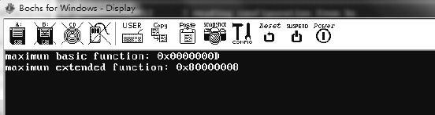
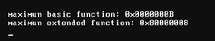
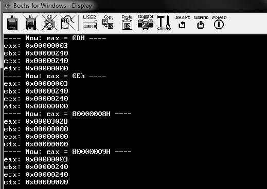
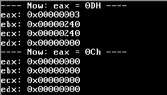

<!-- @import "[TOC]" {cmd="toc" depthFrom=1 depthTo=6 orderedList=false} -->

<!-- code_chunk_output -->

- [1. 概述](#1-概述)
- [2. 查询最大 leaf 号](#2-查询最大-leaf-号)
- [3. 基本最大功能号](#3-基本最大功能号)
- [4. 扩展最大功能号](#4-扩展最大功能号)

<!-- /code_chunk_output -->

# 1. 概述

从 **CPUID 指令**获得的**信息有两大类**: **basic(基本**)和 **extended(扩展**), 要获得信息必须要先提供相应的 leaf(功能号), 每一类信息都有最大的功能号限制.

**某些功能号**下面还有许多 `sub-leaf`(**子叶**), 也就是**信息的子集**. 使用 CPUID 指令之前在 **eax 寄存器**提供要查询的某个信息相应的功能号.

```assembly
mov eax, 0      ;功能号 0(main leaf)
cpuid           ;查询 0 号信息
```

**返回的相应信息**放在**eax、ebx、ecx**, 以及**edx 寄存器**中. 这些信息是**32 位**的, 因此在**64 位模式**下, **rax、rbx、rcx, 以及 rdx 寄存器**的**高 32 位被清 0**.

# 2. 查询最大 leaf 号

CPUID 指令被使用来查询处理器所支持的特性, 因此 CPUID 所支持的 leaf 数量是与处理器相关的. 很多时候, 在使用某个 leaf 查询之前, 必须判断处理器是否支持该 leaf.

典型地, 在使用 0BH 号功能时, 应先查询处理器**是否支持 0BH 号功能**.

# 3. 基本最大功能号

使用 CPUID 的 00H leaf 来查询, 最大的基本功能号返回在 EAX 寄存器里.

```assembly
mov eax, 0                 ;  功能号 0(main leaf)
cpuid                       ;  查询 0 号信息
cmp eax, 0BH    ;  判断是否支持 0B leaf
jb no_support    ;  假如不支持...
```

# 4. 扩展最大功能号

同样, 最大的扩展功能号也可以查询.

```assembly
mov eax, 80000000          ;  功能号 80000000(main leaf)
cpuid                   ;  查询最大扩展功能号
cmp eax, 80000001H  ;  判断是否支持 80000001 leaf
jb no_support    ;  假如不支持...
```

输入 80000000H 功能号, 从返回的 EAX 寄存器里可以得到最大的扩展功能号.

功能号 0 也返回处理器厂商名, 在 Intel 的机器上返回的是: ebx 寄存器是"Genu", ecx 寄存器是"ntel", edx 寄存器是"ineI", 组合起来是"GenuineIntel", 在 AMD 的机器上是"AuthenticAMD".

>实验 4-2: 获得 basic 和 extended 功能号

实验的源码在 `\topic04\ex4-2\setup.asm` 文件里.

```assembly
      call test_CPUID test ax, ax
      jz no_support
; ;  获得最大 basic 功能号
      mov eax, 0
      cpuid
      mov esi, eax
      mov di, value_address
      call get_dword_hex_string
      mov si, basic_message
      call puts
      mov si, value_address
      call puts
      call println
; ;  获得最大 extended 功能号
      mov eax, 0x80000000
      cpuid
      mov esi, eax
      mov di, value_address
      call get_dword_hex_string
      mov si, extend_message
      call puts
      mov si, value_address
      call puts
      call println
      jmp $
no_support:
      mov si, [message_table + eax * 2]
      call puts
      jmp $
support_message            db 'support CPUID instruction', 13, 10, 0
no_support_message        db 'no support CPUID instruction', 13, 10, 0
message_table              dw no_support_message, support_message, 0
basic_message                db 'maximun basic function: 0x', 0
extend_message               db 'maximun extended function: 0x', 0
value_address                dd 0, 0, 0
```

在 Bochs 里运行的结果如下所示.



Bochs 是模拟 Intel 系列的 CPU, 在笔者的 AMD 真实机器上最大 basic 功能号是 0x00000005, 最大 extended 功能号是 0x8000001A, 在另一台 Intel i5 机器上分别是 0Bh 和 80000008h:



Intel 的处理器上目前的最大 basic 功能号是 0DH, 最大 extended 功能号是 80000008H(依赖于每个机器的实现). Intel 手册中指示 Core i7 处理器(Westmere 架构)最大的 basic 功能号是 0BH, 最大的 extended 功能号是 80000008H.

如果在 eax 中输入的功能号超过了最大的功能号, 那么将返回 basic 最大功能号的信息.

当 eax=0Eh 时, 返回的信息和 eax=0Dh 一致, 当 eax=80000009h 时返回的信息也和 eax=0Dh 一致.

>实验 4-3: 分别使用 0Dh 和 0Eh, 以及 80000008h 和 80000009h 来运行获得信息

由于在目前的 Intel 上 0Dh 是最大 basic 功能号, 80000008h 是最大的扩展功能号, 因此本实验的目的是验证 Intel 所说的话.

代码清单 4-3(topic04\ex4-3\setup.asm):

```assembly
; ;  现在得到最大功能号 0DH 的信息
      mov si, msg1
      call puts
      mov eax, 0Dh
      cpuid
      mov [eax_value], eax
      mov [ebx_value], ebx
      mov [ecx_value], ecx
      mov [edx_value], edx
      call print_register_value                    ;  打印寄存器的值
;  测试输入功能号为 eax=0Eh
      mov si, msg2
      call puts
      mov eax, 0Eh
      cpuid
      mov [eax_value], eax
      mov [ebx_value], ebx
      mov [ecx_value], ecx
      mov [edx_value], edx
      call print_register_value                    ;  打印寄存器的值
; ;  现在得到 extended 最大功能号 80000008h 的信息
      mov si, msg3
      call puts
      mov eax, 80000008h
      cpuid
      mov [eax_value], eax
      mov [ebx_value], ebx
      mov [ecx_value], ecx
      mov [edx_value], edx
      call print_register_value                    ;  打印寄存器的值
; ;  现在测试 extended 最大功能号 80000009 的信息
      mov si, msg4
      call puts
      mov eax, 80000009h
      cpuid
      mov [eax_value], eax
      mov [ebx_value], ebx
      mov [ecx_value], ecx
      mov [edx_value], edx
      call print_register_value                   ;  打印寄存器的值
```

下面是在 Bochs 中运行的结果.



可以看出, 当 eax 分别等于 0Dh、0Eh 和 80000009h 时, 所返回的信息是一样的. 在笔者的 AMD 真实机器上运行上面的例子, 得不到输出结果, 目前在 AMD 的机器上最大的 basic 功能号是 06H, 而 extended 功能号则达到了 8000001Bh.

请注意: 当输入的功能号<=最大功能号时, 如果 CPU 并不支持该功能号, 则所有寄存器返回 0 值, eax=ebx=ecx=edx=0.

由于在 Bochs 上所支持的最大 basic 功能号是 0Dh, 如果以 0Ch 去访问 CPUID 指令(0Ch 功能号 CPU 不支持), 返回的寄存器将全是 0 值(eax<=maxinum number).



当输入功能号>最大功能号时, 访问 CPUID, 返回的将是最大功能号的信息, 也就是上面做的实验所证明的.