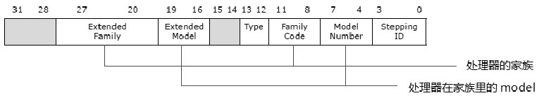
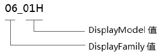
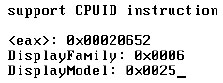
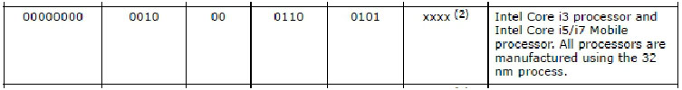
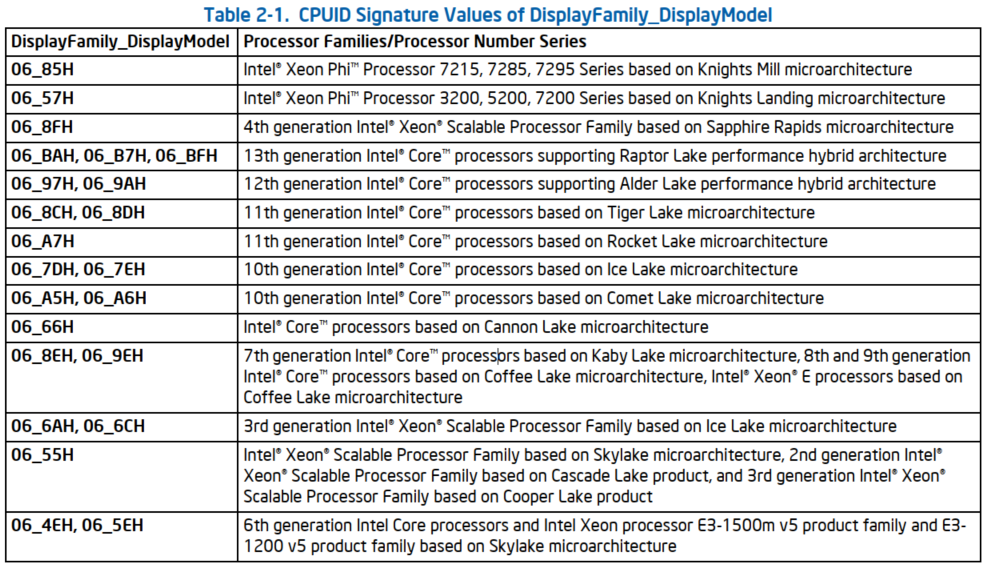
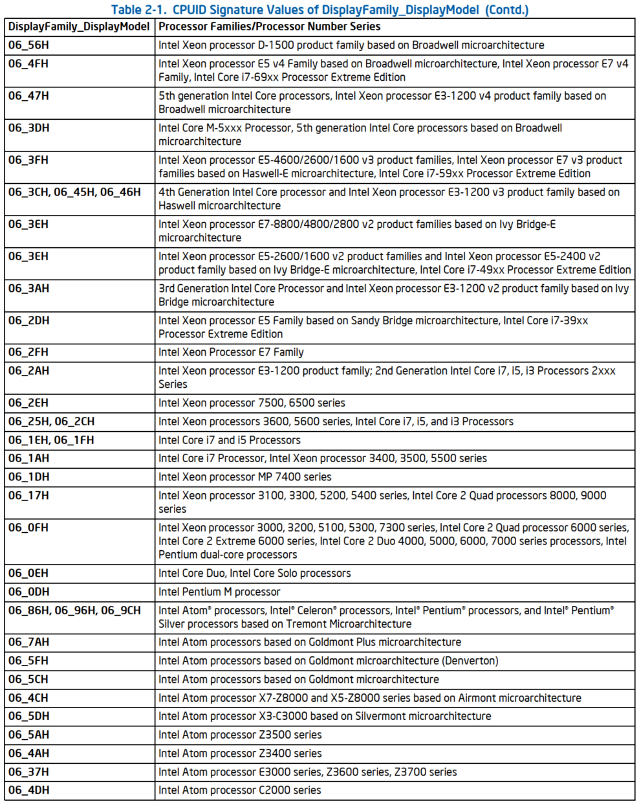
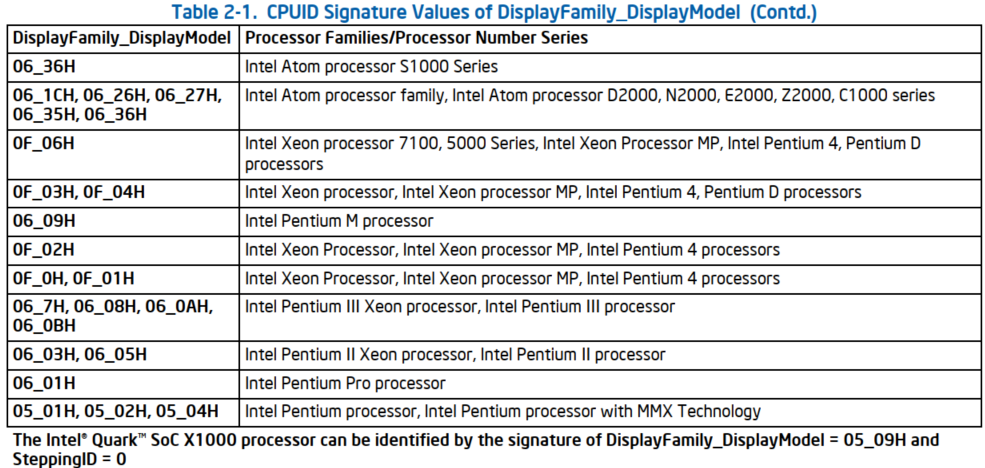

<!-- @import "[TOC]" {cmd="toc" depthFrom=1 depthTo=6 orderedList=false} -->

<!-- code_chunk_output -->

- [1. main leaf: 01H](#1-main-leaf-01h)
- [2. family 与 model](#2-family-与-model)
  - [2.1. DisplayFamily](#21-displayfamily)
  - [2.2. DisplayModel](#22-displaymodel)
- [3. 简单的实验](#3-简单的实验)
- [4. Intel 家族](#4-intel-家族)

<!-- /code_chunk_output -->

# 1. main leaf: 01H

由 `CPUID.01H:EAX` 可返回**处理器的家族、模型及步进信息**.



- `EAX[11: 8]`得到**family 编码**, 典型地, **P6 家族**处理器的**family 编码**是**06H**, Pentium4 家族的 family 编码是 0FH.

- `EAX[27: 20]`得到**扩展的 family 值**.

- `EAX[7: 4]`得到处理器**在家族中的 model**.

- `EAX[19: 16]`得到**扩展的 model 值**.

# 2. family 与 model

在这些处理器信息里, **最重要**的是**family 与 model**.

由于 x86 处理器的庞大和混乱, 在 Intel 文档的相关描述中, 使用了 family 和 model 的配合来描述处理器的特性, 例如下面的这个描述.



## 2.1. DisplayFamily

DisplayFamily 值的计算方法如下.

```cpp
if (Family == 0FH)
{
        DisplayFamily = ExtendedFamily + Family;
}
else
        DisplayFamily = Family;
```

可见, 只有在**Pentium4 以后的处理器**才支持**ExtendedFamily 编号**.

## 2.2. DisplayModel

DisplayModel 值的计算方法如下.

```cpp
if (Family == 06H || Family == 0FH)
{
        DisplayModel = ExtendedModel << 4 + Model;
}
else
        DisplayModel = Model;
```

# 3. 简单的实验

现在我们可以做个实验.

>实验 4-4: 获得处理器的 DisplayFamily 与 DisplayModel

实验的完整源码在 `topic04\ex4-4\setup.asm` 文件里, 调用了 `lib\lib16.asm` 文件里面的 `get_DisplayFamily_DisplayModel()` 过程来获得 **DisplayFamily** 和 **DisplayModel 值**, 下面是运行结果.



在笔者实验的机器上的处理器 **DispalyFamily 是 06H**, **DisplayModel 是 25H**, 根据 Intel 的**说明**这个 Model 是属于**32nm 制程的 Core i3/i5/i7 Mobile 处理器(属于 Westmere 微架构**).



它的 **ExtendedModel 值是 0010B**, **Model 值是 0101B**, 组合起来是: **25H**. 那么这个处理器模型将被描述为: **06\_25H**. 这种 **DisplayFamily\_DisplayModel 的模型**相当重要, 在 Intel 手册的描述中**使用这种方式**来**区别处理器的模型**.

注: 参见手册 `vol 4. Table 2-1. CPUID Signature Values of DisplayFamily_DisplayModel`

# 4. Intel 家族

在 **Intel** 的机器上, **06H 家族**和 **0FH 家族**是两大派系.

**0FH 家族**典型地是指 **Pentium 4** 处理器系列.

而 **06H 家族** 很庞大, 从早期的 Pentium Pro、PentiumII 到今天的 Westmere/SandyBridge 微架构的 i7/i5/i3 处理器都属于 06H 家族. 在如此庞大的**06H 家族**, 要靠它的 **DisplayModel** 来识别**每一代架构**的处理器.

**05H 家族**则属于 Pentium 处理器.

处理器产品型号/CPUID 标识/签名对照表:







详细见 Intel 手册: `vol 4. Table 2-1. CPUID Signature Values of DisplayFamily_DisplayModel`

