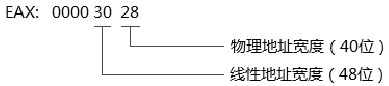

# 概述

在 `x86/x64` 平台, **最大物理地址空间**从 0 到 MAXPHYADDR 之间. 这个 **MAXPHYADDR** 可以使用 `CPUID.80000008H:EAX[7:0]` 查到.

当前 x64 体系下实现的最大的**虚拟地址空间宽度为 48 位**, **最大的虚拟地址宽度**可以从 `CPUID.80000008H:EAX[15:8]` 查到.

# CPUID

在 `CPUID.80000008H` 叶里, 我们可以获取处理器所支持的**最大物理地址**和**线性地址**的宽度.



上面 **80000008h 功能号**返回的 **eax 值为 0x00003028**, **低 byte** 是**物理地址宽度**, 值为 **28h** 就是 **40 位**(十进制), 接着是**线性地址宽度**. 当**CPU 支持 long mode 时**, 这个值是**30h**, 否则就是**20h**, 这表明**long mode**下**最高支持 48 位的线性地址**, 线性地址的**高 16 位**被用做**sign 位**, 在**32 位**的机器上这个值是**20h(32 位**).

# MAXPHYADDR 值

在 Intel 中广泛使用 **MAXPHYADDR** 这个术语来表示**最大的物理地址**. 80000008H leaf 返回的 `EAX[7: 0]` 被称为 MAXPHYADDR.

当处理器**不支持 80000008H leaf(功能**)时, 如果检测 `CPUID.01H:EDX[6] = 1`(即: **PAE=1**)则支持**最高 36 位物理地址**. 如果此时 PAE 也并不支持, 那么**MAXPHYADDR 就是 32 位**.

```
# cpuid -l 0x80000008H -1
Disclaimer: cpuid may not support decoding of all cpuid registers.
CPU:
   Physical Address and Linear Address Size (0x80000008/eax):
      maximum physical address bits         = 0x30 (48)
      maximum linear (virtual) address bits = 0x30 (48)
      maximum guest physical address bits   = 0x0 (0)
   Logical CPU cores (0x80000008/ecx):
      number of CPU cores - 1 = 0x5f (95)
      ApicIdCoreIdSize        = 0x7 (7)
```