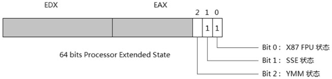
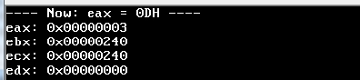
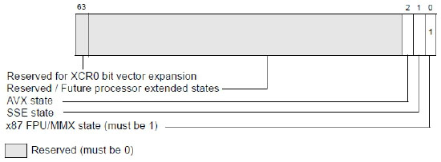
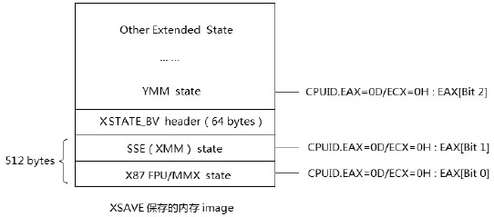
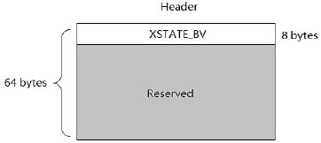

<!-- @import "[TOC]" {cmd="toc" depthFrom=1 depthTo=6 orderedList=false} -->

<!-- code_chunk_output -->

- [1. 概述](#1-概述)
- [2. 探测 Processor Extended State 子叶](#2-探测-processor-extended-state-子叶)
- [3. Processor Extended State 子叶所需内存 size](#3-processor-extended-state-子叶所需内存-size)
  - [Processor Extended State 与 XCR0 的关系](#processor-extended-state-与-xcr0-的关系)
- [4. Processor Extended State 的保存](#4-processor-extended-state-的保存)
- [5. Processor Extended State 的恢复](#5-processor-extended-state-的恢复)

<!-- /code_chunk_output -->

# 1. 概述

实际上 **0Dh 功能号**是获得处理器对**Processor Extended State(处理器扩展状态**)的支持度, 这在 AVX 指令编程里非常重要. 在 Sandy Bridge 架构的处理器中, **支持度只使用了 3 位**.

>Processor Extended State(处理器扩展状态)是什么?

0Dh 功能号是一个功能集, 在前面的例子中:

```assembly
mov eax, 0Dh                  ;  0Dh 功能号
mov ecx, 0                    ;  main leaf(主叶)功能
cpuid                          ;  得到 0Dh 的 main leaf 功能
```

这个 main leaf 功能就可以获得 **CPU 目前对处理器状态信息的支持度**, **eax** 和 **edx** 寄存器返回 **processor extended state 的 enable/disable 位图**.



返回的 **edx** 和 **eax** 寄存器组成一个**64 位的 Processor Extended State 功能表**, 高 32 位在 edx 寄存器, 低 32 位在 eax 寄存器. 在处理器的规划中, **每 1 位对应一个扩展状态功能 enable 位**. 为 1 时支持该状态, 为 0 时不支持.

这个 Processor Extended State 值将影响到 **XCR0**(`Extended Control Register`)的值. 当 State 值的某位为 0 时, 那么 XCR0 的相应位为保留位(此位不能被 XSETBV 指令设置).

目前的 x86 处理器中(包括 Intel 和 AMD)仅使用了低 3 位(Bit 0~Bit2). **Bit 0** 对应 **X87 FPU 状态**, **Bit 1**对应**SSE 状态**, 这两位一般都能返回 1, 表示 CPU 支持 X87 FPU 和 SSE 功能. **Bit 2**对应 **YMM 状态**.

YMM 状态在 Intel 的 Sandy Bridge 架构和 AMD 的 bulldozer 架构中得到了支持, 也就是说 CPU 支持 AVX 指令集. 因此, 在这种处理器以上才返回 YMM 状态位为 1 值.

图中的阴影部分为 reserved(保留位), 未来的处理器可能会使用这些位来支持更多的处理器状态信息. 保留位的值全部为 0.

看看前面在 Bochs 里运行的结果.



得到的结果表明: CPU 支持 x87 FPU 和 SSE 状态而不支持 YMM 状态, 也就是说不支持 AVX 指令. 值得注意的是, 由于 Bochs 模拟实现了 CPUID 0DH 号功能, 因此可以使用 0DH leaf 进行查询. 实际上, 在不支持 AVX 指令的处理器上, 并不支持 CPUID 0DH leaf.

# 2. 探测 Processor Extended State 子叶

由于 eax 返回的是处理器对 Processor Extended State 的 enable 位, 在未来的处理器中可能加入更多的支持, 因此在使用前应该探测处理器到底支持了哪些 Prcessor Extended State.

```assembly
      mov eax, 0Dh                  ;  0Dh 功能号
      mov ecx, 0                    ;  main leaf(主叶)功能
      cpuid                          ;  得到 0Dh 的 main leaf 功能, 在 edx: eax 返回对
      ;  processor extended state 的支持位
      mov [extended_state], eax             ;  保存 enable 位
      mov [extended_size], ebx               ;  保存整个 exended state 的 size 值
      mov dword [detect_value], 2           ;  从 Bit2 开始探测
detect:
      mov eax, 0Dh              ;  0Dh 功能号
      mov ecx, [detect_value]                ;  sub-leaves 子叶号
      bt dword [extended_state], ecx       ;  Bit n == 1 ?
      jnc next_detect                          ;   该位不支持, 继续探测
      cpuid                                       ;  探测
      mov ecx, [detect_value]
      mov [state + ecx * 4], eax           ;  保存子叶 size
      mov [state + ecx * 4 + 4], ebx      ;  保存子叶 offset
next_detect:
      inc dword [detect_value]                ;  继续探测下一个子叶
      cmp dword [detect_value], 62           ;  小于等于 62 就继续
      jle detect
next:
      ... ...
```

假如 CPU 支持 AVX 指令, 那么 `CPUID(eax=0Dh, ecx=0h):EAX[YMM]` 为 1, 也就是 eax 的 Bit 2 为 1, 因此从第 2 位开始探测, 假如 Bit 3 是支持的, 继续探测 Bit 3, 以此类推......

>记录下来: 在上面的 64 位 Processor Extended State 值中每 1 位代表一个子叶, 从 Bit 2(YMM 状态)开始.

在 Processor Extended State 中 X87 FPU state 是必须要支持的, 它必定为 1, 而 **SSE state** 也就是 **XMM** 寄存器状态, 也是支持的, 这时 Bit 1 位是保留. 所以从 Bit 2 开始探测直至 Bit 62 位, Bit 63 位是保留未用.

# 3. Processor Extended State 子叶所需内存 size

在 main leaf(eax=0Dh, ecx=0h)里, ebx 和 ecx 寄存器都返回一个内存 size.

**ebx** 寄存器返回的是在 XCR0(Extended Control Register)里设置了开启某个位去支持处理器状态所**需要的内存 size**.



XCR0 的结构与上面 `CPUID(EAX=0Dh, ECX=0H)` 返回的 64 位 Processor Extended State 值结构是一样的. XCR0 可以设置 SSE 状态为 disable(关闭), 这样 CPU 将不会保存 SSE(即: XMM 寄存器)的值.

## Processor Extended State 与 XCR0 的关系

**XCR0** 是一个**功能开关**, 用来**开启或关闭某些 state 的保存**. 而 CPUID(eax=0Dh, ecx=00h)返回的 Processor Extended State 值将决定处理器保存哪些 state 信息的能力.

OS 可以通过 **XSETBV** 指令对 XCR0 进行相应的设置, 如果某位被 disable 掉, 这时候, XCR0 与 CPU 支持的 64 位 Processor Extended State 值会不一致. 因此, **ebx** 寄存器返回的是**这个 XCR0 设置**的保存状态所需要的内存 size.

**ecx** 寄存器返回的是 CPU 所支持的**所有状态**(即: 在 main leaf 里返回 eax 的位图), 保存这些状态所需要的**总内存 size**, 因此, **ebx** 不一定等于 ecx(取决于 XCR0 是否开启相应的位).

如果 `CPUID(eax=0Dh, ecx=0h)` 返回的 eax 寄存器为 07H 值, 那么说明它支持 AVX 指令, 这样的话就可以接着使用 0Dh 的 **2 号子叶**去查看相关的信息.

在 AMD 处理器上支持 LWP 指令, Bit 62 位是 LWP state 位, 所以在 AMD 里就可以查看 62 号子叶的信息.

下面是查看子叶号为 62 的相关信息(如果 CPU 支持).

```assembly
mov eax, 0Dh                  ;  0Dh 功能号
mov ecx, 62                   ;  AMD 机器上的 62 号子叶功能
cpuid
```

# 4. Processor Extended State 的保存

Processor Extended State 通过使用 XSAVE 指令来保存处理器的状态, 在内存中处理器的 state 映像看起来如下.



实际情况还要更复杂些, SSE 和 YMM 状态的保存, 还取决于 XSAVE 指令提供的 64 位 MASK 码和 XCR0 上面所述的相应位的 enable(开启), 如果 `XCR0.YMM=0` 表明不保存 YMM 状态, 那么图中的 YMM state 区域是 0 值(不被更新).

```assembly
mov edx, 0
mov eax, 3                         ;  不保存 YMM state
xsave [state_image]              ;  根据 64 位的 Mask 值和 XCR0 位进行保存
```

同样, 在 edx: eax 这个 64 位的 mask 码值中, 如果 YMM state mask 位为 0, YMM state 区域也不被更新, 必须 XCR0 和 MASK 值同时被置 1(AND 与关系)区域才被更新.

回到上面的例子, 由于不支持 AVX 指令, 所以 eax 返回 0x03, 表明仅支持 X87 FPU 和 SSE 状态. 而 ebx 和 ecx 寄存器的返回值是 0x240, 这个值就等于 `512 + 64 = 576` (0x240), X87 FPU 需要 512 字节, 还要加上一个 header 部分. 这个 header 的首 64 位(8 bytes)是一个 XSTATE_BV 结构, 当 XSAVE 保存状态时, 用来记录部分状态被保存了. 若保存 X87 FPU 和 SSE 状态, 就设置 Bit 0 和 Bit 1 为 1, 反之将清 0.

# 5. Processor Extended State 的恢复

使用 XRSTOR 指令可以从内存的 state 映像中恢复原来保存的 state 信息.



header 结构是 64 字节, 首 8 字节是一个 64 位的 MASK 值, 用来记录在 state 映像中哪些区域是被保存过的(被更新过), 相应的位为 1 时表示 image 中的相应的区域被更新, 如: YMM state 区域中被保存过, 那么 `XSTATE_BV[2] = 1`(Bit 2 对应于 YMM state 位).

XSTATE_BV 的位在执行 XSAVE 指令保存 state 时被 CPU 设置. 当执行 xrstor 指令时, CPU 会根据 XSTATE\_BV 中哪一位被置位, 而做相应的恢复.