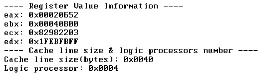
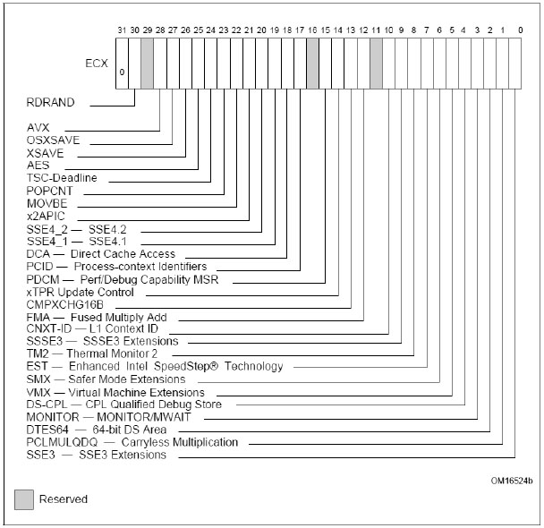
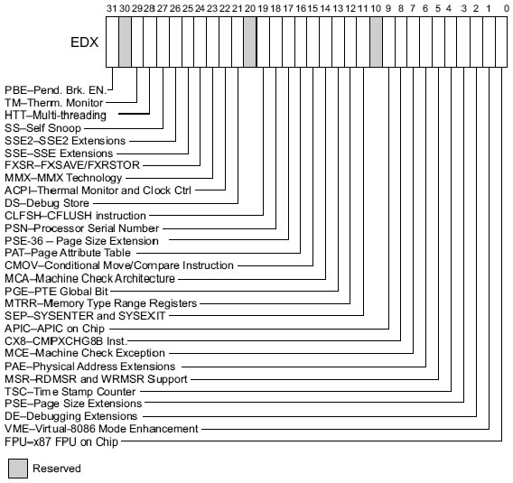

**EAX = 01h 号**功能将获得**处理器的基本信息**, 它是 CPUID 中一个重要的功能号, **eax 寄存器**返回处理器的 **Model、Family、Stepping** 等信息. 在**ebx 寄存器**中: ebx[15: 8]返回 **CLFLUSH line size**, 这个值**乘 8**就可以得到 **Cache line 的 size(！！！**), `ebx[23: 16]` 返回**逻辑处理器最大可寻址的数目**.

>实验 4-5: 查看 CPU 的 cache line size 和 Maximum logic processor

实验的完整源码在\topic04\ex4-5\setup.asm 文件里, 下面是在 VMware 里的运行结果.

在 VMware 中笔者设置**processor core 的数目为 4 个**, 上面显示的 logic processor 是 4 个, ebx[15: 8]的值是 0x08, 所以它的**cache line size 是 64(0x40)字节(！！！**).

在 ecx 和 edx 寄存器中返回 CPU 支持的种类繁多的特性, 下面分别是 ecx 和 edx 寄存器返回值所对应的功能.

这些特性是处理器硬件物理上所支持的功能, 利用 CPUID 指令可以检测处理器所支持的特性.

可是 CPUID.EAX=01H 在 ECX 和 EDX 返回的某些特性是由软件设置的. 还有部分特性受到 MSR(Model Specific Register)的设置影响.

例如: ECX 寄存器的 bit 27 是 OSXSAVE 标志位, 这个标志位并不是硬件特性, 是由软件设置而来的, 在 OS 里为了开启 AVX 指令使用环境, OS 最终会设置 CR4 的 Bit 18 位 CR4.OSXSAVE=1, 处理器会根据这个位来置 CPUID(EAX=01h): ECX[27]标志, 也就是上面的 ECX[OSXSAVE]标志位. 软件使用 AVX 指令前会读取这个标志位, 确认 OS 已经准备好 AVX 指令的执行环境.

检测 CPU 是否支持 AVX 指令的是 Bit 28 AVX 标志位, 而 Bit 26 位是 XSAVE 标志位, 它用于检测 CPU 是否支持 XSAVE/XRSTOR、XSETBV/XGETBV 指令和 XCR0.