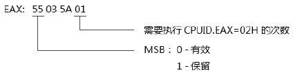
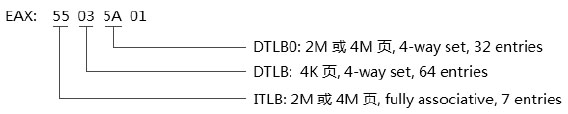
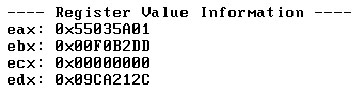
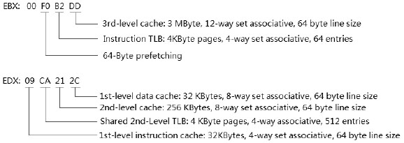
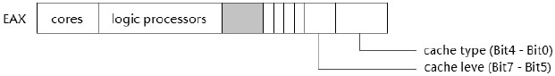
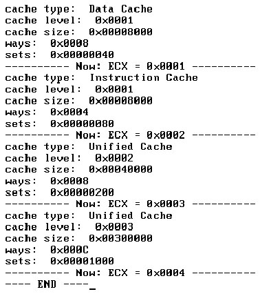
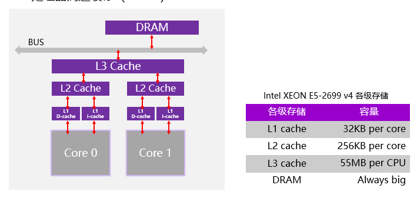
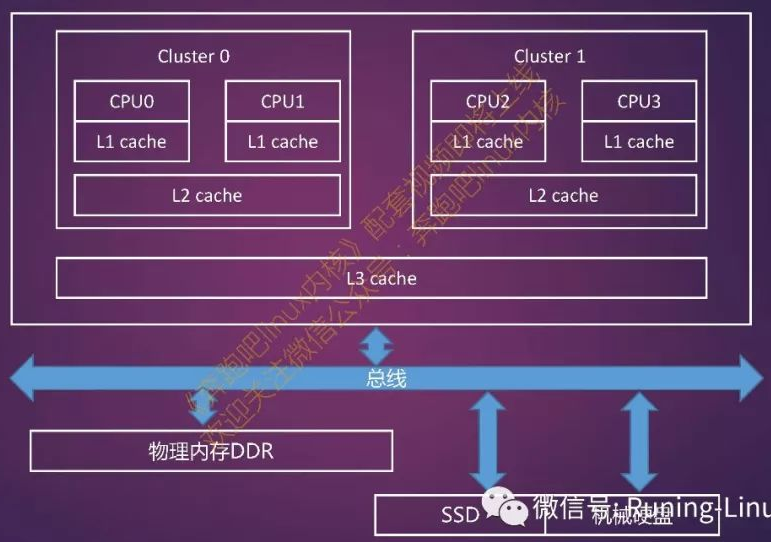
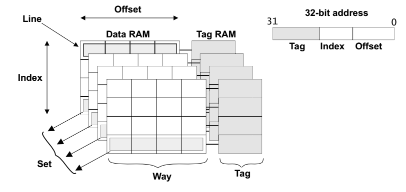

<!-- @import "[TOC]" {cmd="toc" depthFrom=1 depthTo=6 orderedList=false} -->

<!-- code_chunk_output -->

- [main leaf: 02H](#main-leaf-02h)
- [main leaf: 04H](#main-leaf-04h)

<!-- /code_chunk_output -->

# main leaf: 02H

`CPUID.EAX=02H` 用来获得关于 **CPU 的 Cache 与 TLB 信息**.

```assembly
mov eax, 02H        ;02 号功能
cpuid
```

返回信息中**eax 寄存器**的**最低字节(byte 0**)是需要**执行 CPUID.EAX=02H 的次数(！！！**).



上面这个最低字节的值为 01, 表明**只需要执行一次 CPUID.EAX=02H**就能获得**完整的信息**.

>寄存器的 MSB(Bit31)位是个标志位, 为**0 指示有效**, 为**1 指示无效**.

**eax、ebx、ecx 和 edx 寄存器**中的**每个字节指示一个信息**(除 EAX 寄存器的 byte 0 外).



如果是**FF 字节**表示 CPUID.EAX=02H**不返回 cache 及 TLB 信息**, 需要执行**CPUID.EAX=04H**进行查询.

>实验 4-6: 使用 CPUID.EAX=02H 查看 cache 及 TLB 信息

实验的源码在\topic04\ex4-6\setup.asm 中, 下面是在 VMware 中的运行结果.



上面的信息是在 VMware 下打印出来的, 从这个结果, 我们可以看出来以下信息.



# main leaf: 04H

处理器的**Cache 和 TLB**情况也可以从`CPUID.EAX=04H`里获得, 04H 功能号是**一个功能集**, 以**ECX 输入一个子叶号**, 枚举出处理器**Cache 的所有信息**.

首先以**ECX=0H 子叶开始查询**, 在**eax 寄存器返回**, 我们所关心的是以下几个位域.



`EAX[4: 0]`返回**cache 的类型**, 分别是: 1=**Data cache**, 2=**Instruction cache**, 3=**Unified cache**, 0 值是**终止标志**, 表示已经没有子叶可以枚举了, 其他值是保留的.

`EAX[7: 5]`返回**cache 的 level(！！！**), `EAX[31: 26]`域里也可以查询得到**处理器的 core 数**, 这个查询结果值需要**加上 1**才是真正的值.

接下来 EBX 寄存器的返回信息是: `EBX[11: 00]`是**line size**, `EBX[21: 12]`是**physical line partition**, `EBX[31: 22]`返回**cache 的 way 数**. 最后 ECX 寄存器返回 32 位的**cache set 数量**.

>实验 4-7: 使用 CPUID.EAX=04H/ECX=n 来查看 cache 及 TLB 信息

下面是部分代码片断, 完整的源码在 topic04\ex4-7\setup.asm 里.

代码清单 4-4:

```assembly
@@1:
mov ecx, [sub_leaves]       ;子叶号
mov esi, ecx
mov di, value_address
call get_hex_string
mov si, msg
call puts
mov si, value_address
call puts
mov si, msg2
call puts
mov eax, 04                 ;探测 ECX=n
cpuid
mov [eax_value], eax        ;保存各个寄存器的值
mov [ebx_value], ebx
mov [ecx_value], ecx
mov [edx_value], edx
inc dword [sub_leaves]      ;下一个子叶号
call print_cache_info       ;打印信息
test eax, eax
jnz @@1
```

从**子叶 ECX=0H**开始进行探测, 直至 EAX[4: 0]为 0(表示**没有下一个子叶**), **每一个子叶**得到的 cache size 的计算方法如下.

>cache size=line size × line partition × way × set

也就是等于: (EBX[11: 00]+1)\*(EBX[21: 12]+1)\*(EBX[31: 22]+1)\*(ECX+1).

**每一项加上 1**, 是因为返回的信息加上 1 才是完整的值. 这个计算的过程在 print\_cache\_info()过程里, 读者可以在 topic04\ex4-7\setup.asm 源码里看到. 下面是在 VMware 中的运行结果.



对比一下上面的运行结果和使用 CPUID.EAX=02H 查询到的结果, 看是否一致. 上面的结果是:

- **1 级 Data\-cache**的**size 是 32KB(值为 0x8000**), **8\-way** **64 set**结构. 每个 cache line 有 4KB size, 每个 way 有 64 字节.

- 1 级 Instruction\-cache 的 size 同样是 32KB(值为 0x8000), 4\-way 128 set 结构. 每个 way 有 8KB size, 每个 cache line 有 64 字节.

- 2 级 cache 的 size 是 256KB(值为 0x40000), 8\-way 512 set 结构. 每个 way 有 32KB size, 每个 way 有 64 字节.

- 3 级 cache 的 size 是 3MB(值为 0x300000), 属于 12\-way 4096 set 结构. 每个 way 有 256KB size, 每个 cache line 有 64 字节.

从上面大概可见, **1 级到 3 级容量越来越大, way 和 set 越来越大, 但是 cache line 都是 64 字节, 不变**.





如图所示(**图中的 cluster 应该是 package, 表示物理 CPU**), 一个拥有**2 个 CPU**的系统, **每个 CPU**有**两个 Core**, **每个 Core**有**两个线程(图中没有显示)的 Cache 架构**. **每一个 Core(以 core 为单位！！！**)有**单独的 L1 cache(！！！**), 它由**其中的线程所共享**, **每一个 CPU(物理 CPU**)中的**所有 Core**共享**同一个 L2 Cache**, **同一个 cluster 的所有的 CPU**共享**同一个 L3 Cache**.

**L1 cache**最靠近处理器核心, 因此它的访问**速度也是最快**的, 当然它的容量也是最小的. CPU 访问各级的 Cache 速度和延迟是不一样的, **L1 Cache 的延迟最小**, **L2 Cache 其次**, **L3 Cache 最慢**.

**CPU**访问一块**新的内存**时, 它会首先把包含**这块内存的 Cache Line 大小的内容(！！！**)获取到**L3 Cache**, 然后是载入到**L2 Cache**, 最后载入到了**L1 Cache**. 这个过程需要**访问主存储器**, 因此**延迟会很大**, 大约需要**几十纳秒**. 当**下次再读取相同一块数据**的时候**直接从 L1 Cache 里取数据**的话, 这个延迟**大约只有 4 个时钟周期**. 当**L1 Cache 满**了并且有**新的数据**要进来, 那么根据**Cache 的置换算法**会选择**一个 Cache line**置换到**L2 Cache**里, **L3 Cache**也是同样的道理.

访问类型 | 延迟
---|---
L1 cache 命中 | 约 4 个时钟周期
L2 cache 命中 | 约 100 纳秒
L3 cache 命中 | 约 100 纳秒
访问本地 DDR | 约 100 纳秒
访问远端内存节点 DDR | 约 100 纳秒

- 处理器**首次访问主存上的某地址**时, 会将**此地址所在单位大小的内容**依次载入**L3, L2, L1 Cache**
- 短时间内, 处理器**再次访问这个地址**时, 将**直接从 L1 Cache 读取**
- **强烈关注这几个 cache 的位置！！！**

**组相连**中, **cache**被分为**大小相同的块**(称为**way, 即路, 类似于磁盘的盘面**), **每个 way**中有**多个 cache line**, **每个 way**中的**cache line**(cache 中**最小访问单元**, 包含一小段主存中的数据, 常见大小是**32 或 64 字节**)都有**索引**(即**index, 索引域**), **相同索引域**的**cache line**组成一个**组**(即**set**, 相同索引域一般分别存在于每个 way 中, 类似于**磁盘的柱面<所有盘面的相同磁道**>).

处理器访问 cache 时的地址编码(处理器自己内部自发行为！！！)分为 3 个部分, 分别是

- **索引域(index, 用来在整个 cache 中索引得到 cache 组, 所以又叫组索引, 类似于在整个磁盘中找柱面**)
- **标记域(tag, 用于在 cache 组中索引得到特定的 cache line, 类似于在柱面中查找磁道**)
- **偏移域(offset, 用来在 cache line 中查找数据, 类似于在磁道中查找扇区**).



处理器**自我组装 cache 地址编码**, 然后通过**索引域(index**)查找**组(set**), 然后通过**标记(tag**)查找**组中具体的 cache line**, 处理器**直接拿到所有 cache line 数据**, 然后通过**偏移(offset**)查找到**具体数据**.

对比结果 cache size 和 cache 结构是一样的, 在这个例子里没有完整打印详细的信息, 读者朋友可以自行加入更完整的显示. 这个例子探测到子叶号 ECX=03H 为止, ECX=04H 已经不支持了.

让人感到沮丧的是: 在 AMD 的机器上并不支持 EAX=02H 到 EAX=04H 的功能号！

是的, 这确实让人反感, 在 AMD 的机器上 basic 功能号支持 EAX=01H、EAX=05H、EAX=06H 以及 EAX=0DH, 这 4 个功能号. 可是 AMD 比 Intel 支持更多的 extended 功能号, 根据 AMD 的 CPUID specification 指示, 最多达到了 8000001EH, 而 Intel 只支持到 80000008H.

在 AMD 机器上可以使用 80000005H、80000006H, 以及 8000001DH 扩展功能号查询 cache 和 TLB 的相关信息.