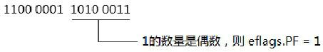
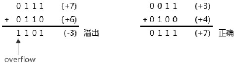
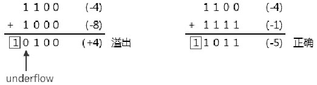
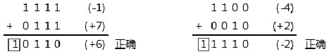
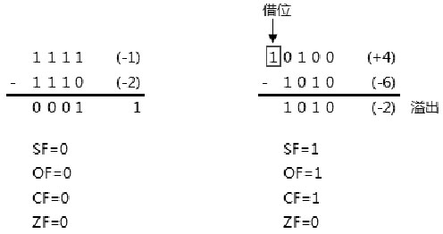
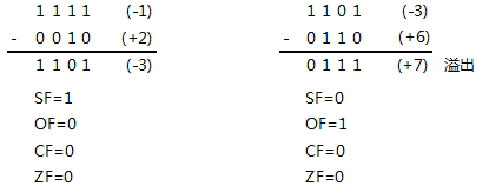
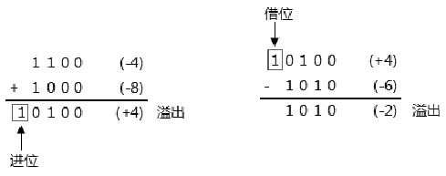

<!-- @import "[TOC]" {cmd="toc" depthFrom=1 depthTo=6 orderedList=false} -->

<!-- code_chunk_output -->

- [1. 概述](#1-概述)
  - [1.1. PF 标志位](#11-pf-标志位)
  - [1.2. AF 标志位](#12-af-标志位)
- [2. signed 数的运算](#2-signed-数的运算)
  - [2.1. 溢出位和符号位的产生](#21-溢出位和符号位的产生)
    - [2.1.1. overflow 的产生](#211-overflow-的产生)
    - [2.1.2. underflow 的产生](#212-underflow-的产生)
  - [2.2. signed 数的比较操作](#22-signed-数的比较操作)
    - [2.2.1. signed 数的条件码](#221-signed-数的条件码)
- [3. unsigned 数的运算](#3-unsigned-数的运算)
  - [3.1. 进位标志的产生](#31-进位标志的产生)
  - [3.2. unsigned 数的比较及条件码](#32-unsigned-数的比较及条件码)

<!-- /code_chunk_output -->

# 1. 概述

status flags 包括: **OF(溢出标志**), **SF(符号位标志**), **ZF(零标志**), **AF(调整位标志**), **CF(进位标志**), 以及**PF(奇偶位标志**). 这些标志位反映了指令执行结果的状态值.

## 1.1. PF 标志位

指令判断**结果值的最低字节(byte 0**), 而设置相应的 PF 标志位, 如下所示.



当最低字节(byte 0)中位为 1 值的数量是偶数 PF 标志被置位, 否则被清 0.

## 1.2. AF 标志位

当运算时 bit 3 发生向上进位或借位时, AF 标志被置位. AF 标志位使用在 BCD 码的运算指令上, 如下面使用 AF 标志位的例子.

```assembly
mov al, 8             ;  al=0000 1000B
mov bl, 9             ;  bl=0000 1001B
add al, bl            ;  al=0001 0001B, AF 标志为 1
aaa                     ;  使用 AF 标志进行调整, AX 的结果是: 00000001 00000111B
```

在上面的 8+9 式子里, bit 3 向 bit 4 进 1 位, AF 标志为 1. AAA 指令根据 AF 标志进行调整后, AX 的值变成 0107H(BCD 码形式).

# 2. signed 数的运算

status flags 标志位中有一部分用于表达 signed(符号)数运算结果的状态, 一部分用于表达 unsigned(无符号)数运算结果的状态. 而 ZF 标志位可以使用在 signed 和 unsigned 数上.

signed 数运算中使用的标志位有: OF(溢出)标志和 SF(符号)标志.

## 2.1. 溢出位和符号位的产生

对于 signed(符号数)的溢出, 有两种情况.

1) overflow(向上溢出): 当结果值超出 signed 数的最大值时产生 overflow.

2) underflow(向下溢出): 当结果值超出 signed 数的最小值时产生 underflow.

当结果产生 overflow 或 underflow 时会对 OF 标志位置位.

### 2.1.1. overflow 的产生

我们看看下面的 2 个正数相加的式子, 为了计算方便, 以 4 位的 signed 数为例.

- 式子 1: 7+6.
- 式子 2: 3+4.



如上面所示: 式子 2 的运算是正确的. 而在式子 1 中的+7 与+6 相加里, 结果值却是-2, 显然这是错误的. 因为这个 4 位符号数的结果值超出了正数最大值 7, 而产生了 overflow. 因此, 在这个计算结果中 eflags.OF=1(溢出标志被置位), eflags.SF=1(符号标志位被置位).

>记录下来: 两个正数相加, 结果为负数时, 产生了 overflow.

### 2.1.2. underflow 的产生

同样以 4 位数为例, 再看看 2 个负数相加的式子.

- 式子 1: (-4)+(-8)
- 式子 2: (-4)+(-1)



在式子 1 中: (-4)+(-8)=(+4)两个负数相加结果为正数, 显然是错误的. 4 位数的负数最小值是-8, 而-4 加上-8 的值应为-12, 它也超出了 4 位符号数的最小值, 产生了 underflow, 这时 eflags.OF=1, eflags.SF=0.

式子 2 中: (-4)+(-1)=(-5)这个值是正确的, 这时 eflags.OF=0, eflags.SF=1. 值得注意的是, 在这两个式子中都产生了进位. 因此这两个式子中, CF 标志位也被置位.

>记录下来: 两个负数相加, 结果为正数时, 产生了 underflow 溢出.

那么, 当正数和负数相加时, 情况又如何呢?



上面的 2 个正数与负数相加的式子中, 它们的值都是正确的, OF 标志都为 0(没有溢出). 式子 1 中 SF 标志为 0, 式子 2 中的 SF 标志为 1.

>记录下来: 正数和负数相加, 不会产生溢出.

OF 标志和 SF 标志也将影响到条件指令的执行, 在 x86 上有下面几类条件指令族: Jcc 指令家族, SETcc 指令家族, LOOPcc 指令家族, 以及 CMOVcc 指令家族. 这些指令助记符中 cc 代表一个条件码助记符.

## 2.2. signed 数的比较操作

上面的 OF、SF 及 ZF 标志都用于 signed 数的比较. 在执行 cmp 指令比较时, 是对两个数进行相减操作, 将比较的结果反映在标志位上.

>\-1\>\-2?4\>\-6?这两个比较式子如何反映在标志位上?

计算(-1)-(-2)和(4)-(-6)的结果, 从 eflags 标志位上获得比较结果, 如下所示.



在式子 1 中, -1 减-2 的结果是 SF、OF 以及 ZF 标志位都是 0; 式子 2 中, +4 减-6 的结果产生了 overflow, 因此 OF 标志与 SF 标志都为 1.

对于这两个比较式子, 我们知道前面的数都大于后面的数, 因此得到的结论如下.

>记录下来: 当 OF==SF 时, 比较结果是大于.

再看看-1>2 和-3>6 这两个比较式子, 我们知道前面的数都小于后面的数, 那么标志位上是什么呢?



在式子 2 的计算中, 由于负数减正数结果值为正数而产生了 underflow, 因此 OF 标志被置位. 可以看出, 这两个式子中, ZF 为 0, SF 与 OF 标志位都不相等. 我们得到的结论是:

>记录下来: 当 OF<>SF 时, 比较结果是小于.

### 2.2.1. signed 数的条件码

基于 SF 标志、OF 标志, 以及 ZF 标志位, 下面是用于 signed 数的条件码.

```
G (greater)                 : OF == SF 并且 ZF=0
L (less)                     : OF <> SF
GE (greater or euqal)     : OF == SF
LE (less or equal)         : OF <> SF 或者 ZF=1
```

在 GE(大于等于)的情况下只需要判断 OF 是否等于 SF 标志, 无论 ZF 是否为零都满足条件. 而在 L(小于)的情况下只需要判断 OF 不等于 SF 标志就可以了, 也不需要判断 ZF 标志.

# 3. unsigned 数的运算

ZF 标志和 CF 标志被用在与 unsigned 数相关的运算里, 在 unsigned 数的相关比较中不会使用 OF 和 SF 这两个标志位.

在 x86 上, 尽管对于数的运算, 指令会同时依据 unsigned 和 signed 数的结果对 OF、SF、CF, 以及 ZF、AF 和 PF 做相应的设置. 可是, 在 unsigned 与 singed 数与条件相关的指令中会做出相应的区分.

## 3.1. 进位标志的产生

在相加运算中, 由于向前进位而使用 CF 标志置位. 在相减运算中, 由于向前借位也会使 CF 标志置位.



-4 加-8 产生了进位, +4 减-6 产生了借位, 这两个计算结果都会使 CF 标志置位.

## 3.2. unsigned 数的比较及条件码

当 unsigned 数相减时, 如果不够减则会产生借位(eflags.CF=1), 表明是小于关系. 下面是用于 unsigned 数的条件码.

```
A (Above)                   : CF=0 并且 ZF=0
B (below)                   : CF=1
AE (Above or euqal)       : CF=0
BE (below or equal)       : CF=1 或者 ZF=1
```

这与 signed 数的情形类似, AE(高于等于)和 B(低于)的比较中都无需判断 ZF 标志.