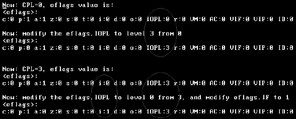
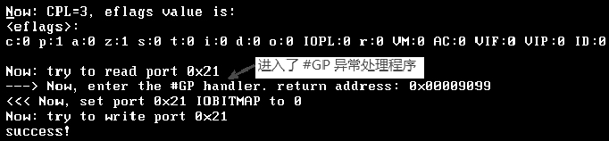

<!-- @import "[TOC]" {cmd="toc" depthFrom=1 depthTo=6 orderedList=false} -->

<!-- code_chunk_output -->

- [I/O Bitmap](#io-bitmap)

<!-- /code_chunk_output -->

eflags 有**两个位**来表示 **IOPL(I/O Privilege Level)标志位**, 指示**访问 I/O 地址空间所需要的权限**, 这个值**仅在 CPL=0** 权限下**可以修改**. **IOPL 标志**还将**影响到 IF 标志位**, **IF 标志**在**具有 IOPL 所规定的权限**内能被修改.

>只有当 CPL=0 时, 可以改变 IOPL 的值, 当 CPL<=IOPL 时, 可以改变 IF 标志位.

改变 IOPL 值可以使用 popfd 指令和 iret 指令, IF 标志位还有专门的指令开/关中断: sti 和 cli 指令. 当使用 popfd 指令进行修改时, 没有足够的权限时不能修改其值, 但是并不会产生异常.

>实验 5-1: 尝试改变 IOPL 和 IF 标志位

由于需要权限的改变, 在我们的实例中, 需要开启保护模式才能完成实验, 因此, 我们在 setup.asm 模块(common\setup.asm)里开启了保护模式, 并没有使用分页机制. 并在 protected.asm 模块里(topic05\ex5-1\protected.asm)进行这些实验.

代码清单 5-1(topic05\ex5-1\protected.asm):

```assembly
      pushfd                                                     ;  get eflags
      or DWORD [esp], 0x3000                                ;  将 IOPL=3
      popfd
;  modify the IOPL
      ... ...
;  进入 ring 3 完成实验
      push user_data32_sel | 0x3
      push esp
      push user_code32_sel | 0x3
      push DWORD user_entry
      retf
      ... ...
      pushfd                                                     ;  get eflags
      and DWORD [esp], 0xffffcfff
      or DWORD [esp], 0x0200                                ;  尝试将 IOPL 改为 0, IF 改为 1
      popfd                                                      ;  修改 eflags
```

在 ring 3 里尝试同时改变 IOPL 和 IF 的值, 完整的源码在 topic05\ex5-1\目录下.



上面这是在 VMware 里的测试结果(在真机下情况一样), 结果显示: 在 CPL=0 下将 IOPL 的权限改为 3 级, 在 CPL=3 下, IF 标志可以改为 1(CPL<=IOPL), 而 IOPL 的值不变(需要 0 级权限).

# I/O Bitmap

IOPL 控制着程序的 I/O 地址空间访问权, 只有在足够的权限下才能访问 I/O 地址, 否则会产生#GP 异常. 其实这话说得不太完整, 还与 I/O 位图相关.

如果当前 CPL>IOPL(值大于), 在 TSS 段中的 I/O Bitmap 有最后的决定权！

是的！即使当前运行的权限低于 IOPL 所规定的权限, 也可以在 TSS 中的 I/O Bitmap 对某些 port 进行设置, 达到可以访问 I/O 地址空间. 当 CPL>IOPL 时, 对 port 的 I/O 访问处理器将检查 I/O Bitmap 中相应的 port 位以决定这个 I/O 访问是否违例, 当 CPL<=IOPL 时则无须检查 I/O Bitmap.

I/O Bitmap 中的每个 bit 对应于一个 port, 当这个 bit 被置位时(设为 1), 程序对 port 无访问权. 当这个 bit 被清 0 时, port 是可以访问的.

>实验 5-2: 利用 I/O Bitmap 的设置来决定 I/O 空间访问权

为了完成这个实验, 我们在 TSS 段中加入了 I/O Bitmap(I/O 位图), 对 common\setup.asm 源码进行了相应的改动！原来是没有 I/O Bitmap 的.

同时, 我们在 protected.asm 文件里增加了一个函数, 用来设置 I/O Bitmap 的值, 下面是这个函数的源码.

代码清单 5-2(topic05\ex5-2\protected.asm):

```assembly
; --------------------------------------------------------
;  set_IO_bitmap(int port, int value): 设置 IOBITMAP 中的值
;  input:
;                 esi - port(端口值), edi - value 设置的值
; ---------------------------------------------------------
set_IO_bitmap:
      jmp do_set_IO_bitmap
GDT_POINTER dw 0
            dd 0
do_set_IO_bitmap:
      push ebx
      push ecx
      str eax                                           ;  得到 TSS selector
      sgdt [GDT_POINTER]                              ;  得到 GDT base
      and eax, 0xfffffff8
      add eax, [GDT_POINTER+2]
      mov ebx, [eax+4]
      and ebx, 0x00ff
      shl ebx, 16
      mov ecx, [eax+4]
      and ecx, 0xff000000
      or ebx, ecx
      mov eax, [eax]                                   ;  得到 TSS descriptor
      shr eax, 16
      or eax, ebx
      movzx ebx, WORD [eax+102]
      add eax, ebx                                      ;  得到 IOBITMAP
      mov ebx, esi
      shr ebx, 3
      and esi, 7
      bt edi, 0
      jc set_bitmap
      btr DWORD [eax+ebx], esi                        ;  清位
      jmp do_set_IO_bitmap_done
set_bitmap:
      bts DWORD [eax+ebx], esi                     ;  置位
do_set_IO_bitmap_done:
      pop ecx
      pop ebx
      ret
```

我们做实验的代码如下.

代码清单 5-3(topic05\ex5-2\protected.asm):

```assembly
; ;  测试 1: 读 port 0x21
      in al, MASTER_OCW1_PORT              ;  尝试读 port 0x21
      mov esi, msg6
      call puts
; ;  测试 2: 写 port 0x21
      mov al, 0x0f
      out MASTER_OCW1_PORT, al                ;  尝试写 port 0x21
```

在 topic05\ex5-2\目录下有全部的源代码, 下面是测试的结果:



实验结果表明: 在第 1 次读的时候, 进入了#GP 异常处理程序, 这里的 IOPL 值是 0, 而我们的 CPL 权限是 3, 并且在开始的时候我们在 I/O Bitmap 中设置了 port 0x21 对应的位为 1 值, 指示 port 为不可访问, 所以产生了异常.

```assembly
; ;  现在重新开启 I/O 可访问权限
      mov esi, MASTER_OCW1_PORT
      mov edi, 0                                        ;  set port 0x21 IOBITMAP to 0
      call set_IO_bitmap
      iret
```

而在后来的写操作是成功的！因为, 我们在#GP 处理程序返回前重新开启了 port 为可访问(即: 在 I/O Bitmap 中将 port 0x21 对应的 bit 清 0), 这时候对 port 0x21 的访问是成功的.