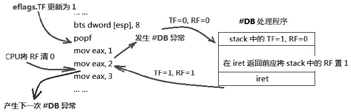
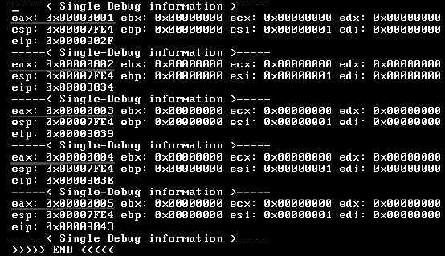

<!-- @import "[TOC]" {cmd="toc" depthFrom=1 depthTo=6 orderedList=false} -->

<!-- code_chunk_output -->


<!-- /code_chunk_output -->

显然 **eflags.RF 标志**与 **eflags.TF 标志**是配合**一起使用**的, 当 **TF 标志被置位**时, 就代表**开启了 single-debug(单步调试**)功能, 处理器将**进入 single-debug 状态**.

>什么时候开始进入 `single-debug`?

答案是: 当**TF 标志被置位**, **执行完下一条指令(！！！**)后, 处理器**进入\#DB 处理**. 这是因为**single\-debug**属于**trap 类型的\#DB 异常**. 看看下面的指令序列.

```assembly
; 开启 single debug 功能
      pushfd
      bts dword [esp], 8            ;eflags.TF=1
      popfd                         ;更新 eflags 寄存器
      mov eax, 1                    ;test 1
      mov eax, 2                    ;test 2
      mov eax, 3                    ;test 3
      mov eax, 4                    ;test 4
      mov eax, 5                    ;test 5
```

**popfd**指令执行完后, 将**更新 TF 标志为 1**, 那么应该是**在 test 1 之前还是之后呢**?答案是**test 1 之后(test 2 之前**), 是在**TF 被置位后**的**下一条指令执行完后(！！！**)产生`#DB`异常.

处理器在**进入\#DB 异常处理程序之前**, 会将**TF 标志清 0**以防止在**中断处理程序内发生 single\-deubg**, 这是显而易见的事情, **RF 标志也会被清 0**. 在进入中断处理程序前, **NT 和 VM 标志都会得到清 0**.

那么, 在压入单步调试\#DB 处理程序**stack 内**的**eflags 寄存器**中**TF 是原来的值(即为 1**), **RF 标志被清 0**.



看看上图: 当**popf 指令执行完毕后**, **TF 被置 1**, **第 1 条 mov 指令执行完毕**, **产生\#DB 异常**, CPU**进入\#DB 处理程序后清 TF 和 RF 标志**, 而**在\#DB 处理程序里**, 在**iret 指令返回前**, 应该**将 stack 中的 RF 标志置为 1(stack 中的！！！**), 以确保**返回到被中断的指令时能顺利执行**. **iret 指令**将 pop 回 stack 中**原来的 eflags 值**.

当**第 2 条 mov 指令执行完毕后**, CPU 将**清 RF 标志为 0**, 处理器重新**转入到\#DB 处理程序**中执行. 除非 TF 标志被清 0, 否则重复上一流程.

由于**引发\#DB 异常**的**不止 single\-debug(单步调试**)这一途径. \#DB 异常可以是**Fault 类型**或是**Trap 类型**, 因此, **在\#DB 异常处理程序**中有责任去**确保返回被中断的执行能够得到正常执行**. 通过**设置 stack 中的 eflags**映像中的**RF 为 1**, 让**iret 返回前更新 eflags 寄存器**.

处理器会在**每一条指令执行完毕后**将**RF 标志清 0**, RF 标志的值基本上恒为 0.

>实验 5-3: 实现一个 single\-debug 例子

正如前面所列代码, 我们是这样开启和测试 TF、RF 以及\#DB 处理程序的.

代码清单 5-4(topic05\ex5-3\protected.asm):

```assembly
; 开启 single debug 功能
        pushfd
        bts dword [esp], 8        ;eflags.TF=1
        popfd                     ;更新 eflags 寄存器
        mov eax, 1                ;test 1
        mov eax, 2                ;test 2
        mov eax, 3                ;test 3
        mov eax, 4                ;test 4
        mov eax, 5                ;test 5
```

我们测试了这 5 条 mov 指令产生 single\-debug 的情况, 为了方便观察演示, 这 5 条 mov 指令只是给 eax 赋一个序号. 我们需要**实现自己的\#DB 处理程序**, 完整的源代码在 topic05\ex5-3\protected.asm 里.

```assembly
DB_HANDLER_VECTOR               equ     1

;; 设置 #DB handler
        mov esi, DB_HANDLER_VECTOR
        mov edi, DB_handler
        call set_interrupt_handler
```

Intel 规定\#DB 固定使用向量号 1, 属于 Trap 或 Fault, 任何代码或数据引用或 INT 1 指令触发.

在这里, **触发过程是处理器自动触发的**, 自动到 IDT 里面**查找向量号是 1 的中断描述符**, 从而得到中断处理程序, 但是**中断处理程序得自己实现**, 上面就是调用 set\_interrupt\_handler 去设置中断描述符的, esi 和 edi 都是参数, 分别是中断向量号和中断处理程序入口.



上面是实验 5-3 的运行结果, **每进入\#DB 处理程序**一次就**打印相关的信息**. 请留意画线**标注的 eax 寄存器的值**, 这正是我们给 eax 寄存器进行 mov 操作后的值. 说明在每执行一条 mov 指令后产生了\#DB 异常, 这就是单步调试的结果. 而 eip 是这些 mov 指令执行状态的当前值. 其他的寄存器值都是不变的.

实际上, 在这个例子里, **RF 标志置不置位对结果没影响**, 那是因为**由 single\-debug 引起**的\#DB 属于**trap 类型的异常**！它会返回到被中断指令的下一条指令.

然而不要以这个例子为准而认为不需要将 RF 置位, 由其他中断源产生的\#DB 异常可能是 fault 类型的, fault 类型的异常会返回中断指令再尝试重新执行.