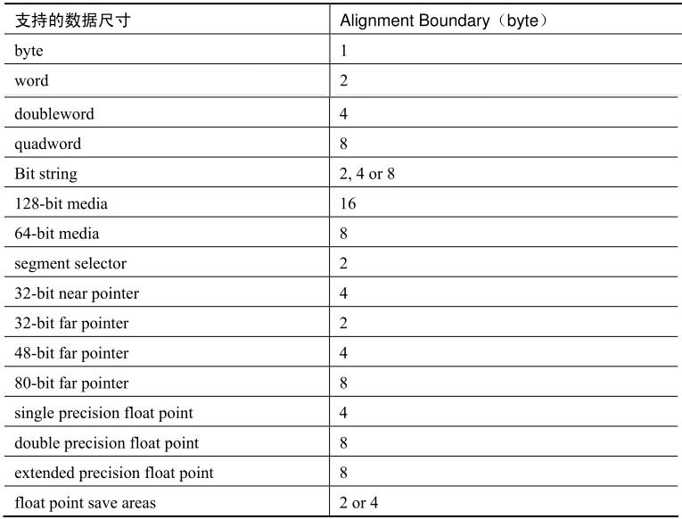
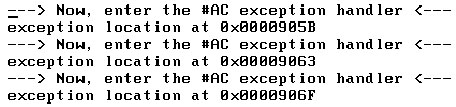

<!-- @import "[TOC]" {cmd="toc" depthFrom=1 depthTo=6 orderedList=false} -->

<!-- code_chunk_output -->


<!-- /code_chunk_output -->

eflags 中的 AC 标志是指 Alignment Check(地址中的对齐检查), 只有当同时开启 CR0.AM 和 eflags.AC 标志位时处理器才支持这项功能.

我们从下面的表格来看, 什么情况下才是有效的 alignment 粒度.



当对上述的某一类数据类型的访问违反了它的粒度时, 会产生#AC 异常.

```assembly
mov ax, WORD [0x10003]               ;  跨 WORD 类型边界
mov eax, DWORD [0x10005]             ;  跨 DWORD 类型边界
mov rax, QWORD [0x10007]             ;  跨 QWORD 类型边界
mov esi, 0x10006
lodsd                                     ;  跨 bit string 类型边界
```

上面几种情况下, 都属于 non-alignmnet 行为. 只有在权限级别 3 下的 non-alignmnet 行为才会产生#AC 异常, 在 0、1 及 2 级下不会产生#AC 异常.

>实验 5-4: 测试 Alignment Check 功能

\#AC 异常属于 fault 类型, #AC 处理程序会返回到发生错误的指令继续执行, 因此在我们的#AC 处理程序中必须要修正这个错误:

代码清单 5-5(topic05\ex5-4\protected.asm):

```assembly
; -----------------------------------------------
;  AC_handler(): #AC handler
; -----------------------------------------------
AC_handler:
      jmp do_AC_handler
ac_msg1                db '---> Now, enter the #AC exception handler <---', 10
ac_msg2                db 'exception location at 0x'
ac_location        dq 0, 0
do_AC_handler:
      pusha
      mov esi, [esp+4+4*8]
      mov edi, ac_location
      call get_dword_hex_string
      mov esi, ac_msg1
      call puts
      call println
; ;  现在 disable AC 功能
      btr DWORD [esp+12+4*8], 18               ;  清 elfags image 中的 AC 标志
      popa
      add esp, 4                                    ;  忽略 error code
      iret
```

\#AC 处理程序里在 iret 返回前, 将 stack 中的 eflags.AC 清为 0, iret 执行完后, eflags.AC 被清 0. 在 ring0 代码里先将 CR0.AM 置位, 在 ring3 代码里, 再将 eflags.AC 置位.

代码清单 5-6(topic05\ex5-4\protected.asm):

```assembly
;  开启 eflags.AC 标志
      pushf
      bts DWORD [esp], 18
      mov ebx, [esp]
      popf
;  test 1
      mov ax, WORD [0x10003]               ;  跨 WORD 类型边界
      push ebx
      popf
;  test 2
      mov eax, DWORD [0x10005]             ;  跨 DWORD 类型边界
      push ebx
      popf
;  teset 3
      mov esi, 0x10006                       ;  跨 string 类型边界
      lodsd
```

由于在#AC 处理程序会将 AC 标志清 0, 因此, 每做一次测试前, 再重新开启 AC 标志位. 这个实验的完整源代码在 topic05\ex5-4\目录下, 运行的结果如下.



结果显示, 共产生了 3 次#AC 异常, 就是我们所做的 3 个测试.