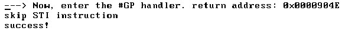

<!-- @import "[TOC]" {cmd="toc" depthFrom=1 depthTo=6 orderedList=false} -->

<!-- code_chunk_output -->


<!-- /code_chunk_output -->

处理器初始化后, eflags 的值为 00000002H, Bit 1 为 1, 其他位为 0, Bit 1 是保留位, 其值固定为 1. 某些标志位可以使用专门指令进行设置, 对于 CF 标志, 可以使用 STC 指令置位, CLC 指令清位, CMC 指令对 CF 标志进行取反. 对于 DF 标志, 可以使用 STD 指令置位, CLD 指令清位.

**STI 指令**可以对 **IF 标志**进行**置位**, CLI 指令对 IF 标志进行清位, 它需要足够的权限来修改 IF 标志位, 这个足够的权限是: `CPL <= IOPL`.

可是这和 popfd 指令修改 IF 标志位不同, 当不够权限时(`CPL > IOPL`), popfd 指令修改 IF 标志不会产生#GP 异常, 而使用 STI 指令时会产生 #GP 异常.

>实验 5-5: 测试 sti 指令

分别使用 popfd 指令和 sti 指令在权限不足的情况下进行测试, 下面是实验的代码(在 3 级权限下).

代码清单 5-7(topic05\ex5-5\protected.asm):

```assembly
;; 测试 popfd 指令
      pushfd
      bts DWORD [esp], 9
      popfd
;; 测试 sti 指令
      sti
      mov esi, msg7
      call puts         ;打印成功信息
      call println;
```

而在我们的#GP 处理程序里, 我们需要修正这个错误, 要么将 IOPL 权限降低, 要么不继续执行引发错误的指令.

代码清单 5-8(topic05\ex5-5\protected.asm):

```assembly
mov eax, [esp]
cmp BYTE [eax], 0xfb    ;检查是否因为 sti 指令而产生#GP 异常
jne do_GP_handler_done
inc eax                 ;如果是, 跳过产生#GP 异常的 sti 指令, 执行下一条指令
mov [esp], eax
mov esi, gp_msg3
call puts
do_GP_handler_done:
      iret
```

对 OS 来说降低 IOPL 权限似乎是一个比较危险的行为, 示例中的#AC 处理程序如果检测到发生 #GP 异常是由 STI 指令产生的(sti 指令的 opcode 码为 FB), 那么就跳过 STI 指令继续向下执行. 由于 #GP 异常属于 fault 类型, 因此必须修正这个错误, 否则将一直在 #GP 处理程序里转不出来.



实验的结果表明: 在 STI 指令里发生了 #GP 处理程序, 当跳过 STI 指令后得以继续往下执行.

当有下面的指令序列:

```assembly
sti         ;在过程返回前开启 IF 标志
ret
```

在某个过程里, sti 紧接着 ret 指令, sti 指令执行后, 如果在 ret 指令返回前发生了外部中断, 这个外部中断将被暂缓响应. ret **指令返回结束后**, 外部中断才被响应.

```assembly
sti          ;第 1 次开启 IF 标志
sti          ;第 2 次开启 IF 标志
ret
```

Intel 明确规定, 在上面 2 次开启 IF 标志的序列中, ret 返回前外部中断是可以被响应的.