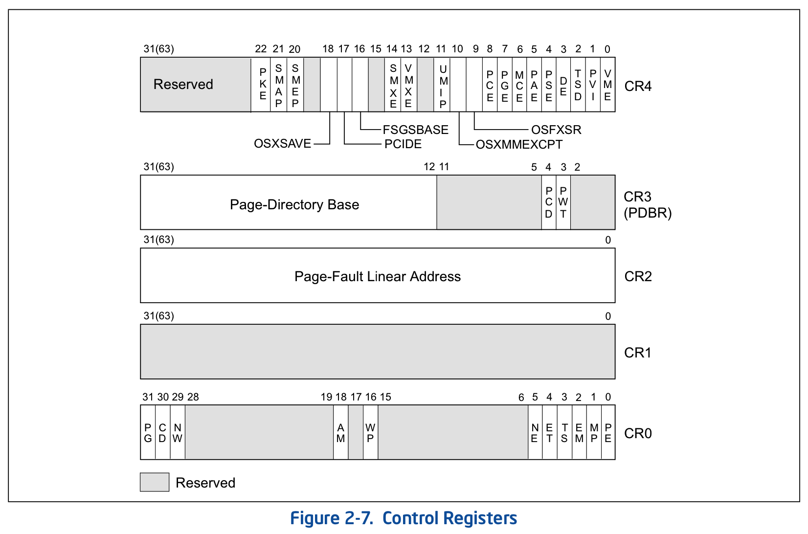
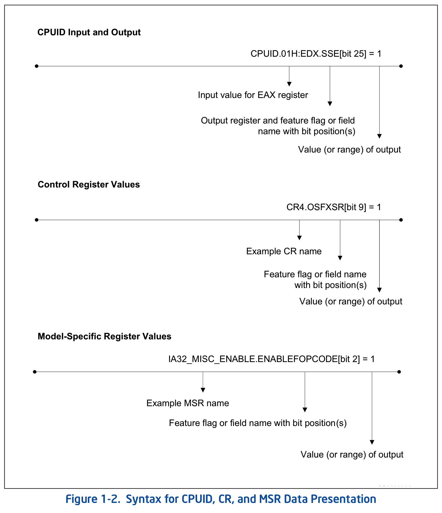

在 x64 上 control register(控制寄存器)被扩展为**64 位**, 有**CR0~CR15**共**16 个寄存器**, 可是在**整个体系**的使用中, 只使用了其中的**CR0**、**CR2**、**CR3**、**CR4**, 以及**CR8 寄存器**, 其他都是**被保留**的.

它们在**64 位模式**下使用**64 位**的宽度, 在其他模式下依然是**32 位宽度**, 下面是这些寄存器的**结构图**(来自 Intel 手册).

**CR0**与**CR4**结合起来对处理器提供了**根本的控制**, 比如处理器的**工作模式**和一些模式中使用的**特色功能**.

**CR2** 和 **CR3** 被使用在**保护模式**的**页管理机制**中.

- **CR2** 保存着访内存时引发 `#PF` **异常**的**线性地址值**(典型的如: 当访问一个页时, 它不在内存中(未映射)或者没有对它进行访问的权限而引发 `#PF` 异常).

- **CR3** 提供整个**页转换结构表**的**基地址**, 这个基地址是**物理地址**.

详细见: Volume 3: 2.5 Control Registers

下面是控制寄存器的语法描述

