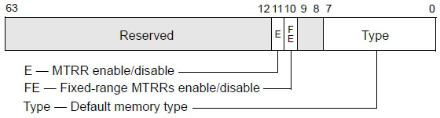

<!-- @import "[TOC]" {cmd="toc" depthFrom=1 depthTo=6 orderedList=false} -->

<!-- code_chunk_output -->

- [1. 概述](#1-概述)
- [2. Fixed-range 区域的映射](#2-fixed-range-区域的映射)
- [3. MTRR 的功能寄存器](#3-mtrr-的功能寄存器)
  - [3.1. Variable 区域的定义](#31-variable-区域的定义)

<!-- /code_chunk_output -->

# 1. 概述

先关注**MTRR(Memory Type Range Register**), MTRR 的作用是**将 memory 物理地址划分某些区域**, 并且可以**为这些区域定义不同的 memory 类型**, 如下表所示.


这些值的作用是在 MTRR 里为**range**定义相关的**memory 类型**.

>memory 中可以划分哪些区域?

可以划分为**3 种区域**: **fixed(固定的**), **variable(可变的**)以及**default(默认的**), 当 memory 中**不划分 fixed 和 variable 区域**时, 这时候**memory 就是 default 的区域**:


如上所示, 在整个物理 memory 中可以划分 3 种区域形式, **MAXPHYADDR**的值提供了**最高的物理 memory 数量**, 它由 CPUID.EAX=80000008H.EAX[7: 0]中获得, 这个值最高是 52 位, 一般要么是 36 要么是 40 位.

上面是 Intel 处理器上的结构, 在 AMD 的机器上这个最大的区域空间是 52 位.

在笔者的测试结果中显示, 在 AMD 的机器上是 0000FFFF_FFFFFFFFH(即使用 CPUID.EAX=80000008H 返回的最大物理地址结果值不是 52 位)而在 Intel 的机器上是 MAXPHYADDR 值(注: 这是在笔者的有限条件测试下的结论. 如果您有不同的测试结果, 确认无误后就以您的结论为准), 在 AMD 中最高实现 8 个 variable-rang 区域.

# 2. Fixed-range 区域的映射

Fixed 区域只能定义在 memory 中的最低 1M 空间(从 00000H 到 FFFFFH)里, 由 11 个 Fixed 映射的 MTRR 来映射, 如下表所示.


每个寄存器固定映射 8 个区域, 那么共有 88 个 Fixed-range 可以映射. 以 IA32_MTRR_FIX64_00000 寄存器为例看看是如何映射的, 如下图所示.


64 位的寄存器划分为 8 个域, 每个域固定对应 1 个 Fixed-range 区域. 每个域 8 位宽, 可以为这些 Fixed-range 内存区域定义相关的 memory 类型(这个 memory 类型值就是前面表格中的编码值). 例如定义 06H 是 WriteBack(WB)类型.

>实验 7-1: 测试 Fix64K 区域的 memory 类型

这个实验只是简单地输出 Fix64K 区域里的 8 个 range 的类型, 完整的源码在 topic07\ex-1\目录下, 请读者自行阅读, 下面是测试的结果.


00000~7FFFF 的 512K 区域里 memory 的类型都是 WriteBack(WB), 这些 memory 类型在 BIOS 里已经设置好了. 当然, 我们可以改写这些 memory 的类型, 我们再改一改实验的源代码, 将第 1 个 64K 区域改为 Uncacheable 类型, 显示的结果如下.


现在我们已经将第 1 个 64K 的区域成功改为 Uncacheable 类型.

代码清单 7-1(topic07\ex7-1\protected.asm):

```assembly
mov ecx, 250H
rdmsr
mov edi, edx
mov esi, eax
mov ebx, eax
call dump_fixed64K_range
mov bl, 00h                                        ;  将 byte 0 改为 Uncacheable 类型
mov eax, ebx
wrmsr                                               ;  写回 IA32_MTRR_FIX64K_00000 寄存器
call println
rdmsr                                               ;  再重新读出来
mov esi, eax
mov ebx, eax
call dump_fixed64K_range                       ;  打印信息
```

代码里, 分两次打印 Fixed-range 区域的内存类型, 第 2 次将第 1 个 64K 区域的内存类型改为 00h 值(也就是 Uncacheable 类型).

# 3. MTRR 的功能寄存器

在使用 MTRR 前应开启 MTRR 功能相应的 Enable 位. 下面的这个 IA32_MTRRCAP 寄存器将指示处理器支持哪些 MTRR 功能, 如下所示.


IA32\_MTRRCAP 寄存器(地址是 FEH)是只读寄存器, VCNT 域(bit 7 到 bit 0)指示可以设置和使用的 Variable-range 寄存器数量. 当前的 Intel 实现了最高 10 个 variablerange 区域.

每个处理器家族实现会不一样, 在笔者的机器上属于 06_25H 家族(Westmere 架构)已实现了 10 对 PHYSBASE/PHYSMASK 寄存器, 表示可以完整支持 10 个 variable-range.

bit 8, bit 10 和 bit 11 分别是 Fixed-range, WC 内存类型以及 SMRR 功能的支持位, 当这些位是 1 的时候这些功能才获得支持.



bit 10 是 Fixed-range 的 Enable 位, 置位时将开启 Fixed 区域的定义(这需要 IA32_MTRRCAP 寄存器的 FIX 位为 1 时才可使用).

bit 11 是 MTRR 的 Enable 位. 需要 CPUID.01: EDX[12]返回 1 时才支持, 否则整个 MTRR 系列寄存器全都不可用.

Type 域(bit 7 到 bit 0)定义 Default 区域的 memory 类型. Intel 推荐这个 Type 设置为 00H(Uncacheable)类型.

## 3.1. Variable 区域的定义

目前有多少个 Variable-range?

这个数量从前面介绍的 IA32_MTRRCAP 寄存器的 VCNT 域获得, 当 VCNT 的值设置为 10(1010B)时, 目前可使用在 variable-range 定义的寄存器有 10 对.

>每个 Variable-range 区域对应着一对 PHYSBASE/PHYSMASK 寄存器.

这 10 对寄存器是:

1) `IA32_MTRR_PHYSBASE0` 到 `IA32_MTRR_PHYSBASE9`.

2) `IA32_MTRR_PHYSMASK0` 到 `IA32_MTRR_PHYSMASK9`.

每对 PHYSBASE/PHYSMASK 寄存器配合描述一个 `variable-range` 区域.


如上图所示: IA32\_MTRR\_PHYSBASE 寄存器的 Bit7~Bit0 是 Type 域, 用来设置 Variable\-range 的 memory 类型(00H, 01H, 04H, 05H 以及 06H).

PhysBase 域提供 Variable\-range 的物理基地址, 这个 PhysBase 是 4K 边界对齐的, 低 12 位为 0, 因此 Variable\-range 区域最低的地址是 0(即: PhysBase=0), 最高的地址要依据 MAXPHYADDR 的值, 当 MAXPHYADDR 的值为 40 位时, 那么就是物理基地址的 39: 12 由 PhysBase 提供.


IA32\_MTRR\_PHYSMASK 寄存器的 PhysMask 域(MAXPHYADDR-1: 12)给 IA32\_MTRR\_PHYSBASE 寄存器的 PhysBase 域提供一个范围的 mask 值, 这个值用来确定 Variable\-range 区域的范围.

这个 PhysMask 值必须满足的条件是:

```c
PhysBase & PhysMask=Variable-range & PhysMask
```

用这种方式来确定 variable\-range 的范围比较特别, 是什么意思呢?例如区域是 200000H 到 3FFFFFH(2M 空间), 那么这段区域内的所有值都必须满足:

```assembly
200000H & PhysMask=3FFFFFH & PhysMask   ;式子 1: 最大值 AND PhysMask
200000H & PhysMask=300000H & PhysMask   ;式子 2: 其中值 AND PhysMask
```

PhysMask 的值要满足式子 1 和式子 2 的等式, 根据这个式子求出 PhysMask 值.

PhysMask 值的计算方式是:

```assembly
1) 3FFFFFH – 200000H=1FFFFFH         ;range 的最大值减最小值
2) FFFFFFFFFH – 1FFFFFH=FFFE00000H   ;MAXPHYADDR-它们的差
```

算出的结果值 FFFE00000H 就是在 MAXPHYADDR 为 36 位情况下的 PhysMask 值, 这个值可以满足:

```assembly
1) 200000H & FFFE00000H=3FFFFFH & FFFE00000H
2) 200000H & FFFE00000H=300000H & FFFE00000H
```

这两个式子都是成立的, 说明这个 PhysMask 是正确的. 那么, PHYSBASE 和 PHYSMASK 寄存器可以设置为:

```assembly
IA32_MTRR_PHYSBASE: 000200006H             ;  Type=06H(WB)
IA32_MTRR_PHYSMASK: FFFE00800H             ;  Valid=1, 是有效的
```

IA32\_MTRR\_PHYSMASK 寄存器的 bit 11 位是 Valid 位, 这个位需要置 1, 否则说明这个 Variable-range 是无效的.

如果 MAXPHYADDR 是 40 位, 则值增加 4 位就可以了, PhysMask 值变成 FFFFE00000H(40 位), 用上面的计算方法再来求一个范围: 8FF000H–CFFFFFH(大于 4M 的空间).

```assembly
1) CFFFFF – 8FF000H= 400FFFH
2) FFFFFFFFFH – 400FFFH=FFFBFF000H
```

验证一下: 8FF000H&FFFBFF000H=8FF000H 以及 CFFF00H&FFFBFF000H=8FF000H. 这个求出来的值是正确的.

>实验 7-2: 枚举出所有的 Variable-range 区域及类型

下面是在笔者的机器测试的结果.


这个结果只使用了 1 对 HYSBASE/PHYSMASK 寄存器, 只有 IA32\_MTRR\_PHYSBA SE0 和 IA32\_MTRR\_PHYSMASK0 里的设置是有效的, 也就是说只设置了 1 个 variablerange 区域, 从 0 到 0FFFFFFFH 的范围(256M 空间). 注意: 这个实验是在 VMware 中运行的结果, VMware 里只设置了 256MB 的内存, 因此只映射了 256MB 的空间.

当将 VMware 的内存调到 512MB 的时候, 下面的运行结果起了变化.


第 1 个映射的区域变成了 0H 到 1FFFFFFFH(512MB 的空间). 那么我们推断在 BIOS 中只是简单地将所有实际的内存一次性映射, memory 是 Uncacheable 类型.

接下来, 我们改一改实验的代码, 改动原来的映射方式, 下面是运行结果.


结果显示, 我们已经改动了 3 个区域(作为演示并没有全部改完), 我们改动的 3 个映射区域是: 0H~1FFFFFFH, 2000000H~2FFFFFFH, 以及 3000000H~3FFFFFFH, 内存类型全都是 UC 类型.

代码清单 7-2(topic07\ex7-2\protected.asm):

```assembly
; ;  打印 variable-rang 信息
      call enumerate_variable_rang
      mov esi, msg9
      call puts
; ;  设置 variable-rang
      mov esi, 0
      mov edi, 0
      mov eax, 1FFFFFFH
      mov edx, 0
      push DWORD 0                                   ;  设 range 0
      push DWORD 0
      call set_variable_rang
      add esp, 8
      mov  esi, 2000000H
      mov edi, 0
      mov eax, 2FFFFFFH
      mov edx, 0
      push DWORD 1                                 ;  设 range 1
      push DWORD 0
      call set_variable_rang
      add esp, 8
      mov  esi, 3000000H
      mov edi, 0
      mov eax, 3FFFFFFH
      mov edx, 0
      push DWORD 2                                   ;  设 range 2
      push DWORD 0
      call set_variable_rang
      add esp, 8
; ;  打印 variable-rang 信息
      call enumerate_variable_rang
```

上面是主程序的代码, 核心的代码是 set\_variable\_rang()和 enumerate\_variable\_rang()这两个函数, 代码比较长, 这里不再列出, 请读者自行阅读, 完整的源代码在 topic07\ex7\-2\protected.asm 里. 里面使用到的 subtract64()和 addition64()等子函数在 lib\lib32.asm 库文件里实现.

当不对内存区域进行任何的划分映射时, 就是 default 的区域, memory type 在 IA32\_MTRR\_DEF\_TYPE 寄存器里设置(见前面的图).

>注意: 在 AMD 机器上的测试结果或许有不同, 那是因为: 正如前面所说, 区域的最高地址是 52 位, 并不是 MAXPHYADDR 值, 而导致在计算范围的时候出现了偏差. 如果您的结果有不同, 请确认是否属于这种情况.

假如同一个区域被多个 PHYSBASE/PHYSMASK 寄存器映射, Intel 有明确的说明, 内存类型的优先次序是: UC, WT, 然后是 Default. 也就是说当它们的类型不一样的时候会按照从 UC 到 WT 的顺序, 如果没有这两个类型, 则按照 Default 类型.