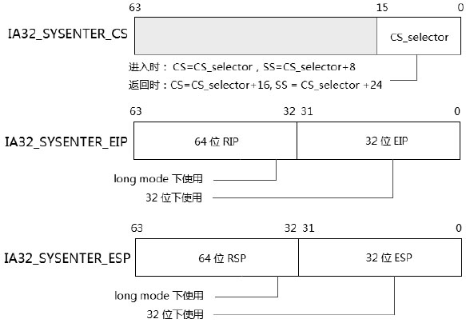
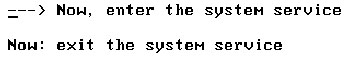
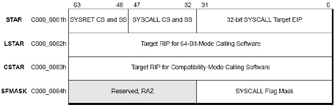
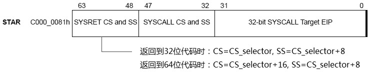
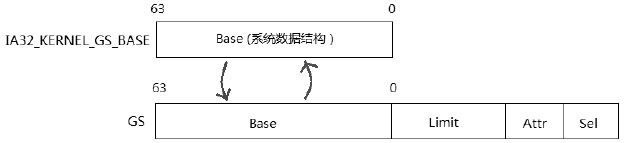

<!-- @import "[TOC]" {cmd="toc" depthFrom=1 depthTo=6 orderedList=false} -->

<!-- code_chunk_output -->

- [1. 概述](#1-概述)
- [2. 支持 sysenter/sysexit 指令的 MSR](#2-支持-sysentersysexit-指令的-msr)
- [3. 支持 syscall/sysret 指令的 MSR](#3-支持-syscallsysret-指令的-msr)
- [4. 支持 swapgs 指令的 MSR](#4-支持-swapgs-指令的-msr)
- [5. 支持 monitor/mwait 指令的 MSR](#5-支持-monitormwait-指令的-msr)

<!-- /code_chunk_output -->

# 1. 概述

现在再来看看 MSR 提供了哪些特殊指令的支持服务, 这类特殊指令有:

1) **sysenter/sysexit**指令

2) **syscall/sysret**指令

3) **swapgs**指令

4) **monitor/mwait**指令

5) 全部的**virtual machine 类指令**

还有 rep movs(串指令), 以及 debug extensions 相关的指令也受到 MSR 的控制. 实际上可能会远不止这些, 最好参考 MSR 列表说明.

# 2. 支持 sysenter/sysexit 指令的 MSR

有 **3 个 MSR**对它们提供支持: **IA32\_SYSENTER\_CS**, **IA32\_SYSENTER\_ESP**, 以及**IA32\_SYSENTER\_EIP**寄存器, 它们的地址分别在: **174H**, **175H**, 以及**176H**. 参见下图. **每个寄存器都是 64 位**.



>从上面可见, **sysenter 或 sysexit 其实就是控制转移**, 类似于**调用门**, 将**原有的 IP, CS, SS, SP 有保存(没有 eflags！！！**)即可, 又因为是控制转移, 所以其他寄存器变化是正常的, 还是属于同一 task 里面的, **相当于程序变量变化**, 保存其他寄存器值的是任务切换.

sysenter/sysexit 在**实模式下是无效**的.

* 在**Intel**的机器上**sysenter/sysexit**指令可以在**long mode**下使用.

* 而在**AMD**上 sysenter/sysexit 指令在**long mode 是无效**的, 需要注意这些区别.

这里的描述以 Intel 的平台为主.

在**32 位**下, IA32\_SYSENTER\_EIP 和 IA32\_SYSENTER\_ESP 的**低 32 位**放入**0 级权限的目标代码入口点和 stack 指针(0 级！！！**), 在 long mode 下可以放入**64 位**的值. 然而**返回时(！！！**)需要在**EDX 和 ECX 寄存器**放入**返回点的入口 IP 值和 stack 指针 SP 值(！！！**). 因此, 在**使用 sysenter 指令进入前(！！！**), 需要为**返回代码**对**ECX 和 EDX 寄存器进行预先的设置**.

注意**IA32\_SYSENTER\_CS 寄存器的使用方法(！！！**), 如上图所标注的, **所有**需要的**selector 都从这个寄存器获得(！！！**). 下面这段简单的代码清单作为实验 7-3(topic07\ex7-3\目录下).

>实验 7-3: 测试 sysenter/sysexit 指令

代码清单 7-3(topic07\ex7-3\protected.asm):

```assembly
;; 配置 sysenter/sysexit 使用环境
      xor edx, edx
      mov eax, KERNEL_CS            ;cs 值
      mov ecx, IA32_SYSENTER_CS
      wrmsr                         ;写 IA32_SYSENTER_CS
      mov eax, sys_service
      mov ecx, IA32_SYSENTER_EIP
      wrmsr                         ;写 IA32_SYSENTER_EIP
      mov eax, 1FFF0h
      mov ecx, IA32_SYSENTER_ESP
      wrmsr                         ;写 IA32_SYSENTER_ESP
;; 设置返回指针
      mov ecx, esp
      mov edx, next
; 执行快速切入
      sysenter
next:
      mov esi, msg10
      call puts
```

上面的代码介绍了 sysenter/sysexit 的基本使用方法, 运行结果如下.



# 3. 支持 syscall/sysret 指令的 MSR

**syscall 和 sysret**是由**AMD 首先引入**的, 能使用在 long mode 环境下, 可以在 AMD 的机器上**代替 sysenter/sysexit 指令**.

**Intel 不支持 syscall/sysret 在 32 位环境(！！！**)下使用.

这里的描述**以 AMD 为主**.



注意在**Intel 的 MSR**里, **没有 IA32\_CSTAR 寄存器**(因为**不支持在非 64 位环境下使用！！！**), 只有**IA32\_STAR、IA32\_LSTAR 及 IA32\_SFMASK 寄存器**, 如图所示,

- **STAR\[63: 48**]是**sysret 指令**使用的**CS 和 SS**,
- **STAR\[47: 32**]是**syscall 指令使用的 CS 和 SS**值,
- **STAR 寄存器低 32 位**用在**32 位环境**的**入口点 EIP**.
- **在 64 位环境**下应该**使用 LSTAR 寄存器来装入口点 RIP**
- 而在**兼容模式**下应该使用**CSTAR 寄存器**来存放**目标代码的入口点 RIP**(64 位的入口点).



需要注意的是**sysret 指令**所需要的**selector 有些微妙**之处(如上图所标示的), 那是由于 syscall/sysret 可以在 32 位和 64 位环境下使用. 当一个 32 位的代码运行在 compaitility 模式下调用了 64 位的系统服务代码, 那么必须从 64 位的系统服务例程返回到 32 位的代码下, 所以产生了这样的需求. 有关这些问题的详情将在后续的话题中探讨.

相比 sysenter 和 sysexit, 多了一个 SFMASK 寄存器. **SFMASK 寄存器**被使用在**对 rflags 寄存器可以屏蔽某些标志位**, 当**syscall 进入目标代码**后, **SFMASK 寄存器**的 bit**被置位**则相**对应的 rflags 寄存器标志位被清 0**, 例如, SFMASK[9]=1, 则 rflags 的 IF 标志(bit 9)被清 0, 将关闭中断标志.

另一个涉及的 MSR 是 **IA32_EFER(AMD 上为 EFER**), 详情请参考 6.5 节. **syscall/sysret**需要**在 IA32\_EFER 中开启(！！！**), **软件**可以在**CPUID.EAX=80000001H leaf**里返回的**EDX[11]位查询 syscall 指令是否得到支持**.

# 4. 支持 swapgs 指令的 MSR

**swapgs 指令**涉及两个相关的 MSR: **IA32\_KERNEL\_GS\_BASE**与**IA32\_GS\_BASE 寄存器**.

**IA32\_GS\_BASE 寄存器**用来设置**GS 寄存器**的**64 位 base 地址**, 在**64 位**环境下, 如果需要对**GS 寄存器**设置**64 位的 base 地址**, **不能通过加载 segment descriptor 的形式**(这样**只能加载 32 位 base 值！！！**), 需要**通过设置 IA32\_GS\_BASE 寄存器**来达到目的.

**段寄存器的 base 域**在**64 位**模式下被扩展为**64 位**, 对于**CS、ES、SS 和 DS(！！！**)寄存器来说这个 64 位的基值没什么意义. 在**64 位模式**下, 这些**段的基值都被强制为 0 值(！！！一旦往这几个段寄存器加载 selector,  发现是这几个寄存器, 忽略段描述符的 base 信息, 直接加载 base 位 0！！！**).

**64 位的段基值**对于**FS 和 GS 寄存器**来说才有意义, **FS 和 GS 寄存器(！！！**)可以由**软件设置非 0 的 64 位值**.

**使用代码段或数据段描述符(！！！这两种描述符在 64 位下还是 8 字节大小,  base 还是 32 位！！！**)的加载方法, 只能加载一个**32 位的 base 值**, 在 x64 体系中, 新增了**两个 MSR 寄存器**: **IA32\_FS\_BASE**和**IA32\_GS\_BASE**. 它们分别映射到**FS.base**和**GS.base**.

**IA32\_KERNEL\_GS\_BASE 寄存器**实际上与**IA32\_GS\_BASE 寄存器**有异曲同工之处, 可是**IA32\_KERNEL\_GS\_BASE 寄存器**是**为 swapgs 指令所准备**的.



**swapgs 指令**的目的是**交换 GS.Base**与**IA32\_KERNEL\_GS\_BASE**的值, 如上图所示, 这些值是**64 位的**, 因此**swapgs 只能在 64 位下使用(！！！**), 并且需要**0 级的权限**. **GS.base 部分是隐藏的**, 只能被处理器**内部使用(！！！所以提供了 swapgs 指令！！！**). 当通过 IA32\_GS\_BASE 寄存器预先设置好 GS.base 值, 在 system service 例程里就可以用 swapgs 指令交换它们的 base 值.

实际上, 对**系统服务例程**来说**GS.base 原来的值是什么并不重要**, swapgs 负责将 IA32\_KERNEL\_GS\_BASE 值装入到 GS.base 中.

因为在完成系统服务例程后, 必须使用 swapgs 指令再次交换回原来的值. 在服务例程里 GS.base 原来的值处于被忽略的状况.

```assembly
system_servec:
      swapgs                            ; 将 IA32_KERNEL_GS_BASE 值装入到 GS.base 中
      mov rbx,  gs: [system_table+8]    ;获得系统数据结构中的数据
      ... ...
      swapgs                            ;将 GS.base 原来的值装回到 GS.base 中
      ret
```

在 system 服务例程入口里, 可以像上面的示例一样使用 swapgs 指令. 有意思的是, syscall 指令在进入时并没有提供 kernel 级别的 stack 指针, 可以通过**这种方式**来获得**kernel 的 stack 指针**(将**stack 指针存放在系统数据结构的表格中**).

# 5. 支持 monitor/mwait 指令的 MSR

在 4.8 节有关于 monitor/mwait 指令的部分探讨, 它们涉及的 MSR 有: IA32_MISC_ENABLE 寄存器将开启 monitor/mwait 指令的支持位.

程序中检测是否支持 monitor/mwait 指令通过 CPUID.01H leaf 里的 ECX[3]查询, 可是这个 ECX[3]位是由 IA32\_MISC\_ENABLE[18]位的 monitor enable 决定的. 它反映在 CPUID.01H: ECX[3].MONITOR 标志位上.

因此, 可以通过 IA32\_MISC\_ENABLE[18]位关闭 monitor/mwait 指令, 当 IA32\_MISC\_ENABLE[18]=0 时, 由 CPUID.01H leaf 查询返回的 ECX[3]被清 0(MONITOR/MWAIT 不可用).

另一个相关的寄存器是 IA32\_MONITOR\_FILTER\_LINE\_SIZE, 用来设置监视地址范围, 默认的情况下 LINE\_SIZE 是 64 字节. IA32\_MONITOR\_FILTER\_FILE\_SIZE 寄存器的用法是写入两次值, 写入较小的值被作为最小的 line size, 写入较大的值被作为最大的 line size.

>实验 7-4: 对 MONITOR/MWAIT 指令进行 disable 看看结果如何?接下来尝试修改监视的 line size, 查看结果如何

注意: 这个实验必须在真机环境上测试, 如果在 VMware 虚拟机上测试结果是不对的(VMware 进行了一些屏蔽).

代码清单 7-4(topic07\ex7-4\protected.asm):

```assembly
;; 打印原来的值
      call dump_CPUID_leaf_01_ecx
      call println
      call dump_CPUID_leaf_05
      call println
      mov esi, msg11
      call puts
;; 现在更改 monitor/mwait enable 位, 以及更改 monitor line size
;         mov ecx, IA32_MISC_ENABLE
;         rdmsr
;         btc eax, 18                                          ;  将 monitor/mwait 指令 disable
;         wrmsr
; ;  注意当 MONITOR/MWAIT 指令被 disable 时, IA32_MONITOR_FILTER_LINE_SIZE 寄存器是不可用的
      mov ecx, IA32_MONITOR_FILTER_LINE_SIZE
      xor edx, edx
      mov eax, 2000H                                        ;  设置最大监视 line size 为 2000H
      wrmsr
      mov eax, 1000H                                        ;  设置最小监视 line size 为 1000H
      wrmsr
; ;  打印新的值
      call dump_CPUID_leaf_01_ecx
      call println
      call dump_CPUID_leaf_05
      call println
```

注意: 不能在将 monitor/mwait 指令 disable 掉的同时, 修改监视 line size 值, 当关闭 monitor/mwait 指令时, IA32\_FILTER\_LINE\_SIZE 寄存器是不可用的, 修改不了 line size 值.