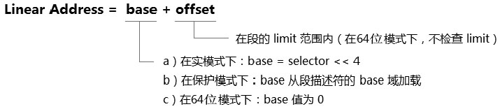

<!-- @import "[TOC]" {cmd="toc" depthFrom=1 depthTo=6 orderedList=false} -->

<!-- code_chunk_output -->

- [1. 概述](#1-概述)
- [2. 段式内存管理](#2-段式内存管理)
- [3. 段式的保护措施](#3-段式的保护措施)

<!-- /code_chunk_output -->

# 1. 概述

无论是**分段机制**还是**分页机制**, 它们都包含**两方面管理**.

1) **内存管理**: 负责为地址的转换提供基础设施, 处理器在访问内存时根据这些设施进行转换.

2) **保护措施**: 访问行为的控制, 保护数据避免随意访问.

在内存管理中, 对访问的对象进行寻址, 查找到需要访问的地址. 访问的对象包括**程序代码**(Code)和**数据**(Data), 在这个访问的过程中, 处理器需要检查访问者是否有足够的权限, 或者是否合法地进行访问. 对于违例的访问, 处理器将会拒绝.

```assembly
mov eax, es:[00400000H]
```

上面这是一条很简单很常见的指令, 实际上处理器在这条指令顺利执行之前, 做了许多额外的工作. 在 **32 位保护模式**下包括以下内容.

1) **selector** 的检查: 假如 `ES.selector` 是一个 null selector, 产生违例异常.

2) 进行**段 limit** 检查: 假如 `ES.limit >= 00400000H + 3`, 检查通过, 否则违例. (这里的前提是, 假设 ES 是 Expand-up 类型的段.)

3) 访问地址 `ES.base + 0x00400000`.

这条指令使用 ES 寄存器**段前缀**对内存地址进行读访问, ES 在加载的时候需要进行权限的检查. 因此在成功加载 ES 寄存器后, ES 要么引用一个最低需要的 Readable(可读的)段, 要么使用一个 Null selector.

在 limit 检查中需要区分 `Expand-up` 段和 `Expand-down` 段的情形.

* 在 `Expand-up` 段中, limit 是最大的偏移量, 因此只有 `ES.limit >= 00400000H + 3` 是合法的(加上 3 是因为访问 dword 值).

* 在 `Expand-down` 段中, limit+1 是最小的偏移量, 因此当 `ES.limit + 1 <= 00400000H` 是合法的. (关于 Expand-up 与 Expand-down 段详见 10.5.4.5 节. )

# 2. 段式内存管理

保护模式下的段式管理和实模式下的段式管理原理是一致的, 最大的不同是段 base 地址的形成. 在段式内存管理里, 线性地址的形成如下.



* 在**实模式**下段的 `base = selector << 4`;

* 在**保护模式**下 base 从 segment descriptor 里加载而来;

* 在 **64 位模式**下, 所有段的 base 都被处理为 0 值, 所有段的 limit 都是 FFFFFFFFH 值.

offset 可由多种寻址模式产生.

```assembly
mov eax, [ebx+ecx*4+0x0c]           ;  base+index+displacement
```

上面指令中的 offset 由 base+index*scale+displacement 这种寻址产生, 这是最为复杂的一种形式.

>保护模式下的段式内存管理将围绕着这个段 Base 值的获取而构建出一套段式的管理环境.

在内存中可以定义许多个段, 可以为每个段定义不同的属性.

- 段的 base 地址.

- 段的 limit.

- 段的 attribute, 包括访问权限和类型(如: Code/Data, LDT/TSS 段)等.

这些段的属性由 Segment Descriptor(段描述符)定义. 在同一个时刻内, 最多只有 6 个段是可用的(active), 这些段由 Segment Selector Register 段选择子寄存器(即: 段寄存器)进行引用. 当所有段的 base 值为 0, limit 为 FFFFFFFFH 值时, 被称为 flat mode(平坦的模式)内存管理模式.

# 3. 段式的保护措施

在允许访问前, 处理器会进行一系列的检查, 在 segmentation 环节中包括以下检查.

- 段 limit 检查.

- 段 type 检查.

- 段 privilege 检查.

在 64 位模式下, 处理器并不执行段的 limit 检查. 在这些检查中, privilege 检查是最复杂的一个环节, Data 段、Stack 段及 Code 段的访问检查细节都不一致. 只有通过这些检查后才允许访问.