<!-- @import "[TOC]" {cmd="toc" depthFrom=1 depthTo=6 orderedList=false} -->

<!-- code_chunk_output -->

- [1. Segment Selector (段选择子)](#1-segment-selector-段选择子)
  - [1.1. Segment Selector 的加载](#11-segment-selector-的加载)
  - [1.2. Null Selector 在 64 位模式下](#12-null-selector-在-64-位模式下)
    - [1.2.1. 加载 Null selector 到 SS 段寄存器](#121-加载-null-selector-到-ss-段寄存器)
  - [1.3. 隐式地加载 Null selector](#13-隐式地加载-null-selector)
- [2. Descriptor Table (描述符表)](#2-descriptor-table-描述符表)
  - [2.1. 描述符表寄存器](#21-描述符表寄存器)
  - [2.2. GDTR](#22-gdtr)
  - [2.3. GDTR 的加载](#23-gdtr-的加载)
  - [2.4. GDT 的 limit](#24-gdt-的-limit)
- [3. Segment Selector Register (段寄存器)](#3-segment-selector-register-段寄存器)
- [4. Segment Descriptor (段描述符)](#4-segment-descriptor-段描述符)
  - [4.1. 描述符 (Descriptor) 的种类](#41-描述符-descriptor-的种类)
  - [4.2. 描述符的大小](#42-描述符的大小)
  - [4.3. Code segment 代码段描述符](#43-code-segment-代码段描述符)
    - [4.3.1. Accessed 访问标志](#431-accessed-访问标志)
    - [4.3.2. Readable 可读类型](#432-readable-可读类型)
    - [4.3.3. conforming 与 non-conforming 代码段](#433-conforming-与-non-conforming-代码段)
    - [4.3.4. DPL 属性](#434-dpl-属性)
    - [4.3.5. S 属性](#435-s-属性)
    - [4.3.6. P 属性](#436-p-属性)
    - [4.3.7. D/B 属性](#437-db-属性)
      - [4.3.7.1. long mode 下的 D/B 属性](#4371-long-mode-下的-db-属性)
    - [4.3.8. L 属性](#438-l-属性)
    - [4.3.9. G 属性](#439-g-属性)
  - [4.4. long mode 下的 Code 代码段描述符](#44-long-mode-下的-code-代码段描述符)
  - [4.5. Code 代码段寄存器的加载](#45-code-代码段寄存器的加载)
    - [4.5.1. 加载 CS 寄存器的常规检查](#451-加载-cs-寄存器的常规检查)
      - [4.5.1.1. selector 的检查](#4511-selector-的检查)
      - [4.5.1.2. limit 的检查](#4512-limit-的检查)
      - [4.5.1.3. Code segment 类型的检查](#4513-code-segment-类型的检查)
    - [4.5.2. 用 far pointer 加载 CS 寄存器](#452-用-far-pointer-加载-cs-寄存器)
    - [4.5.3. 使用 call gate 加载 CS 寄存器](#453-使用-call-gate-加载-cs-寄存器)
      - [4.5.3.1. offset 域](#4531-offset-域)
      - [4.5.3.2. selector 域](#4532-selector-域)
      - [4.5.3.3. cnt 域](#4533-cnt-域)
      - [4.5.3.4. Call-gate 的 DPL 值](#4534-call-gate-的-dpl-值)
      - [4.5.3.5. gate selector 和 gate descriptor 的常规检查](#4535-gate-selector-和-gate-descriptor-的常规检查)
      - [4.5.3.6. 使用 call 指令调用 call-gate 时的权限检查](#4536-使用-call-指令调用-call-gate-时的权限检查)
      - [4.5.3.7. 加载 selector 及 code segment descriptor 到 CS 寄存器](#4537-加载-selector-及-code-segment-descriptor-到-cs-寄存器)
      - [4.5.3.8. 权限的切换](#4538-权限的切换)
      - [4.5.3.9. 当使用 jmp 指令调用 call-gate 时](#4539-当使用-jmp-指令调用-call-gate-时)
      - [4.5.3.10. stack 的切换](#45310-stack-的切换)
      - [4.5.3.11. long-mode 下的 Call-gate](#45311-long-mode-下的-call-gate)
      - [4.5.3.12. 64 位 Call-gate 的 offset 值](#45312-64-位-call-gate-的-offset-值)
      - [4.5.3.13. 64 位 Call-gate 中的 selector](#45313-64-位-call-gate-中的-selector)
      - [4.5.3.14. 64 位 Call-gate 的调用](#45314-64-位-call-gate-的调用)
      - [4.5.3.15. 在 compatibility 模式下对 64 位 Call-gate 的调用](#45315-在-compatibility-模式下对-64-位-call-gate-的调用)
    - [4.5.4. 使用 TSS selector 调用加载 CS 寄存器](#454-使用-tss-selector-调用加载-cs-寄存器)
      - [4.5.4.1. TSS descriptor](#4541-tss-descriptor)
      - [4.5.4.2. TSS 类型](#4542-tss-类型)
      - [4.5.4.3. 提供 TSS selector 进行 call 或 jmp 调用](#4543-提供-tss-selector-进行-call-或-jmp-调用)
      - [4.5.4.4. TSS selector 及 TSS 描述符的常规检查](#4544-tss-selector-及-tss-描述符的常规检查)
      - [4.5.4.5. 权限检查](#4545-权限检查)
      - [4.5.4.6. 对原 TSS descriptor 进行处理](#4546-对原-tss-descriptor-进行处理)
      - [4.5.4.7. 保存原处理器状态](#4547-保存原处理器状态)
      - [4.5.4.8. 在新的 TSS 段写入原 TSS selector](#4548-在新的-tss-段写入原-tss-selector)
      - [4.5.4.9. 置 Eflags.NT 标志位](#4549-置-eflagsnt-标志位)
      - [4.5.4.10. CR0.TS 标志位置位](#45410-cr0ts-标志位置位)
      - [4.5.4.11. 新 task 的 TSS descriptor Busy 被置位](#45411-新-task-的-tss-descriptor-busy-被置位)
      - [4.5.4.12. 加载 TR](#45412-加载-tr)
      - [4.5.4.13. 加载 CS 寄存器及其他寄存器](#45413-加载-cs-寄存器及其他寄存器)
    - [4.5.5. 使用 iret 指令进行任务切换从而加载 CS 寄存器](#455-使用-iret-指令进行任务切换从而加载-cs-寄存器)
    - [4.5.6. 使用 Task-gate 加载 CS 寄存器](#456-使用-task-gate-加载-cs-寄存器)
      - [4.5.6.1. Selector 域](#4561-selector-域)
      - [4.5.6.2. Task-gate 的类型](#4562-task-gate-的类型)
      - [4.5.6.3. selector 和 Task-gate 描述符的常规检查](#4563-selector-和-task-gate-描述符的常规检查)
      - [4.5.6.4. 访问 Task-gate 的权限检查](#4564-访问-task-gate-的权限检查)
    - [4.5.7. 在 long-mode 下 TSS 及任务切换](#457-在-long-mode-下-tss-及任务切换)
      - [4.5.7.1. long-mode 下的 TSS 段](#4571-long-mode-下的-tss-段)
      - [4.5.7.2. 64 位模式下的 TSS 描述符](#4572-64-位模式下的-tss-描述符)
      - [4.5.7.3. long-mode 下的 TR 加载](#4573-long-mode-下的-tr-加载)
    - [4.5.8. 使用 int 指令加载 CS 寄存器](#458-使用-int-指令加载-cs-寄存器)
      - [4.5.8.1. IDTR 中断描述符表寄存器](#4581-idtr-中断描述符表寄存器)
      - [4.5.8.2. Interrupt/Trap gate descriptor](#4582-interrupttrap-gate-descriptor)
      - [4.5.8.3. 访问 gate descriptor](#4583-访问-gate-descriptor)
      - [4.5.8.4. 常规检查](#4584-常规检查)
      - [4.5.8.5. 权限的检查](#4585-权限的检查)
      - [4.5.8.6. Interrupt/Trap-gate 与 Call-gate 的异同](#4586-interrupttrap-gate-与-call-gate-的异同)
      - [4.5.8.7. long-mode 下的 Interrupt/Trap-gate 描述符](#4587-long-mode-下的-interrupttrap-gate-描述符)
      - [4.5.8.8. gate 的类型](#4588-gate-的类型)
      - [4.5.8.9. IST 指针域](#4589-ist-指针域)
    - [4.5.9. 使用 int3、into, 以及 bound 指令加载 CS 寄存器](#459-使用-int3-into-以及-bound-指令加载-cs-寄存器)
      - [4.5.9.1. #OF 异常](#4591-of-异常)
      - [4.5.9.2. #BP 异常](#4592-bp-异常)
      - [4.5.9.3. #BR 异常](#4593-br-异常)
    - [4.5.10. 使用 RETF 指令加载 CS 与 SS 寄存器](#4510-使用-retf-指令加载-cs-与-ss-寄存器)
      - [4.5.10.1. 权限的处理](#45101-权限的处理)
      - [4.5.10.2. Selector 与所使用的 Descriptor 的权限检查](#45102-selector-与所使用的-descriptor-的权限检查)
      - [4.5.10.3. Selector 及 Descriptor 的类型检查](#45103-selector-及-descriptor-的类型检查)
      - [4.5.10.4. CS 与 SS 寄存器的加载](#45104-cs-与-ss-寄存器的加载)
      - [4.5.10.5. 隐式的 Null selector 加载](#45105-隐式的-null-selector-加载)
    - [4.5.11. 在 long-mode 下使用 RETF 指令](#4511-在-long-mode-下使用-retf-指令)
      - [4.5.11.1. 从 64 位模式返回到 64 位模式](#45111-从-64-位模式返回到-64-位模式)
      - [4.5.11.2. 从 64 位模式返回到 compatibility 模式](#45112-从-64-位模式返回到-compatibility-模式)
      - [4.5.11.3. 从 compatibility 模式返回到 64 位模式](#45113-从-compatibility-模式返回到-64-位模式)
      - [4.5.11.4. Jmp 指令在 64 位操作数下的变通](#45114-jmp-指令在-64-位操作数下的变通)
      - [4.5.11.5. Jmp 指令使用 32 位操作数](#45115-jmp-指令使用-32-位操作数)
      - [4.5.11.6. 使用 retf 指令来切换](#45116-使用-retf-指令来切换)
    - [4.5.12. 使用 IRET 指令加载 CS 和 SS 寄存器](#4512-使用-iret-指令加载-cs-和-ss-寄存器)
      - [4.5.12.1. 使用 IRET 指令返回](#45121-使用-iret-指令返回)
    - [4.5.13. 在 long-mode 下使用 IRETQ 指令](#4513-在-long-mode-下使用-iretq-指令)
      - [4.5.13.1. 使用 IRETQ 指令从 64 位模式返回到 64 位模式](#45131-使用-iretq-指令从-64-位模式返回到-64-位模式)
      - [4.5.13.2. 使用 IRETQ 指令从 64 位模式返回到 compatibility 模式](#45132-使用-iretq-指令从-64-位模式返回到-compatibility-模式)
      - [4.5.13.3. 使用 IRET 指令从 compatibility 模式返回到 64 位模式](#45133-使用-iret-指令从-compatibility-模式返回到-64-位模式)
    - [4.5.14. 使用 SYSENTER/SYSEXIT 指令加载 CS 与 SS 寄存器](#4514-使用-sysentersysexit-指令加载-cs-与-ss-寄存器)
      - [4.5.14.1. 使用 SYSENTER 指令进入 0 级权限代码](#45141-使用-sysenter-指令进入-0-级权限代码)
      - [4.5.14.2. 使用 SYSEXIT 指令退回到 3 级权限代码](#45142-使用-sysexit-指令退回到-3-级权限代码)
      - [4.5.14.3. 非对称地使用 sysenter/sysexit 指令](#45143-非对称地使用-sysentersysexit-指令)
      - [4.5.14.4. 设置一个 stub 函数](#45144-设置一个-stub-函数)
      - [4.5.14.5. 在 3 级权限里使用 sysenter 调用](#45145-在-3-级权限里使用-sysenter-调用)
    - [4.5.15. 在 IA-32e 模式下使用 SYSENTER/SYSEXIT 指令](#4515-在-ia-32e-模式下使用-sysentersysexit-指令)
      - [4.5.15.1. 设置 IA-32e 模式里的 sysenter/sysexit 使用环境](#45151-设置-ia-32e-模式里的-sysentersysexit-使用环境)
      - [4.5.15.2. 使用 SYSENTER 指令进入 0 级 64 位代码](#45152-使用-sysenter-指令进入-0-级-64-位代码)
      - [4.5.15.3. 从 64 位模式进入 0 级 64 位模式](#45153-从-64-位模式进入-0-级-64-位模式)
      - [4.5.15.4. 从 compatibility 模式进入 0 级 64 位模式](#45154-从-compatibility-模式进入-0-级-64-位模式)
      - [4.5.15.5. 使用 SYSEXIT 指令返回](#45155-使用-sysexit-指令返回)
      - [4.5.15.6. 统一使用 SYSEXIT 指令返回到 64 位模式](#45156-统一使用-sysexit-指令返回到-64-位模式)
    - [4.5.16. 使用 SYSCALL/SYSRET 指令来加载 CS 与 SS 寄存器](#4516-使用-syscallsysret-指令来加载-cs-与-ss-寄存器)
      - [4.5.16.1. 设置 SYSCALL 指令的使用环境](#45161-设置-syscall-指令的使用环境)
      - [4.5.16.2. 为 SYSCALL 指令所准备的 stub 函数](#45162-为-syscall-指令所准备的-stub-函数)
      - [4.5.16.3. SYSCALL 版本的系统服务例程](#45163-syscall-版本的系统服务例程)
      - [4.5.16.4. 非对称地使用 syscall/sysret 指令](#45164-非对称地使用-syscallsysret-指令)
  - [4.6. Stack (栈)结构及 Stack 的切换](#46-stack-栈结构及-stack-的切换)
    - [4.6.1. Legacy 模式下的 Stack](#461-legacy-模式下的-stack)
      - [4.6.1.1. Expand-up 类型的 stack 段(或 Data 段)](#4611-expand-up-类型的-stack-段或-data-段)
      - [4.6.1.2. 段 Limit 值的计算](#4612-段-limit-值的计算)
      - [4.6.1.3. Expand-up 段的有效范围](#4613-expand-up-段的有效范围)
      - [4.6.1.4. Expand-down 类型的 stack 段(或 Data 段)](#4614-expand-down-类型的-stack-段或-data-段)
      - [4.6.1.5. 段 Limit 值的计算](#4615-段-limit-值的计算)
      - [4.6.1.6. Expand-down 段的有效范围](#4616-expand-down-段的有效范围)
    - [4.6.2. 在 64 位模式下的 Stack](#462-在-64-位模式下的-stack)
    - [4.6.3. Data segment descriptor](#463-data-segment-descriptor)
      - [4.6.3.1. D/B 与 G 标志位](#4631-db-与-g-标志位)
    - [4.6.4. long-mode 下的 Data segment descriptor](#464-long-mode-下的-data-segment-descriptor)
      - [4.6.4.1. W 标志位](#4641-w-标志位)
      - [4.6.4.2. DPL 标志位](#4642-dpl-标志位)
      - [4.6.4.3. Base 域](#4643-base-域)
      - [4.6.4.4. FS 段和 GS 段的基地址](#4644-fs-段和-gs-段的基地址)
    - [4.6.5. Stack 的使用](#465-stack-的使用)
      - [4.6.5.1. 显式使用 SS 段](#4651-显式使用-ss-段)
    - [4.6.6. SS 寄存器显式加载](#466-ss-寄存器显式加载)
      - [4.6.6.1. 使用 LSS 指令加载](#4661-使用-lss-指令加载)
      - [4.6.6.2. selector 检查](#4662-selector-检查)
      - [4.6.6.3. 权限权查](#4663-权限权查)
      - [4.6.6.4. limit 检查](#4664-limit-检查)
      - [4.6.6.5. Data 段描述符类型的检查](#4665-data-段描述符类型的检查)
    - [4.6.7. TR 的显式加载](#467-tr-的显式加载)
      - [4.6.7.1. 置 Busy 标志位](#4671-置-busy-标志位)
      - [4.6.7.2. 使用 Call-gate 调用下的 Stack 切换](#4672-使用-call-gate-调用下的-stack-切换)
      - [4.6.7.3. TSS 段里的栈指针](#4673-tss-段里的栈指针)
    - [4.6.8. 在 long-mode 下使用 Call-gate 调用的 Stack 切换](#468-在-long-mode-下使用-call-gate-调用的-stack-切换)
      - [4.6.8.1. long-mode 下的 TSS 段里的栈指针](#4681-long-mode-下的-tss-段里的栈指针)
      - [4.6.8.2. 加载 Null selector 到 SS 寄存器](#4682-加载-null-selector-到-ss-寄存器)
    - [4.6.9. 使用 RETF 指令返回时的 Stack 切换](#469-使用-retf-指令返回时的-stack-切换)
    - [4.6.10. long-mode 下使用 RETF 指令返回时的 Stack 切换](#4610-long-mode-下使用-retf-指令返回时的-stack-切换)
      - [4.6.10.1. 返回到 compatibility 模式时](#46101-返回到-compatibility-模式时)
      - [4.6.10.2. 返回到 64 位模式时](#46102-返回到-64-位模式时)
      - [4.6.10.3. 从伪造的 Call-gate 服务例程 RETF 返回时](#46103-从伪造的-call-gate-服务例程-retf-返回时)
    - [4.6.11. 调用中断或中断/异常发生时的 Stack 切换](#4611-调用中断或中断异常发生时的-stack-切换)
    - [4.6.12. long-mode 下的中断 Stack 切换](#4612-long-mode-下的中断-stack-切换)
      - [4.6.12.1. IST(Interrupt Stack Table)](#46121-istinterrupt-stack-table)
      - [4.6.12.2. 从 compatibility 模式进入 64 位模式](#46122-从-compatibility-模式进入-64-位模式)
      - [4.6.12.3. 从 64 位模式进入 64 位模式](#46123-从-64-位模式进入-64-位模式)
    - [4.6.13. 使用 IRET 指令返回时的 Stack 切换](#4613-使用-iret-指令返回时的-stack-切换)
      - [4.6.13.1. long-mode 下的 IRETQ 返回 Stack 切换](#46131-long-mode-下的-iretq-返回-stack-切换)
      - [4.6.13.2. 返回到 compatibility 模式时](#46132-返回到-compatibility-模式时)
      - [4.6.13.3. 从伪造的中断 handler 环境中返回](#46133-从伪造的中断-handler-环境中返回)
  - [4.7. Data 数据段](#47-data-数据段)
    - [4.7.1. 段的访问类型限制](#471-段的访问类型限制)
    - [4.7.2. 加载 Data 段寄存器](#472-加载-data-段寄存器)
      - [4.7.2.1. selector 的检查](#4721-selector-的检查)
      - [4.7.2.2. 权限检查](#4722-权限检查)
      - [4.7.2.3. limit 的检查](#4723-limit-的检查)
      - [4.7.2.4. Data 段描述符的检查](#4724-data-段描述符的检查)
    - [4.7.3. 加载 Code 段描述符到 Data 寄存器](#473-加载-code-段描述符到-data-寄存器)
      - [4.7.3.1. 加载 non-conforming 段的权限检查](#4731-加载-non-conforming-段的权限检查)
      - [4.7.3.2. 加载 conforming 段的权限检查](#4732-加载-conforming-段的权限检查)
    - [4.7.4. long-mode 下的 Data 段寄存器加载](#474-long-mode-下的-data-段寄存器加载)
      - [4.7.4.1. 64 位模式下加载 Null selector](#4741-64-位模式下加载-null-selector)
    - [4.7.5. Data 段的访问控制](#475-data-段的访问控制)
    - [4.7.6. 64 位模式下 Data 段的访问控制](#476-64-位模式下-data-段的访问控制)
- [5. LDT 描述符与 LDT](#5-ldt-描述符与-ldt)
  - [5.1. LDT 描述符](#51-ldt-描述符)
  - [5.2. LDTR 的加载](#52-ldtr-的加载)
    - [5.2.1. selector 检查](#521-selector-检查)
    - [5.2.2. limit 检查](#522-limit-检查)
    - [5.2.3. LDT 描述符类型检查](#523-ldt-描述符类型检查)
  - [5.3. 64 位模式下的 LDT 描述符](#53-64-位模式下的-ldt-描述符)

<!-- /code_chunk_output -->

# 1. Segment Selector (段选择子)

Segment Selector 结构是**16 位(恒 16 位！！！**), 它是一个段的标识符, 结构如下.


* RPL(Requested Privilege Level): 请求**访问者**所使用的权限级别, **从 0 到 3 级**.

* TI(Table Indicator): 描述符表索引位. 当 **TI=0** 时, 从 **GDT** 查找; 当 **TI=1** 时, 从 **LDT** 查找.

* Index(Descriptor Index): 这是 Descriptor 在 GDT/LDT 中的序号, 根据 TI 的值在相应的描述表中查找 descriptor.

注意, **段选择子不是段寄存器, 不能混为一谈,  段选择子是一个数值, 只有 16 位, 段寄存器是寄存器, 128 位或 96 位, 其可见部分等于段选择子(！！！**), 段寄存器详见下面节.

由图上可以看到通过段选择子只能选择 LDT 或 GDT, **不会包括 IDT**.

当有下面的 selector 时,

```assembly
selector=0008H           ;  RPL=0, TI=0, Index=1
```

表示将在**GDT**的**第 1 项**得到 Descriptor, 访问者使用的权限是**0 级**.

>当 Index 为 0, 并且 TI 为 0 时, 它在 GDT 内的第 0 项, 是一个无效的 selector, 被称为 Null selector(TI=1 时, 有效).

当 selector 的值为**0000H 到 0003H**时, 这个 selector 是**Null selector**, 它指向 **GDT 的第 0 项**, 第 0 项的 Descriptor 是 **unused**(不被使用的). Null selector 的作用**类似于 C 指针中的 NULL 值**, 用于**防止代码对 unused segment register(未使用的段寄存器)进行访问**.

**13 位的 Index**取值范围是 0~1FFFH(0~8191), 表示 selector 可以寻址**8192 个 descriptor**(而 0 号的 Null selector 是无效).

## 1.1. Segment Selector 的加载

当代码被允许访问时, **selector 值**会被加载到 **segment selector register 内**, 像下面两类典型的访问, 就会发生 selector 的加载.

```assembly
mov ax, 0008H                ;  selector=08H
mov ds, ax                    ;  加载 selector 到 DS 寄存器
```

当 descriptor 的权限允许以及类型相符时, 处理器会加载 selector 到 DS 寄存器的 selector 域里, 同时对应的 segment descriptor 也会被加载到 DS 寄存器的 Cache 部分. (段寄存器结构稍后会探讨. )

```assembly
jmp 0008h: 00001000h        ;  执行一个 far jmp 指令
call 0008h: 00001000h       ;  执行一个 far call 指令
```

像上面的指令提供一个 far pointer 进行 jmp/call 操作, 同样在通过处理器的检查后, 处理器会加载 selector 到 CS 寄存器的 selector 域里, 同时相应的 Code segment descriptor 也会被加载到 CS 寄存器.

注意: **Null selector 不允许加载到 CS 及 SS 寄存器**, 会产生 `#GP` 异常. 允许被加载到 **ES、DS、FS, 以及 GS 寄存器**中, 但是这些寄存器**使用 Null selector 进行访问**时会产生 `#GP` 异常.

当加载一个 Null selector 到上述允许的段寄存器时, 处理器并不真正读取 GDT 的第 0 项 segment descriptor 到段寄存器中, 而是以一个无效的 unused descriptor 来初始化段寄存器(段寄存器内除了 S 标志为 1 外, 其他都为 0).

```assembly
mov ax, 03H                  ;  selector=03H
mov ds, ax                   ;  Null-selector 加载
```

DS 的结果是: DS.selector=03H, base/limit/attribute=0H(除了 S 标志为 1 外).

## 1.2. Null Selector 在 64 位模式下

在**64 位模式**下, 处理器对 Null selector 的使用并不检查. 允许加载 Null selector 到除 CS 寄存器外的任何一个段寄存器(SS 段寄存器有条件限制), 以及使用这些 Null selector 进行访问.

### 1.2.1. 加载 Null selector 到 SS 段寄存器

64 位模式下, 在**非 3 级权限(！！！**)里, 允许为**SS 段寄存器加载一个 Null selector**, 即在 0 级、1 级和 2 级权限下. 假设当前运行在 2 级权限下, 则下面的代码是正确的.

```assembly
mov ax, 02H             ;RPL=2
mov ss, ax              ;Null-selector 加载, OK！
```

可是如果当前运行在 3 级权限下, 则下面的代码是错误的.

```assembly
mov ax, 03H             ;RPL=3
mov ss, ax              ;Null selector 引发 #GP 异常
```

**Null selector**的隐晦点在当**使用 retf 指令(远调用返回**)或**iret 指令(中断例程返回**)时, 如果**发生权限的改变**, **引发 stack 切换**的情景下变得更明显.

```assembly
push 3                   ;SS=Null selector
push USER_RSP
push USER_CS | 3         ;切换到 3 级权限代码
push USER_ENTRY
retf                     ;#GP 异常, 不允许为 SS 加载 3 级权限的 Null selector
```

在 64 位模式下, 切换到 3 级的用户代码时, 提供 Null selector 是错误的. 明白了不能在 3 级权限下加载 Null selector 到 SS 寄存器后一切都变得豁然开朗了, 归根到底还是因为忽视了 Null selector 的 RPL 的重要性.

## 1.3. 隐式地加载 Null selector

有时候处理器会隐式地为 SS 寄存器或其他 Data Segment 寄存器加载一个 Null selector, 这时候加载 Null selector 是有用的.

1) 在执行**RETF(远过程返回**)或**IRET(中断返回**)指令时: 当发生权限的改变(从**高权限切换到低权限**)时, 如果**ES**、**DS**, **FS**, 以及**GS 段寄存器内的 DPL 值低于 CPL**(DPL \< CPL), 那么处理器将会为这些段寄存器**隐式地加载 Null selector(无论是不是 long mode, 都会这样！！！**).

2) 在**long mode**下(包括**64 位模式**和**compatibility 模式**), 使用**call gate 进行调用**, 发生**权限改变**(从**低权限切换到高权限**)时, 处理器将会加载一个**Null selector**到**SS 寄存器**, **SS.selector.RPL**会被设为**新 CPL**值.

3) 在**long mode**下(包括 64 位模式和 compatibility 模式), 使用**INT 进行中断调用**(或者**发生中断/异常**), 发生**权限改变**(从**低权限切换到高权限**)时, 处理器也会加载**Null selector**到**SS 寄存器**, **SS.selector.RPL**被设为**新的 CPL**值.

在第一种情形里, 由于从高权限切换到低权限代码, 将**Data segment 寄存器**(**！！！ES、DS、FS 和 GS！！！**)隐式加载为 Null selector 是为了**防止在低权限代码里对高权限数据段进行访问**.


在 64 位模式下无须重新加载, 数据段寄存器可以使用 Null selector 进行访问, 而在 legacy 和 compatibility 模式下在使用这些段寄存器之前应该为它们重新加载.

在第二和第三种情形下, 是承接了上面所述的 64 位模式下加载 Null selector 到 SS 寄存器的条件. 从低权限切换到高权限(也就是: 非 3 级权限下)的 64 位代码下, 处理器会为 SS 寄存器自动加载一个 Null selector, 目的是在这个 64 位的代码里调用其他更高权限的 64 位例程(库 routine 等)时, 在**返回时**可以**判断调用者是 64 位的高权限代码(！！！**).

下面是一个示意图.


在上图中, 这种嵌套的 64 位代码权限改变调用中, 图中的**0 级 kernel service 代码**返回到**稍低一级的桩代码**的过程里, 处理器**检查到压入的 SS 是 Null selector**, 那么这个 Null selector 作为一个**标志(调用者是 64 位的非 3 级权限代码**), 就为 kernel service 的设计提供了一个灵活的处理手法(**根据这个标志可以选择进行/或不进行一些相应的处理！！！**).

在这个 64 位代码进行 stack 切换的返回过程中, 处理器允许 Null selector 被加载到 SS 寄存器中, 不会产生\#GP 异常. 这个条件是, 目标代码的 DPL 不是 3 级(返回到非 3 级权限的代码).

在 legacy/compatibility 模式下, 以及在 64 位模式返回到 3 级代码的情形下, 不允许从 stack 中 pop 出 null selector.

# 2. Descriptor Table (描述符表)

**Segment Selector** 用于在 **Descriptor Table(描述符表**)里查找 **descriptor(描述符**), 在 x86 中有**三类描述符表**:

* **GDT**(`Global Descriptor Table`)

* **LDT**(`Local Descriptor Table`)

* **IDT**(`Interrupt Descriptor Table`).

## 2.1. 描述符表寄存器

这些 descriptor table 由 **descriptor table register(描述符表寄存器**)进行定位, 因此, **三种描述符表**就对应着**三种描述符表寄存器**:

* **GDTR**

* **LDTR**

* **IDTR**


由 2.1 的图可知, 所有的**描述符表寄存器**存放的**描述符表的地址**都是**线性地址(！！！**), 应该是由于历史原因为了兼容.

## 2.2. GDTR


GDTR 的 limit 域是 **16 位值**, 最大的 limit 是 FFFFH, **base** 可以在处理器 **linear address 空间的任何位置**.

**GDTR 没有不可见部分的缓存！！！**


如图所示, `GDTR.base` 提供 GDT 的基地址, `GDTR.limit` 提供 GDT 表限.

在 longmode(包括 64 位模式和 compatibility 模式)下, `GDTR.base` 是 **64** 位的 GDT base 值; 在 compatibility 模式下, 处理器也将读取 64 位的 base 值.

## 2.3. GDTR 的加载

在 selector 能访问 GDT 之前, 必须要**对 GDTR 进行设置(加载寄存器**), 系统软件使用 **lgdt 指令**加载 GDTR.

```assembly
lgdt [GDT_POINTER]                      ;  加载 GDTR
```

或者

```assembly
mov eax, GDT_POINTER
lgdt [eax]
GDT_Pointer:        dw  3FFh                    ;  GDT limit
dd  200000h                ;  GDT base
```

**lgdt** 指令在 **0 级权限**里执行, 必须为它提供一个内存操作数, 这个内存地址里**低 16 位**是 GDT 的 **limit** 值, 高 32 位是 base 值(在 64 位代码里使用 64 位的值), 这些值将被装入 GDTR 的 limit 和 base 域里.

## 2.4. GDT 的 limit

使用 selector 对 GDT 进行访问时, 处理器会**检查 selector 是否超出 GDT 的 limit**. 若 GDT 的 limit 值为 3FFh, 那么 GDT 内的有效范围是 0~3FFh(偏移量).

当 GDT 的 limit 值为 0C6h 时, 下列情形就超出了 limit 范围.

1) 当使用 0xc0 作为 selector 访问 GDT 时.

```assembly
mov ax, 0xc0     ;selector 为 C0h
mov ds, ax       ;#GP 异常(超限)
```

这个 selector 的 Index 是 0x18, 所访问的空间应该是 C0h 到 C7h(8 个字节的空间), 然而 limit 的值是 C6h, 这超出了 GDT 的 limit, 将引发#GP 异常.

> index(0x18)* 8 = 0xc0, 所以访问 GDT 的范围是 0xc0 ~ 0xc7 一共 8 字节空间

2) 当使用 0xc8 作为 selector 访问 GDT 时, 超出了 GDT 的 limit.

在 GDT 中 segment descriptor 是 8 个字节的, 在1)情形中, GDT 的 limit 值不能容纳完整的 descriptor 宽度, 使得 selector 访问的 descriptor 最后一个字节超出了 GDT 的 limit.

# 3. Segment Selector Register (段寄存器)

**CS, DS, ES, SS, FS, GS**.

段寄存器有时被表述为**段选择子寄存器**, **恒 16 位**, 包括两大部分: **visible (可视部分**)与 **invisible(不可视部分**).


如图所示, 灰色部分是不可视部分, 只有 **Selector** 域是**可视部分**. 不可视部分隐藏在寄存器内部只有处理器可用, 有时也被称为 Cache 部分.

>invisible 部分由 segment descriptor 加载而来, 作为一个段的 cache 作用.

在不改变段的情况下, 对内存段进行访问, 处理器从段寄存器内部的 cache (不可视部分)读取段的信息, 避免重复加载 segment descriptor.

在 **64 位模式**下, 段寄存器的**base 地址**部分被扩展为**64 位**, **limit** 域固定为 **32** 位, **Attribute** 和 **Selector** 是 **16** 位宽. 在 compatibility 模式下依然使用 base 的低 32 位值.

**64 位模式是 128 位, 32 位模式是 96 位, 但是只有 16 位 selector 可见！！！**.

实质上, 在 **x64** 体系(Intel64 和 AMD64)的机器上, 寄存器的宽度本来就是 64 位, 在实模式下低 16 位可用, 在 32 位保护模式和 compatibility 模式下, 低 32 位可用.

- Base 域: 提供**段的基址**.

- Limit 域: 提供**段限**, 这个 32 位的段限是从 Segment descriptor 计算而来, Semgent descriptor 里提供的 limit 域是 20 位宽的, 加载到段寄存器后值被计算出 32 位.

- Attribute 域: 分别由 **Segment descriptor** 的 Type、S、DPL、P、G、D/B、L, 以及 AVL 域组合而来.

- Selector 域: 使用 **selector 加载新的段**时, selector 会被加载到段寄存器的 selector 域.

在使用这些段寄存器之前, 应该先加载, 下面是一个典型的**段描述符加载到段寄存器的示意图**.


当段寄存器发生加载时, 根据**Selector**得到**segment descriptor**, **Selector**将加载到**段寄存器的 Selector 域**, 同时**segment descriptor**也将加载到**段寄存器的不可视部分(Cache**).

segment descriptor 加载到段寄存器中几乎是一对一加载, 除了 limit 域: 在 **segment descriptor** 的 **limit 域是 20 位**, 而**段寄存器**中的 **limit 是 32 位宽**的. descriptor 内 20 位的 limit 计算为 32 位后加载到段寄存器的 limit 域.

使用下列指令可以对 Data segment 寄存器进行**显式的加载**.

- mov 指令: mov sreg, reg16.
- pop 指令: pop es, pop ds, pop ss, pop fs, 以及 pop gs.
- lds, les, lss, lfs, 以及 lgs.

下列情形对 **CS 寄存器**或**SS 寄存器**进行**隐式的加载**.

- 提供一个 far pointer 给 jmp/call 指令, 进行远跳转/调用, 根据提供的 selector 进行加载.

- 使用 retf 和 iret 指令进行返回时, 根据 stack 中的 image 对 CS 寄存器进行加载, 以及对 SS 寄存器(权限改变时)进行加载.

- 使用 int 指令进行中断调用, 或者发生中断/异常时, 对 CS 和 SS 寄存器(权限改变时)进行加载.
- 使用 **TSS/Task\-gate** 进行**任务切换**时, 根据 TSS 段内的段寄存器 image 进行加载.
- 使用 sysenter/sysexit, syscall/sysret 指令时, 处理器对 CS 和 SS 进行 selector 加载和一些强制性的设置.

在**64 位模式**下, lds、les 指令无效; pop ds、pop es, 以及 pop ss 指令无效; **使用 TSS 机制进行任务切换将不再支持(！！！**).

**段寄存器的 base 域**在**64 位**模式下被扩展为**64 位**, 对于**CS、ES、SS 和 DS(！！！**)寄存器来说这个 64 位的基值没什么意义. 在**64 位模式**下, 这些**段的基值都被强制为 0 值(！！！一旦往这几个段寄存器加载 selector,  发现是这几个寄存器, 不读取 GDT 或 LDT, 直接加载 base 位 0！！！**).

**64 位的段基值**对于**FS 和 GS 寄存器**来说才有意义, **FS 和 GS 寄存器(！！！**)可以由**软件设置非 0 的 64 位值**.

**使用代码段或数据段描述符(！！！这两种描述符在 64 位下还是 8 字节大小,  base 还是 32 位！！！**)的加载方法, 只能加载一个**32 位的 base 值**, 在 x64 体系中, 新增了**两个 MSR 寄存器**: **IA32\_FS\_BASE**和**IA32\_GS\_BASE**. 它们分别映射到**FS.base**和**GS.base**.

# 4. Segment Descriptor (段描述符)

段寄存器和段描述符(Segment Descriptor)在整个 x86/x64 体系里非常重要, 前面的图揭示了**段寄存器与段描述符的关系**. 在保护模式里, 段寄存器离不开段描述符, 而段描述符也不能独立于段寄存器存在. 只有当段描述符被加载到了段寄存器里才能发挥应有的作用.

**TSS descriptor**是一个比较特殊的**段描述符**, 当一个**TSS descriptor 被引用**(被加载)时, 处理器会将它**置为 Busy 状态**. Busy 状态的 TSS descriptor 不能被加载, 它存在于 GDT 中会发挥一定的作用.

段描述符要么存放在 Descriptor Table(描述符表)里, 要么被加载到段寄存器里. 一个段描述符在被加载到段寄存器后, 它所描述的段变成**active 状态**. 在继续探讨段寄存器之前, 我们先要了解段描述符.

## 4.1. 描述符 (Descriptor) 的种类

段描述符只是众多描述符中的一类, 描述符有**两大类**: **Segment Descriptor(段描述符**)和 **Gate Descriptor(门描述符**). 按**系统性质**来分, 可以分为: **System Descriptor(系统描述符**)和 **Code/Data Descriptor(非 system 描述符**).

下面是对 Descriptor 按**系统性质**的分类.

- **System descriptor**(系统描述符)

  - **System Segment descriptor** (系统段描述符). 包括:

    - **LDT descriptor**

    - **TSS descriptor**

  - **Gate descriptor** (门描述符). 包括:

    - **Call-gate** 调用门

    - **Interrupt-gate** 中断门

    - **Trap-gate** 陷阱门

    - **Task-gate** 任务门

- **Non-system segment descriptor** (非系统描述符)

    - **Code segment descriptor** (代码段描述符)

    - **Data segment descriptor** (数据段描述符)

Descriptor 的 **S 域**指示了**描述符的类型**:

* 当 **S=0** 时, 属于**系统级的描述符**;

* 当 **S=1** 时, 属于 **Code/Data 类描述符**.

也可以分类为:

* 段描述符. 在 long mode 下, 段机制的使用方式有所简化, 通常采用平坦模型, 段基址一般为 0, 段界限通常设置为最大值, 通过页表机制来实现更精细的地址空间管理。系统段描述符中的 TSS 描述符等在 long mode 下也有相应的支持和使用方式。

  * 代码段描述符

  * 数据段描述符

  * 系统段描述符

* 门描述符

  * 调用门描述符

  * 中断门描述符

  * 陷阱门描述符

**LDT 和 TSS** 在系统中可能有**很多个**, 所以需要在 **GDT** 中添加**每个 LDT** 和**每个 TSS 的描述符**, 用来查找. 而 **IDT 是没有描述符**的, 因为 **IDT 在系统中就只有一个**, **IDTR 指向**就可以, 永远不变, **不需要在 GDT 中存在一个 IDT 的描述符**.

当要使用这些 **LDT** 时, 可以用它们的**选择子(32 位下 TSS 中有一个 LDT 段选择符！！！**)来访问 GDT, 将**LDT 描述符**加载到 LDTR 寄存器.

**在 Interrupt/Trap\-gate 描述符里增加了一个 IST 域**, 可以为 interrupt handler 提供**额外的 stack 指针**, 当**IST 值为非 0**时, IST 值用来在**当前 TSS 块**里查找**相应的 stack 指针值**.

**中断门和陷阱门描述符都只允许存放在 IDT 内(！！！**), **任务门可以位于 GDT、LDT 和 IDT 中(！！！**)

通过**中断门进入中断服务程序**时 cpu 会**自动将中断关闭**, 也就是将 **cpu 中 eflags 寄存器中 IF 标志复位**, 防止嵌套中断的发生; 而通过**陷阱门进入服务程序**时则维持**IF 标志不变**. 这是**中断门与陷阱门的唯一区别(！！！**)

## 4.2. 描述符的大小

在 **legacy 模式**下, **每个描述符**是**8 字节 64 位宽(！！！**);

在 **long mode**(包括 **compatibility 模式**)下:

* 系统描述符

  * 系统段描述符 **LDT/TSS 描述符**在 **64 位模式**下是 **16 字节 128 位宽(！！！**), 而在 **compatibility 模式**下依然是 **8 字节 64 位宽(！！！**);

  * **所有的 gate 描述符**是**16 字节 128 位宽**, 包括 **Call-gate descriptor**, **Interrupt-gate descriptor** 和 **Trap-gate descriptor**. 在 **long-mode** 下并**不存在 Task-gate 描述符**, 基于 **TSS 的任务切换机制将不再支持**.

* **Code/Data 段描述符**依然是**8 字节 64 位宽**, 不过**大部分域或属性无效**.

## 4.3. Code segment 代码段描述符

Code segment(代码段)描述符结构(**64 位宽**)如下.


对于**Code 段**来说, 它的类型取值范围是**8~F**, 对于 4 位的 Type 域来说, 还可以进行一细化为


**Code/Data 标志**指示段描述符属于**Code 段还是 Data 段**, 1 属于 Code 段(指示该段可执行并且不可写).

**C 标志位**是比较重要的, C=1 时为**conforming 类型**, C=0 时为 non\-conforming 类型, 0x8~0xB 是 non\-conforming 类型, 0xC~0xF 是 conforming 类型.

**32 位的段 base 值**被分为 2 个部分: base 的低 24 位放在 segment descriptor 的 bit 39 位到 bit 16 位上. base 的高 8 位放在 segment descriptor 的 bit 63 到 bit 56 位上. (注意区分: 在 Intel 和 AMD 的手册上以 2 个 32 位结构进行描述, 在这里以一个 64 位结构进行描述. )

**20 位的段 limit 值**也被分为 2 个部分: limit 的低 16 位放在 segment descriptor 的 bit 15 到 bit 0 位上, 高 4 位放在 segment descriptor 的 bit 51 到 bit 48 位上. 20 位的 limit 值经过计算为 32 位后被加载到段寄存器上.

### 4.3.1. Accessed 访问标志

在 type 域里的 A 标志(accessed)指示段是否被访问过, A=1 表示已经被访问过(被加载到段寄存器中), A=0 表示未访问.

当段描述符被加载到段寄存器时, 只有当 A 标志位为 0 时, 处理器才会对在 GDT/LDT 中的 segment descriptor 中的 A 标志进行置位, 这种行为可以让系统管理软件(典型的是内存管理软件)知道哪个段已经被访问过.

可是一旦置位, 处理器从不会对 A 标志位进行清位. 系统软件在对 descriptor 进行重新设置的时候, 可以对 A 标志位进行清位. 在处理器再次加载 descriptor 的时候对 A 标志位重新置位, 在这种情况下, A 标志往往配合 P 标志位使用. 系统软件在对 A 标志和 P 标志位进行修改的时候应当使用 LOCK 指令前缀锁 bus cycle.

当处理器加载 descriptor 到段寄存器时, 处理器会对 descriptor 执行自动加 lock 的行为, 处理器在访问这个 descriptor 期间, 其他处理器不能修改这个 descriptor.

这个加载 descriptor 期间, 应当包括从对 descriptor 检查到最后的使用 descriptor 更新段寄存器内的 Cache 部分.

### 4.3.2. Readable 可读类型

一个代码段不可能被写访问, 但可以被读访问, 当代码段的类型标志 R 设为 1 时, 表示该代码段可以被读, 那么就可以像下面这样使用 CS 段进行读访问.

```assembly
mov eax, cs: [ebx]              ;  通过 CS 寄存器读代码段空间
```

或者可以将 code segment descriptor 加载到数据段寄存器进行读访问.

```assembly
mov ax, CODE_SEL                 ;  CODE_SEL 是一个代码段描述符
mov es, ax                         ;  将代码段描述符加载到 ES
mov eax, es: [ebx]
```

前提是有足够的权限加载(non-conforming 类型)描述符, CPL<=DPL 并且 RPL<=DPL. 或者是对于 conforming 类型的代码段描述符加载总是成功的.

### 4.3.3. conforming 与 non-conforming 代码段

conforming 类型的代码强迫使用低权限或相等权限(CPL>=DPL)来运行, nonconforming 类型的代码限制用户使用低权限来运行(进入高权限代码需要通过 gate 符调用).

conforming 段的另一个重要特性是: 进入 conforming 段运行不改变当前运行的 CPL 值(无论是通过直接调用还是 gate 调用).

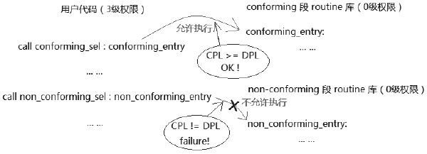

如上图所示, 在同一段 3 级权限的用户代码里, 分别调用 conforming 段和 nonconforming 段的代码, 采用直接调用的方式.

```assembly
call selector: offset              ;  提供 far pointer 直接调用
```

从 3 级直接调用 0 级权限的 conforming 段代码获得通过, 处理器检查 CPL>=DPL(低权限或相等权限), 而调用 0 级的 non\-conforming 段代码将失败, 处理器检查到 CPL != DPL(权限不相等).

conforming 段的代码将阻止使用高权限执行, 假如调用者的权限是 0 级, 而 conforming 段的权限为 1 级, 那么这个调用将失败. 因此当 conforming 段使用 0 级 DPL 时, 就可以在任何权限里执行. 进入 conforming 段不会引起权限和 stack 的切换.

non\-conforming 段的代码将阻止使用低权限执行, 而强迫通过使用 gate 来执行高权限的代码.

>**需要保护**的代码和数据应该**使用 non\-conforming 段**, 而对于**不重要、无须保护**的代码可以使用 conforming 段.

在某些场合下, 使用 conforming 段会比使用 non-conforming 段灵活: 例如要使一个库 routine 能在任意权限下运行, 前提是这个库 routine 并不涉及重要的数据和使用系统资源.

基于这种要求, 我们来对比一下 conforming 段与 non-conforming 段.

1) 使用 conforming 段, 并将 DPL 设为 0 级权限, 在 3 级权限下可以直接调用(CPL>DPL), 在 0 级权限下, 依然可以使用直接调用(CPL==DPL).

2) 使用 non-conforming 段, 并将 DPL 设为 3 级权限, 在 3 级权限下可以直接调用(CPL==DPL), 而在其他级别无法直接调用, 例如在 0 级不能直接调用 3 级权限的代码(CPL！=DPL), 那么在 0 级权限使用 gate 符进行调用呢?同样做不到(条件是: CPL>=DPL of Code segment). 如果将 non-conforming 段的 DPL 设为 0 级权限, 在 3 级权限下可以使用 gate 符进行调用, 在 0 级权限下也可以使用 gate 符进行调用.

相比之下, non-conforming 段的执行权限需要被定义为 0 级, 通过 gate 符进行调用, 显得不如 conforming 段灵活, 并且 conforming 段定义在 3 级权限, 不会改变调用者的 CPL 值. 对于不重要的库 routine 来说, 使用 conforming 段会更适合些.

下面是一个典型的使用方法.

代码清单 10-1(lib\conforming_lib32.asm):

```assembly
; ----------------------------------------------
;  conforming_lib32_service_enter(): conforming 代码库的 stub 函数
;  input:
;        esi: clib32 库函数服务例程号
;  描述:
;        conforming_lib32_service_enter()的作用是切换到 conforming 段里,
;        然后调用 conforming lib32 库里的服务例程, 它相当于一个 gate 的作用.
;  -----------------------------------------------
__clib32_service_enter:
__conforming_lib32_service_enter:
      jmp do_conforming_lib32_service
conforming_lib32_service_pointer       dd __clib32_service dw conforming_sel
do_conforming_lib32_service:
      call DWORD far [conforming_lib32_service_pointer]   ;  使用 conforming 段进行调用
      ret
; --------------------------------------------
;  conforming_lib32_service()
;  input:
;        eax: clib32 库函数服务编号
; --------------------------------------------
__clib32_service:
__conforming_lib32_service:
      mov eax, [__clib32_service_table + eax * 4]
      call eax
      retf
; ----------------------------------------------------------
;  get_cpl(): 得到 CPL 值
;  output:
;        eax: CPL 值
; ----------------------------------------------------------
__get_cpl:
      mov ax, cs
      and eax, 0x03
      ret
;  conforming lib32 库服务例程表
__clib32_service_table:
      dd __get_cpl                            ;  0 号
      dd __get_dpl                            ;  1 号
      dd __get_gdt_limit                     ;  2 号
      dd __get_ldt_limit                     ;  3 号
      dd __check_null_selector              ;  4 号
      dd __load_ss_reg                        ;  5 号
```

这段代码在 lib\conforming\_lib32.asm 库里, 是专门为 conforming 段代码所设立的一个 32 位的库, \_\_get\_cpl()函数用来获取**当前运行的 CPL 值**. 那么, 在软件里可以使用下列方式来调用.

```assembly
mov eax, 0       ;  clib32 库的例程编号
call __clib32_service_enter   ;  调用 clib32 库的进入函数
```

在\_\_clib32\_service\_table 里, \_\_get\_cpl()函数的编号是 0, 因此, 给 eax 寄存器传递例程号由接口函数\_\_clib32\_service\_enter()来进行调用.

它设立的目的是能**在任何权限执行**, 这样就可以很方便地**获取到 CPL 值**.

由于 conforming 的特殊性——不改变 CPL 值, 于是\_\_get\_cpl()函数就被放在 conforming 里执行. 如果以 non\-conforming 段来运行, 就显得很麻烦了.

1) 发生权限的改变时 CPL 会改变. 因此还要根据情况做出相应的判断.

2) 必须放在 0 级的 DPL 权限里, 使得 0 级权限下能够执行, 在 3 级里使用 gate 进行调用.

而放在 conforming 段里就很容易做到了, 这个\_\_get\_cpl()函数的调用路径是

\_\_conforming\_lib32\_service\_enter()--> \_\_clib32\_service() --> \_\_get\_cpl()

上面是在 conforming\_lib32.asm 库里的执行顺序. 在我们的程序里只需给出 conforming 段目标例程 get\_cpl()的例程号(在 inc\clib.inc 文件里定义了一些常量值), 然后调用入口函数就可以了. 入口函数\_\_conforming\_lib32\_service\_enter()负责切换到 conforming 段执行.

在 conforming\_lib32.asm 库里的这些烦琐的调用路径是为了实现一个库的接口, 当 conforming\_lib32.asm 库里添加更多的函数时, 可以利用这个路径进入.

代码清单 10-2(topic10\ex10-1\protected.asm):

```assembly
mov esi, msg2                        ;  打印信息
call puts
mov eax, CLIB32_GET_CPL   ;  常量定义在 inc\clib.inc 头文件里
call clib32_service_enter         ;  调用 conforming 例程
mov esi, eax
call print_byte_value              ;  打印值
```

最后, 在我们的程序里, 分别在 0 级和 3 级用户代码里调用, 结果如下.


这个结果分别打印了当前的 CPL 值, 说明处理器从 0 级切换到了 3 级权限里. 结果虽然很简单, 但意义重大.

### 4.3.4. DPL 属性

在 segment descriptor 里 DPL 属性定义一个段所需要的最低访问权限. 如果 DPL 设为 2 级权限, 那么 0、1 和 2 级权限可以访问, 3 级权限将被拒绝.

在处理器权限检查中, DPL 是一个重点的被检查对象, 使用 CPL 与 DPL 进行权限对比. 许多情况下还需要使用 RPL 与 DPL 进行额外的辅助对比.

### 4.3.5. S 属性

S 标志位指示 descriptor 属于 System 还是 Code/Data(非 System), Code/Data 段的 S 位为 1 值, 当 S=0 时, descriptor 属于 System(例如, LDT/TSS 描述符, Gate 描述符).

### 4.3.6. P 属性

P 标志位指示一个 segment 或 gate 是否存在内存中, P=1 表示 segment 或 gate 已经放在内存中, P=0 表示该 segment 或 gate 不存在内存中(所需的内存没准备好).

当 P=0 时加载 segment descriptor 到 segment 寄存器, 会产生#NP(Segment Not-Present)异常, #NP 异常是一个 fault 类型的异常, 表示在#NP handler 里必须要修复这个错误.

在#NP handler 里有责任去改正 Segment Not-Present 错误, 当内存准备好时, 在#NP handler 里需要将在 GDT 的描述符的 P 置为 1(返回加载者表示已经准备好了), 在启用 paging 内存管理的系统里, 接收#NP 异常后, 应尝试将物理内存提交到 segment 的 virtual address 上, 成功后将 P 标志置为 1 值.

OS 内存管理模块维护 segment 和 page(当启用 paging 机制时)的 present 状态, 当 page 是 not-present 时产生的是#PF(Page\-Fault)异常.

在某些情况下, 系统软件需要主动去清 P 标志位, 当系统软件需要对 descriptor 进行更新时. 在更新 descriptor 前将 P 标志位清 0, 指示为不可用的. 在更新完毕后, 对 P 标志进行置位, 指示为可用的. 在这种情况下 P 标志往往与 A 标志配合使用.

### 4.3.7. D/B 属性

`D/B`在不同的 segment 里有不同的意义, 对于 Code segment 来说, 它指示 Default operand size(默认的操作数大小), 这个标志位被称为 D 标志位, D=1 指示 Code Segment 的默认操作数是 32 位, D=0 时是 16 位.

#### 4.3.7.1. long mode 下的 D/B 属性

在 long mode 下, Code segment 的 D 标志与 L 标志(L 标志在 legacy 模式下是保留位)组合使用, 如下所示.


如上所述: L=0 时处理器处于 compatibility 模式, 再根据 D 标志选择相应的 default operand size(默认操作数). 当 L=1 时处理器处于 64 位模式, 但是还需要 D 标志位配合(D 需为 0).

值得注意的是, x64 体系规定 L=1 且 D=1 是无效的组合.

在实模式下, 由于 CS.D 为 0, 因此实模式下默认的操作数是 16 位的.

无论默认操作数是 16 位还是 32 位, 操作数的大小是可以改变的, 通过使用 operand size override(操作数大小的改写)操作.

```assembly
bits 16
mov eax, 1                 ;  16 位默认操作数下, 使用 32 位的寄存器
```

如上所示. 在汇编语言代码层上, 在 16 位的默认操作数下使用 32 位的寄存器, 那么编译器会为这条指令生成一个额外的 operand size override prefix 字节, 它是 66H, 从而可以使用 32 位宽的操作数.

当 L=1 且 D=0 时, 使用该 Code segment 时将进入 64 位模式, 但默认操作数还是 32 位的(部分指令是 64 位的), 那么要使用 64 位的操作数, 需要使用 REX.W 进行扩展.

```assembly
bits 64
mov rax, 1                 ;  32 位默认操作数下, 使用 64 位的寄存器
```

同样的情形下, 编译器会为这条指令生成的机器码中加入 REX prefix(前缀), REX 字节为 48H(REX.W=1), 这样操作数被扩展为 64 位宽.


上图揭示了 D 标志重要性的另一面: 当 D=0 时, 由于默认操作数是 16 位的, 影响到 call 指令在调用时压入了 16 位的返回地址(当前的 ESP 指针是 32 位), 即使在 SP 为 16 位的前提下, 如果 D=1, call 指令将压入 32 位的返回地址而不受 SP 指针的影响.

### 4.3.8. L 属性

L 标志位仅用于 long mode 的 Code segment descriptor. L=1 表示进入 64 位模式, L=0 表示进入 compatibility 模式. L 标志需配合 D 标志使用, 详见上面的 D/B 属性描述.

### 4.3.9. G 属性

G 标志位指示**segment limit 的粒度**. 当 G=1 时, 段限的粒度为**4KB**, 当 G=0 时段限的粒度为 1 byte. G 标志配合 limit 域使用, 20 位的 limit 值配合 G 标志的计算后产生 32 位的 limit 值.

- G=0 时: 32 位的段限就是 limit 域的值.
- G=1 时: 32 位的段限=limit×4K+FFFH.

假如 segment descriptor 的 20 位 limit 域是 FFFFF, 那么最终 32 位的段限是

```assembly
FFFFFh × 1000h + FFFh = FFFFFFFFh
```

段的 limit 值的计算方式是统一的, 但段内有效区域实际上较为复杂, 分为 Expandup 和 Expand\-down 两种类型. 这在 10.5.4.5 节有详细的描述.

## 4.4. long mode 下的 Code 代码段描述符

在 long mode(包括**64 位模式**和**compatibility 模式**)下, Code Segment Descriptor 的**L 标志**是一个**切换开关**, 它将指示段描述符在 64 位模式和 compatibility 模式角度下进行切换解析, 如下所示.


当 L=1 时切换到 64 位模式, 这时候 Code segment descriptor 使用 64 位模式的定义(对描述符采用 64 位模式解析), 当 L=0 时切换到 compatibility 模式, 这时候 Code segment descriptor 使用 legacy 定义, **compatibility 模式下和 legacy 下定义是完全一致**的.

在 64 位模式下大部分域都是无效的, 仅有少数几个属性标志有效, 如下所示.


**灰色部分是无效域**, 将被忽略, 白色的属性标志——C 标志, DPL 标志, P 标志, L 标志, 以及 D 标志是有效的. **固定部分是必须设置为 1 的标志(S=1, 以及 Code/Data=1**).

在**64 位模式**下, 由于**段的 base**和**段的 limit**都**无效**被忽略, 它**强制所有段的 base 为 0(！！！), limit 为 FFFFFFFFH(64 位满！！！), 只有 FS 和 GS 寄存器可以使用非 0 值的段 base**.

下面是一个典型的 long mode 下代码段描述符的定义.

```assembly
;;;定义一个 64 位代码段, DPL=0, P=1, S=1, Code/Data=1, L=1, D=0
kernel_code64_desc    dq 0x0020980000000000     ;Attribute=2098H
```

除了属性域外, 其他的域都为 0 值, 可见在**64 位模式下大大简化了 segment descriptor 的定义**. 当 L=1 且 D=0 时, 目标代码是 64 位模式的. L=1 且 D=1 时是无效的组合. L=0 时, 根据 D 标志位判断目标代码是 32 位还是 16 位的默认操作数.

这是否就是 x64 体系中在 64 位 OS 里向下平滑地兼容执行 legacy 应用程序的原理呢?

没错！在 x64 体系中, 可以使用全新的 64 位操作系统, 当 OS 开启 long mode 并激活 long mode, 这时候处理器进入 long mode. OS 的 kernel 及其 executive 组件运行在 64 位模式, 而应用程序可以是 32 位或 64 位, **运行 32 位的应用程序**处理器将**转入到 compatibility 模式**运行, 运行 64 位应用程序则切换回 64 位模式.

处理器就是根据目标程序加载的 Code segment descriptor 中的 L 标志进行切换. 因此可以使用一个 32 位程序的 Code segment descriptor 而无须任何修改或重新编译. 在 long mode 下, 程序代码可以在 compatibility 与 64 位模式下任意切换(**前提是执行环境设置正确**).

## 4.5. Code 代码段寄存器的加载

**目标代码**要得到**执行**必须先**将其 code segment descriptor 加载到 Code segment register(代码段寄存器)即 CS 寄存器**里.

**不像数据段寄存器**, **CS 寄存器不能使用 mov 或 pop 指令(！！！**)进行直接加载, **必须**通过**控制权的转移形式隐式加载(！！！**).

代码段寄存器的加载非常复杂, 这是保护模式下最为复杂的一个环节, 不但涉及控制权的转移, 也涉及权限的检查, 以及 stack 的切换, 某些情况下还涉及任务的切换.

### 4.5.1. 加载 CS 寄存器的常规检查

在加载 CS 寄存器前处理器会进行一些检查, 下面是对 Code segment Selector 和 Code segment descriptor 进行的常规检查(未包括对权限检查的描述).

#### 4.5.1.1. selector 的检查

处理器检查**selector 是否为 Null selector**, 处理器**不允许加载一个 Null selector**到**CS 寄存器**中. 否则会产生\#GP 异常.

#### 4.5.1.2. limit 的检查

处理器检查**selector 是否超出 GDT/LDT 的 limit 表限**, 否则产生 `#GP` 异常.

然而在**64 位模式**下, 处理器并**不检查 selector 是否超 limit(！！！**)值.

#### 4.5.1.3. Code segment 类型的检查

能被加载到 CS 寄存器的 Code segment descriptor**类型**必须如下.

1) **S=1**, 属于**非 system 描述符**.

2) **Code/Data 标志**为 1, 指示属于**一个 Code 段**, 表示它是 Execute(可执行)的段.

3) **P=1**, 指示**段在内存**中.

即使在**64 位模式**下, 在加载 CS 时, 处理器也**必须进行上面的三项检查**. 上面这些检查中并**不包括对权限的检查**, 在稍后的各种加载 CS 寄存器的情形里再分别对权限检查进行进一步的探讨.

### 4.5.2. 用 far pointer 加载 CS 寄存器

**直接跳转形式**是提供一个**far pointer(selector: offset 形式**)使用**jmp/call 指令**进行**跳转/调用**, 并**不通过 call\-gate 描述符**, 因此**CPL 不会改变(！！！**).

1) 当**jmp/call**到一个**non\-conforming 代码段**时, non\-conforming 类型的代码段会**阻止不同权限的代码进行加载(只要不同就会阻止！！！**).

```assembly
call 0x28: 0x00001000         ;  0x28 是一个 non-conforming 代码段选择子
jmp 0x28: 0x00001000
```

在这个情形里, jmp/call 指令能够成功加载 CS 寄存器所需要的权限如下(**必须是同级调用！！！**).

>**CPL == DPL**并且 **RPL <= DPL**

这里使用的 selector 是 0x28, 那么它使用的 RPL 是 0. 如果**当前的 CPL=3**, 而**DPL 为 0**, 则**会失败**, **产生\#GP 异常**.

2) 当**jmp/call**到一个**conforming 代码段**时, conforming 类型的代码会**阻止高权限代码进行加载**.

```assembly
call 0x30: 0x00001000         ;  0x30 是一个 conforming 代码段选择子
```

jmp/call 指令能够成功加载 CS 寄存器所需要的权限如下(必须是**同级或低权限代码调用！！！**).

>**CPL>=DPL**, **RPL 被忽略**

在**64 位模式**下, **不允许**使用**直接 far pointer 指针(立即数操作数**), 需要使用**间接的 far pointer 指针**, 这个 indirect(间接)的 far pointer 必须**保存在内存**中.

```assembly
call QWORD far [FAR_POINTER]       ;  使用间接的 64 位 far pointer
```

在提供的**内存操作数**里, 该**内存地址依次存放 64 位的 offset 值和 16 位的 selector 值(！！！**). 在上面的**常规检查**和**权限检查**通过后, 处理器将**加载 Selector**和**目标 Code 段描述符**到**CS 寄存器**里, **CPL 无须更新**(即**CS.RPL 不会被更新！！！**).

在 AMD 的机器里, 在 64 位操作数下, far pointer 的 offset 值是 32 位, 如下所示.

```assembly
FAR_POINTER:
dd entry64       ;32 位 offset 值
dw cs_selector
```

### 4.5.3. 使用 call gate 加载 CS 寄存器

**直接调用方式**是加载一个**相同权限**的**段描述符到 CS 寄存器**, 那么需要进行**权限改变**时, 必须使用**Call\-gate 描述符**. 使用 call gate 可以加载**更高权限的 Code 段描述符**.


Call\-gate 描述符是 system descriptor 的一种, 它的**S 标志位为 0**, 在**legacy 模式**下(非 long mode)是**8 字节 64 位**宽. **Call\-gate 描述符**可以放在**GDT 或者 LDT**, 但**不能放在 IDT**.

#### 4.5.3.1. offset 域

**32 位的目标代码 offset 值**被分成两部分, 低 16 位在描述符的低 16 位, 高 16 位在描述符的 bit 63 到 bit 48 位, 由 selector 得到对应的目标 code segment descriptor. **offset 值**加上这个 code segment descriptor 的**base 域**就是**目标代码的入口点**. **不使用指令中给出的偏移量(！！！**)

#### 4.5.3.2. selector 域

它是**目标代码段的 selector**, 由它获得 code segment descriptor, 这个 code segment descriptor 的 DPL 值是处理器用来进行权限检查的条件之一. 目标代码的基址由这个 code segment descriptor 的 base 域提供.

#### 4.5.3.3. cnt 域

这个值共 5 位, 指示**参数个数**, 作用是 caller(调用者)向 callee(被调用者)传递参数. 调用者在自己的栈压入参数, 处理器根据在 cnt 域里的参数个数将调用者的 stack 中的参数复制到被调用者的 stack 中, 被调用者可以在自己的 stack 中访问参数.

#### 4.5.3.4. Call-gate 的 DPL 值

每个门描述符有它自己的**DPL 值**, 在使用 call\-gate 进行调用时, gate 描述符的 DPL 结合目标 code segment descriptor 的 DPL 进行权限检查.

#### 4.5.3.5. gate selector 和 gate descriptor 的常规检查

处理器会检查如下内容.

1) call/jmp 指令使用的 selector 是否为 Null selector, 是否超出 GDT/LDT 的 limit.

2) selector 所引用的 descriptor 是否为 Call\-gate 描述符.

3) gate 描述符的 S 标志是否为 0, 指示它属于 System 描述符.

4) gate 描述符的 P 标志是否为 1, 表示它在内存中.

5) 最后, 还要对 gate 描述符里所引用的 code segment selector 及目标 Code segment descriptor 做 10.5.4.4 节下 1 中所描述的常规检查.

#### 4.5.3.6. 使用 call 指令调用 call-gate 时的权限检查

在使用 call 指令加载到 CS 寄存器之前会进行权限的检查, 处理器会对**两个 DPL**进行检查: **Call\-gate 的 DPL**和**Code segment 的 DPL**, 目标 Code 段能加载 CS 寄存器的合法权限如下.

1) **CPL <= Call\-gate 的 DPL**, 并且 RPL <= Call\-gate 的 DPL.

2) CPL >= Code segment 的 DPL(由低权限进入高权限, 或者相等权限).

在1)里揭示了当前运行的代码必须有权限去访问 Call\-gate 描述符(CPL 和 RPL 须小于等于 Call-gate 描述符的 DPL 值), 在2)里揭示了目标代码必须由低权限或者相同权限的代码去调用.

注意: 如果**目标代码段**是**conforming 类型**, 进入高权限代码后, **CPL 是不会改变**的.

#### 4.5.3.7. 加载 selector 及 code segment descriptor 到 CS 寄存器

通过检查后, 目标代码段的 selector 及 Code segment desciptor 会加载到 CS 寄存器, 并转到目标代码执行.


如图所示, 我们可以使用类似下面的指令进行调用.

```assembly
call Callgate_sel: 0                ;  Callgate_sel 是一个门符选择子
```

那么在 Call-gate 描述符里的 selector 域(也就是目标代码段的 selector)将被加载到 CS 寄存器的 Selector 域里, CS 寄存器内部的 cache 会被加载为目标 code segment descriptor.

CS.Selector.RPL 会更新为目标 Code segment descriptor 的 DPL 值, 也就是 CPL 会得到更新(code segment 的 selector.RPL 会忽略).

当目标代码段是 conforming 类型时, selector 和 code segment descriptor 会被加载到 CS 寄存器, 但 CS.selector.RPL 不会被更新(CS.RPL 保持原值).

#### 4.5.3.8. 权限的切换

当目标代码是高权限代码时, 将会发生权限的切换, CPL 会更新为目标 code segment 的 DPL 值. 以上面的 call 指令为例, 假如调用者的权限是 3 级, 目标代码的权限是 0 级, CS 寄存器的 Selector.RPL 会被更新为 0 级.

在 long\-mode 下, call 指令调用 call\-gate 而引发权限切换, 如果调用者在 compatibility 模式下, 处理器将切换到 64 位模式里执行.

#### 4.5.3.9. 当使用 jmp 指令调用 call-gate 时

Jmp 指令与 call 指令会遭遇不同的情况, 当使用 jmp 指令对 call\-gate 进行跳转时, 处理器必须确保在相同的权限级别下跳转.

```assembly
jmp Callgate_sel: 0                ;  Callgate_sel 是一个门符选择子
```

如果在不同的权限级别下, 有两种可能, 依赖于目标代码的类型.

1) 跳转失败: 当目标代码段是 non\-conforming 类型时, 处理器的检查是

a)CPL <= Call-gate 的 DPL, 并且 RPL <= Call-gate 的 DPL.

b)CPL == Code segment 的 DPL(权限必须相等).

b)点揭示了使用 jmp 指令跳转到 non-conforming 代码段时不会发生权限的切换(权限必须相等).

2) 跳转成功: 当目标代码段是 conforming 类型时, 处理器的检查和 call 指令一致. Conforming 代码段允许由低权限访问者跳转到高权限里, 但权限不会发生切换.

>使用**jmp 指令无论如何也不会发生权限切换**, **CS.selector.RPL 会维持原值**.

#### 4.5.3.10. stack 的切换

当发生权限的切换(意味着将切换到高权限里), 同时处理器也会自动进行 stack 的切换, stack 的权限和 CPL 权限是必须一致的. 处理器将在当前 TSS 段里读取相应权限级别的 SS 与 ESP 值, 加载到 SS 与 ESP 寄存器里.

在**long\-mode**下执行 call 指令调用**call\-gate**而**引发 stack 切换**时(无论是在 64 位模式还是 compatibility 模式): **仅读取 TSS 中的 RSP**值, 并且处理器**加载一个 Null selector 到 SS 寄存器**里. 最后处理器会转入 64 位模式里执行.

关于**stack 的切换**我们将在**后面的 4.5 节里**进行详细的探讨.

#### 4.5.3.11. long-mode 下的 Call-gate

关于**stack 的切换**我们将在**后面的 4.5 节里**进行详细的探讨.

在 long mode(包括**64 位模式**和**compatibility 模式**)下, **Call\-gate**被扩展为**16 个字节共 128 位**结构.


如上图所示, 目标代码的**offset 值**扩展为**64 位**, 在 Call\-gate 的高 8 字节 Bit 44 到 Bit 40 位**共 5 位**必须**设置为 0 值**, 代表一个**无效的 descriptor 类型**. 在**long mode**下段描述符(**Code 和 Data**)仍然是**8 字节**宽度. 由于 Call-gate 存放在 GDT 或 LDT 中, 占据了**2 个 segment descriptor**的空间(**16 字节**).

为了对**Call\-gate descriptor**和**Code/Data segment descriptor 加以区分**, 防止 Call\-gate 的**高 8 字节**作为 Code/Data segment descriptor 进行引用, 必须将**高 8 字节的 S 标志和 Type 域置为 0(！！！**).

Call\-gate 的**Type 依然是 0Ch 值**, **long mode**下这个类型是**64 位 Call\-gate 类型**.

#### 4.5.3.12. 64 位 Call-gate 的 offset 值

这个 offset 值必须是一个**canonical 形式的地址**值(关于 canonical 地址, 详见 2.4.3 节描述), 否则**会产生\#GP 异常**.

#### 4.5.3.13. 64 位 Call-gate 中的 selector

这个**selector**所引用的**code segment descriptor**必须是**64 位代码段(L=1 并且 D=0！！！**). 因此我们可以看到开启了 long mode 的 OS, 它的核心代码运行在 64 位模式下(0 级权限的代码为 64 位).

#### 4.5.3.14. 64 位 Call-gate 的调用

在 64 位模式下**不允许**在指令中**直接提供 far pointer 指针**形式, 需要使用**内存操作数**.

```assembly
call QWORD far [CALLGATE_POINTER]   ;  使用间接的 64 位 far pointer 形式
```

除了要通过和 legacy 模式相同的权限检查外, 还需要经过**额外的检查**.

1) Call\-gate 的高 8 位的 S 与 Type 是否为 0(5 个 0)值, 否则产生\#GP 异常.

2) offset 是否属于 canonical 地址形式, 否则产生\#GP 异常.

3) 目标 Code segment descriptor 的 L 标志和 D 标志组合是否属于 64 位模式代码, 否则产生\#GP 异常.

如同 legacy 模式一样, **Code segment**的**selector 和 descriptor**会加载到**CS 寄存器的 selector 和 cache**里, **64 位的 offset**值会加载到**RIP 寄存器**中.

#### 4.5.3.15. 在 compatibility 模式下对 64 位 Call-gate 的调用

compatibility 模式运行在 32 位或者 16 位代码, 通过 far pointer 调用 64 位 Call-gate 进入 64 位模式.

```assembly
call Callgate_sel: 0      ;  Callgate_sel 是一个 64 位 Call-gate 选择子
```

如同在 legacy 模式下一样, 在 compatibility 模式下可以使用直接的 far pointer 形式调用 call gate, 这将导致处理器从 compaitibility 模式切换到 64 位模式. 处理器对调用的检查与在 64 位模式下是完全一致的(64 位 Call-gate 本身并没有改变). 注意在 64 位的操作数 size 下, AMD64 体系的 far pointer 是 16: 32 结构(48 位宽), 在 Intel64 体系的 far pointer 是 16: 64(80 位宽).

### 4.5.4. 使用 TSS selector 调用加载 CS 寄存器

使用**TSS selector**进行调用是 call/jmp 指令加载 CS 寄存器的**第三种方法**. 使用 TSS selector 和 Task\-gate 进行任务切换的机制异常复杂, 机器的耗时非常多.

#### 4.5.4.1. TSS descriptor

TSS 描述符属于**系统描述符(它的 S 标志位为 0**值), 并且**只能存放在 GDT**中, **不能放在 LDT 和 IDT**. 下面是**32 位 TSS descriptor**结构.


在 legacy 模式里的 TSS 描述符是**8 字节 64 位宽**. 在**long\-mode**的**compatibility 子模式**里**TSS 描述符也是 8 字节**, 和 legacy 模式行为一致.

#### 4.5.4.2. TSS 类型

在**Type 类型域**里, **1001B**是**32 位 TSS**, **1011B**是**Busy 32 位 TSS**. 而**0001B**是**16 位 TSS**, **0011B**是**Busy 16 位 TSS**.

#### 4.5.4.3. 提供 TSS selector 进行 call 或 jmp 调用

可以提供直接的 far pointer 或间接的 far pointer 给 call 或 jmp 指令进行任务切换.

```assembly
call tss_sel: 0      ;tss_sel 是一个 32 位 TSS 选择子
```

同样, 处理器会经过一系列的检查, 包括常规的 selector 和 TSS descriptor 险查以及权限的检查.

#### 4.5.4.4. TSS selector 及 TSS 描述符的常规检查

处理器对所使用的 TSS selector 和 TSS descriptor 进行如下常规的检查.

1) selector 是否为 Null selector, 是的话产生#GP 异常.

2) selector.TI 是否为 1, 是的话表示将使用 LDT, 产生#GP 异常.

3) selector 的引用是否超出 GDT 的 limit, 是的话产生#GP 异常.

4) TSS descriptor 的 S 标志为 0, 表示属于 system 描述符, 否则产生#GP 异常.

5) TSS descriptor 的 P 标志为 1, 表示在内存中, 否则产生#GP 异常.

6) TSS descriptor 是否属于 available 32-bit TSS(即类型值为 1001B), 如果是属于 Busy 状态或者其他的描述符类型, 则产生#GP 异常.

7) TSS descriptor 里的 limit 值是否大于等于 67H, 否则产生#GP 异常.

从上面可以看到, 处理器对 TSS selector 及 TSS 描述符的检查是很多的.

#### 4.5.4.5. 权限检查

使用 TSS selector 进行调用需要如下权限(使用 call 指令与使用 jmp 指令相同).

1) TSS selector 的 RPL <= TSS 描述符的 DPL

2) CPL <= TSS 描述符的 DPL

如上所示, 调用者必须有权限去访问 TSS descriptor, 但是在调用时处理器并不检查 TSS 段内的各个权限. 只有在切换阶段加载 TSS 段内的各个段(CS, SS 及所有段)时才会对它们进行详细检查.


上图是一个简单的加载 CS 寄存器示意图, 当所有检查都通过时, 处理器进行复杂的任务切换工作. 最后会在 TSS 段里加载所有的段寄存器, 包括 CS 与 SS 寄存器.

#### 4.5.4.6. 对原 TSS descriptor 进行处理

对于使用**jmp 指令和 call 指令**, 处理器会有**不同的处理**.

1) **jmp 指令**会**清当前 TR**所使用的**TSS descriptor 的 Busy 位**, 使当前所使用的**TSS descriptor**置为**available 状态**.

2) **call 指令**会**保持**当前 TR 所使用的**TSS descriptor**的**Busy 状态**, 不作处理.

当前 TR 内的 TSS descriptor 是在系统初始化时加载的, **加载到 TR 后**处理器会**将 TSS descriptor 置为 busy**状态. **进入保护模式后必须要加载一个 TSS descriptor 到 TR(！！！**), 这是一个完整的执行环境中必不可少的, 否则将不能发生权限的切换.

下图是处理器在进行任务切换时的工作示意图, 图中的**原 TSS 描述符**是指上面所说的**当前 TR 所引用的 TSS 描述符**.


#### 4.5.4.7. 保存原处理器状态

如上图所示, 接下来处理器将在**当前 TSS 段**(**未加载 TR 之前为当前的 TSS 段**)里保存**切换前的处理器状态**(**对于新的 task 来说是原 task 状态**).

#### 4.5.4.8. 在新的 TSS 段写入原 TSS selector

如果是使用**call 指令**进行调用的, 将会在**新的 TSS 段**里的**Link 域(Previous task link**)写入**原 TSS selector 值**. 而对于**jmp 指令**来说, 处理器**不会写入 TSS selector**.


上图是在**legacy 模式**(非 long mode)下的**32 位 TSS segment 结构**, **旧 task 的处理器状态**保存在**原 TSS 段**里, 而**新 Task 的初始化状态**从**新的 TSS 段**里进行**加载**. 在任务切换到新 Task 时处理器的最后任务是加载新 task 的初始状态, 使用**call 指令**调用会将原 TSS selector 写入新任务的 TSS 段的 Link 域, **以便由新任务里切换回原任务**.

处理器会检查 TSS descriptor 的 limit 域, 看看 TSS 段是否大于等于 67H(十进制数的 103), TSS 段的最小段限是 67H, 如上图所示: 从 0 到 103 之间的区域是必需的.

代码清单 10-3(topic10\ex10-1\protected.asm):

```assembly
; ;  设置新 TSS 区域
      mov esi, tss_sel
      call get_tss_base
      mov DWORD [eax + 32], tss_task_handler                 ;  设置 EIP 值为
tss_task_handler
      mov DWORD [eax + 36], 0                                  ;  eflags=0
      mov DWORD [eax + 56], KERNEL_ESP                         ;  esp
      mov WORD [eax + 76], KERNEL_CS
;  cs
      mov WORD [eax + 80], KERNEL_SS                            ;  ss
      mov WORD [eax + 84], KERNEL_SS                            ;  ds
```

上面这段代码在 protected.asm 模块里, 对新的 TSS 段进行一些设置, 几个必需的要素包括: EIP 与 ESP、CS、SS、DS, 以及 CR3 的值, 其他为 0 值. 在未开启 paging 情况下, CR3 可以忽略, CR0 和 CR4 都使用现有的.

#### 4.5.4.9. 置 Eflags.NT 标志位

使用**call 指令**进行调用时, 处理器会对**Eflags.NT 标志位**进行置位, 指示**新 task 进入 Nested(嵌套)状态**.

而对于 jmp 指令则相反, **jmp 指令**对 Eflags.NT 标志位**进行清位**.

#### 4.5.4.10. CR0.TS 标志位置位

无论是**call 指令**还是**jmp 指令**, **CR0 的 TS 标志位都会被置位**, 指示**进行了任务切换**. TS 标志位**不会被处理器清位**, 需使用**clts 指令进行清位**(关于 CR0.TS 控制位更多的信息, 请参考第 6 章).

#### 4.5.4.11. 新 task 的 TSS descriptor Busy 被置位

在加载 TR 及各个段寄存器之前的最后一个工作是**将新任务的 TSS descriptor 的 Busy 位进行置位**, 指示当前(**新的任务)TSS descriptor 是不可用**的.

#### 4.5.4.12. 加载 TR

上面工作完成后, 处理器将加载 TSS descriptor 进入 TR, 下面是 TR 的结构.


没错, **TR 具有与段寄存器完全相同的结构(也和 LDTR 具有完全相同的结构！！！**), 包括: TR 的 Cache 部分(base 域、limit 域, 以及 Attr 域)和 Selector 部分, 同样 Cache 部分的内容由 TSS descriptor 加载而来, **Selector**由**TSS selector 加载而来**. 所不同的是**TSS descriptor 只能放在 GDT**里.


实际上, **需要加载 descriptor 的寄存器**都具有**相同的结构(！！！**), 包括: **段寄存器, TR 和 LDTR**.

处理器从指令操作数 far pointer 的**Selector**部分得到 Selector 加载到 TR 的 selector 域, 同时 GDT 中的 TSS descriptor 也会加载到 TR 的 cache 部分.

#### 4.5.4.13. 加载 CS 寄存器及其他寄存器

任务切换里最后一系列的关键工作是加载 TSS 段里的寄存器和其他通用寄存器组. 处理器使用 TSS 段里的 segment selector 加载段寄存器, 还要通过一系列最后的检查.

由于在新 Task 里所有的段寄存器要重新加载, 新任务的执行权限要重新设置(执行高权限还是低权限), TSS 段里各个段寄存器的加载权限要通过如下检查.

1) CS 的 selector.RPL, SS 的 selector.RPL, 以及目标 Code segment descriptor, Stack segment descripotr 的 DPL, 四者必须相等. 假设目标代码为 3 级代码, 那么

```assembly
      mov esi, tss_sel
      call get_tss_base
      mov DWORD [eax + 32], tss_task_handler                      ;  设置 EIP 值为
tss_task_handler
      mov DWORD [eax + 36], 0                                         ;  eflags=0
      mov DWORD [eax + 56], USER_ESP                                ;  esp
      mov WORD [eax + 76], USER_CS|3                                ;  CS  的
selector.RPL 必须为 3
      mov WORD [eax + 80], USER_SS|3                                ;  SS 的
selector.RPL 必须为 3
      mov WORD [eax + 84], USER_SS                                   ;  ds
```

在上面的 CS 和 SS 的 selector 设置里, RPL 必须为 3 级(和 DPL 匹配), 否则将产生#TS 异常.

2) CS 和 SS 的 selector 必须是有效的, 不是 Null selector, 对于 ES、DS、FS, 以及 GS 寄存器的 selector 在切换时可以为 Null selector, 可是在使用前必须使用有效的 selector 显式地加载段寄存器.

3) ES、DS、FS, 以及 GS 寄存器 segment descriptor 的 DPL 不能低于 CS 寄存器 segment descriptor 的 DPL 值(即: 权限不能高于 Code segment descriptor 的 DPL).

4) 在加载 CS 和 SS 段寄存器时, 这些段必须是 present 的, 也就是说, segment descriptor 的 P 标志位必须是 1 值.

在这一步里, 处理器使用 TSS 段里的 CS selector 进行加载 CS 寄存器, 以及使用其他的段 selector 来加载剩余的段寄存器(见上面的加载 TR 和 CS 寄存器示意图). 成功加载这些寄存器和 EIP 值后, 处理器完成切换工作, 将执行新的 Task.

关于 Data segment descriptor 及 Data segment Register 的加载稍后探讨. 这里我们先做一个实验.

>实验 10-1: 使用 call 指令进行任务切换, 并使用 iret 指令切换回来

这个实验首先使用 call 指令提供 TSS selector 调用, 进行任务切换到新任务, 然后在新任务里使用 iret 指令切换到原来的任务(3 级切换到 0 级, 0 级切换回 3 级).

看看下面的代码片段(前面已经介绍过).

代码清单 10-4(topic10\ex10-1\protected.asm):

```assembly
; ;  设置新 TSS 区域
      mov esi, tss_sel
      call get_tss_base
      mov DWORD [eax + 32], tss_task_handler                 ;  设置 EIP 值为
tss_task_handler
      mov DWORD [eax + 36], 0                                    ;  eflags=0
      mov DWORD [eax + 56], KERNEL_ESP                         ;  esp
      mov WORD [eax + 76], KERNEL_CS                            ;  cs
      mov WORD [eax + 80], KERNEL_SS                            ;  ss
      mov WORD [eax + 84], KERNEL_SS                            ;  ds
      mov WORD [eax + 72], KERNEL_SS                            ;  es
```

在这里先对新任务的 TSS 段内容进行设置, 只设置了几个重要的数据: ESP 与 EIP, 以及 CS、SS、DS 和 ES 寄存器.

代码清单 10-5(topic10\ex10-1\protected.asm):

```assembly
; ;  下面将 TSS selector 的 DPL 设为 3 级
      mov esi, tss_sel
      call read_gdt_descriptor
      or edx, 0x6000                                             ;  TSS desciptor DPL=3
      mov esi, tss_sel
      call write_gdt_descriptor
```

接下来将 TSS descriptor 的 DPL 设为 3 级(这点很重要), 我们所要做的实验是: 从 3 级用户代码切换到 0 级新任务, 然后从 0 级新任务切换到原 3 级用户代码. 因此, 这里需要将 TSS 描述符的 DPL 设为 3 级(是为了可以从 3 级切到 0 级).

代码清单 10-6(topic10\ex10-1\protected.asm):

```assembly
;  进入 ring 3 代码
      push DWORD user_data32_sel | 0x3
      push esp
      push DWORD user_code32_sel | 0x3
      push DWORD user_entry
      retf
; ;  3 级用户代码
user_entry:
      mov ax, user_data32_sel
      mov ds, ax
      mov es, ax
;  获得 CPL 值
      mov esi, msg2
      call puts
      call
      mov esi, eax
      call print_byte_value
      call println
;  使用 TSS 进行任务切换
      call tss_sel: 0                  ;  使用 TSS selector 进行任务切换
      mov esi, msg1
      call puts                ;  打印信息
;  获得 CPL 值
      mov esi, msg2
      call puts
      mov eax, CLIB32_GET_CPL
      call clib32_service_enter     ;  调用 clib32 库的 get_cpl() 函数
      mov esi, eax
      call print_byte_value
      call println
```

在 3 级用户代码里使用 call tss\_sel: 0 指令发起任务切换. 这些转入到 0 级的新任务里.

代码清单 10-7(topic10\ex10-1\protected.asm):

```assembly
; -----------------------------------------
;  tss_task_handler()
; -----------------------------------------
tss_task_handler:
      jmp do_tss_task
tmsg1        db '---> now, switch to new Task, ', 0
tmsg2        db 'CPL: ', 0
do_tss_task:
      mov esi, tmsg1
      call puts
;  获得 CPL 值
      mov esi, tmsg2
      call puts
      mov eax, CLIB32_GET_CPL
      call clib32_service_enter               ;  调用 clib32 库的 get_cpl() 函数
      mov esi, eax
      call print_byte_value
      call println
      clts                                          ;  清 CR0.TS 标志位
;  使用 iret 指令切换回原 task
      iret
```

作为实验, 这里只是简单地打印一条信息, 这里使用了前面介绍过的 get_cpl()函数来获得当前的 CPL 值并打印出来. 接着清 CR0.TS 标志位, 切换回原来的任务里, 下面是实验的测试结果.


这里的打印结果显示, 先进入到新任务, 再切换回旧任务, 这是我们想看到的结果. 这段代码在真实的机器上和 VMware 上进行了测试.

>在从 0 级切换到 3 级, 然后从 3 级切换回 0 级时遇到一些让人感到困惑的问题: 在不同的地方测试可能会出现不同的结果.

下面我们做另一个实验. 在 topic10\ex10-2\protected.asm 代码里, 是作为实验 10-2 从 0 级切换到 3 级, 然后切换回 0 级.

>实验 10-2: 伪造一个任务嵌套环境, 使用 iret 指令发起任务切换

在一台 Core i5 处理器的笔记本上测试和在 Bochs 2.5 上测试结果一致, 如下所示.


在 Bochs 和 Intel 的机器上结果是我们想要的, 然而在 AMD 的 Phenom X4 处理器和 Semporn 3000+处理器上测试都出现同样的#TS 异常结果. 在 VMware 8.0 上测试结果也出现了#TS 异常, 这个异常出现在 tss\_task\_handler() 使用 iret 指令切换到原来的任务时.


AMD 机器上出现的异常代码是 0xF000, 笔者一时摸不准这个异常代码的意义. 可见 Intel 与 AMD 的机器上会有一些细节上的区别, 可是在 VMware(这个 VMware 运行在 Intel 的机器上)上出现异常确实有点让人摸不着头脑, 这只能认为是 Bug.

### 4.5.5. 使用 iret 指令进行任务切换从而加载 CS 寄存器

接着上面的话题, 我们看看在一个任务里**iret 指令如何切换回原来的任务**. 当使用 TSS selector 或者 Task\-gate(将在后面讨论)进行任务切换时, 由 iret 指令引起的任务切换有两个方面.

1) 从**嵌套内的任务返回原来的任务**.

2) 用**iret 指令主动发起任务切换**.

在1)里是从一个由**call 指令(！！！**)使用**TSS selector**或**Task\-gate selector**而切换的任务里**返回原任务**

而在2)里则是**构建一个伪造的嵌套任务环境**, 由 iret 主动发起任务切换.


上图是 iret 指令在恢复 TSS 段里的 image 前处理器的工作.

1) iret 指令**检查当前的 EFLAGS 寄存器**, 如果**NT 标志置位**, 则发起**Task 切换**, 否则**执行中断返回**.

2) 处理器从**当前的 TSS 段**的**Previous Task Link 域里读取 TSS selector**, 这个 TSS selector 是在 call 指令调用发起任务切换时写入的. 处理器会对这个 TSS selector**是否有效进行检查**, 包括: 1) 是否为 Null selector. 2) TSS selector 的 TI 是否为 0(即: **TSS 描述符必须在 GDT 内**). 3) 是否超出 GDT 的**limit**.

3) 从 TSS selector 读取 TSS 描述符, 并对 TSS 描述符进行一些检查, 包括: 1) 是否为 Busy 状态. 2) Descriptor 的类型是否正确(是否为 TSS 描述符).

4) 处理器将对原 TSS 描述符的 Busy 进行清位, 置为 available 状态.

5) 处理器清 EFLAGS.NT 标志位.

接下来, 处理器将加载 TR 和原 TSS 段里的寄存器 image, 恢复被中断任务的处理器状态.

值得注意的是: 执行 iret 指令**从 TSS Link 域读取 TSS selector 值**, 处理器并**不会进行权限检查(不会检查 TSS selector 的 RPL 和 TSS 描述符的 DPL**).

从这个角度来看, TSS 任务切换**具有一定的危险性**, iret 指令可以**从 3 级权限**里**发起任务切换**到**0 级权限**而**无须进行权限的检查**. 前提是, **软件**必须构造一个**伪造的任务嵌套环境(包括完整的 TSS 段内容和 GDT 的 TSS 描述符**), 然后将**EFLGAS.NT 标志置位**, 满足 iret 指令进行任务切换的要求.


如同在 call 指令调用发起任务切换, 在这个加载过程中进行完全相同的检查, 详见前面所述. 由于 iret 指令的特殊性, 在程序中可以伪造一个任务嵌套环境. 然后执行 iret 指令主动发起任务切换. 现在我们可以通过实验来测试 iret 指令的任务切换.

>实验 10-3: 伪造一个任务嵌套环境, 使用 iret 指令发起任务切换

使用 iret 指令可以从 0 级切换到 3 级, 也可以从 3 级切换到 0 级(实现切换到任意权限).

代码清单 10-8(topic10\ex10-3\protected.asm):

```assembly
; ;  设置新 TSS 区域
      mov esi, tss_sel
      call get_tss_base
      mov DWORD [eax + 32], tss_task_handler                ;  设置 EIP 值为
tss_task_handler
      mov DWORD [eax + 36], 0                                    ;  eflags=0
      mov DWORD [eax + 56], KERNEL_ESP                        ;  esp
      mov WORD [eax + 76], KERNEL_CS                           ;  cs
      mov WORD [eax + 80], KERNEL_SS                           ;  ss
      mov WORD [eax + 84], KERNEL_SS                           ;  ds
      mov WORD [eax + 72], KERNEL_SS                           ;  es
; ;  设置嵌套环境 1: 在当前的 TSS 段里写入 Link 域(目标任务的 TSS selector)
      call get_tr_base
      mov WORD [eax], tss_sel                                        ;  设当前的 TSS.link
; ;  设置嵌套环境 2: 置目标 TSS descriptor 为 Busy 状态
      mov esi, tss_sel
      call read_gdt_descriptor
      bts edx, 9                                                         ;  TSS.busy=1
      mov esi, tss_sel
      call write_gdt_descriptor
; ;  设置嵌套环境 3: 置 Eflags.NT 标志位
      pushf
      bts DWORD [esp], 14                                             ;  eflags.NT=1
      popf
```

在这段代码里, 我们需要设置 3 个任务嵌套环境.

1) 在当前的 TSS 段的 Previous task link 域里写入目标任务的 TSS selector, 提供给 iret 指令读取.

2) 将目标任务(被切换)的 TSS descriptor 置为 Busy 状态, iret 指令会检查它是否为 Busy 状态.

3) 置 Eflags.NT 标志位, iret 指令是依据 NT 标志而发起任务切换.

代码清单 10-9(topic10\ex10-3\protected.asm):

```assembly
user_entry:
      mov ax, user_data32_sel
      mov ds, ax
      mov es, ax
; ;  在 3 级里发起任务切换到 0 级
      iret
      mov esi, msg1
      call puts                        ;  在用户代码里打印信息
```

在上面的用户代码里使用 iret 指令发起切换, 从 3 级切换到 0 级(这是一个处理器非常脆弱的环节), 在我们的新任务里:

代码清单 10-10(topic10\ex10-3\protected.asm):

```assembly
tss_task_handler:
   jmp do_tss_task
tmsg1 db '---> now, switch to new Task with IRET instruction！', 10, 0
do_tss_task:
   mov esi, tmsg1
   call puts
   clts                         ;  清 CR0.TS 标志位
; ; ;  再伪造一个嵌套环境: 从 0 级返回到 3 级, tss32_sel 是原 TSS selector
   call get_tr_base
   mov WORD [eax], tss32_sel             ;  写入原 TSS selector
; ;
   mov esi, tss32_sel
   call read_gdt_descriptor
   bts edx, 9         ;  TSS.busy=1
   mov esi, tss32_sel
   call write_gdt_descriptor
; ;  设置嵌套环境 3: 置 Eflags.NT 标志位
   pushf
   bts DWORD [esp], 14       ;  eflags.NT=1
   popf
;  使用 iret 指令切换回原 task
   iret
```

由于 iret 指令会清 NT 标志位及置旧任务的 TSS 描述符为 available 状态, 因此如果我们需要在新任务里使用 iret 指令切换回原任务, 则需要在任务 handler 里重新伪造一个嵌套环境(现在当前 TSS 段是新任务的).

因此, 在我们这个实验里一共伪造了两个嵌套环境, 发起了两次任务切换, 分别如下.

1) 第 1 次, 在 3 级权限代码里发起任务切换到 0 级权限里.

2) 第 2 次, 在新任务(0 级代码)里, 再发起任务切换, 从 0 级切换回 3 级用户代码.

两次都使用 iret 指令进行, 实验的结果如下.


这一次实验的结果, 无论在 Bochs 还是 VMware 或者 Intel/AMD 的机器上都是正确的.

从 OS 安全角度来看, OS 唯一能做的是, 必须防止软件有能力去构造伪造的 TSS 任务切换环境. 也就是恶意的 TSS 描述符不能被建立. 也就等于必须保护 GDT 不被破坏(不过, 从另一方面来说, GDT 一旦被破坏, 什么都变得脆弱了, 什么防止手段都是空谈).

在**x64 体系**就变得安全得多, **利用 TSS 进行任务切换的机制已经被废除(！！！**), 包括**Task\-gate 机制**.

### 4.5.6. 使用 Task-gate 加载 CS 寄存器

这是使用**call/jmp 指令加载 CS 寄存器**最后的一种方法, Task\-gate 的结构如下.


上图是在 legacy 模式下的 Task-gate 描述符结构, 在 long-mode(包括 64 位和 compatibility 模式)下并不存在 Task-gate 描述符. 比起其他描述符, Task-gate 描述符简单得多, 仅有两部分是有效的: selector 和 attribute 域.

#### 4.5.6.1. Selector 域

这是新任务的 TSS selector, 其作用和 TSS 描述符的 selector 是一样的.

#### 4.5.6.2. Task-gate 的类型

Task\-gate 描述符的类型是 0101B, 属于系统级的描述符.


一个 Task-gate 描述符可以放在 GDT、LDT, 以及 IDT 里, 如上所示, 在 call 指令中提供一个 Task-gate 选择子, 根据 TI 来在 GDT 和 LDT 之间进行选择, 在从 Task-gate 描述符里获得 TSS selector 后, 其他的工作都和使用 TSS selector 进行调用一致.

#### 4.5.6.3. selector 和 Task-gate 描述符的常规检查

处理器会对所使用的 Task-gate selector 及 Task-gate 描述符做与 10.5.4.4 节的 3 中所描述的 Call-gate 调用中相似的常规检查.

#### 4.5.6.4. 访问 Task-gate 的权限检查

在使用 Task-gate 的调用中所需要的权限是

1) Task-gate Selector 的 RPL <= Task-gate 描述符的 DPL

2) CPL <= Task-gate 描述符的 DPL

处理器只对访问 Task-gate 描述符进行权限检查, 并不对 TSS 描述符的访问进行检查. 在 Task-gate 描述符里的 Selector 域的 RPL, 以及 TSS 描述符的 DPL 会被忽略.

>实验 10-4: 使用 Task-gate 进行任务切换

这个实验代码很简单, 除了使用 call taskgate_sel: 0(换为 Task-gate 选择子)外, 主要的代码如下.

代码清单 10-11(topic10\ex10-4\protected.asm):

```assembly
; ;  设置 Task-gate 描述符
      mov esi, taskgate_sel                             ;  Task-gate selector
      mov eax, tss_sel << 16
      mov edx, 0xe500                                     ;  DPL=3, type=Task-gate
      call write_gdt_descriptor
```

这几行代码是对 Task-gate 描述符进行设置, 需要将 Task-gate 描述符的 DPL 设为 3 级, 以便在用户代码里访问. 然后在用户代码里进行调用, 结果如下.


### 4.5.7. 在 long-mode 下 TSS 及任务切换

在 long-mode 下并**不支持 TSS 任务切换机制**(包括**使用 TSS selector**和**Task-gate 调用门！！！**), 因此`Task-gate`在`long-mode`下是**不存在**的. 而**TSS 段**起了很大的变化, 下面就来看 long\-mode 下的 TSS 段结构.

#### 4.5.7.1. long-mode 下的 TSS 段

long\-mode 下的 TSS 段结构如下.


在这个 long\-mode 下的 TSS 段, **只保留**了**3 个权限级别的 RSP 指针**, **增加了 7 个 IST(Interrupt Stack Table)指针**, **所有的域都是 64 位(！！！**)宽.

由于在**long\-mode**下**不支持处理器提供的任务切换机制(！！！**), 因而**Previous task link 域**已经**不再存在**, 所有**处理器的状态域**也都**被移去**.

**处理器提供的任务切换机制**确实比较烦琐耗时, 现代的 OS 都不使用这种机制切换任务, long\-mode 去除它也在情理之中.

**TSS 段**的主要作用是为**Stack 的切换**提供**各级权限的 stack 指针**. 当**发生 Stack 切换**时, 处理器**从 TSS 段**里获得**相应权限级别的 RSP 值**, 加载到**RSP 寄存器**中.

#### 4.5.7.2. 64 位模式下的 TSS 描述符

compatibility 模式的 TSS 描述符与 legacy 是一致的, 在**64 位模式**下, **TSS 描述符**被扩展为**16 字节 128 位**宽, 如下图所示.

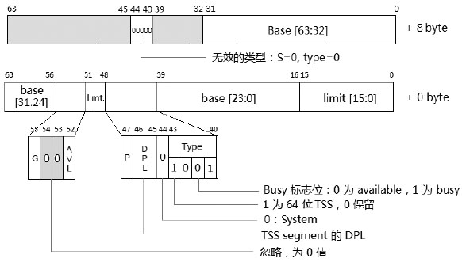

64 位 TSS 描述符的高 8 字节的 S 和 Type 域固定为 00000B(5 个 0 值). 这和 64 位 Call\-gate 描述符是相同的原理, 注意它的**Type 域是 1001B**值, 这和 32 位 TSS 描述符的值是一样的, 在**long\-mode**下这个值被解释为**64 位 TSS 描述符**.

#### 4.5.7.3. long-mode 下的 TR 加载

在**long\-mode**下**TR 不能使用隐式的加载**(**不能使用任务切换机制**), 因此**必须**使用**显式的加载(！！！但不是用来提供任务切换机制的！！！主要目的是为 stack 切换提供各权限的 stack 指针！！！**).

```assembly
mov ax, tss_sel             ;TSS selector
ltr                         ;加载 TR
```

这个**tss\_sel 不能为 Null selector**, 选择子的**TI 必须为 0**(**指示在 GDT 内**). **ltr 指令**只能在**0 级权限(！！！**)里执行, 这个 tss\_sel.RPL 被忽略不起作用.

处理器同样会对 TSS selector 和 TSS descriptor 进行 10.5.4.4 节 4 中所述的常规检查.

### 4.5.8. 使用 int 指令加载 CS 寄存器

在程序中使用**int 指令**主动发起**调用中断服务例程**, 处理器根据 **Vector 号**在 **IDT** 中获得**Interrupt Descriptor(中断描述符**). 中断描述符可以是 `Interrupt-gate`(**中断门**)、`Trap-gate`(**陷阱门**), 以及 `Task-gate`(**任务门**). 在 `long-mode` 下 `Task-gate` 已经被取消.

#### 4.5.8.1. IDTR 中断描述符表寄存器

IDTR 用来保存 IDT 的 base 地址和 IDT limit 值, 下面是 IDTR 的结构.


**IDTR 与前面所述的 GDTR 结构是完全一致的(！！！**), 内部只有 2 个组成部分: limit 域和 base 域. 在 long-mode 下 base 为 64 位, limit 固定为 16 位, 因此 IDT 最大的 limit 是 0xFFFF, base 可以在 linear address 空间的任何位置. **IDTR 也是没有不可见部分的！！！**


上图是 IDTR、IDT、GDT, 以及中断向量之间的关系. IDTR.base 提供 IDT 的基地址, IDTR.limit 提供 IDT 表限. vector 则是在 IDT 里访问 gate descriptor, 在 IDT 里的 gate 描述符提供目标代码段的 selector, 这个 selector 最终被加载到 CS 寄存器里, Code segment descriptor 也被加载到 CS 寄存器的 Cache 部分.

#### 4.5.8.2. Interrupt/Trap gate descriptor

在**legacy 模式**下, **每个 gate descriptor**是**8 字节 64 位宽**, gate 描述符属于系统级的描述符, Task\-gate 描述符在前面已经介绍过, 下面看看 Intrrupt\-gate 与 Trap\-gate**描述符**的结构.


Interrupt\-gate 与 Trap\-gate 描述符的结构是完全一致的, 只是**类型不同**. Interrupt\-gate 的类型值是 1110B(32 位 Interrupt\-gate)、0110B(16 位 Interrupt\-gate). Trap-gate 的类型值是 1111B(32 位 Trap\-gate)、0111B(16 位 Trap\-gate).

#### 4.5.8.3. 访问 gate descriptor

在**legacy 模式**下, IDT 里的 Interrupt/Trap\-gate 和 Task\-gate 描述符都是**8 字节**的, 因此使用**中断指令调用**时, **vector 乘上 8 再加上 IDTR.base 值**就得到**IDT 内的描述符位置**.

```assembly
int 0x40          ;描述符位置在 IDTR.base + 0x40 * 8
```

#### 4.5.8.4. 常规检查

在加载 CS 寄存器前处理器会检查以下内容.

1) 中断向量号访问是否超出 IDT 的 limit.

2) IDT 内的描述符是否属于这三种 gate 描述符类型之一.

3) 对 gate 描述符内的 Code segment selector 及目标 Code segment descriptor 做 10.5.4.4 节 1 中所描述的常规检查.

#### 4.5.8.5. 权限的检查

在中断调用中, 由于不使用 selector, 因此没有 RPL 权限的检查, 这里所需要的权限如下.

1) CPL <= gate 描述符的 DPL.

2) CPL >= 目标 Code segment 描述符的 DPL(由低权限进入高权限或相等权限).

在使用 Call-gate 进行调用的时候, 我们知道 CPL>=目标 Code segment 描述符的 DPL, 对于 Interrupt-gate 和 Trap-gate 有同样的限制.

如果需要让中断服务例程能在 3 级权限里调用, 那么 Interrupt/Trap-gate 或者 Taskgate 描述符的 DPL 应设为 3 级.

例如, int 0x40 指令能在用户代码里调用, 那么对应 IDT 内 0x40 号的中断描述符 DPL 应为 3.

#### 4.5.8.6. Interrupt/Trap-gate 与 Call-gate 的异同

Interrupt\-gate 和 Trap\-gate 具有许多与 Call\-gate 相同的地方.

1) 它们的权限检查除了 Interrupt/Trap\-gate 没有检查 RPL 之外, 其他都相同.

2) 执行目标代码的机制是相同的, 都是经由 gate 访问目标 Code segment.

不同之处如下.

1) **Call\-gate**可以放在**GDT/LDT**里, 不能放在 IDT 中. Interrupt/Trap\-gate**只能放在 IDT**里.

2) Interrupt/Trap\-gate 通过**int 指令**、**int3 指令**、**into 指令**、**bound 指令**以及发生中断和异常访问. 而 Call\-gate 通过**call 指令和 jmp 指令访问**.

>实验 10-5: 编写一个中断服务例程

在这个实验中, 我们将打印信息的库函数包装一下, 使用中断机制来访问, 每个函数定义一个系统服务例程功能号, 然后通过系统功能号来调用服务.

代码清单 10-12(lib\lib32.asm):

```assembly
; -------------------------------------------------------
;  system_service(): 系统服务例程, 使用中断 0x40 号调用进入
;  input:
;                 eax: 系统服务例程号
; --------------------------------------------------------
__system_service:
      mov eax, [system_service_table + eax * 4]
      call eax                                       ;  调用系统服务例程
      iret
; ******** 系统服务例程函数表 ***************
system_service_table:
      dd __puts                                           ;  0 号
      dd __read_gdt_descriptor                        ;  1 号
      dd __write_gdt_descriptor                       ;  2 号
```

在 lib\lib32.asm 模块里, \_\_system\_service()是系统服务例程的入口函数, 在开放给用户使用的接口中. 它经过 int 0x40 来调用, 作为实验, 这里只定义了 3 个系统服务例程功能号, 分别调用 puts()、read\_gdt\_descriptor()和 write\_gdt\_descriptor()函数. 这些功能号通过 eax 寄存器传递过来.

代码清单 10-13(lib\lib32.asm):

```assembly
; ------------------------------------------------------
;  set_user_interrupt_handler(int vector, void(*)()handler)
;  input:
;                 esi: vector,  edi: handler
; ------------------------------------------------------
      sidt [__idt_pointer]
      mov eax, [__idt_pointer + 2]
      mov [eax + esi * 8 + 4], edi                               ;  set offset [31: 16]
      mov [eax + esi * 8], di                                          ;  set offset [15: 0]
      mov DWORD [eax + esi * 8 + 2], kernel_code32_sel          ;  set selector
      mov WORD [eax + esi * 8 + 5], 0E0h | INTERRUPT_GATE32   ;  Type=interrupt gate,
P=1, DPL=3
      ret
```

函数\_\_set\_user\_interrupt\_handler()设置一个用户级的 Intrrupt-gate 描述符, 使得在 3 级权限里可以通过中断调用来调用服务例程.

代码清单 10-14(topic10\ex10-5\protected.asm):

```assembly
; ;  设置系统服务例程入口
      mov esi, SYSTEM_SERVICE_VECTOR             ;  向量号为 0x40
      mov edi, system_service                      ;  lib32 库接口函数
      call set_user_interrupt_handler
... ...
; ;  在用户代码里调用:
      mov esi, msg1
      mov eax, SYS_PUTS            ;  系统服务例程号 0
      int 0x40                        ;  调用系统服务
```

在调用 set\_user\_interrupt\_handler()函数设置 Interrupt\-gate 描述符后, 在用户级代码里通过 int 0x40 调用系统服务例程(本例中的 puts 函数), 结果是通过这个服务例程打印如下的一条信息.


通过 int 指令和 Call-gate 调用是进入系统服务例程使用 OS 系统资源的两种方式, 后面我们将会看到其他的方式.

#### 4.5.8.7. long-mode 下的 Interrupt/Trap-gate 描述符

在**long\-mode**下 Interrupt/Trap\-gate**描述符**是**16 字节**的, 如下所示.

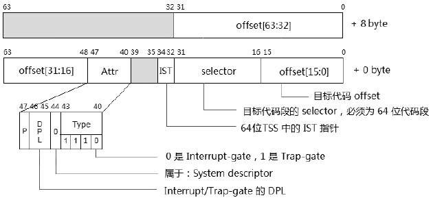

在 long\-mode(包括 64 位模式和 compatibility 模式)下**不存在 Task\-gate 描述符**, 在 IDT 里只有 Intrrupt/Trap-gate 描述符, 它们都是 16 个字节 128 位宽的.

#### 4.5.8.8. gate 的类型

在 long\-mode 下只有 64 位的 Interrupt\-gate 描述符, 类型值是**1110B**, 以及 64 位的 Trap\-gate 描述符, 类型值是 1111B, 不存在 32 位和 16 位.

#### 4.5.8.9. IST 指针域

Interrupt/Trap\-gate 描述符新增了一个**IST 域**, 共**3 位宽**, 在低 8 字节的 bit 34 到 bit 32 位里, 定义了一个 Interrupt Stack Table 指针, 这个值**对应**于**64 位 TSS**中的**IST1 到 IST7 域**(前面所提到的 64 位 TSS).

假如 Interrupt/Trap-gate 描述符里的 IST 值是**001B 到 111B 之间(即: 1 到 7**), 那么**发生中断或异常**切换到**中断处理程序**时, 它从**64 位 TSS 段里**取出**对应的 IST 指针值**(它为 Interrupt 处理程序**提供一个指定的 RSP 指针**).

当 Interrupt/Trap\-gate 描述符里的**IST 值是 0 值**时, 不使用 IST 机制, 将**从 64 位 TSS 段里相应的 RSP0、RSP1, 以及 RSP2 域获取 RSP 指针(即: 使用原来的方法**). 关于 IST 我们将在后面的 Stack 描述里详细探讨.

>实验 10-6: 在 Interrupt handler 里使用 IST 指针

在这个实验里, 将建立两个 Interrupt handler, 一个由 0x40 向量号调用, 一个由 0x41 向量号调用, 主体代码在 topic10\ex10-6\long.asm 文件里, 实验运行在 64 位模式下.

代码清单 10-15(topic10\ex10-6\long.asm):

```assembly
; ;  设置 system service
      mov rsi, SYSTEM_SERVICE_VECTOR                             ;  0x40
      mov rdi, system_service
      call set_user_interrupt_handler
; ;  设置 interrupt handler
      mov rsi, SYSTEM_SERVICE_VECTOR + 1                        ;  0x41
      mov rdi, interrupt_handler
      call set_user_interrupt_handler
;  修改 gate descriptor
      mov rsi, 0x41
      call read_idt_descriptor
      bts rax, 32                                                      ;  IST=1
      mov rsi, 0x41
      call write_idt_descriptor
```

上面代码修改 0x41 号中断 gate 描述符的 IST 域, 改为 1(即使用 IST1 指针), TSS 中的 IST1 值为 0FFFFFFFFFE10FF0h. 在用户代码里分别调用了 int 0x40 和 int 0x41 进行测试, 结果如下.


我们看到对于 0x40 号中断来说是使用 RSP0 值, 而 0x41 号中断是使用我们提供的 IST1 值.

### 4.5.9. 使用 int3、into, 以及 bound 指令加载 CS 寄存器

Int3 指令也是主动发起调用 Interrupt handler 的方式之一, 而 into 指令和 bound 指令是根据条件触发, 当满足条件时才引起异常 handler 的调用.

#### 4.5.9.1. #OF 异常

INTO 指令的有效性取决于**EFLAGS 寄存器的 OF 标志(溢出标志**), OF 置位时, 执行 INTO 指令产生#OF(Overflow)异常, 否则 INTO 指令不起作用. INTO 指令在 64 位模式里是无效的.

#### 4.5.9.2. #BP 异常

执行 INT3 指令将产生#BP(BreakPoint)异常, debugger(调试器)通常用来对被调试目标下断点, INT3 指令的 opcode 码是 0xCC, 与两个字节的 int 3 指令(opcode 码为 CD 03)有细微的差距(除了介入 virtual 8086 模式外, 其他一致).

#### 4.5.9.3. #BR 异常

BOUND 指令检查给出的 index 值在指定的范围内**是否有越界行为**, 如果越界就产生#BR 异常, BOUND 指令在 64 位模式里是无效的.

>实验 10-7: 测试 INTO、INT3 及 BOUND 指令

这三条指令分别在用户代码里进行测试, 它们在同一个源代码文件里, 下面是对 bound 指令的测试.

代码清单 10-16(topic10\ex10-7\protected.asm):

```assembly
; ;  测试 bound 指令
      mov eax, 0x8000                                     ;  这个值将越界
      bound eax, [bound_rang]                           ;  引发 #BR 异常
... ...
bound_rang        dd        10000h                         ;  给定的范围是 10000h 到 20000h
                  dd        20000h
```

bound 指令对 0x8000(在 eax 寄存器内)这个值在 10000h 到 20000h 范围内测试是否越界, 结果是向下越界了, 将产生#BR 异常(注意#BR 异常属于 Fault 类型, 意味着需要修正异常发生点). 下面是对 INTO 指令的测试.

代码清单 10-17(topic10\ex10-7\protected.asm):

```assembly
; ;  测试 INTO 指令
      mov eax, 0x80000000
      mov ebx, eax
      add eax, ebx                                             ;  产生溢出, OF 标志置位
      into                                                       ;  引发 #OF 异常
```

80000000h 加上 80000000h 的结果产生了溢出, OF 标志置位, 引发#OF 异常.

我们重点来关注#BP 异常, 断点异常是一个很有用处的异常, 在调试时, 调试器将插入 0xCC 字节到设定的断点位置, 下面是模拟调试器插入断点示意图.


在插入前需要保存断点位置上的原来值, 然后将断点位置上的字节改写为 0xCC 字节, 修改后, 这个断点就感觉是插入了一条 INT3 指令, 实际上是改写了断点上的字节. 改写后断点上的指令将发生改变, 如上图所示情形.

由于断点上的指令被改写了, 因而在 BP_handler 里需要恢复断点上原来的值, 否则程序代码将出现异常情况, 在后续的指令流里 90%以上会出现#UD 异常.

代码清单 10-18(topic10\ex10-7\protected.asm):

```assembly
; ;  断点调试的使用
      mov al, [breakpoint]                                ;  保存原字节
      mov BYTE [breakpoint], 0xcc                       ;  写入 int3 指令
breakpoint:
      mov esi, msg1                                         ;  这是断点位置, 引发 #BP 异常
      call puts
```

在上面的代码里, 断点的位置设在一条 mov 指令里, 断点的原值保存在 eax 寄存器里, 以便于在 BP handler 里用它来进行恢复.

代码清单 10-19(topic10\ex10-7\protected.asm):

```assembly
; --------------------------------------
;  BP_handler(): #BP handler
; --------------------------------------
BP_handler:
jmp do_BP_handler
bmsg1 db 10, 10, 10, '---> Now, enter #BP handler, Breakpoint at: ', 0
do_BP_handler:
      push ebx
      mov bl, al
      mov esi, bmsg1
      call puts
      mov esi, [esp + 4]   ;   返回值
      dec esi      ;   breakpoint 位置
      mov [esp + 4], esi   ;  修正返回值
      mov BYTE [esi], bl   ;  修复 breakpoint 数据
      call print_value
      pop ebx
      iret
```

上面是 BP\_handler 代码, 只是简单地输出一条信息, 然后恢复原断点上的字节, 保证后续执行成功, 注意, 这里需要将返回值修改为断点位置. 由于#BP 异常是 Trap 类型的异常, 它的返回值是断点的下一条指令, 所以这里需要恢复断点的执行.


上面是这三条指令的测试结果, 在 OF_handler 里还输出了发生#OF 异常时的 EFLAGS 寄存器的值.

实验的源代码在 topic10\ex10-7\目录下, 其中 OF\_handler 使用 dump_flags_value()函数来打印 eflags 寄存器的值, 实现在 lib\creg.asm 文件里.

### 4.5.10. 使用 RETF 指令加载 CS 与 SS 寄存器

从正常途径来说 RETF(远调用返回)**指令是与 FAR** **Call(远调用)指令配套的**, 可是 RETF 指令也常常单独使用.

```assembly
;进入 ring 3 代码
      push DWORD user_data32_sel | 0x3
      push DWORD USER_ESP
      push DWORD user_code32_sel | 0x3
      push DWORD user_entry
      retf
```

上面的代码被使用在**从 0 级切换到 3 级的场合**下, 实际上这也属于**伪造 Call\-gate 服务例程的返回环境**, retf 指令在执行时, 处理器会进行一系列的工作.

#### 4.5.10.1. 权限的处理

处理器会检查**stack 内的 CS selector 值**, 看是否需要进行**权限与 stack 的切换**.

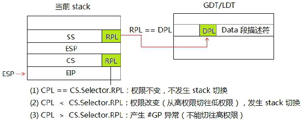

如上图所示, **当前的 CPL**与**当前 stack 栈内(！！！)的 CS selector.RPL**对比有三种情形.

1) 当**CPL=CS.selector.RPL**时, retf 指令将返回同级权限的代码, **权限不变**, **无须发生 stack 的切换**. 这意味着, 处理器不会 POP 出栈内的 ESP 和 SS 值.

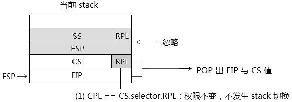

在返回同级代码这种情形下, 意味着你不需要压入 SS 与 ESP, 否则这将造成栈的不平衡.

2) 当**CPL \< CS.selector.RPL**时, 表明**目标代码是低权限级别(允许切换到低权限代码**), 接下来将发生**权限改变和进行 stack 的切换**.


处理器会比较**栈内的 CS.selector.RPL**和**SS.selector.RPL()是否相等**, 如果**不相等会产生\#GP 异常**, 当所有检查都通过后, 处理器会**依次 POP**出**EIP**、**CS**、**ESP**与**SS 值**, 转入执行**新代码**.

3) 当 CPL>CS.Selector.RPL 时, 意味着目标代码是高权限代码, 将产生\#GP 异常, **不能**使用**retf 指令切换到高权限(！！！**)上.


**只能通过 gate 形式(调用门也是！！！**)进入以及**使用 TSS**发起**任务切换到高权限代码(！！！**).

#### 4.5.10.2. Selector 与所使用的 Descriptor 的权限检查

1) SS selector 的 RPL 必须与所使用的 Data 段描述符的 DPL 相等.

2) 如果返回的目标代码是 conforming 类型的, 那么需要 CS selector 的 RPL>=Code 段描述符的 DPL.

3) 如果返回的目标代码是 non-conforming 类型的, 需要 CS selector 的 RPL 等于 Code 段描述符的 DPL.

#### 4.5.10.3. Selector 及 Descriptor 的类型检查

处理器还会对 Selector 及 Descriptor 做些类型的检查工作.

1) CS selector 与 SS selector 是否为 Null selector, 是的话将产生#GP 异常.

2) CS selector 与 SS selector 是否超出 GDT/LDT 的 limit.

3) 对 CS 与 SS 的段描述符进行检查: P 是否为 1, S 标志是否为 1(Code/Data 段).

4) 对 CS 所使用的段描述符来说, 描述符类型是否为 Code 段描述符.

5) 对 SS 所使用的段描述符来说, 描述符类型是否为 Data 段, 是否属于 Writable(可写).

#### 4.5.10.4. CS 与 SS 寄存器的加载

当权限检查和上面这些检查都通过后, 处理器会使用 selector 来加载 CS 与 SS 寄存器.

#### 4.5.10.5. 隐式的 Null selector 加载

在前面提到当使用 retf 指令或 iret 指令返回到低权限代码时, 处理器会为 ES、DS、FS 及 GS 寄存器隐式地加载 Null selector, 进入低权限代码后应该重新加载这些段寄存器.

### 4.5.11. 在 long-mode 下使用 RETF 指令

在**long\-mode(IA\-32e**)下的返回机制和 legacy 模式下是一致的, 由于 long\-mode(IA\-32e)下有两个子模式: 64 位模式和 compatibility 模式, 因而增加了一些隐晦的地方.


当前代码运行在**64 位模式**, 处理器会**检查在 stack 中的 CS selector(也就是原来的 CS！！！**), 根据这个 selector 所引用的**Code segment descriptor(代码段描述符！！！**)指示出**返回到 64 位模式还是 compatibility 模式**. 当返回的目标代码段描述符的**L=0**时, 将返回到 compatibility 模式, 当**L=1**时 D 标志位必须为 0, 指示返回到 64 位模式.

#### 4.5.11.1. 从 64 位模式返回到 64 位模式

这是最为常见的情形, 除了 legacy 模式下的检查外, 处理器会额外检查如下内容.

1) 栈中的**RIP 与 RSP 值**是否属于 canonical 地址形式(详见第 2 章中的 canonical 地址描述), 不是的话产生\#GP 异常.

2) 栈中的**SS selector**是否属于 03H(即: 3 级权限下的 Null selector), 如果为 3 则产生#GP 异常(详见前面关于 Null selector 所述). 如果**切换到相应的 0 级、1 级或 2 级**, 那么 0、1 或 2 将是允许的**Null selector**.


retf 指令的**默认操作数是 32 位**的, 因此返回到 64 位代码, **retf 指令**需要在前面额外**手工加上 REX 前缀 0x48 字节(REX.W=1！！！**), 否则只能 pop 出 32 位的值.

```assembly
;; 切换到用户代码
      push USER_SS | 3
      push USER_RSP     ;  RSP 值在 32 位内
      push USER_CS | 3                    ;  3 级权限
      push user_entry
      db 0x48                                ;  REX prefix
      retf
```

上面这个代码切换到 64 位的 3 级用户代码里, 进入 3 级代码后, ES、DS、FS 和 GS 都会被隐式地装入 Null selector, 但是在 64 位模式下, 这些 Null selector 并不需要去理会, 处理器不检查 Null selector 的使用.

上面代码中的 RSP 在 32 位值范围内可直接使用 push 指令压栈. 如果使用 64 位的 RSP 值, 必须通过使用寄存器来压栈.

```assembly
; ;  切换到用户代码
      push USER_SS | 3
       mov rax, USER_RSP        ;  使用 64 位的 RSP 值
      push rax          ;  通过 rax 寄存器压入 64 位的 RSP 值
      push USER_CS | 3                       ;  3 级权限
       mov rax, user_entery     ;  使用 64 位的入口地址
      push rax         ;  压入 64 位的入口地址
      db 0x48                                   ;  REX prefix
      retf
```

这是由于 push 指令并不支持 64 位的立即数操作数, 只能通过寄存器来进行压栈操作. 同理, 当入口地址是 64 位地址, 也必须通过寄存器来压栈, 切记！

#### 4.5.11.2. 从 64 位模式返回到 compatibility 模式

如果返回到 compatibility 模式, 处理器的检查机制将和 legacy 模式下完全一致, 在返回 compatiblity 模式里时需要注意目标地址问题.


1) 需要为目标代码准备 32 位或 16 位的 Code segment descriptor, 即描述符的 L=0, D 标志位取决于返回是 32 位还是 16 位: D=1 时是 32 位, D=0 时是 16 位.

2) 目标代码必须为 4G 范围内, 需要为目标代码准备 32 位的 EIP 和 ESP 值(stack 内的 64 位值里低 32 位是有效的目标代码进入点), 如果在返回前压入的是 64 位的目标地址值, 那么返回后将由于使用截取低 32 位值而造成错误的指令边界.

>实验 10-8: 从 64 位里返回到 compatibility 模式

下面是一个简单的实验, 实验代码将从 protected.asm 模块转入到 long.asm 模块里, 这个模块运行在 64 位模式.

代码清单 10-20(topic10\ex10-8\long.asm):

```assembly
; ;  切换到 compatibility mode(进入 3 级)
      push user_data32_sel | 3
      push COMPATIBILITY_USER_ESP
      push user_code32_sel | 3
      push compatibility_entry
      retf64           ;  统一使用 retf64 宏
; ;   下面是 32 位的 compatibility 模式代码
      bits 32
compatibility_entry:
      mov ax, user_data32_sel | 3
      mov ds, ax
      mov es, ax
; ;  通过 stub 函数从 compatibility 模式调用 call gate 进入 64 位模式
      mov esi, cmsg1
      mov eax, LIB32_PUTS                                       ; ;  功能函数号
      call compatibility_lib32_service                        ; ;  stub 函数形式
      jmp $
      cmsg1        db '---> Now: enter compatibility mode', 10, 0
```

代码的前一段是 64 位代码, 使用 retf 指令(宏定义了 retf64, 这个宏定义在 inc\CPU.inc 文件里)进入到 32 位的 3 级 compatibility 模式代码, 注意由于后面一段是 32 位代码, 因而需要用 bits 32 指示编译器编译为 32 位的代码.

进入 compatibility 模式后重新对 DS 和 ES 寄存器行了装载, 然后调用一个 compatibility\_lib32\_service 接口函数, 这个函数运行在 64 位模式, 是 lib64 模块提供的对外服务接口, 为了避免重复工作, 实际上在这个 64 位的服务函数里调用了 32 位的 lib32 模块的函数. compatibility\_lib32\_service()接口函数实现在 lib\lib64.asm 模块里.

实验的结果是使用 compatibility\_lib32\_service()来打印如下的一条信息.


#### 4.5.11.3. 从 compatibility 模式返回到 64 位模式

从 32 位的 compatibility 模式返回到 64 位模式, 同样会遇到目标地址的问题. 如果需要返回到 4G 以上的空间执行, 那么需要一些中间跳转过程.


在 32 位的 compatibility 模式下, 由于栈内的 EIP 值是 32 位, 执行 retf 指令后只能返回到 4G 内的代码, 因此可以设置一条 jmp 指令提供大于 4G 的地址, 然后跳到高于 4G 的空间.

```assembly
entry64_stub:
      mov rax, entry64      ;  64 位入口
      jmp rax         ;  跳转到高于 4G 的空间
      ... ...
```

返回到 64 位模式, 处理器同样会做额外检查.

1) 栈中的 RIP 与 RSP 值是否属于 canonical 地址形式(详见第 2 章中的 canonical 地址描述), 不是的话产生#GP 异常. 但是对于 compatibility 模式下来说, 栈中的 32 位 ESP 与 EIP 值必定属于 canonical 地址形式. 实际上无须进行检查.

2) SS selector 是否属于 03H, 即 3 级权限下的 Null selector, 如果为 3 则产生#GP 异常(详见前面关于 Null selector 所述). 如果切换到相应的 0 级、1 级或 2 级, 那么 0、1 或 2 将是允许的 Null selector.

同样, 如果从高权限返回到低权限里会为 ES、DS、FS 和 GS 寄存器隐式加载一个 Null selector.

>实验 10-9: 从 compatibility 里返回到 64 位模式

这个实验与实验 10-8 的操作相反, 在这里我们选择先从 64 位模式切换到 compatibility 模式, 然后从 compatibility 模式返回 64 位模式.

代码清单 10-21(topic10\ex10-9\long.asm):

```assembly
; ;  从 64 位切换到 compatibility mode(权限不改变, 0 级)
      jmp QWORD far [compatibility_pointer]
compatibility_pointer:
            dq compatibility_kernel_entry              ;  64 bit offset on Intel64
            dw code32_sel
```

为了达到实验目的, 这里先使用 jmp 指令提供一个 far pointer 来切换到 compatibility 模式, 这是个平级的切换. 来到 compatibility 模式后也是 0 级权限.

在 Intel64 中, 在 64 位操作数下 far pointer 是 80 位(16: 64)宽, 在 AMD64 中 far pointer 是 48 位(16: 32)宽.

接下来在 compatibility 模式代码里使用 retf 指令返回到 3 级权限的 64 位模式里.

代码清单 10-22(topic10\ex10-9\long.asm):

```assembly
      bits 32
; ;  0 级的 compatibility 代码入口
compatibility_kernel_entry:
      mov ax, data32_sel
      mov ss, ax
      mov ds, ax
      mov es, ax
      mov esp, COMPATIBILITY_KERNEL_ESP
      jmp compatibility_entry
; ;  3 级的 compatibility 代码入口
compatibility_user_entry:
      mov ax, user_data32_sel | 3
      mov ds, ax
      mov ss, ax
      mov es, ax
      mov esp, COMPATIBILITY_USER_ESP
compatibility_entry:
; ;  通过 stub 函数从 compatibility 模式调用 call gate 进入 64 位模式
      mov esi, cmsg1
      mov eax, LIB32_PUTS
      call compatibility_lib32_service                        ; ;  stub 函数形式
; ;  现在切换到 3 级 64 位模式代码
      push USER_SS | 3
      push COMPATIBILITY_USER_ESP
      push USER_CS | 3
      push user_entry
      retf
cmsg1        db '---> Now: enter compatibility mode', 10, 0
```

这里修改了 compatibility 代码开头, 为 compatibility 模式代码提供了两个入口, 一个是 0 级的入口, 一个是 3 级的入口, 那么现在就可以使用 retf 指令返回到 3 级的 compatibility 模式里, 也可以使用 jmp 指令切换到 0 级的 compatibility 模式里. 这样做的目的是为 SS、DS 等寄存器选择正确的权限描述符进行加载.

在代码的未尾是使用 retf 指令返回到 3 级权限的 64 位模式代码里.


结果显示先进入了 compatibility 模式, 然后返回到 64 位的用户代码.

从 64 位切换到 compatibility 模式, 或者从 compatibility 切换到 64 位模式, 在权限不变的前提下可以使用 jmp 指令. 然而在 64 位操作数下, 由于 AMD64 的机器上 far pointer 是 48 位(16: 32), 而 Intel64 机器上是 80 位(16: 64), 因而为了通用性, jmp 指令统一使用 32 位操作数或者使用 retf 指令切换(或 iretq 指令)是一个不错的做法.

#### 4.5.11.4. Jmp 指令在 64 位操作数下的变通

如果坚持使用 64 位的操作数来执行 jmp 指令, 那么可以有下面的逻辑处理手法.

```c
      if (processor == INTEL64)      ;  判断是 Intel 还是 AMD
      {
            rax=intel64_compatibility_pointer
      } else if (processor == AMD64)
      {
            rax=amd64_compatibility_pointer
      }
      jmp QWORD far [rax]               ;  固定使用 64 位操作数
intel64_compatibility_pointer:
            dq compatibility_kernel_entry               ;  64 bit offset on Intel64
            dw code32_sel
amd64_compatibility_pointer:
            dd compatibility_kernel_entry               ;  32 bit offset on AMD64
            dw code32_sel
```

上面是使用 jmp 指令进行切换时的一个逻辑做法: 先判断是 Intel 还是 AMD 的处理器. 由于 64 位操作数下 Intel 与 AMD 使用不同长度的 far pointer, 因而应该为两个平台准备相应长度的 far pointer.

#### 4.5.11.5. Jmp 指令使用 32 位操作数

在 32 位操作数下, far pointer 都是 48 位宽(16: 32 形式). 在切入 compatibiltiy 模式的情形里, 由于 compatibility 模式使用 32 位的入口地址. 因此, 实际上统一使用 32 位的操作数是最好的解决方法.

```assembly
      jmp DWORD far [rax]       ;  强制使用 32 位操作数
compatibility_pointer:
      dd compatibility_kernel_entry    ;  32 位的入口地址
      dw code32_sel
```
jmp 指令统一使用 32 位操作数, 无论在 Intel 还是 AMD 平台上都能用.

#### 4.5.11.6. 使用 retf 指令来切换

另一个通用做法是, 使用 retf 指令来切换到同级的 compaitibility 模式.

```assembly
;; 从 64 位切换到同级 compaitbility 代码
      push code32_sel        ;  同级
      push compatibility_kernel_entry    ;  32 位 EIP 值
      db 48h          ;  REX prefix(使用 64 位操作数)
      retf           ;  far return 指令
```

上面的代码在栈上压入了 compatibility 代码的 far pointer, 这些 32 位的值会被符号扩展到 64 位压入栈中. 使用 retf 指令来切换, 在无论 Intel 还是 AMD 的机器上都是正确的.

### 4.5.12. 使用 IRET 指令加载 CS 和 SS 寄存器

在前面我们看到了伪造一个任务嵌套环境使用 iret 指令进行任务切换, iret 指令使用 TSS selector 从 TSS 段中加载 CS 和 SS 寄存器. 在这一节里我们使用 iret 指令进行正常的中断返回调用. 使用**iret 指令返回**实际上也属于**伪造一个中断 handler 返回环境**.


使用**IRET 指令**与使用**RETF 指令**的情形几乎一致, 除了在**中断调用发生**时, 处理器额外**压入 EFLAGS 寄存器**外. 对于**一些异常**的发生, 处理器还将**压入 Error Code**, 那么在中断 handler 里需要主动 POP 出这个 Error Code, 否则返回将失败.

对于权限的检查, 以及 selector 与 descriptor 的检查, 和使用 RETF 指令是一样的. 当**进入中断**handler**不发生权限改变**时, 处理器**只依次压入 EFLAGS 寄存器、CS selector、EIP 值或者 Error Code(某些异常**).

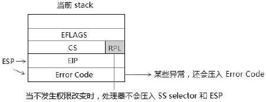

前面我们已经知道, **当 EFLAGS.NT 标志置位**时, **IRET 指令**会使用**TSS 段内 Previous Task Link 域**提供的**TSS selector 进行任务切换**. 我们可以**清 NT 标志**, 而**使用 IRET 中断返回机制**.

#### 4.5.12.1. 使用 IRET 指令返回

在前面使用 retf 指令**从 0 级代码返回到 3 级权限**的例子里, **也可以改用 iret 指令**来代替. 区别是**多压入一个 EFLAGS 寄存器**.

```assembly
;  进入 ring 3 代码
      push DWORD user_data32_sel | 0x3
      push DWORD USER_ESP
      pushf                                 ;压入 EFLAGS 值
      push DWORD user_code32_sel | 0x3
      push DWORD user_entry
      iret                                  ;使用 iret 指令切换到 3 级代码
```

上面这段代码将 retf 使用的场合改为使用 iret 指令, 增加了一条 EFLAGS 寄存器的压入指令, 实际效果是完全一致的.

### 4.5.13. 在 long-mode 下使用 IRETQ 指令

在**64 位模式下**的**压栈行为**与**legacy 模式及 compatibility 模式**有较大区别: 当发生**中断/异常**时, 无论**是否发生权限改变**, 处理器都**压入 SS 与 RSP 值**.


同样**iretq 指令**也会**无条件地 POP 出 SS 与 RSP 值**. 在 long\-mode 里中断处理程序的**栈指针是 64 位宽**的, 在 compatibility 模式下发生中断/异常, 处理器会切入到 64 位模式下的中断处理程序. 在 64 位模式下中断处理程序使用 IRETQ 指令返回(64 位的操作数).

>可是, 我们依然可以在 32 位的 compatibility 模式的代码里使用 iret 指令返回到 64 位模式.

注意这里的区别: 1) 在中断 handler 里需使用**64 位操作数的 IRETQ 指令**(因为中断 handler 是执行在 64 位模式下). 2) 在用户的 compatibiltiy 模式代码中需使用 IRET 指令(32 位的操作数).

下面几个情形与 RETF 指令的使用是一致的.

#### 4.5.13.1. 使用 IRETQ 指令从 64 位模式返回到 64 位模式

下面是从 0 级权限返回到 3 级权限下, 在这里的结构与 legacy 下是完全一致的.

```assembly
push USER_SS | 3
push USER_RSP
pushfq
push USER_CS | 3
push user_entry
iretq                                       ;  使用 64 位操作数, 返回到 3 级权限
```

区别只是使用了 64 位宽度. 这里**IRETQ 指令**是**IRET 指令的 64 位别名**, 只是在**机器码前面加上了 REX 前缀**.

#### 4.5.13.2. 使用 IRETQ 指令从 64 位模式返回到 compatibility 模式

同样, 当使用 iretq 指令从 64 位返回到 compatibility 模式时, 需要提供 4G 内的入口地址.

```assembly
; ;  使用 iret 切换到 compatibility mode(进入 3 级)
      push user_data32_sel | 3
      push USER_RSP
      pushfq
      push user_code32_sel | 3       ;用户 compatibility 模块入口
      push compatibility_user_entry
      iretq            ;  使用 64 位操作数
```

栈中入口地址的低 32 位必须是有效的 4G 内地址值. 返回到 compatibility 模式与返回到 64 位模式的区别只是使用了 32 位的 compatibility 模式代码段(Code 段描述符的 L 标志为 0, D 标志为 1). 这与 RETF 指令使用的情形是一样的.

必须注意的是, 在 64 位模式下, 不论是否发生权限切换, 必须无条件压入 SS 与 RSP 值！

#### 4.5.13.3. 使用 IRET 指令从 compatibility 模式返回到 64 位模式

在这里需要使用 32 位的 IRET 指令(因为当前执行在 32 位的 compatibility 模式下), 提供 4G 范围内的返回地址值(因为栈中的值是 32 位).

```assembly
;;使用 iret 指令从 3 级 compatibility 模式切换到 3 级 64 位模式
      pushf      ;压入 eflags 值
      push USER_CS | 3         ;在 4G 范围内
      push user_entry
      iret                     ;使用 32 位操作数, 返回到 64 位模式
```

实验 10-10 的源码在 topic10\ex10-10\long.asm 文件里, 这里不再列出.

>实验 10-10: 使用 iret 指令进行切换

结果如下.


与实验 10-9 的结果是完全一致的, 在表面上根本看不出来, 在实际代码里, 一个是使用 RETF 指令, 另一个是使用 IRET 指令. 另外的区别是, 在实验 10-9 里先使用 jmp 指令从 0 级的 64 位模式切换到 0 级的 comaptibility 模式里, 再从 0 级的 compatibility 模式返回到 3 级的 64 位模式. 而实验 10-10 里, 是先使用 IRETQ 指令从 0 级的 64 位模式返回到 3 级的 compatibility 模式, 再使用 IRET 指令从 3 级的 compatibility 模式返回到 3 级的 64 位模式.

### 4.5.14. 使用 SYSENTER/SYSEXIT 指令加载 CS 与 SS 寄存器

**sysenter 与 sysexit 指令**是处理器提供**快速切入 0 级代码**及**快速返回到 3 级代码**的一对指令.


上图是 sysenter/sysexit 指令使用的**三个 MSR**, 它在前面的第 7 章介绍过.

- 在**Intel64**中, **SYSENTER/SYSEXIT 指令**可以使用在**long\-mode**里,
- 在**AMD64**中**只能**使用在**legacy 模式**.

**IA32\_SYSENTER\_CS 寄存器**将会提供**4 个 selector**值.

1) 进入时目标代码的 CS selector, 它等于 IA32\_SYSENTER\_CS[15: 0].

2) 进入时目标代码的 SS selector, 它等于 IA32\_SYSENTER\_CS[15: 0]+8.

3) 返回时目标代码的 CS selector, 它等于 IA32\_SYSENTER\_CS[15: 0]+16.

4) 返回时目标代码的 SS selector, 它等于 IA32\_SYSENTER\_CS[15: 0]+24.

#### 4.5.14.1. 使用 SYSENTER 指令进入 0 级权限代码

**sysenter 指令**可以**执行于任何权限**中, 但是**不要企图在非 3 级(CPL！=3)权限下使用 sysenter 指令**, 因为 **sysexit 指令会强制返回到 3 级！！！** 权限里(当然: 在不使用 sysexit 指令返回时可以这么做！), 这里会造成严重错误.

在**执行 sysenter 指令**时, 处理器会**强制对 CS 和 SS 寄存器的加载**进行一些处理.

1) **CS 寄存器**被设置为: CS.Selector.RPL=0, **CS.Base=0**, CS.Limit=FFFFFFFFH. 而 CS 的 Attribute 域则被设为: G=D=P=S=1, DPL=0, CS.Attribute.Type 被设为 1011B(Excute/Readable, Accessed)类型.

2) **SS 寄存器**被设置为: SS.Selector.RPL=0, **SS.Base=0**, SS.Limit=FFFFFFFFH. SS 的 Attribute 域也被设置为: G=D=P=S=1, DPL=0, 类型设为 0011B(Writable, Expandup, Accessed)

注意: 处理器并**不去 GDT 里读 segment descriptor**, 而是**直接对 CS 和 SS 寄存器进行强制设置**.

比较有意思的是, 在**IA32\_SYSENTER\_CS 寄存器里只要不是 Null selector**, 其他值都可以.

```assembly
mov eax, 0x10 | 3               ;selector 为 0x13
mov ecx, IA32_SYSENTER_CS
wrmsr                           ;设置 IA32_SYSENTER_CS
```

**即使 CS selector 被设为 0x13 值**, 这个**selector 的 RPL 为 3**, 并且它是 Data 段描述符的 selector 也没问题. 这是因为处理器**根本不去 GDT/LDT 中读取描述符**.

胡乱给 IA32\_SYSENTER\_CS 设一个值, 要小心处理. 在以后的代码执行流里**如果出现了 stack 切换**时, 一个**混乱的值会引发\#GP 异常**的产生.

在**正常的情况下不要对 IA32\_SYSENTER\_CS 随便设一个值**, 以防后续处理出现问题.

代码清单 10-23(lib\lib32.asm):

```assembly
; -----------------------------------------------------
;  set_sysenter(): 设置系统的 sysenter/sysexit 使用环境
; -----------------------------------------------------
__set_sysenter:
      xor edx, edx
      mov eax, KERNEL_CS
      mov ecx, IA32_SYSENTER_CS
      wrmsr                                                    ;  设置 IA32_SYSENTER_CS
      mov eax, KERNEL_RSP0
      mov ecx, IA32_SYSENTER_ESP
      wrmsr                                                    ;  设置 IA32_SYSENTER_ESP
      mov eax, __sys_service
      mov ecx, IA32_SYSENTER_EIP
      wrmsr                                                    ;  设置 IA32_SYSENTER_EIP
      ret
```

这个 set\_sysenter()提供在 lib\lib32.asm 文件里, 对 sysenter/sysexit 使用环境做出配置.

#### 4.5.14.2. 使用 SYSEXIT 指令退回到 3 级权限代码

**sysexit 只能执行在 0 级权限的代码(！！！**)里, 处理器同样对 CS 和 SS 进行强制的设置.

1) CS 寄存器被设置为: CS.Selector.**RPL=3**, **CS.Base=0**, CS.Limit=FFFFFFFFH. 而 CS 的 Attribute 域则被设为: G=D=P=S=1, DPL=3, CS.Attribute.Type 被设为 1011B(Excute/Readable, Accessed)类型.

2) SS 寄存器被设置为: SS.Selector.**RPL=3**, **SS.Base=0**, SS.Limit=FFFFFFFFH. SS 的 Attribute 域也被设置为: G=D=P=S=1, DPL=3, 类型设为: 0011B(Writable, Expandup, Accessed).

所不同的是, **sysexit 指令**将**CS 和 SS 寄存器的权限设为 3 级**. 而**sysenter 指令设为 0 级**.

**sysexit 指令**会使用**ECX 寄存器**与**EDX 寄存器**.

1) 3 级代码的**ESP 值**放在**ECX 寄存器**里.

2) 3 级代码的**EIP 值**放在**EDX 寄存器**里.

因此, 在使用 sysenter 指令进入前, 需要为返回代码对 ECX 和 EDX 寄存器进行预先的设置.

代码清单 10-24(lib\lib32.asm):

```assembly
; --------------------------------------------------------
;  sys_service(): 使用 sysenter/sysexit 版本的系统服务例程
;  input:
;                 eax: 系统服务例程号
; --------------------------------------------------------
__sys_service:
      push ecx                                                ;  保存返回 esp 值
      push edx                                                ;  保存返回 eip 值
      mov eax, [system_service_table + eax * 4]
      call eax                                                ;  调用系统服务例程
      pop edx
      pop ecx
      sysexit
```

如上面的代码, 在 0 级的系统服务例程里应该先要保存这两个值(需要使用到 ECX 和 EDX 寄存器), 在返回前恢复这两个值.

#### 4.5.14.3. 非对称地使用 sysenter/sysexit 指令

值得注意的是: **有些 OS**的**系统服务例程的调用只使用了 sysenter 指令**进入, 而在某些情况下并没有使用 sysexit 指令返回. 这种非对称的使用为系统服务例程调用机制提供了某些灵活性.

#### 4.5.14.4. 设置一个 stub 函数

**多数情况**下并**不在代码**里**直接使用 sysenter 指令**, 而是将 sysenter 指令**封装**起来, 设置一个 stub 函数作为中转站.

代码清单 10-25(lib\lib32.asm):

```assembly
; ---------------------------------------------------
;  sys_service_enter(): 快速切入 service 的 stub 函数
; ---------------------------------------------------
__sys_service_enter:
      mov ecx, esp              ;返回代码的 ESP 值
      mov edx, return_address   ;返回代码的 EIP 值
      sysenter                  ;进入 0 级 service
return_address:
      ret
```

这个**sys\_service\_enter**()实现在 lib\lib32.asm 文件里, **EDX 寄存器**设置为**sysenter 指令的下一条指令**, 这是为了**正常返回到指令流**里.

```assembly
mov esi, msg1
mov eax, SYS_PUTS                  ;  系统功能号
call sys_service_enter            ;  sysenter 指令 stub 函数
```

在用户代码里就可以像上面一样调用这个 stub 函数, sysenter 指令被包装起来, 看起来和平常的函数没区别.

在 lib\lib32.asm 文件里有两个系统服务接口函数, 一个是\_\_sys\_service()函数, 使用了 sysenter/sysexit 指令来调用/返回. 另一个是\_\_system\_service()函数, 它使用 int 0x40 指令来调用. 两个系统服务接口实现相同的功能.

上面的调用也可以使用以下的方式.

```assembly
mov esi, msg1
mov eax, SYS_PUTS                  ;  系统功能号
int 0x40                             ;  使用中断调用进入系统服务例程
```

**现在的 OS**都支持使用快速的切入系统服务例程方式. 而**中断调用**虽然是一种旧式并且较慢的系统服务例程调用方式, 但是可以在**任意权限**下执行, 这是使用 sysenter/sysexit 指令快速调用方式做不到的(除了使用非对称的 sysenter/sysexit 指令外, 下面的描述排除了非对称使用 sysenter/syexit 指令的情形), 原因如下.

#### 4.5.14.5. 在 3 级权限里使用 sysenter 调用

由于 sysexit 返回到 3 级权限里, 因此在非 3 级权限代码里使用 sysenter 会遇到很大问题. 假如在 0 级代码里使用 sysenter 进入服务例程, 而 sysexit 返回时会强行变成 3 级权限. 因此, 必须保证从 3 级代码里使用 sysenter 进入系统服务例程.

### 4.5.15. 在 IA-32e 模式下使用 SYSENTER/SYSEXIT 指令

在 AMD64 机器上 sysenter/sysexit 不能使用在 long\-mode 下, 所以这里使用了 IA-32e 术语(Intel64 的术语). 在 IA\-32e 模式下, CS 和 SS selector 获取起了些变化.


sysenter 指令进入时, CS 和 SS selector 的获取方法不变, 在 sysexit 返回时, 根据返回的模式而决定如何获取. 如果返回到 compatibility 模式则和 legacy 模式下是一致的. 而在返回 64 位模式时, CS selector 是 IA32\_SYSENTER\_CS+32, 而 SS selector 是 IA32\_SYSENTER\_CS+40. 实际上就等于扩展了为 64 位环境所使用的 selector 值.

在配置 sysenter/sysexit 使用环境时, GDT/LDT 中 Code segment descriptor 与 Data segment descriptor 应组织如下.

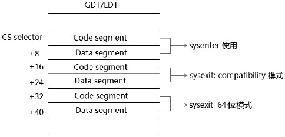

实际上是 64 位模式返回的 Code segment 和 Data segment 描述符排列在 compatibility 模式的后面.

IA32\_SYSENTER\_ESP 和 IA32\_SYSENTER\_EIP 寄存器的地址值是 64 位宽, 处理器会检查是否属于 canonical 地址形式.

#### 4.5.15.1. 设置 IA-32e 模式里的 sysenter/sysexit 使用环境

这个设置几乎与 legacy 模式下是一致的, 可是需要注意以下几点.

1) 由于 IA-32e 模式的 sysexit 指令为了返回 64 位模式而相应增加了 2 个 selector, 因此在 GDT/LDT 里的 Code Segment descriptor 与 Data Segment descriptor 的位置要相应做出调整(或另外增加 2 个描述符), 以适应 sysexit 指令的使用.

2) 进入 0 级目标代码的地址需要是 64 位的 canonical 地址, 目标代码必须为 64 位模式.

代码清单 10-26(lib\lib64.asm):

```assembly
; ----------------------------------------------------------------
;  set_sysenter():                long-mode 模式的 sysenter/sysexit 使用环境
; ----------------------------------------------------------------
__set_sysenter:
      xor edx, edx
      mov eax, KERNEL_CS
      mov ecx, IA32_SYSENTER_CS
      wrmsr                                                        ;  设置 IA32_SYSENTER_CS
      mov rdx, KERNEL_RSP
      shr rdx, 32
      mov rax, KERNEL_RSP
      mov ecx, IA32_SYSENTER_ESP
      wrmsr                                                        ;  设置 IA32_SYSENTER_ESP
      mov rdx, __sys_service
      shr rdx, 32
      mov rax, __sys_service
      mov ecx, IA32_SYSENTER_EIP
      wrmsr                                                        ;  设置 IA32_SYSENTER_EIP
      ret
```

在设置 sysenter/sysexit 的执行环境时, 需要为 sysexit 指令的返回做出考虑. 在这里统一使用 sysexit 指令返回到 64 位模式的设置. 这个设置函数在 lib\lib64.asm 文件里, 与 32 位的设置环境几乎是一致的, 只是 RSP 与 RIP 是 64 位值.

#### 4.5.15.2. 使用 SYSENTER 指令进入 0 级 64 位代码

同样, 处理器会对 CS 和 SS 寄存器做出强制的设置.

1) 对于 CS 寄存器: CS.Selector.RPL=0, CS.Base=0, CS.Limit=FFFFFFFFH, 而 Attribute 域中, DPL=0, G=P=S=1, L=1 并且 D=0, Type 被设为: 1011B 值(Execute/Readable, Accessed)类型.

2) 对于 SS 寄存器: SS.Selector.RPL=0, SS.Base=0, SS.Limit=FFFFFFFFH. 而 Attribute 域中, DPL=0, G=D=P=S=1, Type 被设为: 0011B 值(Writable, Expand-up, Accessed)类型.

与 legacy 模式唯一的不同是 CS 寄存器设置为 L=1 并且 D=0, 指示目标代码将是 64 位模式的代码. 可是与 legacy 模式下使用相比, 在 IA-32e 模式下使用增加了几个情形.

1) 从 64 位模式进入 64 位模式.

2) 从 compatibility 模式进入 64 位模式.

3) 从 64 位模式返回 64 位模式.

4) 从 64 位模式返回到 compatibility 模式.

sysenter 指令必定进入 64 位模式, 而返回则不一样了. 实际上, 这与前面所述的使用 Call-gate、retf 指令以及 iret 指令, 在 long-mode 下遇到的切换情形是一样的.

#### 4.5.15.3. 从 64 位模式进入 0 级 64 位模式

这是在一个 64 位模式代码里使用 sysenter 指令进入 0 级 64 位模式, 我们设置了一个 stub 函数以供在 3 级 64 位模式下使用:

代码清单 10-27(lib\lib64.asm):

```assembly
; -----------------------------------------------------
;  sys_service_enter():         系统服务例程接口 stub 函数
;  input:
;                 rax: 系统服务例程号
; -----------------------------------------------------
__sys_service_enter:
      mov rcx, rsp
      mov rdx, return_64_address
      sysenter
return_64_address:
      ret
```

除了地址值扩充为 64 位外, 其他和 legacy 模式下的 stub 是一致的. 这个 stub 只能为 64 位代码服务.

#### 4.5.15.4. 从 compatibility 模式进入 0 级 64 位模式

为了能在 compatibility 下使用, 我们还需为 compatibility 模式编写另一个 stub 函数.

代码清单 10-28(lib\lib64.asm):

```assembly
      bits 32
; -------------------------------------------------------------
;  compatibility_sys_service_enter(): compatibility 模式下的 stub 函数
; ----------------------------------------------------------------
__compatibility_sys_service_enter:
      mov ecx, esp
      mov edx, return_compatibility_address
      sysenter
return_compatibility_pointer:        dq compatibility_sys_service_enter_done dw user_code32_sel | 3
return_compatibility_address:
      bits 64
      jmp QWORD far [return_compatibility_pointer]  ;  从 64 位切换回
; compatibility 模式
compatibility_sys_service_enter_done:
      bits 32
      ret
```

由于是从 32 位的 compatibility 模式代码里使用, 因此, 需要编译为 32 位, 在函数开头使用 bits 32 指示字. 然而值得注意的是, 在这里系统服务例程将统一使用 sysexit 指令返回到 64 位模式. 因此, 在这个 compatibility 模式使用的 stub 函数里, 需要重新从 64 位模式切换到 compatibility 模式(在返回前).

#### 4.5.15.5. 使用 SYSEXIT 指令返回

在 IA\-32e 模式下, sysexit 指令返回情形发生了很大的变化.

sysexit 指令如何确定是返回 64 位模式还是 compatibility 模式?

是根据 sysexit 指令的操作数大小, 与 retf 指令一样, 在 64 位模式下 sysexit 指令的默认操作数不是 64 位的. 所不同的是, retf 与 iretq 指令根据 Stack 内的 CS selector 所引用的 code segment descriptor 来确定返回到哪种模式. 而 sysexit 指令只能根据 sysexit 的操作数大小.

```assembly
db 0x48                           ;  REX prefix 字节
sysexit                           ;  返回到 64 位 模式
sysexit                           ;  返回到 compatibility 模式
```

处理器会强制设置 CS 和 SS 寄存器.

1) 对于 SS 寄存器: SS.Selector.RPL=3, SS.Base=0, SS.Limit=FFFFFFFFH. 而 Attribute 域中, DPL=3, G=D=P=S=1, Type 被设为 0011B 值(Writable, Expand-up, Accessed)类型.

2) 当返回 64 位模式(使用 64 位的操作数)时, CS 寄存器为: CS.Selector.RPL=3, CS.Base=0, CS.Limit=FFFFFFFFH. 而 Attribute 域中, DPL=3, G=P=S=1, L=1 并且 D=0, 类型为 1011B(Execute/Readable, Accessed).

3) 当返回 compatibility(使用 32 位的操作数)时, CS 寄存器的 L=0 并且 D=1, 返回到 32 位代码.

在 IA-32e 模式下的 sysexit 使用, 在系统里需要进行设计上的考虑.

1) 考虑一: 可以为 64 位模式和 compatibility 模式的调用分别设置两个环境, 那么 sysexit 将可以根据情形返回到 64 位模式或 compatibility 模式.

2) 考虑二: 统一使用 64 位环境, 那么 sysexit 指令统一返回到 64 位模式下.

#### 4.5.15.6. 统一使用 SYSEXIT 指令返回到 64 位模式

统一让 sysenter 指令返回到 64 位模式毕竟符合 IA-32e 的设计原则, 也是占绝对优势的.

代码清单 10-29(lib\lib64.asm):

```assembly
      bits 64
; ---------------------------------------------------
;  sys_service(): 系统服务例程
; ---------------------------------------------------
__sys_service:
      push rbp
      push rcx
      push rdx
      push rbx
      mov rbp, rsp
      mov rbx, rax
      jmp QWORD far [lib32_service_enter_compatiblity_pointer]  ;  从 64 位切换到 compatibility 模式
; ;  定义 far pointer
lib32_service_enter_compatiblity_pointer:        dq
lib32_service_enter_compatibilitydw         code32_sel
lib32_service_enter_64_pointer:                     dd        lib32_service_enter_done dw        KERNEL_CS
lib32_service_enter_compatibility:
      bits 32
; ;  重新设置 32 位环境
      mov ax, data32_sel
      mov ds, ax
      mov ss, ax
      mov es, ax
; **造成不可重入, 去掉: mov esp, LIB32_ESP 指令
lib32_enter:
      lea eax, [LIB32_SEG + ebx * 4 + ebx]                ;  rbx * 5 + LIB32_SEG 得到
lib32 库函数地址
      call eax                                                    ; ;  执行 32 位例程
      jmp DWORD far [lib32_service_enter_64_pointer]   ; ;  切换回 64 位模式
      bits 64
lib32_service_enter_done:
      mov rsp, rbp
      pop rbx
      pop rdx
      pop rcx
      pop rbp
      sysexit64                                       ;  统一返回到 64 位 模式, sysexit64 是宏定义
```

这个是 IA\-32e 版本下的 sys\_service()系统服务例程(对应于前面的 legacy 版本的系统服务例程), 这个例程统一使用 sysexit 指令返回到 64 位模式. 当从 compatibility 模式里进入时, 前面介绍的 compatibility 模式快速切换系统服务例程 stub 函数\_\_compatibility\_sys\_service\_enter()会从 sysexit 返回到 64 位模式后切换回到 compatibility 模式.

这个 sys\_service()例程, 体现了三个特色.

1) 从 64 位切换到 compatibility 模式, 调用 lib32.asm 库里面的函数(目的是避免重复编写一些库函数). 为了调用 32 位的 lib32.asm 库函数, 需要切换到 compatibility 模式里执行.

2) 当执行完 lib32.asm 的库函数后, 切换回 64 位模式.

3) 统一返回到 64 位模式.

值得注意的是, 需要为何种模式编译何种代码: 64 位或 32 位, 要在适当的位置指示编译器.

这个函数只能在 Intel64 机器上运行, 除了使用了 80 位的 far pointer 形式外, 最重要的是, 在 AMD64 机器上的 long-mode 下并不支持 sysenter 与 sysexit 指令. 在 AMD64 机器上应该使用 syscall 与 sysret 指令代替.

上面所列出的代码作为实验 10-11 的代码.

>实验 10-11: 测试 sysenter/sysexit 指令

运行结果如下.


上面的结果显示, 分别在 compatibility 模式和 64 位模式里调用了 sys_serivce()系统服务例程, 使用了 lib32.asm 库里的 puts()函数来打印信息.

代码清单 10-30(topic10\ex10-11\long.asm):

```assembly
      mov esi, cmsg1
      mov eax, LIB32_PUTS                               ;  lib32.asm 库的 puts() 函数
      call compatibility_sys_service_enter         ;  compatibility 模式下的
sys_service() stub 函数
```

上面是在 compatibility 模式下调用 stub 函数进入系统服务例程.

### 4.5.16. 使用 SYSCALL/SYSRET 指令来加载 CS 与 SS 寄存器

**syscall/sysret**指令是由**AMD**引入的, Intel 对它提供了有限的支持, 在**AMD64**中**syscall/sysret**可以完全用来**替代 sysenter/sysexit**指令, 在**Intel64**中**syscall/syscall**指令**只能使用在 64**位模式下, 也不支持在 compatibility 模式里使用.

注: Intel 使用只能在 64 位, 但是进入可以是 compatibility 模式???

syscall/sysret 指令实现了与 sysenter/sysexit 几乎完全相同的功能, 只有些细微的区别, 下图来自 AMD64 手册.


与 sysenter/sysexit 指令相比, 多了一个 SFMASK 寄存器, 在**Intel64 中去掉了 CSTAR 寄存器**, 只有`IA32_STAR`、`IA32_LSTAR`及`IA32_SFMASK`寄存器.

**SFMASK 寄存器**的作用是, 进入**0 级**代码后用来**屏蔽 RFLAGS 寄存器**的某些标志位. 当 SFMASK 寄存器的 bit**被置位**, 则**RFLAGS**寄存器**相应的标志位**将**被清 0**.

#### 4.5.16.1. 设置 SYSCALL 指令的使用环境

syscall 与 sysret 指令使用**STAR 寄存器**进行设置, 在 Intel 中称为`IA32_STAR`寄存器, 结构如下所示.


STAR 寄存器的低 32 位对于 Intel64 机器来说是无效的, 在调用时, **syscall 指令**从`STAR[47: 32]`获得 CS selector, 从`STAR[47: 32]+8`获得 SS selector.

在**返回 64 位模式**时, **sysret 指令**从`STAR[63: 48]+16`得到 CS selector, 从`STAR[63: 48]+8`得到 SS selector.

返回到**compatibility 模式**时, sysret 指令从`STAR[63: 48]`得到 CS selector, 从`STAR[63: 48]+8`得到 SS selector.

注意: 在 AMD64 上可以返回到 compatibility 模式, 在 Intel64 上返回 compatibility 模式是无效的.

下面这段代码对 syscall/sysret 使用环境进行了设置(这里主要是基于 Intel64 机器).

代码清单 10-31(lib\lib64.asm):

```assembly
; ----------------------------------------------------------------
;  set_syscall():        long-mode 模式的 syscall/sysret 使用环境
; ----------------------------------------------------------------
__set_syscall:
;  enable syscall 指令
      mov ecx, IA32_EFER
      rdmsr
      bts eax, 0                                                ;  SYSCALL enable bit
      wrmsr
      mov edx, KERNEL_CS | (sysret_cs_sel << 16)                ; edx 表示高 32 位, 即 63:32
      xor eax, eax                                                ; eax 表示低 32 位, 即 31:0
      mov ecx, IA32_STAR
      wrmsr                                                       ;  设置 IA32_STAR
      mov rdx, __sys_service_routine
      shr rdx, 32
      mov rax, __sys_service_routine
      mov ecx, IA32_LSTAR
      wrmsr                                                       ;  设置 IA32_LSTAR
      xor eax, eax
      xor edx, edx
      mov ecx, IA32_FMASK
      wrmsr
; ;   下面设置 KERNEL_GS_BASE 寄存器
      mov rdx, kernel_data_base
      mov rax, rdx
      shr rdx, 32
      mov ecx, IA32_KERNEL_GS_BASE
      wrmsr
      ret
```

注: 可以看下`kvm-unit-test`中的`syscall.c`

这个 set\_syscall()函数主要做三个工作.

1) 开启 SYSCALL/SYSRET 指令的 Enable 位, 在`IA32_EFER`的 Bit 0 是 syscall 指令的 enable 控制位. 只有开启了这个功能, 才可以使用 syscall 指令, 否则会产生#UD 异常.

2) 分别对 IA32\_STAR、IA32\_LSTAR, 以及 IA32\_FMASK 进行设置.

3) 对 IA32\_KERNEL\_GS\_BASE 寄存器进行设置, 这个寄存器用来保存 OS 的 kernel 数据, 其中包括系统服务例程所使用的 RSP 值.

对于3)点, 详情请看 7.3.3 节关于 swapgs 指令的介绍.

#### 4.5.16.2. 为 SYSCALL 指令所准备的 stub 函数

同样, 我们最好为 syscall 指令准备一份 stub 函数, 用来封装 syscall 指令的调用.

代码清单 10-32(lib\lib64.asm):

```assembly
;  ; -----------------------------------------------------
;  sys_service_call():         系统服务例程接口 stub 函数, syscall 版本
;  input:
;                 rax: 系统服务例程号
; -----------------------------------------------------
__sys_service_call:
      push rbp
      push rcx
      mov rbp, rsp                                    ;  保存调用者的 rsp 值
      mov rcx, return_64_address_syscall        ;  返回地址
      syscall
return_64_address_syscall:
      mov rsp, rbp
      pop rcx
      pop rbp
      ret
```

syscall 指令无须为系统服务例程准备 RSP 指针, 可是我们需要想办法在 sysret 返回时找回原来的 RSP 指针值, 因为使用 rbp 保存原 rsp 是最好的办法, 在 sysret 指令返回后用 rbp 恢复原 rsp 值.

#### 4.5.16.3. SYSCALL 版本的系统服务例程

syscall 版本与 sysenter 版本的结构是一样的, 只是在 syscall 版本里需要增加对 RSP 指针的获取.

代码清单 10-33(lib\lib64.asm):

```assembly
; -----------------------------------------------------
;  sys_service_routine():  系统服务例程, syscall/sysret 版本
; -----------------------------------------------------
__sys_service_routine:
      swapgs                                        ;  获取 Kernel 数据
      mov rsp, [gs: 0]                             ;  得到 kernel rsp 值
      push rbp
      push r11
      push rcx
      push rbx
      mov rbp, rsp
      mov rbx, rax
      jmp QWORD far [lib32_service_call_compatiblity_pointer]  ;  从 64 位切换到
; compatibility 模式
; ;  定义 far pointer
lib32_service_call_compatiblity_pointer:        dq
lib32_service_call_compatibilitydw         code32_sel
lib32_service_call_64_pointer:                     dd        lib32_service_call_done dw        KERNEL_CS
lib32_service_call_compatibility:
      bits 32
; ;  重新设置 32 位环境
      mov ax, data32_sel
      mov ds, ax
      mov ss, ax
      mov es, ax
; *不可重入, 去掉:        mov esp, LIB32_ESP
lib32_call:
      lea eax, [LIB32_SEG + ebx * 4 + ebx]  ;  rbx * 5 + LIB32_SEG 得到 lib32 库函数地址
      call eax
; ;  执行 32 位例程
      jmp DWORD far [lib32_service_call_64_pointer]                ; ;  切换回 64 位模式
      bits 64
lib32_service_call_done:
      mov rsp, rbp
      pop rbx
      pop rcx
      pop r11
      pop rbp
      swapgs                                                  ;  恢复 GS.base
    sysret64            ;  返回到 64 位模式
```

在这个系统例程里使用了 swapgs 指令来读取 kernel 的数据结构, [gs: 0]里存放着 RSP 指针值(Intel 语法是 gs: [0]), 通过这种径途来得到 0 级的 RSP 指针值(关于 swapgs 指令详情请参考的 7.3.3 节).

到此为止, 我们的 lib64.asm 库里有三份系统服务例程的实现, 分别是: 使用 Callgate 调用版本的 lib32\_service(), 使用 sysenter 版本的 sys\_service(), 以及使用 syscall 版本的 sys\_service\_routine()函数. 使用 Call\-gate 进行调用的效率是最低的, sysenter 和 syscall 效率是非常高的, 快过一般的函数调用, 因为并不需要从 memory 里读取数据, 而是直接从寄存器里取目标代码地址.

#### 4.5.16.4. 非对称地使用 syscall/sysret 指令

同样, 有些 OS 在实现切入系统服务例程时, 使用 syscall 指令进入. 而在某些情况下不使用 sysret 指令返回, 造成非对称使用 syscall/sysret 指令对. 这在系统服务例程调用机制上提供了灵活性.

>实验 10-12: 测试三个版本的系统服务例程

在这里简单地使用 lib32.asm 的 puts()函数作为系统服务例程号来测试三个版本的系统服务例程, 实际上这些测试在前面的实验已经做过, 这里只总结一下.

代码清单 10-34(topic10\ex10-12\long.asm):

```assembly
;  使用 Call-gate 调用
      mov esi, msg1
      mov eax, LIB32_PUTS
      call lib32_service
;  使用 sysenter 调用
      mov esi, msg2
      mov eax, LIB32_PUTS
      call sys_service_enter
;  使用 syscall 调用
      mov esi, msg3
      mov eax, LIB32_PUTS
      call sys_service_call
... ...
msg1        db '---> Now: call sys_service() with CALL-GATE', 10, 0
msg2        db '---> Now: call sys_service() with SYSENTER', 10, 0
msg3        db '---> Now: call sys_service() with SYSCALL', 10, 0
```

这段代码统一在 3 级用户代码里调用, 因为在 Intel64 机器上 syscall 指令只能使用在 64 位模式里, 下面是这个实验例子的执行结果.


这三个系统调用分别使用 lib32.asm 库里的 puts()函数打印自己的信息, 实际上还可以使用前面所述的 Int 0x40 中断调用方式来实现一模一样的系统服务例程.

使用 Call-gate 或者 Int 0x40 方式来实现系统服务例程虽然速度上有劣势, 可是最大的优势是可以在任何权级里使用(如 0 级权限)而不会出现问题, sysexit 与 sysret 强制返回到 3 级权限代码, 在 0 级里调用会产生问题, 除非你特别设计在 stub 函数里返回时切换回 0 级权限或非对称使用 syscall/sysret 指令.

到此为止, 我们在上面探讨了对 CS 寄存器进行加载的 15 种情形(有些包括对 SS 寄存器的加载), 总结一下, 包括: (1)使用 jmp/call 直接提供 far pointer 进行调用. (2)使用 Call-gate 进行调用. (3)提供一个 TSS selector 进行任务切换. (4)使用 Task-gate 进行任务切换. (5)使用 IRET 指令进行任务切换. (6)使用 INT 指令发起中断调用. (7)使用 INTO、INT3 及 BOUND 指令引起异常调用. (8)使用 RETF 指令进行权限的切换. (9)使用 IRET 指令进行权限切换. (10)使用 SYSENTER/SYSEXIT 指令快速切入 0 级代码. (11)使用 SYSCALL/SYSRET 指令快速切入 0 级代码.

其中部分情形还对 long-mode(IA-32e)下进行了探讨. 这些对 CS 和 SS 寄存器加载的情形是 x86/x64 的保护模式体系里最为重要的一环.

## 4.6. Stack (栈)结构及 Stack 的切换

在**加载 CS 寄存器**时, 若发生**权限的更改**, 那么也会发生**Stack 的切换**. 我们先来了解一下 stack 的结构.

### 4.6.1. Legacy 模式下的 Stack

在**legacy 模式**下**Stack 指针的大小**受**SS**所引用的**Data segment descriptor(！！！SS 属于段寄存器, 里面可见部分是选择子, 也是通过 LDT 或 GDT 查找描述符的！！！**)的**B 标志位**影响.


当**B=1**时, 栈指针为**32 位的 ESP**值能**寻址 4G**的地址空间. 当**B=0**时, 栈指针是**16 位**的**SP 值能寻址 64K**的地址空间.

>需要注意的是, 在**栈中压入多少个字节**并**不是由栈指针大小**决定, 而是由**操作数大小**决定.

在默认操作数大小和栈指针大小不一致的时候, 更容易让人产生困扰: 当 CS.D=1(指示默认操作数为 32 位), 而 SS.B=0 时(栈指针为 16 位), 比如下面的情形:

```assembly
mov esp, 0x7fffc000                       ;  目的是栈指针 ESP 设为 0x7fffc000 值
push eax                                     ;  eax 压入栈中
```

在这种情况下, SP 的值为 0xc000, 处理器会在 0xbffc(SP-4 后)处压入 32 位的 eax 寄存器值. 栈指针是 16 位的. 在 ESP 中只有低 16 位是有效的栈指针值, 然而操作数是 32 位的, 压入的是 32 位的值.

#### 4.6.1.1. Expand-up 类型的 stack 段(或 Data 段)

当**SS 或其他数据段寄存器**内的属性标志**E=0**时, 它属于**Expand\-up 段**.

通常来说, **描述符**的 [**base, base + limit**] 这段空间是**可访问**的, 其它空间不可访问. 如果 **E = 1**, [**base, base +limit**] 就**变的不可访问**, 相反, 其它空间变的可访问. 所以 **E 位, 有反转有效空间的含义(！！！**). 对于数据段来说, **E 位指示段的扩展方向**. E＝0 是向上扩展的, 也就是向高地址方向扩展的, 是普通的数据段; E＝1 是向下扩展的, 也就是向低地址方向扩展的, 通常是堆栈段.

**E 位不是说 SP 指针的方向！！！E 位影响的是数据段的有效范围而已！！！**E 位不可能影响汇编指令, **汇编指令的效果永远都是一样的**, 对于**push 操作 SP 永远都是减**, **pop 操作 SP 永远都是加！！！**

对于一个**Expand\-up 类型**的 Stack 或 Data 段来说, 它的段内**有效区域并不依赖于 B 标志位(！！！**).


上图所示 SS 使用的 Data 段是 Expand\-up 类型段.

1) 最大 offset 值是 limit 值.

2) 最小 offset 值是 0.

#### 4.6.1.2. 段 Limit 值的计算

**32 位段寄存器**内的**limit 值**计算依赖于**段描述符**的**G 标志**和**limit 值**, 而**段描述符**内的**limit 值是 20 位**, 最终的**32 位段 limit**计算如下.

1) 当**G=1**时, **32 位的段 limit 值**=段描述符 limit×1000h+FFFh, 假设段描述符的 limit 为 FFFFFh, 那么最终的段限是: FFFFFh×1000h+FFFFh=FFFFFFFFh. 假设段描述符的 limit 为 0, 那么最终的段限是: FFFh.

2) 当**G=0**时, 32 位的段 limit 值就是段描述符的 limit 值. 假设段描述符的 limit 为 FFFFFh, 那么最终的**段限就是 FFFFFh**. 这是实模式下典型的 64K 段限. 假设段描述符的 limit 为 0, 那么最终的段限就是 0.

#### 4.6.1.3. Expand-up 段的有效范围

**访问 Expand\-up 段内的地址**, **有效**的段内地址范围是**0 到段寄存器的 limit 值**, 以 SS 段为例, Expand\-up 类型的段描述符加到 SS 寄存器后, 访问 SS 段, 那么有效的地址范围就是**0 到 SS.limit**值.

段内访问都是**基于段 base**值. 如果**SS.base=10000h**, 那么:

1) mov eax, SS: [0]              ;访问地址 10000h

2) mov eax, SS: [0ffffffffh]     ;访问**地址 10000h+0ffffffffh=0000ffffh**

如果**SS.limit=FFFFFFFFh**, 上面这两个段内地址的访问都是有效的. 实际上对段内的访问有效区域无须考虑 base 值.

#### 4.6.1.4. Expand-down 类型的 stack 段(或 Data 段)

绝**大多数情况**下, OS 系统都是使用**Expand\-up 类型的 Data segment**, 包括**Stack 也是使用 Expand\-up 类型**的, 如果使用 Expand\-down 类型的 stack 呢?


上图是当 SS 所使用的 Data segment 为**Expand\-Down 类型**时(也适用于**其他的数据段**, 如**DS 段**)的内存结构示意图. 它的有效区域依赖于**B 和 G 两个标志位**.

当一个**Data segment descriptor**被加载到**SS 寄存器**后, **SS 属性域**里的**E 标志**指示它属于**Expand\-up**还是**Expand\-down**类型. 当 E=1 时, 它是 Expand\-down 类型的. 这时其**内存有效区域**与 Expand\-up 类型相比有很大的变化. 对于一个**Expand\-down 类型的段**来说, **最大 offset(偏移量**)值是**固定**的; 对于一个**Expand\-up 类型**的段来说, **最小 offset(偏移量**)值是**固定**的.

当它是一个**Expand\-down 类型的数据段**时(以 SS 段为例)

1) **B 标志**决定段的**最大 offset**值. 当**B=1**时, **最大 offset**值为**FFFFFFFFh(4G 限**), 当**B=0**值时, **最大的 offset**值为**FFFFh(64K**限).

2) 段的**最小 offset**值是**Limit+1**.

>**段的有效访问区域**是**最小 offset 值**到**最大 offset**值之间(**基于段的 base**值).

#### 4.6.1.5. 段 Limit 值的计算

当在一个 segment descriptor 被加载到段寄存器时(包括 Code 和 Data 段寄存器), 段描述符的 limit 会被加载到段寄存器的 Limit 域(隐藏的 Cache 部分), 段寄存器内的 Limit 是 32 位宽, 它由段描述符中 20 位的 Limit 域计算而来(依赖于描述符的 G 标志位).

1) 当 G=1 时, 32 位的 limit=描述符内的 limit×1000h+FFFh. 假设描述符内的 limit 值是 FFFFFh, 那么段的最终 limit 是: FFFFFh×1000h+FFFh=FFFFFFFFh(4G 限).

2) 当 G=0 时, 32 位的 limit=描述符内的 limit×1=limit(也就是等于描述符内的 limit 值), 假设描述符内的 limit 值是 F0000h, 那么段的最终 limit 就是 F0000h 值.

可以看出段的 limit 值的计算是统一的, 无论是 Expand-up 段还是 Expand-down 段, 所不同的是它们的最大 offset 值和最小 offset 值.

#### 4.6.1.6. Expand-down 段的有效范围

回到前面的 Expand\-down 类型的 SS 段, 它基于段 base 的有效区间如下.

1) B=1 时, **SS.limit+1**到**FFFFFFFFh**.

2) B=0 时, SS.limit+1 到 FFFFFh.

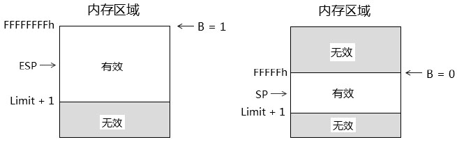

在 E=1, G=1, B=1 的情况下, 看看下面的几个例子.

例子 1. 假设段描述符内的 limit=F0000h, 那么这个 Expand\-down 的:

1) 段的最小 offset 值是 minimum\_offset=limit+1=F0000h×1000h+FFFh+1=F0001000h.

2) 段的最大 offset 值是 maximum\_offset=FFFFFFFFh.

因此, 段内有效访问是 minimum\_offset 到 maximum\_offset 之间, 即 F0001000h 到 FFFFFFFFh 之间是合法的段内地址区域. 在下面的段内地址访问中

1) F000FFFh: 出错, 超出最小访问值, 产生#GP 异常.

2) 0F00FFFh: 出错, 超出最小访问值, 产生#GP 异常.

3) F0001000h: 正确.

4) FFFFFFFFh: 正确.

例子 2. 若段描符内的 limit=0 值, 那么这个 Expand\-down 段的:

1) minimum\_offset=limit+1=FFFh+1=1000h.
2) maximum\_offset=FFFFFFFFh.

因此, 在段内的有效访问是从 1000h 到 FFFFFFFFFh 之间的区域, 在下面的地址访问中

1) FFFh: 出错, 超出最小访问值, 产生#GP 异常.

2) 1000h: 正确

3) FFFFFFFFh: 正确.

例子 3. 假设在 B=0 的前提下, G=1, E=1, limit=0 值, 那么:

1) minimum\_offset=limit+1=FFFh+1=1000h.

2) maximum\_offset=FFFFh.

因此它的段内有效区域是 1000h 到 FFFFh 之间, 在下面的段内地址访问中

1) FFFh: 出错, 超出最小范围值, 产生#GP 异常.

2) 10000h: 出错, 超出最大范围值, 产生#GP 异常.

3) 1000h: 正确.

4) FFFFh: 正确.

有一种情况需要注意: 跨边界产生的访问. 以例子 3 为例:

```assembly
mov al, [FFFFh]                ;  正确, 刚好在最大段限范围内
mov ax, [FFFFh]                ;  错误, 读 WORD 边界, 超出了段限范围
```
大多数 OS 几乎都使用更简单的 Expand-up 类型, 在一些情况下处理器会强制使用 Expand\-up 段(例如在前面所述的 sysenter 与 syscall 指令调用中的 SS 段). 并且在 64 位模式下, Expand-down 段是无效的.

### 4.6.2. 在 64 位模式下的 Stack

在**64 位模式**下, 栈结构起了很大的变化.

1) **栈指针**固定了**64 位的 RSP 值**, 不受任何影响.

2) **Stack 段**只能是**Expand\-up**类型, **Expand\-down 类型是无效(！！！**)的.

3) 在**中断 handler 被调用**时, **RSP 被调整为 16 字节边界对齐(！！！**).


如上图所示, 假设**中断发生前**的**RSP 是 13FF7H**, 处理器在**中断 handler 调用时**, 在**push 数据之前**将**栈指针 RSP 从 13FF7H 调整到 13FF0H(16 字节边界上**)然后再**执行 push 操作**, 压入**SS、RSP、RFLAGS、CS, 以及 RIP**值.

这个调整的操作是 RSP&FFFFFFFF\_FFFFFFF0h, 结果是 16 字节边界对齐. 对于**一般的 push 和 call 调用**, 处理器并**不进行对齐调整**.

### 4.6.3. Data segment descriptor

**Data 段描述符**与**Code 段描述符**具有通用性, 结构基本是完全一致的, 只是**描述符类型字段 TYPE 不同**, 如下图所示:


图中描述符的各个域与 Code 段的意义一致, 在类型域里, 三个类型标志位对数据段的类型进行定义, 下面是 Data**数据段的类型组合**.


**只读类型的 Data 段不能作为 Stack 段**, 如果**加载一个只读的 Data 段描述符**到**SS 寄存器**, 会**产生\#GP 异常**. 其中可写的代表具有 Read/Write 的权限, **已访问**的代表已经被加载到段寄存器中.

#### 4.6.3.1. D/B 与 G 标志位

**D/B 标志位**使用于**Stack 段**时, 被作为**B 标志位**, 如前面的 Stack 结构中所述.

当使用于其他的数据段时, D/B 标志位也同样被用于 Expand\-down 类型的段才有意义, 它与 G 标志位结合起来对 Expand\-down 段的 limit 值进行定义, 如前面对 Expand\-down 类型的段所述.

### 4.6.4. long-mode 下的 Data segment descriptor

在 compatibility 模式下, Data segment descriptor 的结构是与 legacy 模式一致的, 在**64 位模式**下起了很大的变化, Data segment descriptor 的**绝大部分域都是无效的**.


在 64 位模式下的 Data 段描述符**S 标志必须设为 1**, Code/Data 标志位必须设置为 0, 否则在加载时会产生\#GP 异常.

#### 4.6.4.1. W 标志位

这个标志位对于**DS、ES、FS 和 GS 寄存器**来说并**无影响**, 被忽略. 当被加载到**SS 寄存器**时, 处理器会检查 W 标志位是否为 1(可写的), 否则会产生\#GP 异常. 可是在**64 位模式**下的**非 3 级权限**下可以**加载 Null selector 到 SS 寄存器(！！！**)里, 这时**所有的段描述符属性都被忽略**.

#### 4.6.4.2. DPL 标志位

这是**Data 段的 DPL**值, 在**加载 Data 段描述符**到**段寄存器**的时候处理器会检查该值.

>可是, 在 AMD64 的 Manual Volume2 System Programming 里有这样的一段话: A data\-segment-descriptor DPL field is ignored in 64-bit mode, and segment\-privilege checks are not performed on data segments.

这段话的描述产生了隐晦点, 实际上并不是这样简单.

1) 在**64 位模式**下, 对于一个正常的 selector 来说, 处理器在加载时也会**对 Data segment 描述符的 DPL 进行必要的检查**.

2) 在 64 位模式下, 当加载一个**Null selector**到**Data 段寄存器**时, 处理器不但会**忽略 DPL**值, 还会忽略所有的 Data 段描述符属性.

基于在加载时需要检查, 笔者将 DPL 归纳为有效的域, 这始终都是有益处的.

#### 4.6.4.3. Base 域

在 64 位模式下, 对于 ES、SS、DS 段来说 Base 是无效, 被忽略的. 然而对于 FS 和 GS 段是有效的, 可是从 data segment descriptor 里只能加载到 FS 和 GS 段的低 32 位.

#### 4.6.4.4. FS 段和 GS 段的基地址

**FS 段**和**GS 段**完整的 64 位 Base 地址需要在**相应的 MSR 里设置**, 这些值必须在**0 级权限**下使用**wrmsr 指令**进行设置:
* **FS**的基地址寄存器是`IA32_FS_BASE`, 地址在 `C0000100H`.
* **GS**的基地址寄存器是 `IA32_GS_BASE`, 地址在 `C0000101H`.

### 4.6.5. Stack 的使用

下面**两种数据的访问形式**是**隐式(默认)使用于 SS 段**的.

1) 使用**sp/esp/rsp 寄存器**的内存访问形式. 如: mov eax, [esp].

2) 使用**bp/ebp/rbp 寄存器**的内存访问形式. 如: mov eax, [ebp].

ebp 是栈的 frame base pointer, esp 是栈的 top pointer, 使用它们将默认引用 SS 段. 下面的指令将隐式使用于 SS 段, 且不能更改.

1) **栈操作指令**: push 指令, pop 指令, enter 指令及 leave 指令. 还包括它们的衍生形式, 如: pushf/popf, push es/pop es 等.

2) 控制权转移指令: call 指令, ret 指令, int 指令, 以及 iret 指令. 还包括它们的衍生形式, 如: int3/into, retf 指令等.

#### 4.6.5.1. 显式使用 SS 段

可以使用 Segment prefix 显式引用 SS 段.

```assembly
mov eax, ss: [eax]                ;  SS prefix
```

上面这条指令中, [eax]内存访问默认是使用 DS 段的, 可以使用 SS 段前缀进行显式地使用于 SS 段.

### 4.6.6. SS 寄存器显式加载

可以使用**mov 指令**、**lss 指令**和**pop ss 指令**显式地加载 SS 寄存器, **pop ss 在 64 位模式下是无效的(！！！**).

```assembly
mov ax, USER_SS
mov ss, ax                        ;  load into SS
```

使用 mov 指令加载 ss 寄存器, 如果发生中断/异常, 处理器将保证 mov ss, ax 指令的下一条指令得到执行, 完毕后才响应中断和异常.

```assembly
mov ss, ax                        ;  临时抑制中断/异常的发生
mov esp, XXX                     ;  下一条指令执行完毕后, 才可响应
```

处理器假设在 mov ss, ax 指令后面是一条更新 sp/esp/rsp 寄存器的指令, 确保 Stack 结构能够得到建立.

#### 4.6.6.1. 使用 LSS 指令加载

在这种情形下, 使用**LSS 指令**加载是更有效率的方式, 提供一个 far pointer.

```assembly
      lss esp, [STACK_POINTER]            ;  far pointer
;far pointer 定义:
STACK_POINTER dd 0x7fff                    ;  ESP 值
              dw 0x20                      ;  SS 值
```

在**64 位模式**下, **LSS 指令**依然可用, 在**Intel64**中, far pointer 可以是 80 位(16: 64), 在 AMD64 中 far pointer 最长只能是 48 位(16: 32).

```assembly
       lss rsp, [STACK_POINTER64]            ;  far pointer
;  far pointer 定义(for Intel64):
STACK_POINTER dq 0x7fff                   ;  64 位 RSP 值
              dw 0x20                     ;  SS 值
```

#### 4.6.6.2. selector 检查

处理器会检查 selector 是否为 Null selector, 在 legacy 模式和 compatibility 模式下不允许加载 Null selector 到 SS 寄存器, 否则会产生#GP 异常.

在 64 位模式下, 在非 3 级权限(0、1 和 2 级权限)里可以加载 Null selector 到 SS 寄存器里.

#### 4.6.6.3. 权限权查

SS 寄存器的加载需要严格的权限限制, 合法的权限如下.

1) RPL == Data segment 的 DPL.

2) CPL == Data segment 的 DPL.

每个 Stack 段对应一个权限级别, RPL、CPL 与 DPL 三者必须是相等的, 否则会产生#GP 异常.

#### 4.6.6.4. limit 检查

所使用的 selector 必须在 GDT/LDT 的 limit 内, 否则产生#GP 异常.

#### 4.6.6.5. Data 段描述符类型的检查

在 64 位模式和 legacy 模式下都要经过下面的 Data 段描述符类型检查, 能加载到 SS 寄存器的描述符类型必须在下列项中.

1) S 标志位为 1 值, 表示为非 system 描述符.

2) Code/Data 标志位为 0 值, 指示为 Data 段(1 值为 Code 段).

3) W 标志位为 1 值, 指示为 Writable(可写的)段.

4) P=1, 表示存在内存中.

当在 64 位模式的非 3 级权限下加载 Null selector 到 SS 寄存器, 可以不受上面的类型限制. 当上面的所有检查都通过后, 如下图所示.

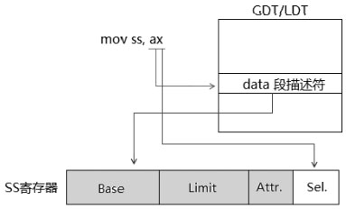

处理器将 SS selector 加载到 SS 寄存器的 selector 域中, 同时从 GDT/LDT 中得到 Data segment descriptor 加载到 SS 寄存器的 Cache 部分.

(1)在**64 位模式**下加载**Null selector**到**SS 寄存器**

仅在**非 3 级权限**下, 可以加载一个 Null selector 到 SS 寄存器里.

```assembly
mov ax, 2                      ;  null selector, RPL=2
mov ss, ax                     ;  在 2 级权限下加载 null selector 到 SS
```

上面是**显式地进行 Null selector 加载**, 能加载到 SS 寄存器的有效 Null selector 是: 0, 1 及 2 值, 在 RPL=3 时不能被加载(3 级权限), 处理器在切往高权限时还会隐式地加载 Null selector 到 SS 寄存器.

(2)实现一个 load\_ss\_reg()函数

根据 SS 段寄存器的加载限制, 我们可以实现一个 load\_ss\_reg()函数, 模拟处理器在加载 SS 寄存器时的检查, 通过了就加载.

代码清单 10-35(lib\conforming_lib32.asm):

```assembly
; ------------------------------------------------------------
;  load_ss_reg(): 加载 SS 寄存器
;  input:
;                 esi: selector
; -----------------------------------------------------------
__load_ss_reg:
      jmp do_load_ss_reg
lsr_msg1        db 'load SS failure: Null-selector', 10, 0
lsr_msg2        db 'load SS failure: selector.RPL ！= CPL', 10, 0
lsr_msg3        db 'load SS failure: CPL ！= DPL', 10, 0
lsr_msg4        db 'load SS failure: check limit', 10, 0
lsr_msg5        db 'load SS failure: a system descriptor', 10, 0
lsr_msg6        db 'load SS failure: non data segment', 10, 0
lsr_msg7        db 'load SS failure: non writable segment', 10, 0
lsr_msg8        db 'load SS failure: non present', 10, 0
do_load_ss_reg:
      push ecx
      push edx
      mov ecx, esi
;  检查 selector
      call __check_null_selector
      test eax, eax
      jz check_privilege
      mov esi, lsr_msg1
      call puts
      jmp load_ss_reg_done
;  检查权限
check_privilege:
      call __get_cpl
      mov esi, ecx
      and esi, 0x03
      cmp esi, eax                                ;  RPL == CPL?
      jz check_privilege_next
      mov esi, lsr_msg2
      call puts
      jmp load_ss_reg_done
check_privilege_next:
      mov esi, ecx
      call __get_dpl
      mov esi, ecx
      and esi, 0x03
      cmp esi, eax                                ;  CPL == DPL ?
      jz check_limit
      mov esi, lsr_msg3
      call puts
      jmp load_ss_reg_done
;  检查 selector 是否超 GDT/LDT limits
check_limit:
      mov esi, ecx
      bt esi, 2
      jc ldt_limit
      call __get_gdt_limit
      jmp check_limit_next
ldt_limit:
      call __get_ldt_limit
check_limit_next:
      and esi, 0xFFF8
      add esi, 8
      cmp esi, eax
      jbe check_descriptor
      mov esi, lsr_msg4
      call puts
      jmp load_ss_reg_done
;  检查 data segment descriptor 类型
check_descriptor:
      mov esi, ecx
      call __read_gdt_descriptor
      bt edx, 12                                        ;  S 标志
      jc check_cd
      mov esi, lsr_msg5
      call puts
      jmp load_ss_reg_done
check_cd:
      bt edx, 11                                        ;  Code/Data 标志
      jnc check_w
      mov esi, lsr_msg6
      call puts
      jmp load_ss_reg_done
check_w:
      bt edx, 9                                        ;  W 标志
      jc check_p
      mov esi, lsr_msg7
      call puts
      jmp load_ss_reg_done
check_p:
      bt edx, 15                                        ;  P 标志
      jc load_ss
      mov esi, lsr_msg8
      call puts
      jmp load_ss_reg_done
load_ss:
      mov ss, cx
load_ss_reg_done:
      pop edx
      pop ecx
      ret
```

这个\_\_load\_ss\_reg()函数实现在 conforming\_lib32.asm 库里, 最后被包括进 lib32.asm 库里, 实现在 legacy 模式下对 SS 寄存器的加载功能, 加载前进行必要的检查. 这个检查就是基于前面所述的加载 SS 寄存器的检查.

```assembly
mov esi, 03                      ;  Null-selector
call load_ss_reg                ;
```

上述使用 Null selector 进行加载时, 得出的结果如下.


提示加载 SS 失败, 属于一个 Null selector, conforming_lib32.asm 库里的函数使用 conforming 段进行调用, conforming 段的 DPL 为 0 值, 使得它可以在任何权限执行, 而不改变 CPL 值, 这样就可以方便地进行 CPL 的获取和加载 SS 寄存器.

代码清单 10-36(lib\conforming_lib32.asm):

```assembly
; -----------------------------------------------
;  conforming_lib32_service_enter(): conforming 代码库的 stub 函数
;  input:
;        esi: clib32 库函数服务例程号
;  描述:
;        conforming_lib32_service_enter()的作用是切换到 conforming 段里,
;        然后调用 conforming lib32 库里的服务例程, 它相当于一个 gate 的作用.
;  -----------------------------------------------
__clib32_service_enter:
__conforming_lib32_service_enter:
      jmp do_conforming_lib32_service
conforming_lib32_service_pointer        dd __conforming_lib32_service
dw conforming_sel
do_conforming_lib32_service:
      call DWORD far [conforming_lib32_service_pointer] ;  使用 conforming 段进行调用
      ret
; --------------------------------------------
;  clib32_service()
;  input:
;        eax: clib32 库函数服务编号
; --------------------------------------------
__conforming_lib32_service:
      mov eax, [__clib32_service_table + eax * 4]
      call eax
      retf
... ...
;  conforming lib32 库服务例程表
__clib32_service_table:
      dd __get_cpl                            ;  0 号
      dd __get_dpl                            ;  1 号
      dd __get_gdt_limit                      ;  2 号
      dd __get_ldt_limit                      ;  3 号
      dd __check_null_selector                ;  4 号
      dd __load_ss_reg                        ;  5 号
```

上面实现了一个 stub 函数\_\_clib32\_service\_enter(), 它是对外的接口, 传递一个 conforming lib32 库的函数编号, load\_ss\_reg()函数的编号是 5, 那么, 可以这样调用 load\_ss\_reg()函数.

```assembly
mov eax, LOAD_SS_REG     ;  编号值
call __clib32_service_enter   ;  调用 conforming 库
```

### 4.6.7. TR 的显式加载

在**Stack 的切换**环节中, **TSS 段**是很重要的数据结构, **没有 TSS 段完成不了 Stack 的切换**, 因此, 在系统**初始化阶段必须加载 TR**, 完成对 TSS 段环境的设置. 在**TSS 任务切换机制**里, 处理器会**隐式地加载 TR**.

```assembly
mov ax, TSS_sEL                        ;  TSS selector
ltr ax
```

在这里, 我们使用**ltr 指令显式地加载 TR**, 处理器会对 TSS selector 和 TSS 描述符进行在 10.5.4.4 节 4 中所描述的常规检查. 通过检查后, 处理器将 TSS selector 加载到 TRselector 域, TSS 描述符会加载到 TR 的 Cache 部分.

#### 4.6.7.1. 置 Busy 标志位

在**TSS 描述符加载到 TR**后, 处理器会将**GDT(！！！TSS 描述符只能存在于 GDT！！！**)的**TSS 描述符 Busy 标志位置位**, 指示这个 TSS 描述符不可用.

#### 4.6.7.2. 使用 Call-gate 调用下的 Stack 切换

当使用 gate(包括 Call\-gate, Interrupt\-gate 及 Trap\-gate)从**低权限进入高权限**时, 处理器从 TSS 段里取出**相应权限级别的 ESP**值, 装入**ESP 寄存器**, 然后执行压栈操作.


在上图里使用一个**Call\-gate**从**3 级**权限切换到**0 级**权限里, 处理器从**当前的 TSS 段**里(由**TR 的 Base 域获取了 TSS 段位置！！！**), 读取属于**0 级权限的 SS 和 ESP 值**(在**TSS 段里的 SS0 和 ESP0 域**), 分别**加载到 SS 寄存器和 ESP 寄存器**里, **SS 和 ESP 的原值被临时保存(！！！**)起来.

现在处理器**加载新的 SS 和 ESP 值**后, **已经切换到 0 级的 stack**里, 在**当前的 Stack(0 级的 Stack**)里依次**压入调用者(！！！原来的！！！)的 SS、ESP、CS, 以及 EIP 值**, 然后转去**执行 0 级代码**.

#### 4.6.7.3. TSS 段里的栈指针

在**TSS 段**里存放了**3 个级别**的栈指针**SS 和 ESP**值, 如下所示.


在**TSS 段**里存放有**0 级、1 级和 2 级的 SS 和 ESP**, **不存在 3 级的 SS 和 ESP 栈指针**值.

>3 级的栈指针(SS: ESP)存放在哪里?

**3 级**的栈指针值(SS 和 ESP)放在**两个地方**:

- 要么存放在**当前的 SS 寄存器和 ESP 寄存器**里
- 要么在切换到**高权限的 stack**时**被压入在高权限的 stack**里.

当**从高权限的代码返回到低权限**时, **3 级**的**栈指针(SS 和 ESP**)被**从栈里 pop 出恢复到 SS 寄存器和 ESP 寄存器**里, 这时**3 级的栈指针**是指向**当前 active(活动)的栈**.

在将 SS selector 加载到 SS 寄存器之前, 处理器会进行检查, 这个检查和以前所述的 CS 和 SS 寄存器隐式加载的情形一样.

### 4.6.8. 在 long-mode 下使用 Call-gate 调用的 Stack 切换

在**long\-mode**使用**Call\-gate**进行调用从而进入到**64 位模式的 Call\-gate 服务例程**. 权限的切换将使处理器进入更高权限的 64 位模式, 这时候使用 64 位的 stack 结构, 这一点体现在从 compatbility 模式里使用 Call\-gate 进入更高权限代码时, 处理器将切换到 64 位模式.

#### 4.6.8.1. long-mode 下的 TSS 段里的栈指针

在**long\-mode**下, **TSS 段**里并**不保存 SS Selector 值(！！！**), 3 个级别的**栈指针扩展为 64 位**.


在**long\-mode**下进行**stack 切换**时并**不需要 SS slector 值**, 因此在 long\-mode 的**TSS 段**里并**不存在 SS selector**.

#### 4.6.8.2. 加载 Null selector 到 SS 寄存器

在**long\-mode**下, **切换到高权限代码**里, 处理器将**自动加载一个 Null selector 到 SS 寄存器(！！！**)里, 这是在**64 位的 TSS 段里没有 SS selector 的原因(！！！**).

这是在**long\-mode**下与**legacy 模式**下的**Stack 切换最大的不同之处(！！！**).

(1)**compatibiltiy 模式**调用**Call\-gate**进入**64 位模式**的**Stack 切换**在 long\-mode 的 compatibility 子模式里, 使用下面的代码:

```assembly
call DWORD far [CALLGATE_POINTER32]    ;使用 32 位的 call-gate 指针
```

使用**32 位的 call\-gate 指针(16: 32 形式**), 从**3 级的 compatibility 模式**进入到**0 级的 64 位模式 Call\-gate 服务例程**. 当前的 stack 将从 compatibiltiy 切换到 64 位模式, 如**下图所示(！！！下图很重要！！！**).


处理器**从 64 位的 TSS 段**里得到**RSP0 值(因为是 0 级**), 加载到**RSP 寄存器**里, 处理器还会将**Null selector**加载到**SS 寄存器**里. 如果切换到**0 级**, 这个**Null selector 值将会是 0**; 如果切换到**1 级**, 这个**Null selector 将会是 01H**; 切换到**2 级**, 这个 Null selector 将会是**02H**.

处理器会在 64 位的栈里压入 compatibiltiy 模式的 SS、ESP、CS 和 EIP 值, 32 位的值会被 0 扩展到 64 位值压入栈中.

(2)**64 位模式**调用**Call\-gate**的**Stack 切换**

在 64 位模式下, 使用下面的指令:

```assembly
call QDWORD far [CALLGATE_POINTER]    ;  使用 64 位的 call-gate 指针
```

这里使用的是**64 位的 call\-gate 指针**(**16: 64 形式**)切换到**0 级**代码, Stack 的切换情形**与在 compatibility 模式下是一致**的.


上面是简化的示意图, 与**comaptibility 模式**下的**调用不同**的是**从 3 级的 64 位 Stack**切换到**0 级的 64 位 Stack**, 其他处理是一致的.

### 4.6.9. 使用 RETF 指令返回时的 Stack 切换

使用**Call\-gate**进行调用是**从低权限切往高权限**(排除同级调用的情形), 而使用**retf 指令返回**是从**高权限的 Call\-gate 服务例程切往低权限的用户代码**(排除同级返回的情形). 因此, 同样是发生了权限切换和进行 Stack 切换.

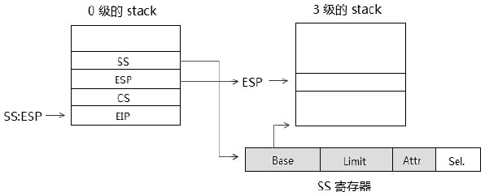

如果 retf 指令返回时检查到是切往低权限(假设从 0 级返回到 3 级时), 将从**0 级的 stack**里**依次 POP**出**EIP**、**CS**、**ESP**和**SS**值, 这个**SS selector 将会被加载到 SS 寄存器**里, **ESP 值会被加载到 ESP 寄存器**里, 那么现在的 SS: ESP 指针就指向当前的 3 级的 Stack.

### 4.6.10. long-mode 下使用 RETF 指令返回时的 Stack 切换

在**long\-mode**下, **Call\-gate 服务例程**执行在**64 位模式环境**中, 与使用 Call\-gate 进行调用时情形相对应, 从 Call\-gate 服务例程里使用 RETF 指令返回时也有:

1) 返回到**compatibility 模式**时的**Stack 切换**.

2) 返回到**64 位模式**下的 Stack 切换.


#### 4.6.10.1. 返回到 compatibility 模式时

在上图的 a)中, 返回的目标代码段描述符 L=0 时, 将返回到 compatibility 模式, 目标的 Stack 是 compatibility 下的 3 级 stack(假设从 0 级返回到 3 级的情况下), POP 出来的 SS 和 ESP 值(栈内的 RSP 映像低 32 位)加载到 SS 寄存器和 ESP 寄存器里, 当前的 Stack 已经切换到 compatibility 模式下.

#### 4.6.10.2. 返回到 64 位模式时

在上图的 b)中, 返回的**目标代码段描述符**的**L=1 并且 D=0**时, 将**返回到 64 位模式**, 表示**目标的 Stack**也是属于**64 位**的, 在**栈里 POP**出来的**SS 和 RSP**值将**加载到 SS 和 RSP 寄存器**里, **当前的 Stack**已经**切换回 3 级的 Stack**(假设从 0 级返回到 3 级的情况下).

在返回到 64 位模式里时, 如果**从 0 级权限返回到 1 级或者 2 级权限**(非 3 级权限), 在栈中的**SS 值允许为 Null selector**, 否则是不允许的.

#### 4.6.10.3. 从伪造的 Call-gate 服务例程 RETF 返回时

在前面的加载 CS 寄存器的情形中, 以权限的切换为目的时, 可以**伪造一个 Call\-gate 服务例程返回环境**(在前述的使用 RETF 指令加载 CS 寄存器的情形), 这时可以从 0 级的 compatibility 模式返回到 3 级的 64 位模式里, 也可以从 compatibility 模式返回到 compatibility 模式里.

### 4.6.11. 调用中断或中断/异常发生时的 Stack 切换

当**中断 handler 被调用(主动或被动**), **权限发生改变**时, 同样会进行**Stack 的切换**. 在**legacy 模式**下, 与使用 Call\-gate 调用时的 Stack 切换的**不同之处**是: 处理器会**额外压入 EFLAGS**值, **有些异常**发生时还会压入**Error Code**值.


与 Call\-gate 调用时的**Stack 切换一样**, 处理器从**TSS 段**里得到相应的**0 级的 SS 和 ESP**值(假设从 3 级切换到 0 级的情况下), 分别**加载到 SS 和 ESP 寄存器**里.

那么 SS: ESP 就切换到 0 级的 Stack, 处理器依次压入**SS、ESP、EFLAGS、CS, 以及 EIP**值. **有时**还会压入**Error Code**值.

### 4.6.12. long-mode 下的中断 Stack 切换

在 long\-mode 下的**中断栈**有**很大的变化**.

1) 可以使用**额外的 Stack 指针**(中断 handler 专用的 Stack 指针).

2) 在执行中断 handler 前, 处理器会将**RSP 调整到 16 字节边界对齐(！！！**), 然后**再压入 SS、RSP、RFLAGS、CS 及 RIP**值.

3) 处理器会**无条件压入 SS 和 RSP 值**, **即使不改变权限(！！！**)的情况下.


上图是前面已经介绍过的 long\-mode 下的 Interrrupt/Trap\-gate 描述符, 在 long\-mode 下除了 offset 被扩展为 64 位外, 还新增了一个**3 位的 IST 域**, 它是在**64 位 TSS 中的 IST 指针的索引值**, 范围值从 1 到 7, 每一个值对应一个 IST(Interrupt Stack Table)指针.

#### 4.6.12.1. IST(Interrupt Stack Table)

在 64 位 TSS 里有 7 个 IST 指针值, 提供可以给中断 handler**额外使用的 Stack 区域**, 如下图所示.

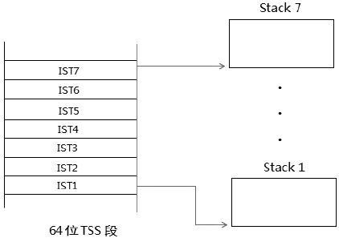

Interrupt/Trap\-gate 描述符里的**IST**值用来**得到 TSS 段里对应的 IST**值, 从而使用这些 IST 指针**指定的 Stack 区域**.

假如中断**vector 号为 0x40**的**中断描述符**, 它的**IST 域为 1**值, 那么处理器将在**TSS 的 IST1 里得到 RSP 值**, **加载到 RSP 寄存器**里, 如下图所示.


在**TSS 段**里的**RSP0 值(0 级的栈指针**)将被**忽略不用**. 可是如果中断描述符里的**IST 被清 0**, 那么处理器仍然**从 RSP0 里取得 RSP 值加载到 RSP 寄存器**里(上图中的虚线).

同样一个**Null selector**将**被加载到 SS 寄存器**里, 处理器就**完成了中断栈的切换**, 在经过调用到 16 字节边界对齐后, 依次压入 SS、RSP、EFALGS、CS, 以及 RIP 值.

#### 4.6.12.2. 从 compatibility 模式进入 64 位模式

如上图所示, 处理器从 TSS 段的 RSP0 或 IST 域(依赖于 Interrupt/Trap-gate 描述符的 IST 域)里得到 0 级(假设从 3 级切换到 0 级)64 位的 Stack 指针加载到 RSP 寄存器中, Null selector 被加载到 SS 寄存器后, 那么 Stack 将从 compatibility 模式(假设为 32 位)的 Stack 切换到 64 位的 Stack. RSP 调整到 16 字节边界后依次压入 SS、RSP、EFLAGS、CS, 以及 RIP 值.

#### 4.6.12.3. 从 64 位模式进入 64 位模式

除了处理器将 64 位的 Stack 切换到同样是 64 位的 Stack 外, 其余操作与从 compatibility 模式进入 64 位模式是完全一致的.

### 4.6.13. 使用 IRET 指令返回时的 Stack 切换

原理与使用 RETF 指令返回时是完全一致的, 如下图所示.


IRET 指令返回时, 处理器从 0 级的 Stack 里 POP 出 SS 和 ESP 值加载到 SS 和 ESP 寄存器后, 现在当前活动的 Stack 就是 3 级的 Stack(假设从 0 级返回到 3 级时).

#### 4.6.13.1. long-mode 下的 IRETQ 返回 Stack 切换

在 long\-mode 下的中断 handler(中断处理程序)是运行在 64 位模式下. 从中断 handler 使用 IRETQ 指令返回时是从 64 位模式中返回, 这时处理器**无条件 POP 出 SS 和 RSP 值(无论是否发生权限的改变**), 与调用中断 hanlder 时无条件压入 SS 和 RSP 值相对应.


如同 RETF 指令一样, 处理器从栈中的 CS 引用的 Code segment descriptor 判断返回到 64 位模式还是 compatibility 模式.

#### 4.6.13.2. 返回到 compatibility 模式时

POP 出的 RSP 值低 32 位加载到 ESP 寄存器, SS 值加载到 SS 寄存器, 从而切换回原来的 compatibility 模式的 Stack.

#### 4.6.13.3. 从伪造的中断 handler 环境中返回

以权限的切换为目的时, 可以伪造一个中断 handler 环境从 0 级的 compatibililty 模式代码返回到同样是 compatibility 模式的代码里或者 64 位模式的 3 级权限代码. 在非 64 位模式下使用 IRET 指令, 处理器将依赖于权限的改变而 POP 出 SS 和 ESP 值.

## 4.7. Data 数据段

一个**Data segment descriptor**可以加载到**SS、ES、DS、FS 及 GS 寄存器**中的任何一个, 但是**不能被加载到 CS 寄存器**里.

### 4.7.1. 段的访问类型限制

下面是一个段描述符能被加载到段寄存器的访问类型条件.

1) 能被加载到**CS 寄存器**的段**必须是可执行**的段, 段**描述符**的**Code/Data 标志为 1**, 表示为**Code 段(可执行的段**).

2) 能被加载到**SS 寄存器**的段**必须是可写**的段, 段描述符的**W 标志为 1**, 表示为 Writable(可写的段).

3) 能被加载到**ES、DS、FS 及 GS 寄存器**的段必须是**可读**的段, 段描述符的**R 标志为 1**, 表示为 Readable(可读的段).

对于2), 这个段描述符类型是 Data segment descriptor, 并且 W 标志为 1. 对于3), 当加载一个 Code segment descriptor 到 ES、DS、FS 及 GS 寄存器时, 这个 Code segment descriptor 的 R 标志必须为 1, 它是可读的 Code 段. 任何一个 Data 段都是可读的.

因此, 可读的 Code 段和任何的 Data 段都能被加载到 ES、DS、FS 及 GS 寄存器中.

### 4.7.2. 加载 Data 段寄存器

这里所说的**Data 段寄存器**指**ES, DS, FS 及 GS 寄存器**. **SS 寄存器也属于 Data 段寄存器**, 但**不在此类描述对象**中. Data 段寄存器显式地进行加载.

```assembly
mov ax, data32_sel mov ds, ax
mov es, ax
mov fs, ax
mov gs, ax
```

上面的代码使用同一个 selector 分别加载 Data 段描述符到各个 Data 段寄存器里, 在 legacy 模式下可以使用下面的指令加载 far pointer.

1) lds 指令: 加载一个 far pointer 到 DS: reg 中.

2) les 指令: 加载一个 far pointer 到 ES: reg 中.

3) lfs 指令: 加载一个 far pointer 到 FS: reg 中.

4) lgs 指令: 加载一个 far pointer 到 GS: reg 中.

5) lss 指令: 加载一个 far pointer 到 SS: reg 中.

lds 和 les 指令在 64 位模式下是无效的. lfs 指令、lgs 指令和 lss 指令在 64 位模式下是有效的.

值得注意的是, 在 64 位的操作数 size 下, AMD64 机器上 far pointer 是 48 位(16: 32), 在 Intel64 机器上 far pointer 是 80 位(16: 64).

因此, 在 64 位模式下可以使用 lfs 和 lgs 指令加载 FS、GS 及 SS 寄存器.

#### 4.7.2.1. selector 的检查

不同于 CS 和 SS 寄存器, 一个 Null selector 可以被加载到 ES、DS、FS 和 GS 寄存器里, 在加载到上面的 Data 段寄存器时, 处理器不检查 Null selector.

#### 4.7.2.2. 权限检查

能加载到 Data 段寄存器的 Data 段描述符, 所需要的权限如下.

1) RPL <= Data segment 的 DPL.

2) CPL <= Data segment 的 DPL.

实际中可以直接使用 RPL=0 值的 selector, 只需检查 CPL 是否合法.

#### 4.7.2.3. limit 的检查

处理器会检查 selector 是否超出 GDT/LDT 的 limit 表限. 否则会产生#GP 异常.

#### 4.7.2.4. Data 段描述符的检查

能被加载到 Data 段寄存器(ES, DS, FS 和 GS)的 Data 段描述符类型必须是:

1) S 标志为 1, 表示属于非 system 描述符.

2) P 标志为 1, 表示在内存中, 否则会产生#NP 异常.

3) 当加载一个 Code 段到 Data 段寄存器时, Code 段描述符的 R 标志位为 1, 表示 Readable(可读的).

上面这些检查在 64 位模式下也是必要的(除了加载 Null selector 外). 我们看到可以将 Code 段描述符加载到 Data 段寄存器里, 但这个 Code 段必须是可读的.

### 4.7.3. 加载 Code 段描述符到 Data 寄存器

当加载一个 Code 段描述符到 Data 段寄存器时, 与上面加载 Data 描述符的 selector 检查、limit 检查和描述符类型的检查都是一致的. 而处理器对权限的检查分为两种情况.

#### 4.7.3.1. 加载 non-conforming 段的权限检查

如果 Code 段属于 non-conforming 段, 情形和上面加载一个 Data 段描述符到 Data 段寄存器是一致的.

#### 4.7.3.2. 加载 conforming 段的权限检查

加载一个 conforming 类型的 Code 段描述符到 Data 段寄存器, 实际上无须进行权限检查, 权限的检查总是获得通过.

### 4.7.4. long-mode 下的 Data 段寄存器加载

在**long\-mode**下的 Data 段寄存器加载与 legacy 模式是一致的, 只不过在 64 位模式下**可以加载 Null selector**到 Data 段寄存器.

#### 4.7.4.1. 64 位模式下加载 Null selector

在 64 位模式下, 可以在任何权限下加载一个 Null selector 到 ES、DS、FS, 以及 GS 寄存器里(加载 Null selector 到 SS 寄存器里只能在非 3 级权限下).

那么, 处理器不会读取 GDT/LDT, Null selector 加载到段寄存器的 selector 域, 内部的 Cache 域直接被设置为 0 值(除了 S 标志为 1 外).

```assembly
mov ax, 0                     ;  null selector
mov ds, ax                    ;  加载到 DS
mov DWORD [eax], 0          ;  写访问
```

在上面这种情况下, 对于加载 Null selector 的 ES、DS、FS 和 GS 寄存器, 以及 SS 寄存器, 处理器都会忽略段寄存器内的属性.

对加载到 ES、DS、FS 和 GS 寄存器的 Null selector, 它的 RPL 被忽略, 在 0 级权限里, 能加载一个 3 值的 Null selector 到这些段寄存器(RPL=3).

### 4.7.5. Data 段的访问控制

当成功加载段寄存器后, 说明段描述符是合法的, 但是使用它们进行访问内存时, 处理器会做以下检查.

1) 对一个不可读的段进行读访问, 会产生#GP 异常, 这种情况只发生在使用 CS 段进行访问时.

```assembly
mov eax, [cs: ebx]  ; 假如 CS 段是 execute-only 的段, #GP 异常产生
```

如果 CS.R=0, CS 段是 execute-only 不可读的段, 使用它来访问内存会产生#GP 异常.

2) 对一个不可写的段进行写访问, 会产生#GP 异常.

```assembly
mov DWORD [eax], 0               ;  假如 DS 段是 read-only 的段, #GP 异常产生
mov DWORD [cs: eax], 0           ;  错误, CS 段是不可写的段, #GP 异常产生
```

如果 DS.W=0, DS 段是 read-only 不可写的段, 使用它来进行写操作会产生#GP 异常. 而使用 CS 段来访问时, 同样会产生#GP 异常.

3) 内存地址超出段 limit 的, 会产生#GP 异常. 这个段 limit 的计算详情请看前面 Expand-up 和 Expand-down 类型段的描述.

```assembly
mov eax, [0xFFFF0000]             ;  假如 DS 段限是 0xF0000000, #GP 异常产生
```

上面的指令使用 DS 段内的 0xFFFF0000 地址进行访问, 假如 DS.limit=0xF0000000, 将产生#GP 异常.

### 4.7.6. 64 位模式下 Data 段的访问控制

在 64 位模式下, 对于 Data 段的访问, 除了使用 FS 和 GS 寄存器访问外, 其他段寄存器都是无效的.

```assembly
mov rax, [ss: rbx]              ;  这个访问中 SS 段前缀的作用被忽略
mov [cs: rbx], rax              ;  这个访问中 CS 段前缀的作用被忽略
mov rax, [fs: rbx]              ;  FS 段前缀是有效的
```

在 64 位模式下, 成功加载段寄存器后, 所有 Data 段的访问都是基于一个 Read/Write、Expand-up 以及 Accessed 属性的段之上. 除了 FS 和 GS 寄存器的 base 域可用外, 所有段寄存器的 base 都为 0, 处理器也不进行 limit 的检查.

根据 AMD64 的手册说明, 在 AMD64 机器上可以设置 EFER.LMSLE=1 时开启段 limit 的检查机制.

# 5. LDT 描述符与 LDT

Local Descriptor Table 是其中的一个**描述符表**, LDT 由 LDTR 的 base 域进行定位.


**LDTR**的结构**与段寄存器的结构是完全一致的(！！！**), 包括: base、limit、attribute 域, 以及 selector 域, base、limit 和 attribute 组成 LDTR 的 Cache 部分, 也是隐藏不可见的. 像段寄存器一样, LDTR 需要使用 LDT 描述符进行加载, LDT 描述符只能存放在 GDT 中. 32 位的 LDTR.base 值能让 LDT 定位在 4G 的线性地址空间任何位置. 在 64 位模式下, LDTR.base 被扩展为 64 位.

## 5.1. LDT 描述符

LDT 描述符属于系统级的描述符, 它的结构与 TSS 完全一致.

LDT 描述符的类型是 0x02, S 标志位为 0 值, 表示属于一个 system 描述符.

## 5.2. LDTR 的加载

系统使用 LLDT 指令进行显式加载, 或在进行任务切换时隐式地从 TSS 段里加载.

```assembly
mov ax, LDT_SEL            ;  LDT selector
lldt ax
```

lldt 指令执行在 0 级权限里. 处理器会检查以下内容.

### 5.2.1. selector 检查

对 selector 检查两个方面.

1) 如果提供的 selector 是 Null selector, 则会产生#GP 异常.

2) 如果 selector.TI=1, 表示在 LDT 里, 将产生#GP 异常.

### 5.2.2. limit 检查

selector 是否超出 GDT limit 值.

### 5.2.3. LDT 描述符类型检查

能被加载到 LDTR 里的描述符必须如下.

1) S 标志为 0, 属于 system 描述符.

2) P 标志为 1, 表示在内存中.

3) Type 值为 0x02, 它是 LDT 描述符.

## 5.3. 64 位模式下的 LDT 描述符

和 TSS 描述符一样, 在 64 位模式下 LDT 也被扩展为 16 字节, 如下图所示.


高 8 字节的 S 标志位和 Type 值必须为 0(00000B)值, 用来确保高 8 字节不被作为 segment descriptor 使用. 64 位的 LDT 基址加载到 LDTR 的 base 域.