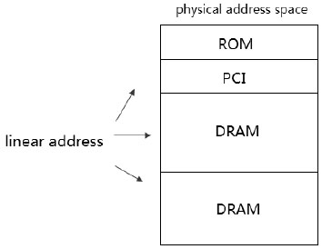

在这一章里, 我们将着力对**x86/x64 体系**的**paging 内存管理机制**及保护机制进行探讨.

```
linear address  ---> paging  ---> physical address
```

在代码中的**logic address(逻辑地址**)经过**segmentation(段式管理**)转化为**linear address(线性地址**)后, 如果**开启了 paging(页式管理**)机制, 这些 linear address 是**virtual address**形式, 在**paging 内存管理**中, 这些 virtual address 被分成**内存 page**的形式映射到**物理地址空间的物理页面**上.



在**物理地址空间**上, 有**许多设备被映射到这个空间**上, 典型的有**ROM 和 DRAM**, 以及一些**memory mapped I/O 设备**, 如 VGA、PCI、APIC 等设备.

