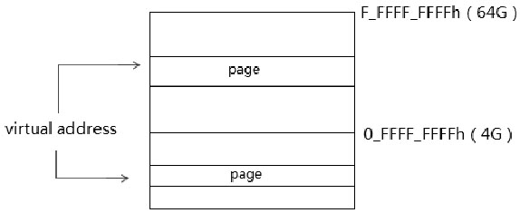
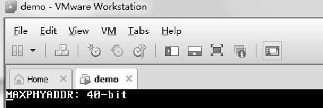
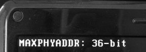
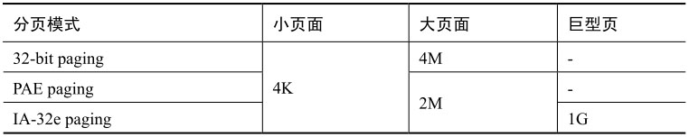
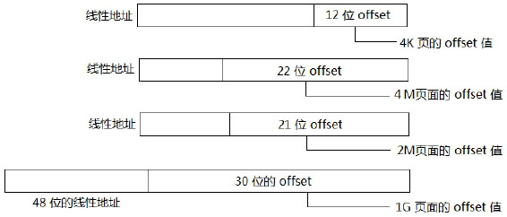
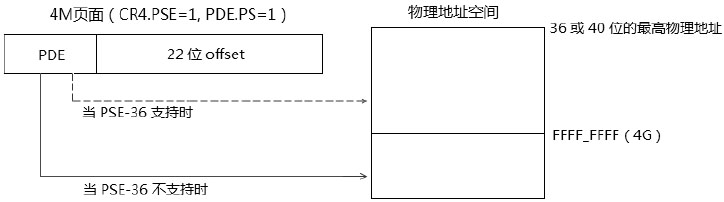

<!-- @import "[TOC]" {cmd="toc" depthFrom=1 depthTo=6 orderedList=false} -->

<!-- code_chunk_output -->

- [1. 最大物理地址(MAXPHYADDR)](#1-最大物理地址maxphyaddr)
  - [1.1. 最高物理地址空间的实现](#11-最高物理地址空间的实现)
- [2. 物理页面的大小](#2-物理页面的大小)
- [3. 分页模式(Paging Mode)](#3-分页模式paging-mode)
  - [3.1. 32 位分页模式](#31-32-位分页模式)
  - [3.2. PSE-36 模式](#32-pse-36-模式)
    - [3.2.1. 最大物理地址](#321-最大物理地址)
  - [3.3. PAE 分页模式](#33-pae-分页模式)
  - [3.4. IA-32e 页转换模式](#34-ia-32e-页转换模式)

<!-- /code_chunk_output -->

**virtual address**能映射到低端的物理页面或者更高端的物理页面上.



处理器通过**paging 机制**可以在**32 位**和**48 位**的**虚拟地址**上使用**36 位**、**40 位**甚至**52 位宽**的**物理地址**, 由 paging 机制提供的各级**page\-translation table(页转换表**)实现.

# 1. 最大物理地址(MAXPHYADDR)

**最高物理地址**的专用语 **MAXPHYADDR** 在整个 x86/x64 体系中许多地方都需要用到, 我们可以通过第 4 章里所说的 `CPUID.80000008H leaf` 获得**MAXPHYADDR**值.

代码清单 11-1(lib\lib32.asm):

```x86asm
; ----------------------------------------------
;  get_MAXPHYADDR(): 得到 MAXPHYADDR 值
;  output:
;        eax: MAXPHYADDR
; ----------------------------------------------
__get_MAXPHYADDR:
      push ecx
      mov ecx, 32
      mov eax, 80000000H
      cpuid
      cmp eax, 80000008H
      jb test_pse36                        ;  不支持 80000008H leaf
      mov eax, 80000008H
      cpuid
      movzx ecx, al                        ;  MAXPHYADDR 值
      jmp do_get_MAXPHYADDR_done
test_pse36:
      mov eax, 01H
      cpuid
      bt edx, 17                            ;  PSE-36 support ?
      jnc do_get_MAXPHYADDR_done
      mov ecx, 36
do_get_MAXPHYADDR_done:
      mov eax, ecx
      pop ecx
      ret
```

这个 `__get_MAXPHYADDR()` 函数用于得到 MAXPHYADDR 值(**最大物理地址位数**), 通过查询 `CPUID.80000008H: EAX[7: 0]` 叶功能, 如果 **不支持 80000008H leaf**, 则通过查询 `CPUID.01H: EDX[17]` 看是否支持**PSE\-36**功能, 如果不支持, 就**返回 32 位**.

代码清单 11-2(topic11\ex11-1\protected.asm):

```x86asm
mov esi, msg1
call puts
call get_MAXPHYADDR
mov esi, eax
call print_dword_decimal
mov esi, msg2
call puts
```

这个测试作为实验 11-1 的例子, 在用户代码里调用 get\_MAXPHYADDR()函数, 然后使用 print\_dword\_decimal()函数打印出来,

>实验 11-1: 得到 MAXPHYADDR 值

下面是在 VMware 上得到的结果.



下面是在一台 Intel Core i5 处理器真实机器上的测试结果.



在笔者工作的这台 Arrandale 核心(Westmere 架构)Core i5 移动处理器机器上, 只支持最高 36 位的物理地址, 属于上一代的 Core i5 处理器. 而在一台 AMD64 的 phenom 机器上得到的结果是 40 位的 MAXPHYADDR 值.

```
# cpuid -1 -l 0x80000008H
CPU:
   Physical Address and Linear Address Size (0x80000008/eax):
      maximum physical address bits         = 0x2e (46)
      maximum linear (virtual) address bits = 0x30 (48)
      maximum guest physical address bits   = 0x0 (0)
```

## 1.1. 最高物理地址空间的实现

在 x86/x64 中依据处理器架构不同, 在可见的描述里有**3 种尺寸的最高物理地址值**.

1) **36 位**: 在 Intel 平台的桌面处理器上普遍实现了 36 位的最高物理地址值, 可寻址**64G**空间.

2) **40 位**: 在 Intel 的服务器产品和 AMD 平台上普遍实现 40 位的最高物理地值, 可寻址空间为**1TB**.

3) **52 位**: 这是 x64 体系描述中的最高实现值, 然而目前尚未有哪个处理器架构实现了 52 位的物理地址宽度.

# 2. 物理页面的大小

在整个 x86/x64 体系里共有**4 种页面尺寸**, 如下所示.



**4K 页**和 **4M 页面**使用在 **32 位 paging 模式**(non\-PAE 模式), **4K 页和 2M 页**使用在**PAE 模式**里. 而 4K、2M, 以及 1G 被使用在 IA\-32e 模式(即 long\-mode).



这些页面的页内的 offset 值如上图所示, 在 **IA-32e 模式**下**线性地址高 16 位**作为**符号扩展位**, 因此只实现了 48 位线性地址.

# 3. 分页模式(Paging Mode)

按**Intel 的分类**, **页转换模式(paging mode**)可分三类.

1) `32-bit paging`(**32 位页转换模式**): 即**non-PAE 模式**.

2) `PAE paging`(**Physical Address Extensions 页转换模式**).

3) `IA-32e paging`(**IA\-32e 页转换模式**): 对应于**AMD64 的 long\-mode**.

这个分类似乎是按照 virtual address 宽度和映射的物理地址大小来做的. 不过笔者认为: 在 **32 位页转换模式**下似乎还可以分出**第四类**:

4) **PSE\-36 模式**.

32 位页转换模式也就是 normal 模式或者 `non-PAE` 模式, 而**第四类 PSE\-36 模式在较早以前的机器**才有意义, 在新近的处理器上都支持 PSE\-36 机制, 对于新机器来说分出 `PSE-36` 模式没多大意义. 它使处理器在 `non-PAE` 模式下能够使用超过 32 位的物理地址.

## 3.1. 32 位分页模式

在**32 位页转换模式**里, `CR4.PAE=0` **关闭 PAE**, **32 位的线性地址**可以映射到超过 **32 位的物理地址**上(**由 MAXPHYADDR 所决定**), 处理器可以使用 **2 种页转换表**.

1) **4K 页面**的 page\-translation table(页转换表).

2) **4M 页面**的 page\-translation table(页转换表).

这些页转换表结构都是 32 位宽的, 意味着只能提供**最高 32 位的物理地址**, 除非支持**PSE\-36 模式**.

## 3.2. PSE-36 模式

PSE\-36 模式应当归属于 32 位页转换模式里, 在 32 位页转换模式里, 当处理器支持 PSE\-36 机制时, 处理器最高可以使用 40 位的物理地址. `PSE-36` 模式**仅使用在 4M 页面的页转换表**上.



上面这个图揭示了 32 位页转换模式和 `PSE-36` 模式的关系, 当 `CR4.PSE=1`, 并且 `PDE.PS=1` 时, 处理器使用**4M 页面的页转换表结构**.

当处理器支持 `PSE-36` 功能时, 可以使用**高于 4G 地址**, 最高可以是 **40 位的物理地址**(36 位或 40 位物理地址取决于**MAXPHYADDR**值). 当处理器不支持 PSE\-36 功能时, 只能使用 4G 内的物理地址(32 位物理地址).

软件可以使用 `CPUID.01H:EDX[17]` 叶功能来查询是否支持 PSE-36 机制, 正如在代码清单 11-1 里 `get_MAXPHYADDR()` 函数所使用的那样, 在 CPUID 01H leaf 里返回 EDX 寄存器的 Bit 17 位是 PSE-36 支持位.

### 3.2.1. 最大物理地址

上图中, 在 PSE-36 功能支持 32 位页转换模式里**最高物理地址**可以是 **36 位**或 **40 位**.

这个 36 位和 40 位最高物理地址如何确定? 由下面的方法决定.

1) 得到 MAXPHYADDR 值.

2) MAXPHYADDR 值和 40 比较, 使用两者中最小的值.

因此, 如果 MAXPHYADDR 值是 36 位, 那么最高就是 36 位. 如果 MAXPHYADDR 为 40 位, 那么最高就是 40 位.

这也说明 32 位页转换模式下最高可能使用 40 位的物理地址.

## 3.3. PAE 分页模式

当开启 `CR4.PAE=1` 时, 处理器使用 PAE 页转换模式. 在 PAE 模式下可以使用最高 52 位的物理地址, 当前 x86/x64 体系中所描述的最高的物理地址就是**52 位**.

在 PAE 页转换模式下, 使用 2 种页面转换表结构.

1) 4K 页面的转换表结构.

2) 2M 页面的转换表结构.

在 PAE 页转换模式里, 处理器会**忽略** `CR4.PSE` 控制位的作用, 无须使用 PSE-36 机制.

## 3.4. IA-32e 页转换模式

使用 `IA-32e paging` 模式需要处理器支持 **IA-32e 模式**(即 `long-mode`), 进入了 `IA-32e` 工作模式也就使用了 `IA-32e paging` 模式.

`IA-32e paging` 必须**开启 CR0.PAE 功能**. 因此, `IA-32e paging` 模式是在 PAE 的基础上扩展而来, 增加了一级页转换表结构. `IA-32e paging` 使用 4 级页转换结构, 包括下面的页面结构.

1) 4K 页面的转换表结构.

2) 2M 页面的转换表结构.

3) 1G 页面的转换表结构.

在 64 位模式下, 处理器将 48 位的 virtual address 转换为物理地址. 在 **compatibility 模式**下, 处理器将转换 32 位的 virtual address.

