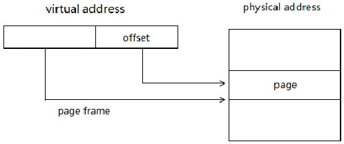

<!-- @import "[TOC]" {cmd="toc" depthFrom=1 depthTo=6 orderedList=false} -->

<!-- code_chunk_output -->

- [1. 寄存器](#1-寄存器)
- [2. 能力检查](#2-能力检查)
  - [2.1. CPUID.01H](#21-cpuid01h)
  - [2.2. CPUID.07H](#22-cpuid07h)
  - [2.3. CPUID.80000001H](#23-cpuid80000001h)
- [3. 寄存器的控制位](#3-寄存器的控制位)
- [4. 页转换表资源](#4-页转换表资源)
  - [4.1. 32 位 paging 模式中](#41-32-位-paging-模式中)
  - [4.2. PAE paging 模式中](#42-pae-paging-模式中)
  - [4.3. IA-32e paging 模式中](#43-ia-32e-paging-模式中)

<!-- /code_chunk_output -->

# 1. 寄存器

下面的寄存器需要被使用.

1) CR0、CR2、CR3 和 CR4.

**CR0** 和 **CR4** 用来**开启和控制 paging 机制及页转换表结构**, **CR2** 是保存发生 `#PF` **异常的线性地址**, **CR3** 是**整个页转换表结构的基地址**.

2) IA32_EFER.

**IA32_EFER** 用于开启 `IA\-32e` 模式(`long-mode`).

# 2. 能力检查

在 **paging 机制**里某些功能需要**先查询处理器是否支持**, 在支持的情况下才可以 **enable** 功能.

## 2.1. CPUID.01H

在 **01H 叶**里**返回的 ECX 和 EDX 寄存器**包括了**大多数 paging 机制**的 **support 位**.

1. `ECX[17].PCID` 位: 指示处理器**是否支持 PCID 功能**, 支持的话可以**开启 CR4.PCIDE 控制位**.

2. `EDX[3].PSE` 位: 指示**是否支持 4M 页面**, 支持的话可以对 **CR4.PSE 控制位置位**. 在 **32 位 paging 模式**下通过 **PDE.PS=1** 来使用**4M 页面**. 这个 support 位**与 PSE\-36 位是不同的意义**, 但 `PSE-36` 功能需要配合 4M 页面使用.

3. `EDX[17].PSE-36` 位: 如果支持: 指示在 **32 位 paging 模式**下, PDE 能提供**最高 40 位的物理地址**. 那么 `PDE[16: 13]` 是 36 位物理地址的高 4 位, 或者 `PDE[20: 13]` 是 40 位物理地址的高 8 位. 如果**不支持则这些位为保留位**.

4. `EDX[6].PAE` 位: 指示是否支持 **PAE(Physical Address Extensions)模式**, 是的话通过对 CR4.PAE 置位使用 PAE paging 模式, 并可以使用 **36 位、40 位或 52 位的最高物理地址**, 依赖于**MAXPHYADDR 值**.

5. `EDX[16].PAT` 位: 指示是否支持 **PAT(Page Attribute Table)功能**.

6. `EDX[13].PGE` 位: 指示是否支持 **PGE(Page Global Enable)功能**, 支持的话可以置 `CR4.PGE=1` 支持 Global page 功能.

## 2.2. CPUID.07H

在 07H 叶的 0H 子叶里(EAX=07H, ECX=0H)返回以下内容.

1. `EBX[7].SMEP` 位: 指示是否支持 SMEP(Supervisor-Mode Execution Prevention)功能, 是的话可以对 CR4.SMEP 控制位进行置位.

2. `EBX[10].INVPCID` 位: 指示是否支持 **INVPCID** 指令.

## 2.3. CPUID.80000001H

在 80000001H 叶里主要是针对 Intel64 和 AMD64 机器, 即支持 long-mode 的机器.

1. `EDX[29].LM` 位: 指示是否支持 Intel64 或 long-mode.

2. `EDX[20].XD` 位: 在 AMD64 中是 NX 位, 指示是否支持 Execution Disable 功能. 是的话可以在 PAE 模式和 IA-32e 页转换模式里使用 XD 位.

3. `EDX[26].1G-page` 位: 指示处理器是否支持 1G 页面.

CPUID.80000008H leaf 功能这个叶功能将返回 MAXPHYADDR 值和最高 virtual address 值.

1. `EAX[7: 0]`: 返回 MAXPHYADDR 值.

2. `EAX[15: 8]`: 返回最高 virtual address 值.

# 3. 寄存器的控制位

CR0 和 CR4 有许多控制位被使用在 paging 机制上.

1) `CR0.PG`: 在 CR0.PE=1 的基础上, 置 CR0.PG=1 开启 paging 机制.

2) `CR0.WP`: 对 `CR0.WP` 置位可以启用 Write Protect 功能, 使 Supervisor 用户也无权对 `Read-only`(只读)页进行修改.

3) `CR0.CD` 与 `CR0.NW`: 将影响到各级页转换表结构里的 PCD 和 PWT 标志, 包括 CR3.

4( `CR4.PSE`: 置 CR4.PSE=1 时, 配合 `PDE.PS` 标志位在 32 位 paging 模式里使用 4M 页面.

5) `CR4.PAE`: 置 CR4.PAE=1 时, 开启 PAE paging 模式. CR4.PAE 控制位将忽略 CR4.PSE 的作用.

6) `CR4.PGE`: 置 CR4.PGE=1 时, 配合 PDE.G 和 PTE.G 标志位启用 Global page 功能, 当更新 CR3 时, TLB 里 Global page 不被刷新.

7) `CR4.SMEP`: 置 `CR4.SMEP=1` 时, 启用 SMEP 功能, 防止 Supervisor 用户执行用户代码.

8) `CR4.PCIDE`: 置 CR4.PCIDE=1 时, 启用 process-context identifier 功能.

9) `IA32_EFER.LME`: 置 `IA32_EFER.LME=1` 时, 开启 `long-mode`, 但需要开启 paging 机制后才被激活.

10) `IA32_EFER.LMA`: 置 `CR4.PAE=1`, 且 CR4.PG=1 时, 激活 long-mode.

11) `IA32_EFER.NXE`: 置 `IA32_EFER.NXE=1` 时, 在 PAE paging 模式和 `IA-32e paging` 模式里启用 Execution Disable 功能.

# 4. 页转换表资源

处理器 paging 机制里使用的**各级页转换表**, 最终是为了查找线性地址映射到物理地址空间上相应的 page frame, 再由 page frame 基地址加上 **page offset** 值得出最终的物理地址.

在三种 paging 模式里, 根据不同的页面尺寸使用**不同的页转换表结构**.

## 4.1. 32 位 paging 模式中

**线性地址是 32 位宽**, 采用一级或两级页转换表, 每个表项大小是 4 字节宽, CR3 使用 32 位.

1) 4K 页面下: 使用 PDT(page directory table, 页目录表)和 PT(page table, 页表)两级表格.

**4KB 页面线性地址构成: 10(PDT 索引, 1024 个项) + 10(PT 索引, 1024 个项) + 12(Page offset, 4KB 页**)

**一个 PDT 和一个 PT 大小都是 4KB**.

2) 4M 页面下: 使用 PDT(page directory table)一级表格.

**4MB 页面线性地址构成: 10(PDT 索引, 1024 个项) \+ 22(Page offset, 4MB 页**)

**一个 PDT 大小是 4KB**

## 4.2. PAE paging 模式中

**线性地址 32 位宽**, 使用两级或三级页转换表, **每个表项 8 字节宽**, CR3 还是 32 位, 但只使用了 27 位, 拼凑了 32 位 PDPT 物理地址.

在 PAE paging 模式里使用两级或三级页转换表.

1) 4K 页面下: 使用 PDPT(page directory pointer table, 页目录指针表), PDT 和 PT.

**4KB 页面线性地址构成: 2(PDPT 索引, 4 个项) \+ 9(PDT 索引, 512 个项) \+ 9(PT 索引, 512 个项) \+ 12(Page offset, 4KB 页**)

PDPT 大小可以是 4x8=32 字节, PDT 和 PT 仍然是 4KB 大小, 512x8.

2) 2M 页面下: 使用 PDPT 和 PDT.

**2MB 页面线性地址构成: 2(PDPT 索引, 4 个项) \+ 9(PDT 索引, 512 个项) \+ 21(Page offset, 2MB 页**)

PDPT 大小可以是 4x8=32 字节, PDT 是 4KB

## 4.3. IA-32e paging 模式中

线性地址 48 位宽, 使用两级到四级的页转换表, 每个表项都是 8 字节宽, CR3 是 64 位宽, 针对是否支持 PCIDE 功能, CR3 使用不一样.

1) **4K 页面**下: 使用 PML4T(page map level-4 table, 四层映射表), PDPT, PDT 和 PT.

**4KB 页面线性地址构成: 9(PML4T 索引, 512 个项) \+ 9(PDPT 索引, 512 个项) \+ 9(PDT 索引, 512 个项) \+ 9(PT 索引, 512 个项) \+ 12(Page offset, 4KB 页**)

每个 table(PML4T, PDPT, PDT, PT)大小都是 4KB = 512 x 8

2) **2M 页面**下: 使用 PML4T, PDPT 和 PDT.

**2MB 页面线性地址构成: 9(PML4T 索引, 512 个项) \+ 9(PDPT 索引, 512 个项) \+ 9(PDT 索引, 512 个项) \+ 21(Page offset, 2MB 页**)

每个 table(PML4T, PDPT, PDT)大小都是 4KB = 512 x 8

3) **1G 页面**下: 使用 PML4T 和 PDPT.

**1GB 页面线性地址构成: 9(PML4T 索引, 512 个项) \+ 9(PDPT 索引, 512 个项) \+ 30(Page offset, 1GB 页**)

每个 table(PML4T, PDPT, PDT)大小都是 4KB = 512 x 8

每个 table 里的 entry(表项)分别被称为 PTE(Page Table Entry)、PDE(Page Directory Table Entry)、PDPE(Page Directory Pointer Table Entry)和 PML4E(Page\-Map Leve\-4 Table Entry).

