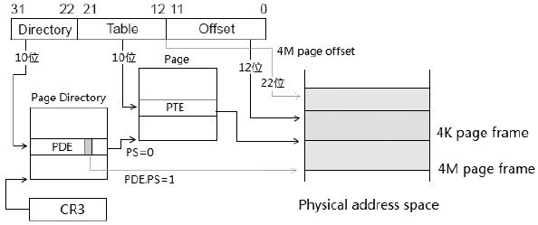
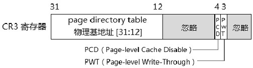
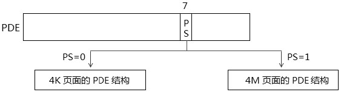
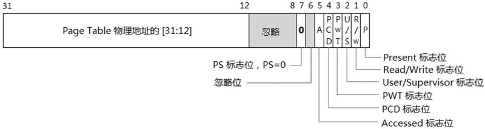
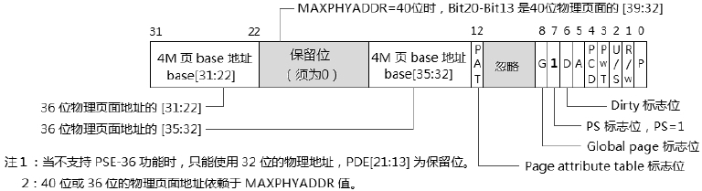
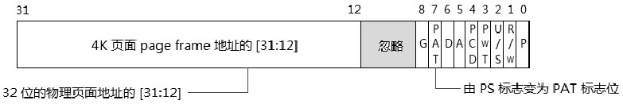
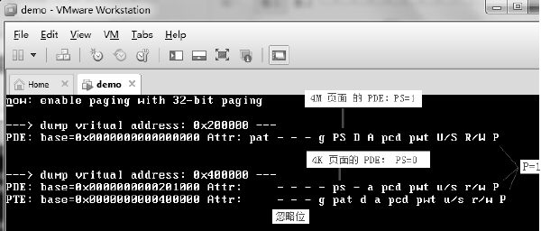
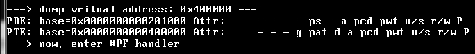
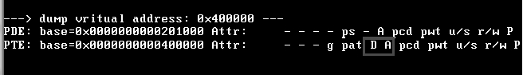
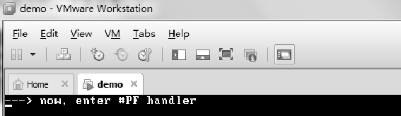

<!-- @import "[TOC]" {cmd="toc" depthFrom=1 depthTo=6 orderedList=false} -->

<!-- code_chunk_output -->

- [1. 基本原理](#1-基本原理)
  - [1.1. 两种页表结构](#11-两种页表结构)
  - [1.2. page offset 值](#12-page-offset-值)
  - [1.3. Table Entry(表项)的大小](#13-table-entry表项的大小)
  - [1.4. 页表的大小](#14-页表的大小)
- [2. CR3 结构](#2-cr3-结构)
  - [2.1. PWT](#21-pwt)
  - [2.2. PCD](#22-pcd)
- [3. 32 位 paging 模式下的 PDE 结构](#3-32-位-paging-模式下的-pde-结构)
  - [3.1. 4K 页面的 PDE 结构](#31-4k-页面的-pde-结构)
    - [3.1.1. P(Present)标志位](#311-ppresent标志位)
    - [3.1.2. R/W(Read/Write)标志位](#312-rwreadwrite标志位)
    - [3.1.3. U/S(User/Supervisor)标志位](#313-ususersupervisor标志位)
    - [3.1.4. PWT(Page-level Write-Through)标志位](#314-pwtpage-level-write-through标志位)
    - [3.1.5. PCD(Page-level Cache Disable)标志位](#315-pcdpage-level-cache-disable标志位)
    - [3.1.6. A(Accessed)标志位](#316-aaccessed标志位)
    - [3.1.7. PS(Page Size)标志位](#317-pspage-size标志位)
  - [3.2. 4M 页面的 PDE 结构](#32-4m-页面的-pde-结构)
    - [3.2.1. D(Dirty)标志位](#321-ddirty标志位)
    - [3.2.2. G(Global page)标志位](#322-gglobal-page标志位)
    - [3.2.3. PAT(Page-Attribute Table)标志位](#323-patpage-attribute-table标志位)
    - [3.2.4. 保留位与忽略位](#324-保留位与忽略位)
    - [3.2.5. PS(Page Size)标志位](#325-pspage-size标志位)
  - [3.3. 4K 页面的 PTE 结构](#33-4k-页面的-pte-结构)
    - [3.3.1. 描述 page 的属性](#331-描述-page-的属性)
- [4. 使用 32 位 paging](#4-使用-32-位-paging)
  - [4.1. 配置页转换表环境](#41-配置页转换表环境)
  - [4.2. 开启 PSE 功能](#42-开启-pse-功能)
  - [4.3. 开启 paging](#43-开启-paging)
  - [4.4. 测试一: 在用户代码里写 0x400000 地址](#44-测试一-在用户代码里写-0x400000-地址)
  - [4.5. 测试二: 在 0 级代码里写 0x400000 地址](#45-测试二-在-0-级代码里写-0x400000-地址)
  - [4.6. 测试三: 在开启 WP 功能下, 0 级代码里写 0x400000 地址](#46-测试三-在开启-wp-功能下-0-级代码里写-0x400000-地址)

<!-- /code_chunk_output -->

# 1. 基本原理

在**32 位 paging 模式**里, **virtual address 是 32 位宽(！！！**). 映射的**物理地址**在**支持 PSE\-36 机制**下是**36 位或 40 位**(取决于**MAXPHYADDR 值**), 否则**为 32 位**.



上图显示了在**32 位 paging 模式**下的**4K 和 4M 页面**的 page frame 获取路径. **CR3 提供 PDT 的基地址**.

**4MB 页面线性地址构成: 10(PDT 索引, 1024 个项) \+ 22(Page offset, 4MB 页**)

**灰色线路**是**4M 页面**的路径: 在**PDT 里的 entry 结构**(PDE)的**PS 标志为 1(！！！**)时, PDE 指向 4M 的物理 page frame(**只需要这一个页表结构！！！**). 线性地址中的[21: 0]域是**22 位的 4M 页面**的**offset**值.

**4KB 页面线性地址构成: 10(PDT 索引, 1024 个项) \+ 10(PT 索引, 1024 个项) \+ 12(Page offset, 4KB 页**)

**黑色线路**是 4K 页面的路径: 当**PDE.PS=0**时, PDE 指向 Page table 结构, 再由 PTE 指向最终的 4K 物理 page frame, 线性地址中的[11: 0]域是**12 位**的**4K 页面的 offset**值.

## 1.1. 两种页表结构

从上图我们看到在 32 位 paging 模式里使用了**两种页表**.

1) **Page Directory Table(页目录表**): 和其中的**PDE 结构作为一类**, 线性地址的[31: 22]域**10 位**是**PDT 的索引值**, 在**PDT**内查找**对应的 PDE**结构.

2) **Page Table(页表**): 和其中的 PTE 结构作为一类, **线性地址的[21: 12]域**是 PT 的索引值, 在 PT 内查找对应的 PTE 结构.

## 1.2. page offset 值

对于**4K 页面**来说**线性地址的[11: 0**]域是 page 内的**offset**值, 对于**4M 页面**来说**线性地址的[21: 0]域**是 page 内的**offset**值.

## 1.3. Table Entry(表项)的大小

每个**Table Entry 结构**为**4 个字节 32 位宽(！！！**), 可是**CR3 依然只能使用低 32 位**.

## 1.4. 页表的大小

在**32 位 paging 模式**下, **PDT**的**索引值**和**PT**的**索引值**是**10 位**, 可以查找到**1024 个表项(！！！**), 而**每个表项**(PDE 和 PTE)的大小是**4 字节宽(！！！**), 因此**每个 PDT 和 PT 的 size 都是 4KB(一个整个页目录表或一个页表！！！**).

在**完整的一级 paging**里总共需要多少个页转换表结构和多少内存量?

这个要视映射的范围来定, 假如要映射**完整的 4G 虚拟地址**, 以**4K 页面映射**的话将需要:

1) 需要**1 个 PDT**, 占用**4K 内存**.

2) **PDT**里有**1024 个 PDE 表项**, 那么需要**1024 个 PT**, 占用**4K×1024=4M 内存**.

总共需**1025 个页转换表结构**, 占用**4M+4K 的内存量**.

如果全部 page 以**4M 页面映射**, 将大大减少内存需求量, **只需要 1 个 PDT**, 占用**4K 的内存量**.

# 2. CR3 结构

在**32 位 paging 模式**下的**CR3 结构**如下.



在 32 位 paging 模式下, CR3 使用**低 32 位**(在**Intel64 或 AMD64 机器上 64 位**), CR3 的**Bit 31 到 Bit 12 位**提供**20 位的 Page Directory Table 的物理基地址(物理基地址！！！高 20 位！！！**).

那么以**36 位的物理基地址**为例, 它是这样形成的.

1) base of PDT[35: 32]=0 值(**高 4 位 Bit 35 到 Bit 32 为 0 值！！！如果是 40 位物理地址高位也会是补 0！！！**).

2) base of PDT[31: 12]=CR3[31: 12](由**CR3 的 Page Driectory base 域**提供).

3) base of PDT[11: 00]=0 值(**低 12 位补 0！！！**).

因此 CR3 提供的**PDT 物理基地址(！！！**)是**4K 边界对齐(！！！**)的. **和 4KB 分页的物理地址形成方式一致(！！！**).

32 位 paging 下**最高为 40 位物理地址(！！！**)(依赖于 PSE\-36 与 MAXPHYADDR 值).

## 2.1. PWT

这是**page 级**的**Write\-Through 标志位**, 当 PWT=1 时使用**Write\-Through 的 Cache 类型**, 当 PWT=0 时使用**Write\-Back**的 Cache 类型. 它受到**CR0.CD 控制位**的影响, 当**CR0.CD=1**时(**Cache 被 Disable 掉**)PWT 标志**会被忽略**.

## 2.2. PCD

这是 page 级的**Cache Disable 标志位**. 当 PCD=1 时, **物理页面是不能被 Cache 的**, 清 0 时允许. 当 C**R0.CD=1**时, PCD 标志位被忽略.

**PWT 和 PCD 标志使用在 CR3**中, **整个页转换表结构**都受到**影响(页表结构也是物理页！！！**).

# 3. 32 位 paging 模式下的 PDE 结构

如下图所示, 它是**4K 页面**和**4M 页面**共同使用的结构.



当**PDE.PS=1**时, 它将作为**4M 页面**的 PDE 结构, 当 PDE.PS=0 时, 它作为 4K 页面的 PDE 结构, 这两种解析存在区别.

## 3.1. 4K 页面的 PDE 结构

在 PDE.PS 为 0 时, 使用 4K 页面的 PDE 结构, 如下图所示.



在这个结构里, `PDE[31: 12]`域共**20 位是 Page table 结构**的**物理基地址**, 在这个 32 位 paging 模式的 4K 页面里, 能映射的**物理地址最高是 32 位(！！！4K 页最高 32 位！！！**), 下一级**32 位的 page table 物理地址(只是 32 位物理地址组成关系！！！**)形成如下.

1) base of `PT[31: 12]`(**高 20 位**)=`PDE[31: 12]`, 它是**PDE 的高 20 位值**.

2) base of `PT[11: 0]`(**低 12 位**)=0 值, 32 位地址的**低 12 位补 0**.

因此, PDE 里提供的**PT 物理基地址(！！！**)是**4K 边界对齐(！！！由 PT 物理基地址组成决定的！！！**)的.

### 3.1.1. P(Present)标志位

**必须为 1**, 表示 **page table 或 page**是存在内存中, 否则产生 `#PF` 异常. 它与**段描述符中的 P 标志位**意义相同, 不同的是**段描述符中的 P=0** 时**产生 \#NP 异常**.

### 3.1.2. R/W(Read/Write)标志位

这个标志位指示和决定**物理 page 的读/写权限**. 为**0 时是只读**的, 为**1 时是可读/写的**. 当 CR0.WP 为 0 时, Supervisor 可以对只读页进行写操作. 关于 R/W 标志位如何决定物理 page 读/写权限, 在第 11.8 节有详细描述.

### 3.1.3. U/S(User/Supervisor)标志位

这个标志位指示和决定物理 page 的访问权限:

* 当为 **0** 时**只有 Supervisor(0 级、1 级或者 2 级权限**)才能访问;
* 当为 **1** 时 User(3 级权限)和 Supervisor 可以访问.

关于 U/S 标志位如何决定物理 page 的访问权限, 在第 11.8 节有详细描述.

### 3.1.4. PWT(Page-level Write-Through)标志位

定义页级的 Cache 类型, 见 11.3.1 节.

### 3.1.5. PCD(Page-level Cache Disable)标志位

指示页级是否可 Cache, 见 11.3.1 节.

### 3.1.6. A(Accessed)标志位

为 1 时, 指示和决定**物理 page 是否已被访问(读或写**). 一旦置位, **处理器从不清这个标志位**. 这个标志位**可被 OS 的内存管理软件利用**.

### 3.1.7. PS(Page Size)标志位

PS 标志位仅使用在 PDE 和 PDPE 结构中, 为 1 时, 表示 PDE 或 PDPE 指向物理 page frame, 为 0 时, 指向下一级页转换表结构.

在这个 4K 页面的 PDE 结构里, PS 值为 0, 它将指向 PT 的物理基地址. 在 PDE 结构中灰色部分为忽略域, 不影响使用.

## 3.2. 4M 页面的 PDE 结构

当 **PDE.PS 为 1**时, 使用下面的**4M 页面 PDE 结构**.



这个 PDE 结构里将提供 4M 页面的基地址, 然而这个 4M 物理 page frame 地址的设置, 需要注意.

1) 当处理器**不支持 PSE\-36**功能时, 4M page frame 只能映射到**32 位的物理地址空间(！！！**)上, `PDE[31: 22]` 是 `4M page base[31: 22]`(**高 10 位**), 这时候 `PDE[21: 13]` 共 9 位是保留位, 必须设置为 0 值.

2) 当 **MAXPHYADDR** 值为 **36** 位时, `PDE[16: 13]` 是 **4M page base[35: 32]位(高 4 位**), `PDE[31: 22]` 是 `4M page base[31: 22]`(**中间 10 位**), 而 `PDE[21: 17]` 是保留位, 必须设置为 0 值.

3) 当 MAXPHYADDR 值为 **40** 位时, `PDE[20: 13]` 是 `4M page base[39: 32]` 位(高 8 位), `PDE[31: 22]` 是 `4M page base[31: 22]`(**中间 10 位**), 而 `PDE[21]` 位是保留位, 必须设置为 0 值.

4) 当 MAXPHYADDR 值为 **52 位**时, 也**仅能使用 40 位的物理地址(！！！**), 同3).

因此, 4M page frame 的基地址形成除上述所说外, **36 位或 40 位的物理地址低 22 位将补 0(！！！**), 物理页面将在 **4M 边界上对齐(！！！**).

### 3.2.1. D(Dirty)标志位

这个标志位仅被用于描述 **page 的属性**. 当**page 被写**时, 处理器将 D 标志置位, 指示已被写过, **处理器从不会清 D 标志位**. 典型地**D 标志和 A 标志可被 OS 内存管理软件使用**.

### 3.2.2. G(Global page)标志位

这个标志位仅被用于描述 page 的属性. 当**CR4.PGE=1(！！！**)时, 可置**G 标志位为 1(！！！**), 指示**page 是 global page(！！！**). 在**CR3 被更新**时, TLB 内的**global page 不被刷新**.

### 3.2.3. PAT(Page-Attribute Table)标志位

当`CPUID.01H: EDX[16]` support 位为 1 时, 可以使用 PAT 功能, PAT 标志位可被置位. 否则为保留位, 必须为 0 值. 它指示了 page 的属性.

注意, **D 标志、G 标志以及 PAT 标志位仅被使用在对 page** 的管理上.

1) 当 **4K 页面**时, 使用在 **PTE 结构**上.

2) 当 **4M 和 2M 页面**时, 使用在 **PDE 结构**上.

3) 当 **1G 页面**时, 使用在 **PDPE 结构**上.

否则在其他 page entry 页项结构里 D 标志和 G 标志被忽略, PAT 标志位为 0 值.

### 3.2.4. 保留位与忽略位

在各级页表项(entry)结构里, 会有保留位或者忽略位. 它们的意义是不同的, 保留位必须为 0, 处理器会对保留位进行检查. 忽略位不会被检查, 不起作用.

### 3.2.5. PS(Page Size)标志位

在 **4M 和 2M 页面**里, **PDE(！！！)的 PS 标志位为 1**. 在 **1G 页面**里, **PDPE(！！！IA\-32e 的 1GB 页面就两级页表 PML4T 和 PDPT)的 PS 标志位为 1**. 在其他的 page **表项结构**里为 **0 值**(在 PTE 结构里 PS 位被用做 PAT 标志位).

换句话说, **只有 4KB 页面的所有表结构 PS 标志位为 0, 其余大小页面机制有 PDT 的则是在 PDT 的表项(即 PDE)中 PS 标志位置位 1, 没有 PDT 的则是在 PDPT 的表项(即 PDPE**)

## 3.3. 4K 页面的 PTE 结构

PTE 结构**指向物理 page frame 基址**(在**4M 页面里由 PDE 结构指向！！！**). 4K 页的 page frame 是**4K 边界对齐(由物理地址组成决定的！！！**)的.



在 32 位 paging 模式下 **4K 页面**使用的是 **32 位的最高映射物理地址(！！！只能使用最高 32 位物理地址！！！**). 因此 page frame 的形成如下.

1) `page base[31: 12]` = `PTE[31: 12]`, PTE 的**高 20 位**对应**物理页面的高 20 位**.

2) `page base[12: 0]` = 0 值. **物理页面的低 12 位补 0**.

所以**物理页面在 4KB 边界对齐**.

在上图中, PTE 结构的 Bit7 位由 PS 标志位变为 PAT 标志位.

### 3.3.1. 描述 page 的属性

如同 4M 页面的 PDE 结构, D 标志、G 标志, 以及 PAT 标志被使用在 4K 页面的 PTE 结构里. 其意义是完全一致的.

# 4. 使用 32 位 paging

到目前为止, protected.asm 模块是未开启 paging 机制的. 在这一小节里, 我们将在 protected.asm 模块里打开 paging 机制, 并作为一个练习实验来使用 32 位 paging.

>实验 11-2: 使用与测试 32 位 paging

这一小节的源代码在 topic11\ex11-2\目录下.

## 4.1. 配置页转换表环境

在**开启 paging 机制前**必须先**设置好各级的页转换表结构**, 代码如下.

代码清单 11-3(topic11\ex11-02\protected.asm):

```x86asm
; ---------------------------------------------
;  init_32bit_paging(): 建立 32 位 paging 环境
; ---------------------------------------------
init_32bit_paging:
;  1) 0x000000-0x3fffff 映射到 0x0 page frame, 使用 4M 页面
;  2) 0x400000-0x400fff 映射到 0x400000 page frame, 使用 4K 页面
; ;  PDT 物理地址设在 0x200000 位置上, PT 物理地址在 0x201000 位置上
;  1) 设置 PDT[0](映射 0 page frame)
      ;  base=0, PS=1, P=1, R/W=1, U/S=1
      mov DWORD [PDT32_BASE + 0], 0000h | PS | RW | US | P
;  2) 设置 PDT[1]
      ;  PT 的地址在 0x201000 位置上, 设置为 supervisor, only-read 权限
      ;  PT base=201000h, P=1
      mov DWORD [PDT32_BASE + 1 * 4], 201000h | P
;  3) 设置 PT[0](映射 0x400000 page frame), 设置为 supervisor, only-read 权限
      mov DWORD [201000h + 0], 400000h | P  ;  4K page framg=400000h
      ret
```

init\_32bit\_paging()函数的职责是设置 32 位 paging 模式下的页转换表结构, 作为练习实验, 为了简明这里只映射了两块区域.

1) virtual address 的 0 到 0x3FFFFF 区域, 使用 4M 页面来映射.

2) virtual address 的 0x400000 到 0x400FFF 区域, 使用 4K 页面来映射.

PDT 的物理基地址设在 0x200000 位置, 而 PT 的物理基地址设在 0x201000 位置上, 于是 virtual address 区域 0 到 0x3FFFFF 将使用 `PDE[0]`, 而 0x400000 将使用 `PDE[1]`, 如上面代码所示, 直接对 PDE 结构进行设置.

## 4.2. 开启 PSE 功能

在 32 位 paging 分页模式下, 为了使用 4M 页面, 需要开启 PSE 功能.

代码清单 11-4(topic11\ex11-02\protected.asm):

```x86asm
pse_enable:
      mov eax, 1
      cpuid
      bt edx, 3                                ;  PSE support?
      jnc pse_enable_done
      mov eax, cr4
      bts eax, 4                               ;  CR4.PSE=1
      mov cr4, eax
pse_enable_done:
      ret
```

上面先检测是否支持 PSE 功能, 通过 `CPUID.01H:EDX[3].PSE` 位查询. (检查是否支持 PSE 似乎有些多余！并且上面的代码也没有在不支持的情况下进行提示. )最后对 `CR4.PSE` 进行置位.

当 `CR4.PSE = 0` 时, 将使用 4K 页面(`PDE.PS=1` 时作用被忽略).

因此, 下面两种情况下效果是一致的.

1) `CR4.PSE = 0` 时: 关闭 4M 页面.

2) `CR4.PSE = 1` 且 `PDE.PS=0` 时: 使用 4K 页面.

## 4.3. 开启 paging

在对 CR0.PG 置位时, 必须先设置 PDT 的物理基地址, 即对 CR3 赋值.

代码清单 11-5(topic11\ex11-02\protected.asm):

```x86asm
;  初始化 paging 环境
      call init_32bit_paging
; 设置 PDT 地址
      mov eax, PDT32_BASE
      mov cr3, eax
; 设置 CR4.PSE
      call pse_enable
;  打开 paging
      mov eax, cr0
      bts eax, 31
      mov cr0, eax
```

上面的代码是在 protected 模式下进行设置, 当置 `CR0.PG` 为 1 时, 处理器将立即进入 paging 机制. 在 `mov cr0, eax` 指令的下一条指令将使用 paging 管理, 处理器将在各级 page 表结构里 walk 查找 EIP 指针地址.

最后, 为了直接显示 paging 机制的效果, 在 `lib\page32.asm` 模块里写了一个 `dump_page()` 函数, 用来打印出被映射 virtual address 的 PDE 和 PTE 信息, 源代码在 page32.asm 文件里.

代码清单 11-6(topic11\ex11-02\protected.asm):

```x86asm
mov esi, 0x200000                ;  dump virtual address 0x200000
call dump_page
mov esi, msg3
call puts
mov esi, 0x400000                ;  dump virtual address 0x400000
call dump_page
```
这段代码在用户代码里做测试, 分别打印 virtual address 0x200000 和 0x400000 的各级 page 表结构信息.

下面是实验的结果.



结果所示, virutal address 0x200000 是在 4M 页面内, 它的 page frame 地址是 0, 后面显示为 Attribute 属性, 在 Attribute 显示里大写为置位, 小写为清 0. 4M 页面的属性为 `PS = 1`, `User/Writable`(用户权限可访问, 可读/写).

virtual address 0x400000 是 4K 页面, 注意它的 D 和 A 标志为 0, 显示未曾被访问过. 并且它的访问权限是 Supervisor 和 `Only-read`. 它对用户代码有两个方面的限制.

1) 只能被 Supervisor 访问, 拥有 0、1 和 2 级权限.

2) Only-read 限制, 对于用户代码来说是不可写的.

## 4.4. 测试一: 在用户代码里写 0x400000 地址

下面我们在用户代码里向 0x400000 地址写数据, 将产生#PF 异常.



## 4.5. 测试二: 在 0 级代码里写 0x400000 地址

对于 Supervisor 访问者, 当 CR0.WP=0 时, 它可以写 Only-read 页面. 下面我们测试在 0 级代码里写 0x400000 地址, 结果如下.



注意, 此时 0x400000 页面的 D 标志和 A 标志已经被置位(已被写访问过).

## 4.6. 测试三: 在开启 WP 功能下, 0 级代码里写 0x400000 地址

代码清单 11-7(topic11\ex11-02\protected.asm):

```x86asm
; 测试二: 在 CR0.WP=0 时, 在 0 级代码里写 0x400000 地址
mov DWORD [0x400000], 0
; 测试三: CR0.WP=1 时, 写 0x400000
mov eax, cr0
bts eax, WP_BIT
mov cr0, eax
mov DWORD [0x400000], 0
```

在 0 级代码里开启 CR0.WP 控制位后, 再尝试往 0x400000 地址里写数据, 那么将产生#GP 异常.



结果所示, 执行流程未进入用户代码就产生了 `#PF` 异常.