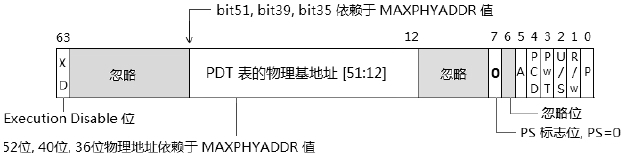

<!-- @import "[TOC]" {cmd="toc" depthFrom=1 depthTo=6 orderedList=false} -->

<!-- code_chunk_output -->

- [1. 基本原理](#1-基本原理)
  - [1.1. 使用 4 种 table 和 entry 结构](#11-使用-4-种-table-和-entry-结构)
  - [1.2. 支持 3 种页面 size](#12-支持-3-种页面-size)
  - [1.3. Intel64 新功能](#13-intel64-新功能)
- [2. IA-32e paging 模式下的 CR3](#2-ia-32e-paging-模式下的-cr3)
  - [2.1. 普通的 CR3 结构](#21-普通的-cr3-结构)
  - [2.2. 2.2 在 CR4.PCIDE=1 时 Intel64 的 CR3](#22-22-在-cr4pcide1-时-intel64-的-cr3)
  - [2.3. PCID 机制](#23-pcid-机制)
    - [2.3.1. 当前的 PCID 值](#231-当前的-pcid-值)
    - [2.3.2. 默认的 PCID 值](#232-默认的-pcid-值)
    - [2.3.3. 更新 PCID 值](#233-更新-pcid-值)
    - [2.3.4. 开启 PCID 功能](#234-开启-pcid-功能)
    - [2.3.5. 关闭 PCID 功能](#235-关闭-pcid-功能)
- [3. IA-32e paging 模式下的 PML4E 结构](#3-ia-32e-paging-模式下的-pml4e-结构)
- [4. IA-32e paging 模式下的 PDPTE 结构](#4-ia-32e-paging-模式下的-pdpte-结构)
  - [4.1. 1G 页面下的 PDPTE 结构](#41-1g-页面下的-pdpte-结构)
  - [4.2. 4K 和 2M 页面下的 PDPTE 结构](#42-4k-和-2m-页面下的-pdpte-结构)
- [5. IA-32e paging 模式下的 PDE 结构](#5-ia-32e-paging-模式下的-pde-结构)
- [6. IA-32e paging 模式下的 PTE 结构](#6-ia-32e-paging-模式下的-pte-结构)
- [7. SMEP 机制](#7-smep-机制)
  - [7.1. User 权限](#71-user-权限)
  - [7.2. Supervisor 权限](#72-supervisor-权限)
  - [7.3. Data 页和 Code 页](#73-data-页和-code-页)
  - [7.4. SMEP 的实施](#74-smep-的实施)
  - [7.5. 检测 SMEP 是否支持](#75-检测-smep-是否支持)
  - [7.6. 使用和测试 SMEP 功能](#76-使用和测试-smep-功能)
  - [7.7. 重新设置 page 映射](#77-重新设置-page-映射)
  - [7.8. 开启 SMEP 功能](#78-开启-smep-功能)
  - [7.9. 复制到 0x400000 区域](#79-复制到-0x400000-区域)
  - [7.10. VMware 中的运行结果](#710-vmware-中的运行结果)
  - [7.11. Bochs 2.5.1 中的运行结果](#711-bochs-251-中的运行结果)
- [8. 使用 IA-32e paging 模式](#8-使用-ia-32e-paging-模式)
  - [8.1. 初始化 paging 结构](#81-初始化-paging-结构)
  - [8.2. 进入 IA-32e 模式](#82-进入-ia-32e-模式)
  - [8.3. 测试 IA-32e paging 模式](#83-测试-ia-32e-paging-模式)

<!-- /code_chunk_output -->

# 1. 基本原理

这是 Intel 的术语, 在 AMD 中是指 long-mode paging 模式. 开启 paging 机制在 IA-32e 模式里是必需的. 只有开启 paging 机制 IA-32e(long-mode) 才能被激活(`IA32_EFER.LMA=1`).

在 IA-32e paging 模式里, 必须开启的功能如下.

1) `IA32_EFER.LME=1`: 开启 long-mode.

2) `CR0.PG=1`, `CR4.PAE=1`: 进入 PAE paging 模式, 并激活 long-mode.

下面是在 IA-32e paging 模式下的页转换路径图.


**灰色路线**是**2M 页面**的转换, **深灰色**路线是**1G 页面**的转换, 而**黑色路线**是**4K 页面**的转换.

* **4KB** 页面**线性地址**构成: 9(PML4T 索引, 512 个项) + 9(PDPT 索引, 512 个项) + 9(PDT 索引, 512 个项) + 9(PT 索引, 512 个项) + 12(Page offset, 4KB 页)

* **2MB** 页面**线性地址**构成: 9(PML4T 索引, 512 个项) + 9(PDPT 索引, 512 个项) + 9(PDT 索引, 512 个项) \+ 21(Page offset, 2MB 页)

* **1GB** 页面**线性地址**构成: 9(PML4T 索引, 512 个项) + 9(PDPT 索引, 512 个项) + 30(Page offset, 1GB 页)

## 1.1. 使用 4 种 table 和 entry 结构

在**IA-32e paging**模式下, 使用 4 个 table 和 table entry 结构.

1) PML4T(Page Map Level-4 Table)及表内的 PML4E 结构, 这是 IA-32e paging 新增的**页转换表**, 每个表为 4K 字节. 内含 512 个 PML4E 结构.

2) PDPT(Page Directory Pointer Table)及表内的 PDPE 结构(在前面的 PAE paging 描述中使用 PDPTE 术语, 指同一结构), 每个表 4K 字节, 内含 512 个 PDPE 结构.

3) PDT(Page Directory Table)及表内的 PDE 结构(或称 PDTE 结构), 每个表 4K 字节, 内含 512 个 PDE 结构.

4) PT(Page Table)及表内的 PTE 结构, 每个表 4K 字节, 内含 512 个 PTE 结构.

IA-32e paging 模式是在 PAE paging 模式的基础上新增了一级 table, virtual address 可以使用 48 位宽. 在当前的**x64 体系**里, 处理器**64 位线性地址**空间**只实现了 48 位**, 高 16 位被用做 Bit 47 位的**符号扩展位**, 要么全是 0 值, 要么全是 1 值, 这是 **canonical address 形式**.

每个 table entry 结构都是 **8 个字节 64 位宽**, 而 virtual address 中的每个 table entry 索引值都是 9 位, 因此**每个 table 都是 512×8=4K 字节**.

## 1.2. 支持 3 种页面 size

在 IA-32e paging 模式下新增了 1G 页面, 可以使用 3 种 page size.

1) 4K 页面: page frame 从 PTE 里提供.

2) 2M 页面: page frame 从 PDE 里提供.

3) 1G 页面: page frame 从 PDPTE 里提供.

## 1.3. Intel64 新功能

Intel64 实现了一些新功能, 包括 **PCID 功能**和 **SMEP 功能**.

**SMEP 功能**也可以使用在 **PAE paging 模式**里. 而**PCID 功能**必须用在**IA-32e paging 模式(！！！**)里. 这些功能在**AMD64 处理器里是不提供**的.

我们将在后面的**11.5.1.3 节里探讨 PCID 功能**, 在**11.5.6 节里探讨 SMEP 功能**.

# 2. IA-32e paging 模式下的 CR3

在 IA-32e paging 模式下, **CR3 是 64 位宽(！！！**). 在 AMD64 中 CR3 的结构比较简单, 然而在 Intel64 中 CR3 结构分两种情况.

1) 在**不支持 PCIDE 功能**时, Intel64 的实现与 AMD64 实现是一致的.

2) 在**支持 PCIDE 功能**时, Intel64 实现比较复杂.

我们先了解普通的 CR3 结构.

## 2.1. 普通的 CR3 结构

当 `CR4.PCIDE=0` 时, Intel64 与 AMD64 在 `IA-32e paging` 模式下的 CR3 如下图所示.


CR3 可以使用 64 位宽, 它的 PML4T 物理地址同样遭遇到 MAXPHYADDR 取值的情形, **PML4T 物理地址的形成**与**第 4 节所描述的情形一致**.

`CR3[51: 12]` 提供 **PML4T 的物理地址高位(最多 40 位**), **低 12 位全部补 0**,  **PML4T 地址 4K 边界对齐**.

如果物理地址比较小, **bit 51 往下减少**.

## 2.2. 2.2 在 CR4.PCIDE=1 时 Intel64 的 CR3

Intel 的 PCID 功能**只能用于 IA-32e paging 模式**下, CR3 的结构如下图所示.


在 Intel64 提供的新机制下, CR3 变得复杂起来, 当**CR4.PCIDE=1(！！！**)时, CR3 的**低 12 位提供一个 PCID 值**, 用来定义**当前的 process context ID(！！！**). 当对**CR3 进行更新**时, **Bit 63 位(！！！**)提供一个值来决定**是否需要 invalidates 处理器的 TLB 和 paging-structure cache**(这两个 cache 将在后面探讨).

1) 当`CR3[63]=0`时, 对**CR3 更新**将使**TLB**和**paging-structure cache**失效.

2) 当`CR3[63]=1`时, 对 CR3 更新不会使 TLB 和 paging-structure cache 失效.

## 2.3. PCID 机制

这个**PCID**是为**TLB**和**paging-structure cache**而产生的, CR3**低 12 位的 PCID 值**可以为**不同的 linear address space(线性地址空间**)定义**一个编号**. 处理器会**在 TLB 和 paging-structure cache**里为**不同 PCID 编号**的**linear address space 维护一份 cache(tlb 和 paging-structure 两个！！！**).

由于**PCID 值是 12**位, 可以定义**最大值为 0xFFF**, 共**4K 的 PCID 值**. Intel 并没有明确说明关于 PCID 的限制.

基于上述的思考, 我们可以认为**每个处理器**会维护共**4K 份的 TLB 和 paging-structure cahce**, 这将是一个很大的 cache 块, **若每份 TLB 为 4K 字节**, 那么将需要**16M 的 TLB**. 因此笔者对此有些疑虑. **可是 PCID 是 Intel64 上新的技术**, 许多处理器**并不支持**.


注意, 上面这个图是笔者对 Intel64 手册里所理解出来的 PCID 与 TLB 及 pagingstructure cache 之间的对应关系. **每一个 PCID 号**对应一份**TLB 和 paging-structure cache**(或者其他形式).

### 2.3.1. 当前的 PCID 值

处理器在 **TLB 和 paging-structure cache** 中建立或者说生成 **TLB entry 和 Cache entry** 时, 只**基于当前的 PCID 值(！！！**). 直接点说就是, 处理器在**一个时间**上, 只维护**当前 PCID 编号(！！！**)的 **linear address space**(或说 virtual address space)的**TLB 和 paging structure cache(！！！**).

当使用**mov CR3, reg64**指令对**CR3 进行更新**, 并且使用**不同的 PCID 值**时, 处理器会**维护新的 PCID 值所对应的 TLB 与 paging structure cache**.

那么, 当前的 PCID 就是在 CR3 里, 随着**使用新 PCID 值**进行 CR3 切换而**改变**.

### 2.3.2. 默认的 PCID 值

有**三种情况**使用**默认的 PCID 值(000H**).

1) 当处理器**不支持 PCID 功能**时, 使用**默认的 PCID 值**.

2) PCID**只能使用在 IA-32e paging 模式**里, 因此当处理器在**32 位 paging 模式**及**PAE paging 模式**下, 即**IA32\_EFER.LME=0**时, 使用默认的 PCID 值.

3) 在 IA-32e paging 模式下, 但**CR4.PCIDE=0**, 即**未开启 PCID 功能**时, 使用默认的 PCID 值.

**默认的 PCID 值为 000H(！！！**), 因此在**上述情况下**, 处理器只维护**000H 编号**的**TLB 和 paging-structure cache**, 实际效果等同于在 legacy 处理器上未实现 PCID 功能.

### 2.3.3. 更新 PCID 值

当执行 mov CR3, reg64 指令对 **CR3 进行刷新**时, **TLB 和 paging-structure cache 的失效**依赖于 `CR3[63]` 位(！！！**), 如下面的代码所示.

```x86asm
mov rax, PML4T_BASE | 0x1    ;PCID=01 值
mov cr3, rax                 ;更新 CR3
```

这个代码是在 CR4.PCIDE=1 的前提下, **使用了 PCID 值为 1 去更新 CR3**, 并且 CR3[63]=0, 表明需要更新 TLB 及 paging-structure cahce, 那么这时候指令对 TLB 和 paging-structure cache 有下面几方面的情形.

1) 使原来 PCID 为 001H 编号的**TLB 无效**, 即**刷新 TLB**.

2) 使原来 PCID 为 001H 编号的**paging-structure cache 无效**, 即**刷新 paging-structure cache**.

3) 对 global page 无影响, **不会刷新 global page(！！！**).

4) 对**其他 PCID 编号的 TLB 和 paging-structure cache 无影响(！！！**), 不会刷新其他 PCID 编号的 TLB 和 paging-structure cache 内容.

因此, 处理器会保留其他 PCID 编号的 virtual address space 在 TLB 及 paging-structure cache 的内容, 即 virtual address 的 page 及 table entry.

那么从这个角度看, 处理器应该**需要保留 0xFFF 份 virtual address space 的 page 及 table entry 在 TLB 和 paging-structure cache 里**.

### 2.3.4. 开启 PCID 功能

在**使用 PCID 功能前**应**检查处理器是否支持**, 通过检查**CPUID.01H: ECX[17].PCID 支持位**是否置位实现. 如果不支持, **对 CR4.PCIDE 进行置位会产生\#GP 异常**.

PCID 功能只能使用在**IA-32e 模式**下, 如果当前处理器不是在 IA-32e 模式下(IA32_EFER.LMA=0), 对 CR4.PCIDE 进行置位会产生#GP 异常.

只有在**当前 PCID 值为 000H**的时候(即当前是**默认的 PCID 值**)才能对 CR4.PCIDE 置位**开启 PCID 功能**. 否则产生\#GP 异常(也就是说, 之前已经设置了 PCID 值).

### 2.3.5. 关闭 PCID 功能

对**CR4.PCIDE 清 0**, 处理器将立即关闭 PCID 功能, 这时候**当前的 PCID 值**将立即切换到**000H 默认的 PCID 值**.

在对**CR4.PCIDE 清位**时, **所有的 TLB**和**paging-structure cache 都失效**, 包括**global page 和所有的 PCID 编号的 TLB 和 paging-structure cache(！！！**).

同时 CR3 使用 11.5.2.1 节图中的 legacy 格式, **Bit 3 和 Bit 4 位被解析为 PWT 和 PCD 标志位**.

# 3. IA-32e paging 模式下的 PML4E 结构

现在我们回过头来看看 `IA-32e paging` 模式下**新增的 PML4E 结构**, 如下图所示.


从上图看 PML4E 并没有 PS 标志位, 因此 Bit 7 位是保留位, PML4E 提供的 PDPT 物理基地址的形成与 11.4.3 节所描述的一致.

`PML4E[51: 12]` 提供**PDPT 的物理地址高位(最多 40 位**),  **低 12 位全部补 0**,  **PDPT 地址 4K 边界对齐**.

如果物理地址比较小, **bit 51 往下减少**.

**IA-32e paging 模式**下从**最高级 table entry 开始使用 XD 标志**, 因此 `PML4E[63]` 是 XD 标志位, 而 PAE paging 模式从 PDE 开始(因 PDPTE 在 PDPTE 寄存器内).

# 4. IA-32e paging 模式下的 PDPTE 结构

在 IA-32e paging 模式下, 由于**新增了 1G 页面**, 因此在 PDPTE 结构里将控制 1G 页面的转换, 由 `PDPTE.PS` 标志位进行转换, 如下图所示.


* 当 **PDPTE.PS=1** 时, 使用 1G 页面的 PDPTE 结构, 那么此时 PDPTE 将提供 1G page frame 地址;
* 当 **PDPTE.PS=0** 时, 使用非 1G 页面的 PDPTE 结构, 那么它将提供下一级 PDT 的地址.

## 4.1. 1G 页面下的 PDPTE 结构

使用 1G 页面, PDPTE 结构被解析如下图所示.


同样, 在 PDPTE 里提供的 1G page frame 物理地址将依赖于 MAXPHYADDR 值, 1G page frame 地址**低 30 位将补 0**, 意味着它将在**1G 边界上对齐**. 它也具有 page 的属性, 包括: D 位, G 位和 PAT 位.

1GB 页面**没有 PDT**, **没有 PT**, **PDPTE 直接指向页面**.

`PDPTE[51: 30]`提供**PDT 的物理地址高位(最多 22 位**),  **页面地址低 30 位全部补 0**,  **页面地址 4K 边界对齐**.

如果物理地址比较小, **bit 51 往下减少**.

## 4.2. 4K 和 2M 页面下的 PDPTE 结构

当 PDPTE.PS=0 时, 意味着 PDPTE 将提供下一级 PDT 的基地址, 那么再根据 PDE.PS 来决定使用 2M 页面还是 4K 页面.



PDT 的地址是 4K 边界对齐, 低 12 位补 0, 它的物理地址形成同 11.4.3 节所描述的一致.

`PDPTE[51: 12]`提供**PDT 的物理地址高位(最多 40 位**),  **低 12 位全部补 0**,  **PDT 地址 4K 边界对齐**.

如果物理地址比较小, **bit 51 往下减少**.

# 5. IA-32e paging 模式下的 PDE 结构

由于 `IA-32e paging` 模式是在 PAE paging 模式上扩展而来, 因此从 PDE 结构开始, `IA-32e paging` 模式和 PAE paging 是完全一致的.

第 4.5 节所描述的 PAE paging 模式下的 PDE 结构同样适合在 `IA-32e paging` 模式里. 为了保持叙述的完整性, 在这里也将 PDE 结构一一列出来.

下面是 **2M 页面的 PDE 结构**.


对比 11.4.4.1 节图中的 PAE paging 模式的 2M 页面 PDE 结构, 它们是完全一致的.

2MB 页面**没有 PT**, **PDE 直接指向页面**.

`PDE[51:21]`提供**页面的物理地址高位(最多 31 位**),  **页面地址低 21 位全部补 0**,  **页面地址 2MB 边界对齐**.

如果物理地址比较小, **bit 51 往下减少**.

下面是 `IA-32e paging` 模式下 4K 页面的 PDE 结构.


对比 11.4.4.2 图中的 PAE paging 模式的 4K 页面 PDE 结构, 它们是完全一致的.

`PDE[51:12]`提供**PT 的物理地址高位(最多 40 位**),  **页表 PT 地址低 12 位全部补 0**,  **页表 PT 地址 4K 边界对齐**.

如果物理地址比较小, **bit 51 往下减少**.

# 6. IA-32e paging 模式下的 PTE 结构

在 IA-32e paging 模式下的 PTE 结构与 PAE paging 模式下的是完全一致的, 详见 11.4.5 节的描述, 为了保持叙述的完整性, 在这里也列举出来.


对比 11.4.5 节图中的 PAE paging 模式的 PTE 结构, 它们是完全一致的.

`PTE[51: 12]`提供**页面的物理地址高位(最多 40 位**),  **页面地址低 12 位全部补 0**,  **页面地址 4K 边界对齐**.

如果物理地址比较小, **bit 51 往下减少**.

# 7. SMEP 机制

**Intel64**的**SMEP(Supervisor-Mode Execution Prevention)机制**用来防止 Supervisor 执行 User 权限的 page. 也就是说, 在**开启 SMEP 功能**后, 如果当前的 CPL 在 0 级、1 级和 2 权限里, 处理器将**拒绝执行属于 User 权限(U/S=1)的代码 page**.

## 7.1. User 权限

在 **table entry**里的 U/S 标志**位**用来定义 table 或 page 的访问权限. 当 `U/S=1` 时, table 或 page 属于 User 权限, 也就是说, 它可以被 User 权限来访问(即 3 级权限). 当然在正常情况下, **Supervisor 是有权限访问**的, 除了**开启 SMEP 功能下的 User Code 页面**.

## 7.2. Supervisor 权限

在**U/S 标志为 0**时, table 或 page 属于 Supervisor 权限. 在这种情况下, 只有 CPL 在 0 级、1 级和 2 级权限下才能被访问.

## 7.3. Data 页和 Code 页

在 32 位 paging 模式下(即 non-PAE 模式), page 并不分 Data 或是 Code 页, 也就是说任何 page 都可以被执行. 在 PAE paging 和 IA-32e paging 模式里, 可以使用**XD 标志位来指定是否被允许执行**. 当然是在**开启 XD 功能**的前提下.

在 IA32\_EFER.NXE=1 下, table entry 的 XD=1 时, page 是不可执行的, 这个 page 属于 Data 页. 当 XD=0 或者 IA32\_EFER.NXE=0 时, page 是可执行的, 这个 page 属于 Code 页(也属于 Data 页).

这个 Code 页和 segmentation 机制下的 Code 段有些不同, Code 段是不可写的, Code 页可以指定为 Writable(可写).

或许在 paging 机制下没有 Code page 的概念, 笔者在 Intel 手册里似乎没看到 Code/Data page 术语.

## 7.4. SMEP 的实施

对于 page 的执行有下面几种情形.

1) 在 PAE paging 和 IA-32e paging 模式下, 当 IA32\_EFER.NXE=1, 并且 XD=1 时, page 不可执行. 这种情况不属于 SMEP 的功能.

2) 在 XD=0 并且 CR4.SMEP=1 时, 在 Supervisor 权限下(CPL=0, 1 或 2)不能执行 User 权限(U/S=1)的 page.

3) 在 XD=0 并且 CR4.SMEP=0 时, Supervisor 权限下可以执行 User 的 page.

SMEP 功能是**限制 Supervisor 对 User page 的执行**, 上面的2)和3)情形属于开启 SMEP 功能后的影响.

## 7.5. 检测 SMEP 是否支持

在开启前, 需要**使用 CPUID 的 07H leaf 检测是否支持 SMEP 功能**.

代码清单 11-18(lib\cpuid.asm):

```x86asm
; -------------------------------------
;  dump_CPUID_leaf_07_ebx():
; -------------------------------------
dump_CPUID_leaf_07_ebx:
      jmp do_dump_CPUID_leaf_07_ebx
fsgsbase            db 'fsgsbase', 0
smep                 db 'smep', 0
repmovsb_ex        db 'enhanced_movsb/stosb', 0
invpcid_msg        db 'invpcid', 0
leaf_07_ebx_flags dd fsgsbase, 0, 0, 0, 0, 0, 0, smep, 0, repmovsb_ex,
invpcid_msg, -1
leaf_07_ebx_msg    db '<CPUID.07H: EBX>', 10, 0
do_dump_CPUID_leaf_07_ebx:
      mov esi, leaf_07_ebx_msg
      call puts
      mov eax, 07H
      mov ecx, 0                        ;  subleaf=0H
      cpuid
      mov esi, ebx
      mov edi, leaf_07_ebx_flags
      call dump_flags
      call println
      ret
```

这个 dump\_CPUID\_leaf\_07\_ebx()函数用来打印 07H leaf 的 subleaf=0H 时返回的 ebx 寄存器的支持位, 下面是在 Bochs 2.5 里的运行结果.


在 Bochs 里实验是因为 VMware 里并不支持 SMEP 功能, 在 Bochs 2.5 里笔者将 FSGSBASE 和 SMEP 功能都打开, 所以在 Bochs 里显示为支持的, 图中灰色框所示.

代码清单 11-19(lib\page32.asm):

```x86asm
smep_enable:
      mov eax, 07
      mov ecx, 0                         ;  sub leaf=0
      cpuid
      bt ebx, 7                           ;  SMEP suport ?
      jnc smep_enable_done
      mov eax, cr4
      bts eax, SMEP_BIT                ;  enable SMEP
      mov cr4, eax
smep_enable_done:
      ret
```

这个 `smep_enable()` 函数先检测是否支持 SMEP 功能, 而后再开启 SMEP 控制位.

## 7.6. 使用和测试 SMEP 功能

在这里, 我们同样对 SMEP 功能进行实验, 练习使用和测试 SMEP 功能.

>实验 11-5: 使用和测试 SMEP 功能

实验的源代码在 topic11\ex11-05\目录下.

## 7.7. 重新设置 page 映射

我们需要重新修改映射方式, 代码如下.

代码清单 11-20(topic11\ex11-5\protected.asm):

```x86asm
; ;  为了实验: 下面将 PDE 改为 supervisor 权限
      mov DWORD [201000h + 0 * 8], 0000h | PS |  P
      mov DWORD [201000h + 0 * 8 + 4], 0
      mov DWORD [201000h + 1 * 8], 200000h | PS | P
      mov DWORD [201000h + 1 * 8 + 4], 0
;  下面将 0x400000 区域改为 user 权限
      mov DWORD [201000h + 2 * 8], 202000h | RW | US | P
      mov DWORD [201000h + 2 * 8 + 4], 0
; ;  3) 设置 PTE[0]
      ;  PTE[0] 对应 virtual address: 0x400000 到 0x400fff (4K 页)
;  下面将 PTE 改为 user 权限, 以及清 XD 标志位
      mov DWORD [202000h + 0 * 8], 400000h | RW | US |P
      mov eax, [xd_bit]
      mov DWORD [202000h + 0 * 8 + 4], 0                         ;  清 XD 位
```

我们的修改如下.

1) 将 0 到 0x3FFFFF 的区域修改为 supervisor 权限, 因为 protected.asm 模块的代码运行在这个区域里.

2) 将 0x400000 到 0x400FFF 的区域改为 user 权限, 因为我们需要在这个区域里做实验.

3) 将 page 0x400000 的 XD 标志位清 0(意味着可以执行), 配合 SMEP 功能使用.

## 7.8. 开启 SMEP 功能

在 0 级权限代码里使用上面介绍的 smep\_enable()函数来**开启 SMEP 功能**.

## 7.9. 复制到 0x400000 区域

接着将一段代码复制到 0x400000 区域里, 这个区域的 page 是属于 user 权限的.

代码清单 11-21(topic11\ex11-5\protected.asm):

```x86asm
;  复制到 0x400000 区域
      mov esi, user_start
      mov edi, 0x400000
      mov ecx, user_end - user_start
      rep movsb
      jmp 0x400000
```

复制后, 跳转到 0x400000 地址上接着运行, 笔者在 VMware 和 Bochs 2.5 里分别测试了结果.

## 7.10. VMware 中的运行结果

由于 VMware 并不支持 SMEP 功能, 所以在 VMware 上运行是正常的, 如下图所示.


上面浅灰色框部分是在 protected 模块里运行的, 显示地址 0x400000 的 page 属于 User 权限(U/S=1), 接着调用 smep\_enable()函数, 这个函数检测到不支持 SMEP 功能并不会对 CR4.SMEP 进行置位. 深灰色框部分在 0x400000 里运行正常. 它的 XD 标志为 0, 即是可执行的 page.

## 7.11. Bochs 2.5.1 中的运行结果

从 Bochs 2.5 后新加入了 SMEP 功能, 笔者的测试是在 Bochs 2.5.1 版本下进行的, 可以开启 SMEP 功能, 下面是结果.


在 Bochs 2.5.1 里运行, 体现出了 SMEP 功能的用处: 它在 0x400000 区域里产生了#PF 异常, 发生在 0x400000 地址上, 它是在当前 0 级权限下执行产生的. 注意 page 0x400000 的 XD 标志为 0, 属于 User 权限的 page.

笔者并没有在真实机器里运行, 笔者的机器上不支持 SMEP 功能.

# 8. 使用 IA-32e paging 模式

在 IA-32e paging 模式下几乎与 PAE paging 模式是一致的, 除了新增的 PML4T 和附加的新功能, 要进入处理器的 IA-32e 模式(long-mode)就必须开启 paging 机制并且需要使用 PAE 机制.

>实验 11-6: 使用和测试 IA-32e paging 模式

在这里作为一个练习实验来使用和测试 IA-32e paging 模式, 源代码在 topic11\ex11-6\目录下, 在这个实验里, 控制权将来到 long.asm 模块里(这是一个 long-mode 的运行模块).

## 8.1. 初始化 paging 结构

同样在开启 paging 前应设置各级的 table 结构, long-mode 的 paging 结构初始化代码实现在 lib\page64.asm 文件里, 代码比较长, 如下所示.

代码清单 11-22(lib\page64.asm):

```x86asm
; ---------------------------------------------------------------
;  init_page(): 初始化 long mode 的页结构
;  描述:
;         在进入 long-mode 模式之前进行页表初始化
; ----------------------------------------------------------------
init_page:
;  lib32  :      virtual address 0xb000 map to physicall address 0xb000 with 4k-page
;  lib32  :      virtual address 0xe000 map to physicall address 0xeb000 with 4k-page
;  code32 :      virtual address 0x10000-0x13000 map to physicall address 0x10000-
0x13000 with 4K-page
;  video  :      virtual address 0xb8000 map to physicall address 0xb8000 with 4K-page
;  data   :      virtual address 0x200000 map to physicall address 0x200000 with 2M
page
;  code64 :      virtual address 0xfffffff800000000 to physicall address 0x600000
with 4K-page
;  apic:         virtual address 0x800000 map to physica address 0xFEE00000(Local APIC 区域)
;  DS save:      virtual address 400000h map to physical address 400000h
;  user code64 : virtual address 00007FFF_00000000 map to physical address 800000h
      mov esi, 200000h
      mov edi, 15
      call clear_4k_pages
      mov esi, 201000h
      mov edi, 3
      call clear_4k_pages
      mov esi, 300000h
      mov edi, 5
      call clear_4K_pages
;  设置 PML4T, PML4T 的地址在 200000H
      mov DWORD [200000h], 201000h | RW | US | P             ;  PML4T[0]
      mov DWORD [200004h], 0
      ; ;  由 0FFFFFF8X_XXXXXXXXX 的 virutal address 均是用户不可访问
      mov DWORD [200000h + 1FFh * 8], 202000h | RW | P     ;  PML4T[0x1ff]
      mov DWORD [200000h + 1FFh * 8 + 4], 0
      mov DWORD [200000h + 0FFh * 8], 300000h | RW | US | P
      mov DWORD [200000h + 0FFh * 8 + 4], 0
;  设置 PDPT, 第 0 个 PDPT 在 201000H, 第 511 个 PDPT 在 202000H
      mov DWORD [201000h], 203000h | RW | US | P             ;  PDPT[0] for PML4T[0]
      mov DWORD [201004h], 0
      ;  为了 00000000_FFE00000 - 00000000_FFE01FFFh 而映射
      mov DWORD [201000h + 3 * 8], 210000h | RW | US | P
      mov DWORD [201000h + 3 * + 4], 0
      mov DWORD [202000h + 1E0h * 8], 204000h | RW | P
      mov DWORD [202000h + 1E0h * 8 + 4], 0
      ;  从 0FFFFFFFF_CXXXXXXX 开始的地址
      mov DWORD [202000h + 1FFh * 8], 209000h | RW | P
      mov DWORD [202000h + 1FFh * 8 + 4], XD
      mov DWORD [300000h + 1FCh * 8], 301000h | RW | US | P
      mov DWORD [300000h + 1FCh * 8 + 4], 0
      mov DWORD [300000h + 1FFh * 8], 302000h | RW | US | P
      mov DWORD [300000h + 1FFh * 8 + 4], 0
;  set PDT
      ; **** PDT[0] for PDPT[0] for PML4T[0]***
      mov DWORD [203000h], 205000h | RW | US | P
      mov DWORD [203004h], 0
      ;  virtual address 200000h - 3FFFFFh 映射到 200000h - 3FFFFFh 上
      ;  不可执行, 用户不可访问
      ;  系统数据区
      mov DWORD [203000h + 1 * 8], 200000h | PS | RW | P
      mov DWORD [203000h + 1 * 8 + 4], XD
      mov DWORD [203000h + 2 * 8], 207000h | RW | P
      mov DWORD [203000h + 2 * 8 + 4], XD
      ;  virutal address 800000h - 9FFFFFh 映射到 0FEE00000h - 0FEFFFFFFh(2M 页面)
      ;  不可执行, 用户不可访问, PCD=PWT=1
      ;  用于 local APIC 区域
      mov DWORD [203000h + 4 * 8], 0FEE00000h | PCD | PWT | PS | RW | P
      mov DWORD [203000h + 4 * 8 + 4], XD
      ;  PDT[0] for PDPT[0x1e0] for PML4T[0x1ff]
      mov DWORD [204000h], 206000h | RW | P
      mov DWORD [204004h], 0
      mov DWORD [204000h + 80h * 8], 208000h | RW | P
      mov DWORD [204000h + 80h * 8 + 4], 0
      mov DWORD [209000h + 1FFh * 8], 20A000h | RW | P
      mov DWORD [209000h + 1FFh * 8 + 4], XD
      ;  virutal address 00007FFF_00000000h - 00007FFF_001FFFFFh(2M 页)
      ;  映射到物理地址 800000h
      ;  可执行, 64 位用户代码执行区域
      mov DWORD [301000h], 800000h | PS | RW | US | P
      mov DWORD [301004h], 0
      mov DWORD [302000h + 1FFh * 8], 303000h | RW | US | P
      mov DWORD [302000h + 1FFh * 8 + 4], XD
      ;  为了 00000000_FFE00000 - 00000000_FFE01FFFh 而映射
      mov DWORD [210000h + 1FFh * 8], 211000h | RW | US | P
      mov DWORD [210000h + 1FFh * 8 + 4], 0
;  set PT
      ;  virutal address 0 - 0FFFh 映射到物理地址 0 - 0FFFh 上(4K 页)
      ;  no present！(保留未映射)
      mov DWORD [205000h + 0 * 8], 0000h | RW | US
      mov DWORD [205000h + 0 * 8 + 4], 0
      ;  virtual address 0B000 - 0BFFFh 映射到物理地址 0B000 - 0BFFFFh 上(4K 页)
      ;  r/w=u/s=p=1
      mov DWORD [205000h + 0Bh * 8], 0B000h | RW | US | P
      mov DWORD [205000h + 0Bh * 8 + 4], 0
      ;  virtual address 0E000 - 0EFFFh 映射到物理地址 0E000 - 0EFFFh 上(4k 页)
      mov DWORD [205000h + 0Eh * 8], 0E000h | RW | P
      mov DWORD [205000h + 0Eh * 8 + 4], 0
      ;  virtual address 10000h - 13FFFh 映射到物理地址 10000h - 13FFFh 上(共 4 个 4K 页)
      ;  可执行, r/w=u/s=p=1
      ;  用于 long.asm 模块执行空间
      mov DWORD [205000h + 10h * 8], 10000h | RW | US | P
      mov DWORD [205000h + 10h * 8 + 4], 0
      mov DWORD [205000h + 11h * 8], 11000h | RW | US | P
      mov DWORD [205000h + 11h * 8 + 4], 0
      mov DWORD [205000h + 12h * 8], 12000h | RW | US | P
      mov DWORD [205000h + 12h * 8 + 4], 0
      mov DWORD [205000h + 13h * 8], 13000h | RW | US | P
      mov DWORD [205000h + 13h * 8 + 4], 0
      ;  virtual address 0B8000h - 0B9FFFh 映射到物理地址 0B8000h - 0B9FFFh 上(2 个 4K 页)
      ;  不可执行, r/w=u/s=p=1
      ;  用于 video 区域
      mov DWORD [205000h + 0B8h * 8], 0B8000h | RW | US | P
      mov DWORD [205000h + 0B8h * 8 + 4], XD
      mov DWORD [205000h + 0B9h * 8], 0B9000h | RW | US | P
      mov DWORD [205000h + 0B9h * 8], XD
      ;  virutal address 0xfffffff800000000 - 0xfffffff800001fff (2 个 4K 页)
      ;  映射到物理地址 600000 - 601FFFh 上
      ;  不可执行, 用户不可访问
      ;  kernel 数据区
      mov DWORD [206000h], 600000h | RW | P
      mov DWORD [206004h], XD
      mov DWORD [206000h + 8], 601000h | RW | P
      mov DWORD [206000h + 8 + 4], XD
      ;  virtual address 0FFFFFFF8_10000000h - 0FFFFFFF8_10001FFFh(2 个 4K 页)
      ;  映射到物理地址 602000h - 602FFFh 上
      ;  用户不可访问
      ;  kernel 执行区域
      mov DWORD [208000h], 602000h | RW | P
      mov DWORD [208004h], 0
      mov DWORD [208000h + 1 * 8], 60B000h | RW | P
      mov DWORD [208000h + 1 * 8 + 4], XD
      ;  virutal address 0FFFFFFFF_FFE00000h - 0FFFFFFFF_FFE03FFFh(4 个 4K 页)
      ;  映射到物理地址 603000h - 606FFFh 上
      ;  用于 kernel stack 区
      mov DWORD [20A000h], 603000h | RW | P                          ;  ; ; 处理器 0
      mov DWORD [20A004h], 0
      mov DWORD [20A000h + 1 * 8], 604000h | RW | P                ;  处理器 1
      mov DWORD [20A000h + 1 * 8 + 4], 0
      mov DWORD [20A000h + 2 * 8], 605000h | RW | P                ;  处理器 2
      mov DWORD [20A000h + 2 * 8 + 4], 0
      mov DWORD [20A000h + 3 * 8], 606000h | RW | P                ;  处理器 3
      mov DWORD [20A000h + 3 * 8 + 4], 0
      ;  virutal address 0FFFFFFFF_FFE04000h - 0FFFFFFFF_FFE07FFFh(4 个 4K 页)
      ;  映射到物理地址 60B000h - 60EFFFh 上
      ;  用于中断 handler stack 区
      mov DWORD [20A000h + 4 * 8], 60B000h | RW | P                ;  处理器 0
      mov DWORD [20A000h + 4 * 8 + 4], 0
      mov DWORD [20A000h + 5 * 8], 60C000h | RW | P                ;  处理器 1
      mov DWORD [20A000h + 5 * 8 + 4], 0
      mov DWORD [20A000h + 6 * 8], 60D000h | RW | P                ;  处理器 2
      mov DWORD [20A000h + 6 * 8 + 4], 0
      mov DWORD [20A000h + 7 * 8], 60E000h | RW | P                ;  处理器 3
      mov DWORD [20A000h + 7 * 8 + 4], 0
      ;  virutal address 00007FFF_FFE00000h - 00007FFF_FFE03FFFh(4 个 4K 页)
      ;  映射到物理地址 607000h - 60AFFFh 上
      ;  用于 user stack 区
      mov DWORD [303000h], 607000h | RW | US | P                          ;  处理器 0
      mov DWORD [303000h + 4], 0
      mov DWORD [303000h + 1 * 8], 608000h | RW | US | P                ;  处理器 1
      mov DWORD [303000h + 1 * 8 + 4], 0
      mov DWORD [303000h + 2 * 8], 609000h | RW | US | P                ;  处理器 2
      mov DWORD [303000h + 2 * 8 + 4], 0
      mov DWORD [303000h + 3 * 8], 60A000h | RW | US | P                ;  处理器 3
      mov DWORD [303000h + 3 * 8 + 4], 0
      ;  virtual address 00000000_FFE00000 - 00000000_FFE01FFFh
      ;  映射到物理地址 60C000h - 60CFFFh
      ;  用于 0 级 的 compatibility mode stack
      mov DWORD [211000h], 60C000h | RW | P
      mov DWORD [211004h], 0
      mov DWORD [211000h + 1 * 8], 60D000h | RW | P
      mov DWORD [211004h + 1 * 8 + 4], 0
      ;  virutal address 400000h 映射到物理地址 400000h 上(使用 4K 页)
      ;  不可执行, 用户不可访问, 用于 DS save 区域
      mov DWORD [207000h], 400000h | RW | P
      mov DWORD [207004h], XD
      ret
```

这个 init\_page()函数运行在 32 位环境下, 在开启 long-mode 之前运行. 为 IA-32e paging 模式设置了许多的映射区域, 其中包括了多个 stack 区域的映射(为每个处理器定义了自己的 stack 区域, 每个 stack 区域为 4K), 下面是关于测试实验 11-6 所使用到的一些设置说明.

1) 0000h 到 0FFFh 这个地址最低端的 4K 页面是未映射的.

2) 200000h 到 3FFFFFh 区域被作为系统数据区, 存放着 paging 机制的页表结构. 使用 2M 页面映射, 用户权限不可访问, 并且不可执行.

3) 800000h 到 8FFFFFh 区域使用 2M 面页映射, 其中一部分被作为 local APIC 设备的映射区域, 并且设置了 PCD 与 PWT, 属于不可 cache 内存, 并且不可执行.

4) 0FFFFFFF800000000h 到 0FFFFFFF800000FFF 区域被作为 long-mode 下的系统数据区域高端内存区域, long-mode 的系统结构将被复制到这个区域. 用户不可访问, 并且不可执行.

少数区域使用 2M 页, 大部分都使用 4K 页映射, 在进入 IA-32e 模式之前, 会调用 init\_page()函数进行初始化页的转换表环境.

## 8.2. 进入 IA-32e 模式

下面代码将开启 IA-32e paging 模式, 并使处理器进入 IA-32e 模式.

代码清单 11-23(topic11\ex11-6\long.asm):

```x86asm
;  设置 CR3
      mov eax, PML4T_BASE
      mov cr3, eax
;  设置 CR4
      mov eax, cr4
      bts eax, 5                                ;  CR4.PAE=1
      mov cr4, eax
;  设置 EFER
      mov ecx, IA32_EFER
      rdmsr
      bts eax, 8                                ;  EFER.LME=1
      wrmsr
;  激活 long mode
      mov eax, cr0
      bts eax, 31
      mov cr0, eax                             ;  EFER.LMA=1
```

在激活 long mode 之前(IA32\_EFER.LMA=0), 处理器还是保护模式, 使 IA-32e 模式得到激活的条件是 IA32\_EFER.LME=1 并且 CR0.PG=1, 即开启 paging 机制, 此时 IA32\_EFER.LMA=1, 在开启 CR0.PG 之前, 必须:

1) CR4.PAE=1, 开启 PAE 模式.

2) CR3 指向有效的整个页转换表结构的基地址, 即 PML4T 的地址.

值得注意的是, 在进入 long.asm 模块的 protected.asm 模块里已经开启了 paging 机制, 在对 CR3 设置的时候需要特别小心, 防止不正确的页映射和设置(特别是, 在已经开启 PAE 模式的前提下, 参见前面的 11.4.1.2 节所描述的 PDPTE 寄存器加载注意事项). 当然可以选择在进入 IA-32e 模式里前, 先关闭原来的保护模式的 paging 机制, 这是一种比较省心的做法, 在笔者的所有 long-mode 测试里选择关闭 paging 机制, 再重新设置 long-mode 的 paging 环境.

## 8.3. 测试 IA-32e paging 模式

最后我们在 3 级用户代码测试一个 IA-32e paging 模式, 和实验 11-2、11-3 一样, 我们通过打印各级 table entry 结构来展示 IA-32e paging 模式.

在 lib\page64.asm 文件里的 dump\_long\_page()函数读取了 200000h 区域里的页表结构来打印页表信息, 在代码清单 11-22 里的 init\_page()函数设置了 200000h 区域是用户权限不可访问的, 因此, 如果需要在用户权限代码里调用 dump\_long\_page()函数, 须使用另一种途径, 在实验 11-6 里使用了中断调用方式来执行 dump\_long\_page()函数.

代码清单 11-24(topic11\ex11-6\long.asm):

```x86asm
; *
; ** 下面设置用户自定义系统服务例程 ***
; ** 使用中断调用方式调用 dump_long_page()
; *
      mov rsi, SYSTEM_SERVICE_USER0                  ;  用户自定义例程号
      mov rdi, dump_long_page                         ;  用户自定义系统服务例程
      call set_user_system_service                    ;  设置用户自定义服务例程
```

上面这段代码将设置 int 40h 所调用的自定义服务例程, 这个服务例程就是 dump\_long\_page()函数, 这样就可以在 3 级权限下通过中断调用来使用 dump\_long\_page()函数.

set\_user\_system\_service()函数实现在 lib\lib64.asm 文件里, 它的作用是注册挂接一个用户自定义例程在 system\_service\_table(系统服务例程表)里. int 40h 中断调用就是从这个表里读取服务例程进行调用.

代码清单 11-25(topic11\ex11-6\long.asm):

```x86asm
;  1) 下面打印 virtual address 0xfffffff800000000 各级 table entry 信息
      mov esi, address_msg1
      LIB32_PUTS_CALL
      mov rsi, 0xfffffff800000000
      mov rax, SYSTEM_SERVICE_USER0       ;  传递用户自定义服务例程号
      int 40h        ;  通过 int 40h 来调用 dump_long_page()函数
      LIB32_PRINTLN_CALL
;  2) 下面打印 virtual address 0x200000 各级 table entry 信息
      mov esi, address_msg2
      LIB32_PUTS_CALL
      mov rsi, 0x200000
      mov rax, SYSTEM_SERVICE_USER0
      int 40h
      LIB32_PRINTLN_CALL
;  3) 下面打印 virtual address 0x800000 各级 table entry 信息
      mov esi, address_msg3
      LIB32_PUTS_CALL
      mov rsi, 0x800000
      mov rax, SYSTEM_SERVICE_USER0
      int 40h
      LIB32_PRINTLN_CALL
;  4) 下面打印 virtual address 0 各级 table entry 信息
      mov esi, address_msg4
      LIB32_PUTS_CALL
      mov rsi, 0
      mov rax, SYSTEM_SERVICE_USER0
      int 40h
```

通过 int 40h 来调用 dump\_long\_page()函数分别打印地址 0xfffffff800000000、0x200000 和 0x800000, 以及 0 地址的 table entry 信息, 这个函数实现在 lib\page64.asm 文件里.

在 init\_page()函数里地址 0 是没有被映射的, 所以这个地址是无效的, 下面是在 Bochs 里的运行结果(在真实机器和 VMware 中结果是一样的).


0xfffffff800000000 被以 4K 页来映射, 因此它具有 4 级的 table entry 结构, 而 0x200000 和 0x800000 区域是以 2M 页来映射, 因此它具有 3 级的 table entry 结构. 最后, 由于地址 0 在 PTE 表里没被映射, 它在 PTE 里出现了问题(P=0).

打印出来的前面 3 个虚拟地址都具有 XD=1(不可执行), User 权限不可访问(U/S=0), Writable(可写)的页.