<!-- @import "[TOC]" {cmd="toc" depthFrom=1 depthTo=6 orderedList=false} -->

<!-- code_chunk_output -->

- [1. 基本原理](#1-基本原理)
  - [1.1. 背景](#11-背景)
  - [1.2. 段的 Cache](#12-段的-cache)
  - [1.3. 页的 Cache](#13-页的-cache)
- [2. TLB](#2-tlb)
  - [2.1. 线性地址的 Page Number](#21-线性地址的-page-number)
    - [2.1.1. 32 位 paging 模式下的 Page Number](#211-32-位-paging-模式下的-page-number)
    - [2.1.2. PAE paging 模式下的 Page Number](#212-pae-paging-模式下的-page-number)
    - [2.1.3. IA-32e paging 模式下的 Page Number](#213-ia-32e-paging-模式下的-page-number)
  - [2.2. TLB 中的转换](#22-tlb-中的转换)
    - [2.2.1. page frame 的访问权限](#221-page-frame-的访问权限)
    - [2.2.2. page frame 的读/写权限](#222-page-frame-的读写权限)
    - [2.2.3. page frame 的执行权限](#223-page-frame-的执行权限)
    - [2.2.4. page frame 的有效条件](#224-page-frame-的有效条件)
    - [2.2.5. page frame 的 Dirty 状态](#225-page-frame-的-dirty-状态)
    - [2.2.6. page frame 的内存类型](#226-page-frame-的内存类型)
  - [2.3. Global page](#23-global-page)
  - [2.4. TLB entry 的建立](#24-tlb-entry-的建立)
    - [2.4.1. 建立 TLB entry 的条件](#241-建立-tlb-entry-的条件)
  - [2.5. TLB entry 的维护](#25-tlb-entry-的维护)
    - [2.5.1. 主动刷新 TLB](#251-主动刷新-tlb)
      - [2.5.1.1. 刷新多个 TLB entry](#2511-刷新多个-tlb-entry)
      - [2.5.1.2. 刷新所有的 TLB entry](#2512-刷新所有的-tlb-entry)
      - [2.5.1.3. 刷新 global TLB entry](#2513-刷新-global-tlb-entry)
      - [2.5.1.4. 根据 PCID 来刷新 TLB](#2514-根据-pcid-来刷新-tlb)
    - [2.5.2. 选择性地主动刷新 TLB](#252-选择性地主动刷新-tlb)
    - [2.5.3. 延迟刷新 TLB](#253-延迟刷新-tlb)
    - [2.5.4. 需要刷新 TLB 的其他情形](#254-需要刷新-tlb-的其他情形)
  - [2.6. 多种形式的 TLB](#26-多种形式的-tlb)
    - [2.6.1. Instruction TLB](#261-instruction-tlb)
      - [2.6.1.1. 指令 TLB entry 的建立](#2611-指令-tlb-entry-的建立)
      - [2.6.1.2. fetch 指令](#2612-fetch-指令)
    - [2.6.2. Data TLB](#262-data-tlb)
    - [2.6.3. 不同页面的 TLB](#263-不同页面的-tlb)
  - [2.7. 使用小页代替大页](#27-使用小页代替大页)
- [3. Paging-Structure Cache](#3-paging-structure-cache)
  - [3.1. IA-32e paging 模式下的 Paging-Structure Cache](#31-ia-32e-paging-模式下的-paging-structure-cache)
    - [3.1.1. PML4E cache](#311-pml4e-cache)
    - [3.1.2. PDPTE cache](#312-pdpte-cache)
    - [3.1.3. PDE cache](#313-pde-cache)
  - [3.2. PAE paging 模式下的 Paging-Structure Cache](#32-pae-paging-模式下的-paging-structure-cache)
    - [3.2.1. PAE paging 模式的 PDE cache](#321-pae-paging-模式的-pde-cache)
  - [3.3. 32 位 paging 模式下的 Paging-Structure Cache](#33-32-位-paging-模式下的-paging-structure-cache)
  - [3.4. Paging-Structure Cache 的使用](#34-paging-structure-cache-的使用)
    - [3.4.1. 使用 TLB entry](#341-使用-tlb-entry)
    - [3.4.2. 使用 PDE-cache entry](#342-使用-pde-cache-entry)
    - [3.4.3. 当查找不到对应的 PDE-cache entry 时](#343-当查找不到对应的-pde-cache-entry-时)
    - [3.4.4. 使用 PDPTE-cache entry](#344-使用-pdpte-cache-entry)
    - [3.4.5. 使用 PML4E-cache entry](#345-使用-pml4e-cache-entry)

<!-- /code_chunk_output -->

# 1. 基本原理

## 1.1. 背景

由于**页转换表在内存**中, 处理器如果要对一个地址进行访问, 那么它需要在内存里根据 table 和 table entry 一级一级地 walk 下去直到找到最终的 page frame. 显而易见, 如果这样做, 这个访问将非常耗时. 因此所有的处理器都会引入 TLB.

**TLB(Translation Lookaside Buffers**)就是**Cache 的一类**. 通过 TLB 处理器可以绕过内存里的 table 和 table entry, **直接在 Cache 里查找页的转换后的结果(即 page frame 信息**), 这个结果包括了最终的**物理页面基址**和**页的属性**.

## 1.2. 段的 Cache

TLB 的作用令我们很容易联想到 segment 的 Cache, 回想一下, 当一个段需要被访问时, 它必须要加载到 Segment Register(段存器)里. 那么在段存器的内部就是这个段的 Cache 信息.

因此, 在已经 **load 进段寄存器的 Cache**里后, 当处理器访问这个段时, 它**不必再去 GDT/LDT 里**加载相关的**segment descriptor**, 这样, 处理器能绕过内存的段描述符直接访问段.

## 1.3. 页的 Cache

**页的 Cache 就是 TLB(！！！**), 可是在**Intel64**实现里**不止 TLB 一个页 Cache**, 在 Intel64 实现了**两类关于页的 Cache**.

- 一个就是**TLB(Translation Lookaside Buffers**), 它实际是保存页的 page frame 信息(从**虚拟地址**到物理页面**转换结果！！！**).

- 另一个是 **Paging-Structure Cache(页表结构 Cache**), 它保存页表的**各级 table entry 结构**(也就是: 寻找 page frame 的过程, 它是 TLB 相对和互补的).

这个 **Paging-Structure Cache 是独立的**, 还是在**处理器内部的 Cache**里(**level\-1, level\-2 或 level\-3 Cache**), 按照推测它应该属于处理器常规的 Cache.

可是在处理器内部, **TLB 是独立于常规的 Cache**, 可以使用 `CPUID.02H leaf` 和 `CPUID.04H leaf` 获得 **TLB 相关的信息**. 详见第 4 章"处理器身份"第 4.8 节描述.

# 2. TLB

TLB 作用是 cache 了**线性地址转换为物理地址**的关系, 与其说是 cache 转换关系, 不如说是**cache 线性地址**(或说 **virtual address**)的 **Page Number**. 存放的**不是某个页内存中的数据(！！！**), 而只是**某个页的线性地址**对应的**物理页帧信息(包括页基地址, 属性等！！！**)

在探讨 TLB 之前, 我们先了解下面几个术语.

**Page Offset**

线性地址的 Page Offset 也就是在前面讲述的 3 种分页模式中线性地址在物理 page frame 内的 Offset 值.

**Page Number**

与 Page Offset 相对应, 线性地址的 Page Number 用来查找最终的物理 page frame 地址. 在其中忽略了各种 table entry 的 Index 值.

**Page frame**

Page frame 是在**物理地址空间**里, 一个页的**起始地址(基地址**), 分为 4 种: 4K page frame, 4M page frame, 2M page frame, 以及 1G page frame.

它们三者的关系如下.

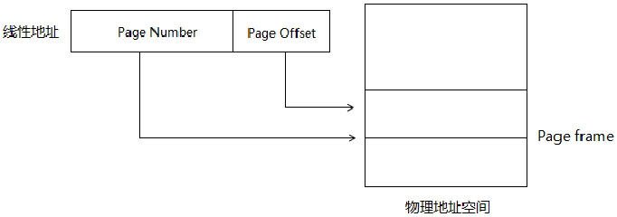

实际上, **Page Number 就是 Page 在物理地址的编号**.


## 2.1. 线性地址的 Page Number

由于存在**几种 paging 模式和几种页面的 size**, 因此 **Page Number 会不同**.

**线性地址除了 offset 以外的其余部分都是该线性地址的 page number！！！**.

### 2.1.1. 32 位 paging 模式下的 Page Number

32 位 paging 模式下有两种页面 size: 4K 页和 4M 页.

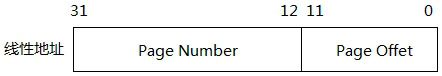

在上面的 4K 页面中, 32 位的线性地址中高 20 位为 Page Number, 低 12 位为 Page offset.

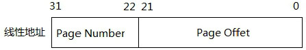

上面是**4M 页面**中的 Page Number 与 Page Offset.

### 2.1.2. PAE paging 模式下的 Page Number

在 PAE paging 模式下 4K 页的 Page Number 与 Page Offset 和在 32 位 paging 模式下是一致的. 在 2M 页面的 Page Number 和 Page Offset 如下.

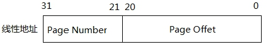

与 32 位 paging 模式下的 4M 页面仅仅是 Page Number 和 Page Offset 宽度不同.

### 2.1.3. IA-32e paging 模式下的 Page Number

在 IA-32e paging 模式下有效的 linear address 被扩展为 48 位, Page Number 将变得很宽.


我们看到, 上图中 4K 页面的 Page Number 有 36 位宽.


在 2M 页面下, Page Number 有 27 位宽.

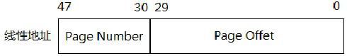

在 1G 页面下, Page Number 为 18 位宽, Page Offset 为 30 位宽.

## 2.2. TLB 中的转换

**TLB 的结构似乎挺神秘**, 笔者只能从 Intel64 手册里的描述**推断出 TLB 内部的结构**.


必须要说明的是, 这个查找过程是笔者的理解, **Intel64 手册里对此并没有描述(！！！**).

处理器**只维护**着**当前 PCID 对应的 TLB cache(！！！**), 关于 PCID 功能, 详情请参考 11.5.1.3 节的描述. 在 **TLB 里的每一个 entry**, 包含下面的信息.

1) **线性地址 Page Number**对应的**物理 Page frame**.

2) Page frame 的**属性**.

这个 page frame 的属性, 包括:

- U/S 标志(访问权限).
- R/W 标志(读/写权限).
- XD 标志(执行权限).
- Dirty 标志(已写状态).
- PCD, PWT 与 PAT 标志(page 的内存类型).

### 2.2.1. page frame 的访问权限

**各级 table entry**的**U/S 标志**决定最终 page frame 的访问权限. 这个最终的访问权限是采用"**从严"策略**, 也就是说:

1) 在**32 位 paging 模式**下, **PDE 和 PTE 只要有其中一个 table entry 属于 Supervisor 权限(！！！**), 那么最终的 page frame 就是**Supervisor 访问权限**.

2) 在**PAE paging 模式**下, **PDPTE、PDE 及 PTE**只要**其中一个是 Supervisor 权限(！！！**)的, 最终的 page frame 就属于 Supervisor 访问权限.

3) 在**IA\-32e paging 模式**下, **PML4E、PDPTE、PDE 及 PTE**只要**其中一个是 Supervisor 权限**的, 最终的 page frame 就是 Supervisor 访问权限.

**仅当所有 table entry 的 U/S=1**时, 最终 page frame 的 U/S 才为 1. 用计算式子来表达, 可以是(以 IA-32e paging 4K 页为例):

```x86asm
Page_frame.U/S=PML4E.U/S & PDPTE.U/S & PDE.U/S & PTE.U/S    ; 进行 AND 操作
```

page frame 的 U/S 值等于各级 table entry 的 U/S 标志进行 AND 操作.

### 2.2.2. page frame 的读/写权限

各级 table entry 的 R/W 标志决定最终 page frame 的读/写权限, 与上面所述的 U/S 标志情景一样, **仅当所有 table entry 的 R/W=1**时, 最终的 page frame 的 R/W=1, 同样用式子表达为(以 IA-32e paging 4K 页为例):

```x86asm
Page_frame.R/W=PML4E.R/W & PDPTE.R/W & PDE.R/W & PTE.R/W   ;  进行 AND 操作
```

page frame 的 R/W 值等于各级 table entry 的 R/W 标志进行 AND 操作.

### 2.2.3. page frame 的执行权限

当**table entry 的 XD 为 1**时, 指示为**不可执行的页**, 因此, 从表达上与上面两个权限是不同的, 同样基于"从严"的策略, 仅当所有 table entry 的 XD=0 时, page frame 的 XD 才为 0. 用式子表达为(IA-32e paging 4K 页为例):

```x86asm
Page_frame.XD=PML4E.XD | PDPTE.XD | PDE.XD | PTE.XD          ;  进行 OR 操作
```

page frame 的 XD 值等于各级 table entry 的 XD 进行 OR 操作. 这个 XD 需要在开启 Execution Disable 功能的前提下.

### 2.2.4. page frame 的有效条件

能在 TLB entry 中保存的 page frame, 必须是**有效的 page frame**. 它必须是最终的 P=1 并且保留位为 0, 同样可以用式子表达为(以 IA-32e paging 4K 页为例):

```x86asm
Page_frame.P=PML4E.P & PDPTE.P & PDE.P & PTE.P           ;  进行 AND 操作
```

**仅当各级 table entry 的 P 标志都为 1(！！！**)时, page frame 的 P 才为 1 值, 否则是**无效**的. 并且仅当各级 table entry 的保留位为 0 时, page frame 才为有效的.

一个无效的 page frame 处理器将不会在 TLB 中建立相应的 entry.

### 2.2.5. page frame 的 Dirty 状态

当对一个线性地址进行写操作时, 线性地址对应的 page frame 的 Dirty 属性为 1(D=1), 指示 page frame 内的某个地址已经被写过.

当 D=0 时发生写操作, 处理器会对内存中的 PDPTE(PS=1)、PDE(PS=1)或 PTE 的 D 标志置位. 处理器从不会对 D 标志进行清位操作.

### 2.2.6. page frame 的内存类型

**page frame**的**PCD**、**PWT**, 以及**PAT 标志**组合起来构成**线性地址**映射的**page 的内存 cache 类型**. 三个标志组合为一个**0~7 的数值**, 这个数值将对应 PAT 里定义的**内存 cache 类型**.

关于 PAT, 将在后面的 11.7 节里描述.

## 2.3. Global page

在处理器内部实现一个**全局的 TLB cache 结构(！！！**). **CR4.PGE=1(！！！**), 并当 **page frame** 是被定义为 **Global 页时(也就是 G 标志为 1**), 在 Global TLB 里(基于独立的 TLB, 或者 curreut PCID 的 TLB)实现这个 Global TLB entry.

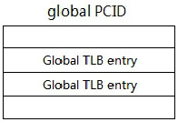

上图是笔者对 global page 在 TLB 实现的推测, 使用类似 global PCID 值而与当前 PCID 值不同, 当**使用 mov CR3,reg 指令对 TLB 进行刷新**时, **global PCID**的**TLB 中的 global TLB entry 不被刷新(！！！**), 继续保持有效.

## 2.4. TLB entry 的建立

当处理器对**首次成功访问的 page frame**(必须注意是**成功访问**, **失败的访问不会建立 TLB entry！！！**), 会在**当前 PCID 的 TLB(！！！**)里建立相应的**TLB entry 来保存 page frame**或者**建立 global TLB entry 来保存 global page frame(当 page 的 G=1 时！！！**).

这个**page frame 必须是已经被访问过**的(page 的**A 标志为 1**), 因此, TLB entry 中的 page frame 属性里**不必保留 A 标志**.

处理器只会为有效的 page frame 进行 cache. 这个有效的 page frame 条件是 11.6.1.2 节里所描述的. 对于无效的 page frame(例如: P=0), 处理器会产生\#PF 异常.


如上图所示, 对线性地址的访问中, 根据线性地址的 page number 在物理地址中的各级页转换表里找到最终的 page frame, 当它是有效的, 处理器会在 page number 对应的 TLB entry 里建立相应的 entry(或者说加载, 或者说 Cache fill 操作). 当 page 是 global 的, 处理器会在 global TLB entry 里建立对应的 entry.

### 2.4.1. 建立 TLB entry 的条件

处理器对首次成功的访问才会在 TLB 里建立**Page Number 对应**的**TLB entry**或**global TLB entry(是 global page 时**), page frame 能访问的条件是 1.2 节里所描述的.

1) **page frame 是有效的(P=1, A=1**).

2) 访问 page frame 的**各项权限是满足**的, 读/写操作时访问权限和读/写权限都需通过, 执行时执行权限需通过(实现 SMEP 功能时, 还要依赖于 SMEP 机制).

当**线性地址的 page number**对应的**TLB entry 建立**后, 下次对该 page 内地址进行访问时, 处理器会在**线性地址 page number(！！！**)对应的**TLB entry**里找到**page frame**, 而不用在内存里 walk 查找 page frame.

## 2.5. TLB entry 的维护

处理器会维持 TLB 中的 TLB entry 不变, 不会因为内存中各级的 table entry 被更改而修改 TLB entry. 可是, 如果遇到在内存中的 table entry 被更改时, 需要根据情况做手动的维护工作. 有两种情形会需要分别对待.

### 2.5.1. 主动刷新 TLB

有时候必须主动发起刷新 TLB, 可以使用 **INVLPG 指令(！！！**)对**当前 PCID 下**的**某个 TLB entry 进行刷新(某个！！！**), 代码如下.

```x86asm
invlpg [0x200000]       ;线性地址 0x200000 地址所在的 page frame
```

在上面这个示例中, 指令刷新的 TLB entry 需根据情况而定.

1) 如果线性地址 0x200000 使用**4K 页**, 它将**刷新 0x200(Page Number**)对应的 TLB entry.

2) 如果线性地址 0x200000 使用**2M 页**, 它将刷新**0x01(Page Number**)对应的 TLB entry.

以此类推到 4M 页和 1G 页上.

还可以使用**mov CR3, reg 或 mov CR4, reg 指令**通过**更新控制寄存器方式**来刷新**所有的 TLB entry(所有！！！**).

INVLPG 指令虽然**只能一次刷新一个 TLB entry**, 可是, 使用**INVLPG 指令**也可以对**当前 PCID**下**线性地址 page number 对应**的所有**Page\-Structure Cache entry 进行刷新(！！！**). 也可以对线性地址所对应的**global TLB entry 进行刷新(！！！**).

在一些情况下, 我们必须要主动刷新 TLB 来避免严重的错误, 下面进行一个实验来阐述这种严重性.

>实验 11-7: 一个未刷新 TLB 产生的后果

在这个实验里, 我们来看看一种需要刷新 TLB 的情形, 当页的映射模式更改时, 必须要刷新. 实验的源代码在 topic11\ex11-07\目录下.

代码清单 11-26(topic11\ex11-7\long.asm):

```x86asm
;  1) 下面打印 virtual address 0xfffffff810001000 各级 table entry 信息
      mov esi, msg0
      LIB32_PUTS_CALL
      mov rsi, 0xfffffff810001000
      call dump_long_page
      LIB32_PRINTLN_CALL
;  2) 写 virtual address 0xfffffff810001000, 将它 load into TLB
      mov rax, 0xfffffff810001000
      mov DWORD [rax], 0x55aa55aa
      mov esi, msg1
      LIB32_PUTS_CALL
;  3) 将 virtual address 0xfffffff810001000 改为 2M 页面
      mov rsi, 0xfffffff810001000
      call get_pdt
      or DWORD [rax + 80h * 8], PS              ;  PS=1
;  4) 下面再次打印 virtual address 0xfffffff810001000 各级 table entry 信息
      mov esi, msg0
      LIB32_PUTS_CALL
      mov rsi, 0xfffffff810001000
      call dump_long_page
      LIB32_PRINTLN_CALL
;  5) 第一次读 virtual address 0xfffffff810001000
      ;  注意: 这个读取在刷新 TLB 之前进行读取, 观察是否成功
      mov esi, msg2
      LIB32_PUTS_CALL
      mov rax, 0xfffffff810001000
      mov esi, [rax]
      LIB32_PRINT_DWORD_VALUE_CALL
      LIB32_PRINTLN_CALL
      LIB32_PRINTLN_CALL
      mov esi, msg3
      LIB32_PUTS_CALL
;  6) 刷新 TLB
      ;  现在, 主动发起刷新 virutal address 对应的 TLB
      mov rax, 0xfffffff810001000
      invlpg [rax]
;  7) 第二次读 virtual address 0xfffffff810001000
      ;  注意, 这个读取是在刷新 TLB 之后进行
      mov esi, msg4
      LIB32_PUTS_CALL
      mov rax, 0xfffffff810001000
      mov esi, [rax]
      LIB32_PRINT_DWORD_VALUE_CALL
      LIB32_PRINTLN_CALL
```

上面是整个实验的步骤, 在初始状态下 0FFFFFFF810001000 到 0FFFFFFF810001FFF 的区域是使用 4K 页映射的, 在第 2 步里:

```x86asm
;  2) 写 virtual address 0xfffffff810001000, 将它 load into TLB
      mov rax, 0xfffffff810001000
      mov DWORD [rax], 0x55aa55aa
```

这一步是测试的关键, 它的用途是写入一个值作为以后的读取值, 并且重要的是, 它会让处理器在 TLB 里建立相应的 TLB entry(在 page frame 加载到 TLB 中).

接下来, 笔者将 0xFFFFFFF810001000 到 0xFFFFFFF810001FFF 区域修改为 2M 页映射, 如下面代码所示.

```x86asm
;  3) 将 virtual address 0xfffffff810001000 改为 2M 页面
      mov rsi, 0xfffffff810001000
      call get_pdt
      or DWORD [rax + 80h * 8], PS              ;  PS=1
```

在上面的代码里, 将 0xFFFFFFF810001000 地址所对应的 PDE 表项的 PS 标志位直接修改为 1, PDE 的其他值保持不变. 经过修改后 0xFFFFFFF810001000 地址将是无效的(由于保留位不为 0), 接下来通过对这个地址读取来测试这个地址所对应的 page frame 是否在 TLB 中 cache.

```x86asm
;  6) 刷新 TLB
      mov rax, 0xfffffff810001000
      invlpg [rax]
```
在这里笔者通过使用指令 INVLPG 来刷新 0xFFFFFFF810001000 地址 page number 所对应的 TLB entry. 最后在后面第二次读取该地址.

下面是在笔者的 Westmere 架构 Core i5 处理器的笔记本上测试的结果.

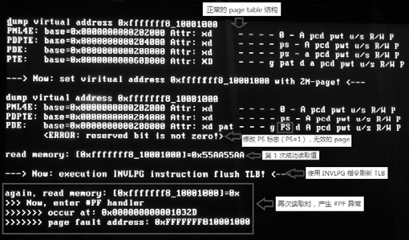

上面的结果中, dump\_long\_page()函数打印出的信息指示 0xFFFFFFF810001000 地址已经是无效的页面(由于直接修改 PS=1, 使用 2M 页面导致保留位不为 0), 然而由于 TLB entry 还存在这个页面对应的 page frame 的 cache 里, 导致从 0xFFFFFFF810001000 地址里还能正常读取到值 0x55AA55AA, 这个值是在上面的代码清单 11-25 的2)里写入的值.

这是一个严重的错误. 因此, 如果是 OS 的内存管理模块里更改了这种映射模式必须要进行刷新 TLB 操作.

在代码清单 11-26 的6)里通过对 TLB entry 的刷新, 在最后一次读取 0xFFFFFFF810001000 地址时产生了\#PF 异常, TLB 和 Page\-Structure Cache entry 已经被刷新.

现在, 我们回过头来看看**什么情况下需要主动刷新 TLB**, 在 Intel64 的手册里列举了一系列推荐的必须刷新的情形, 非常复杂和烦琐, 看得让人抓狂. 实际上这些情形需要进行细致的测试和实验才能准确地深入理解. 下面是笔者总结的两大类情况.

1) 当**指向 page frame**的**table entry 修改**时, 最终的 page frame 无论是由 PTE 指向修改为由 PDE 或 PDPTE 指向, 还是由 PDE 或 PDPTE 指向修改为由 PTE 指向. 也就是说, 4K 页面、2M 页或者是 1G 页映射的修改, 都需要**刷新 TLB**.

2) 当**任何一级的 table entry**中的**物理地址修改**时, 需要**刷新 TLB**(例如: **PDPTE**中提供的**PDE 物理基地址修改**时, 需要**刷新 TLB**).

#### 2.5.1.1. 刷新多个 TLB entry

在前面我们看到了如何对单个 TLB entry 进行刷新, 很多情况下需要**刷新多个 TLB entry**, 例如: 当将**一个区域的页面映射去掉**时, 假如这个区域使用**4K 页面映射**, **线性地址**为**0x200000**到**0x3FFFFF**. 那么这个区域将包含**512 个 4K 页面**, 将需要为这些 page number 进行逐个刷新.

```x86asm
      mov eax,  0x200000
;  下面进行逐个刷新
do_invalidate:
      invlpg [eax]                ;  刷新 page number 对应的 TLB entry
      add eax, 0x1000            ;  下一个 4K 页
      cmp eax, 0x3FFFFF
      jb do_invalidate
```

上面的代码是对逐个 4K 页的 page number 对应的 TLB entry 进行刷新的例子. 实际情况可以更复杂, 更多些, 在这种情况下可以使用**mov CR3, reg 指令**直接刷新**当前 PCID 下所有的 TLB entry**.

#### 2.5.1.2. 刷新所有的 TLB entry

当**CR4.PCIDE=0(不开启 PCIDE 机制！！！**)时, **mov CR3, reg**指令刷新**PCID=000H**下的**所有 TLB entry(除 global TLB entry 外**), 以及**PCID=000H**下**所有的 Paging\-Structure Cache entry**.

当 CR4.PCIDE=1(**开启 PCIDE 机制**)时:

```x86asm
mov cr3, 0x200001          ;  刷新 PCID 值为 001H 的所有 TLB entry
```

上面这条指令将刷新**PCID 值为 001H**下的**所有 TLB entry(除 global TLB entry 外！！！**), 并且也会**刷新 PCID=001H**下**所有的 Paging\-Structure Cache entry**.

```x86asm
mov rax, 0x8000000000200001         ;  bit63=1
mov cr3, rax                            ;  不会刷新 TLB entry
```

可是当**源操作数的 bit 63**位**为 1**时, 对**CR3 的更新不会刷新 TLB**.

#### 2.5.1.3. 刷新 global TLB entry

对**CR3 的更新不会刷新 Global page(！！！**), 可以使用**更新 CR4 的方式刷新 global page(！！！**).

```x86asm
mov eax, cr4
btc eax, 7                      ;  修改 CR4.PGE 位
mov cr4, rax                    ;  刷新所有的 TLB entry, 包括 global page
```

当对**CR4.PGE 位进行修改(由 0 改为 1 或由 1 改为 0**)时, 对**CR4 的更改**会**刷新所有的 global TLB entry**, 也包括**所有的 PCID 下的所有 TLB entry**和**所有 PCID 下的所有 Paging\-Structure Cache entry**. 将 CR4.PCIDE 标志从 1 改为 0, 也同样能达到这样的效果.

#### 2.5.1.4. 根据 PCID 来刷新 TLB

Intel64 提供了一个**新指令 INVPCID** 来根据提供的**invalidation type**和**descriptor**这两个操作数做相应的刷新操作.

**INVPCID 指令**是 **PCID 功能配套指令**, 需要处理器支持, 从 `CPUID.07H: EBX[10].INVPCID` 位里查询是否获得支持.

**INVPCID 指令**可以做到上面所说的**刷新 TLB entry**和**paging\-structure cache entry 的功能**, 它可以提供 **4 个 invalidation type**:

- **0 号 type**可以刷新**单个 entry**;
- **1 号 type**可以刷新**PCID 下的所有 entry(除了 global TLB entry**);
- **2 号 type**可以刷新**所有 PCID**的**所有 entry**(**包括 global TLB entry**);
- **3 号 type**可以刷新**所有 PCID 的所有 entry**(**除了 global TLB entry**).

```x86asm
mov rax, 2                           ;invalidation type 为 2
invpcid rax, [INVPCID_DESCRIPTOR]    ;提供 invpcid descriptor
```

上面将刷新**所有 PCID**的**所有 TLB entry**和**Paging\-Structure Cache entry**, **包括 global TLB entry**.


上面这个图是**INVPCID descriptor 的格式(16 字节, 128 位！！！**), **低 12 位**提供相应的**PCID 值**, 高 64 位提供线性地址, 它们的作用依据相应的 invalidation type 而不同.

### 2.5.2. 选择性地主动刷新 TLB

在 Intel 手册里列举了一些**不必立即进行主动刷新 TLB**的情形, 主要是**基于 table entry 的属性修改**, 我们可以认为这些修改操作**属于 OS 内存管理模块**的管理.

1) table entry 的 P 标志和 A 标志从 0 修改为 1 时, 不需要刷新 TLB entry. 因为处理器只有当 P 和 A 为 1 时, 才可能装载到 TLB entry 中. 它们这样的修改不会对后续产生不良的影响.

2) 当 page frame 的读/写权限 R/W 由 0 修改为 1 时, 意味着由原来的不可写变为可写的. 那么 OS 可以选择不立即进行刷新, 采取延迟刷新策略.

3) 当 page frame 的访问权限 U/S 由 0 修改为 1 时, 意味着由原来的 Supervisor 权限改变 User 权限. 那么 OS 也可以选择采取延迟刷新策略.

4) 当 page frame 的执行权限 XD 由 1 修改为 0 时, 意味着由原来的不可执行改为可执行. 那么 OS 也可以选择采取延迟刷新策略.

### 2.5.3. 延迟刷新 TLB

当遭遇上面的2)、3)和4)情形时, page frame 的 R/W 和 U/S 标志由 0 修改为 1, XD 标志由 1 修改为 0 时, 如果尝试对不可写的 page 进行写, 不可执行的 page 进行执行, 以及使用 User 权限进行访问将产生#PF 异常.

于是, 在\#PF handler 处理中, 可以对情况做出判断, 然后在\#PF handler 里再做出刷新 TLB entry 和 Page\-Structure Cache entry 的操作. 在后续的执行中, TLB entry 已经被刷新为正确的.

### 2.5.4. 需要刷新 TLB 的其他情形

当 page frame 的 P 标志由 1 改为 0 时, 我们需要进行刷新, 采用前面所描述的刷新多个 TLB entry 的方法实现, Intel64 手册里似乎没描述到.

1) 当 page frame 的 R/W 由 1 修改为 0 时, 意味着由原来的可写变为不可写.

2) 当 page frame 的 U/S 由 1 修改为 0 时, 意味着由原来的 User 权限改为 Supervisor 权限.

3) 当 page frame 的 XD 由 0 修改为 1 时, 意味着由可执行改为不可执行.

实际上, 上面这三种情况都应该需要刷新 TLB 和 Paging-Structure Cache.

现在, 我们回过头来仔细看看前面的实验 11-4"在#PF handler 里修复 XD 引起的错误".

在实验 11-4 里, 当尝试去执行一个不可执行的 page frame 时, 引发#PF 异常, 在#PF 异常里将 XD 标志由 1 改为 0 值.

因此, 实验 11-4 是属于可选择的刷新 TLB 的情形.

因此在可选择的刷新 TLB 情形中, 由于执行的失败产生#PF 异常, 在 TLB 或 Paging-Structure Cache 中并没有建立相应的 entry, 因此可以在#PF handler 里将 XD 标志从 1 修改为 0 值. 即使无效刷新也可以执行.

可是, 在上面的三种情形中, 如果 XD 标志由 0 改为 1, OS 必须要主动刷新 TLB 和 Paging-Structure Cache, 否则起不了相应的控制作用.

>实验 11-8: XD 由 0 修改为 1 时的情形

在实验 11-8 里, 我们还是以 XD 标志做测试, 我们在代码里测试 XD 由 0 修改为 1 时的情形.

代码清单 11-27(topic11\ex11-8\protected.asm):

```x86asm
;  1) 将测试函数复制到 0x400000 位置上
      mov esi, func
      mov edi, 0x400000                          ;  将 func()代码复制到 0x400000 位置上
      mov ecx, func_end – func
      rep movsb
      ;  设置 0x400000 地址最初为可执行
      mov DWORD [PT1_BASE + 0 * 8 + 4], 0
;  2) 第 1 次执行 0x400000 处的代码(此时是可执行的, XD=0), 目的是: 在 TLB 中建立相应的 TLB
entry
      call DWORD 0x400000
;  3) 将 0x400000 改为不可执行的, 但是此时没刷新 TLB
      mov DWORD [PT1_BASE + 0 * 8 + 4], 0x80000000
;  4) 第 2 次执行 0x400000 处的代码, 刷新 TLB 之前仍然是正常的(此时, XD=1)
      call DWORD 0x400000
;  5) 主动刷新 TLB, 使 0x400000 地址的 TLB 失效
      invlpg [0x400000]
;  6) 第 3 次执行 0x400000 处的代码, 将产生 #PF 异常
      call DWORD 0x400000
```

在代码清单 11-26 的 3)里将 0x400000 改为不可执行的(XD=1), 在 5)里才做出主动的刷新工作.

实验分 3 次来执行 0x400000 地址上的测试函数 func(), 第 1 次和第 2 次可以执行, 第 3 次由于已经刷了 TLB, 那么 0x400000 的 page number 对应的 TLB entry 是无效的. 因此由于不可执行而产生了\#PF 异常. 下面是运行的结果.

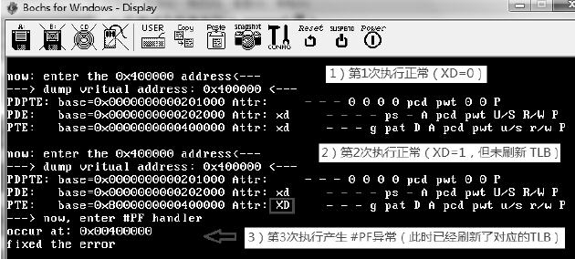

我们对比一下实验 11-4 及可选择性刷新 TLB 的情形的差异. 我们将结论推广至 R/W 和 U/S 标志. 当它们由 1 改为 0 时, 同样是需要主动刷新 TLB 的.

## 2.6. 多种形式的 TLB

与 Cache 一样, **TLB**实现了**Instruction(指令**)和**Data(数据**)两大类, 并且实现了**4K 页、4M 页和 2M 页面的 TLB 结构**.

### 2.6.1. Instruction TLB

处理器对首次**执行的代码 page**会在 Instruction TLB 里建立相应的 TLB entry(或者说加载 TLB, 相对应于 Segment 的加载). Intel 明确说明了在 Instruction TLB entry 里无须包含 R/W 和 D 标志位.

思考一下, 对于一个**可执行的 page frame**, 当**执行 page frame**和**读/写 page frame**时, 处理器会分别在**Instruction TLB**和**Data TLB**里进行**Cache**. 即, 会建立**两份 TLB entry**, 一份为**fetch 指令**, 一份为**访问数据**.

按照 Intel 的说法, 我们可以推断出上面的结论, 在 Instruction TLB 里只为 fetch 指令. 当**fetch 指令**时处理器从**Instruction TLB entry**里找**page frame**, 否则作为**读/写访问内存**时, 则从**Data TLB entry**里找到**page frame**.

#### 2.6.1.1. 指令 TLB entry 的建立

处理器对首次成功进行 fetch 指令的 page frame 建立相应的 TLB entry. 对首次 fetch 指令失败的 page frame 不会建立 TLB entry. 显然对于首次 fetch 指令时 XD=1 的 page frame 是不会建立 TLB entry 的, 从实验 11-4 里我们可以看到(在\#PF handler 里可以不用刷新 TLB entry 而修改了 XD 标志).

#### 2.6.1.2. fetch 指令

当**目标地址 page number**对应的**Instruction TLB entry 未建立**时, 属于首次 fetch 指令, 否则处理器将在 Instruction TLB entry 里查找 page frame, Instruction TLB entry 中的 page frame 属性里必定会包括 XD 标志位, 它用来判断 page frame 是否可执行.

当 fetch 指令时, 处理器从当前 ip/eip/rip 寄存器里得到指令的线性地址, 首次 fetch 指令时将在内存里 walk 找到最终的 page frame. 否则根据线性地址的 page number 在 Instruction TLB 找到相对应的 TLB entry, 再查看 page frame 的属性. 在 IA32\_EFER.NXE=1 的前提下, 当 XD=1 时, fetch 指令将失败.

当 IA32\_EFER.NXE=0 或者 XD=0 时, 在 Intel64 处理器上还会根据 SMEP(详见 11.5.6 节描述)机制来决定 fetch 指令.

1) 当 CR4.SMEP=1 时, 在 Supervisor 权限(0、1 和 2 级)下, 对属于 User 权限(U/S=1)的 page frame 进行 fetch 指令时, fetch 指令将失败.

2) 当 CR4.SMEP=0 时, 在 Supervisor 权限下可以对属于 User 权限的 page frame 进行 fetch 指令.

3) 在 User 权限(3 级)下, 只能对 User 权限的 page frame 进行 fetch 指令.

### 2.6.2. Data TLB

对于**读/写访问内存**, 处理器根据**线性地址 page number(！！！**)从 Data TLB 里找到相应的 TLB entry, 再根据 page frame 的属性判断访问是否合法.

基于 11.6.1.2 节里所描述的各种权限检查, 通过后使用 page frame 物理地址值加上线性地址的 page offset 得到最终目标物理地址.

### 2.6.3. 不同页面的 TLB

在 Intel 上可以通过 CPUID.02H leaf 来查询处理器上的 TLB 信息, 而在 AMD 上通过 CPUID.80000005H 和 CPUID.80000006H leaf 来查询. 我们从 Intel 关于 cache 和 TLB 信息的表格里可以看到有为 4K、2M 和 4M 页面使用的 TLB.

## 2.7. 使用小页代替大页

在处理器 TLB cache 的实现中, 可能会**以小页代替大页进行 Cache**, 例如: 对一个 2M 页面的映射方案, 处理器可以在 TLB entry 里以数个 4K 页面的 TLB entry 来代替.

假设, 0x200000 到 0x3FFFFF 的 2M 区域以 2M 页面来映射, 它的 Page Number 是 0x01, 如果代码中对 0x201000 到 0x203FFF 区域进行访问, 那么处理器可以采用:

1) 在 2M 页面的 TLB 里 Page Number 为 1 对应的 TLB entry 里 Cache 整个 2M 页面.

2) 在 4K 页面的 TLB 里使用 Page Number 为 0x201、0x202, 以及 0x203 对应的 TLB entry 里 Cache 3 个 4K 页面.

使用小页代替大页实现 Cache, 对软件层来说是没什么影响的. 软件层并不知道处理器内部是怎么 Cache 这些 TLB entry 的.

使用大页的好处是简单, 可是需要额外增加 TLB. 使用小页好处是重复有效地利用 TLB, 可是需要更多的 entry 来 Cache 一个大页. 一个典型的情况是, 在 Intel64 和 AMD64 的实现上并没有看到有 1G 页面的 TLB 存在. 因此, 我们可以推断 1G 页面必定是采用小页代替的(2M 页面或 4M 页面, 甚至 4K 页面).

# 3. Paging-Structure Cache

在**Intel64**中可以实现**另一种 Cache 技术**, 处理器**可以选择支持或不支持**这种 Cache.

paging\-structure cache 是与 TLB 互补的: **TLB 是 cache 线性地址对应的 page frame**, 而 **paging\-structure cache** 则是 **cache 页转换表中除 page frame 外的其他 table entry(！！！**).


上面这个图揭示了处理器在 32 位 paging 模式下进行 TLB entry 和 `Paging-Structure Cache entry` 建立的示意, 在 32 位 paging 模式下, **当前 PCID 值为 000H**(**PCID 功能只能用于 IA\-32e 模式！！！下**).

在 `Page-Structure Cache` 里可以建立 **3 种 table entry 的 cache entry**.

1) **PML4E cache entry**: 只使用于 **IA\-32e paging(！！！**)模式下.

2) **PDPTE cache entry**: 只使用于 **IA\-32e paging 模式**下, **PAE paging 模式**的**PDPTE**是在**PDPTE 寄存器里 cache(！！！**), 详见 11.4.1.2 节所描述的 PDPTE 寄存器.

3) **PDE cache entry**: 可以使用在**32 位 paging**、**PAE paging**和**IA-32e paging**模式下.

Paging\-Structure Cache**只对 paing\-structure 进行 cache(！！！**), 因此如上图所示, 在**32 位 paging**模式下如果**PDE 是指向最终的 4M page frame(！！！**), 那么**不存在对 PDE 的 cache(！！！**), 而是在 TLB entry 里对 PDE 进行 cache.

## 3.1. IA-32e paging 模式下的 Paging-Structure Cache

在 **IA-32e paging** 模式下, 处理器会对 PML4E、PDPTE 及 PDE 进行 cache, **依赖于 page size**.

1) 当使用**4K 页**映射时, 将对**PML4E, PDPTE 及 PDE 进行 cache**.

2) 当使用**2M 页映射**时, 将对**PML4E**和**PDPTE**进行 cache(此时**PDE 指向 page frame**).

3) 当使用**1G 页映射**时, 将对**PML4E 进行 cache**(此时 PDPTE 指向 page frame). 下面这个图对 PML4E、PDPTE 和 PDE cache 进行了概括.

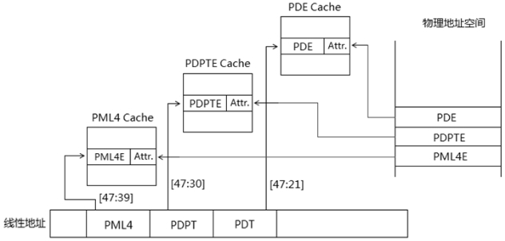

按照图中的理解, 似乎在 Paging-Structure Cache 中分别存在 PML4E-cache、PDPTEcache 和 PDE-cache 结构, Intel64 手册中并没有明确表明.

### 3.1.1. PML4E cache

如下图所示, 处理器对**线性地址**的 `[47: 39]` 即高 9 位**作为 **pml4e number**(注: Intel 上没有 pml4e number 术语**)在当前 PCID 下的 `Paging-Structure Cache` 对应的 entry 里建立 **PML4E cache entry**.

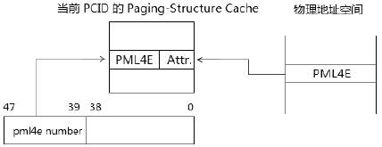

**PML4E cache entry**包括**下一级 PDPT** 的**物理基地址和相关的属性(！！！**), 这个属性包括:

1) R/W 标志.

2) U/S 标志.

3) XD 标志.

4) PCD 和 PWT 标志.

这些标志位直接来自于内存中的 PML4E 结构里, 同 TLB 的情形一致, **首次成功访问的 PML4E**能在 Paging-Structure Cache 里建立 PML4E-cache entry, PML4E 的 P 标志和 A 标志必定为 1. 访问失败(访问权限、读/写权限和执行权限不能通过, 保留位检查失败, 以及 P=0)是不会建立 PML4E\-cache entry 的.

### 3.1.2. PDPTE cache

处理器使用**线性地址的[47: 30]共 18 位**作为**pdpte number**(注: Intel 中无此术语), 在对应的当前 PCID 下的 Paging-Structure Cache entry 里建立 PDPTE-cache entry, 如下图所示.

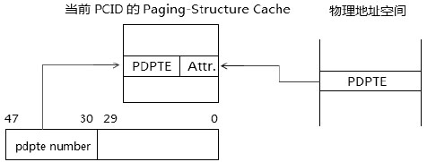

**PDPTE\-cache entry 里提供 PDT 的物理基地址**, 它的**属性**包括:

1) R/W 标志, 它的最终取值是 PDPTE 的 R/W 与 PML4E 的 R/W 进行与操作.

2) U/S 标志, 它的最终取值是 PDPTE 的 U/S 与 PML4E 的 U/S 进行与操作.

3) XD 标志, 它的最终取值是 PDPTE 的 XD 与 PML4E 的 XD 进行或操作.

4) PCD 和 PWT 标志, 来自于内存中的 PDPTE 结构.

我们可以看出, 这同样出于"从严"的策略, 详情请看 11.6.1.2 节所描述的权限设置. 同样, 处理器对首次成功访问的 PDPTE 建立 PDPTE-cache entry.

当使用 1G 页面时, PDPTE 指向 page frame, 此时 PDPTE 不会被 cache.

### 3.1.3. PDE cache

处理器使用**线性地址的[47: 21]共 27 位**作为 pde number(注: Intel 中无此术语), 在对应的当前 PCID 下的 Paging-Structure Cache entry 里建立 PDE-cache entry, 如下图所示.


PDE\-cache entry 提供 PT 的物理基地址, 它的属性包括:

1) R/W 标志, 它的最终取值是 PDE 的 R/W 与 PML4E 及 PDPTE 的 R/W 进行与操作.

2) U/S 标志, 它的最终取值是 PDE 的 U/S 与 PML4E 及 PDPTE 的 U/S 进行与操作.

3) XD 标志, 它的最终取值是 PDE 的 XD 与 PML4E 及 PDPTE 的 XD 进行或操作.

4) PCD 和 PWT 标志, 来自于内存中的 PDE 结构.

处理器对首次成功访问 PDE 建立 PDE-cache entry, 当使用 2M 页时, PDE 指向 page frame, 它将不会被 cache.

思考一下, 每一个 PML4E-cache entry 将维护 512G 的地址空间, 每一个 PDPTE-cache entry 将维护 1G 的地址空间, 每一个 PDE 将维护 2M 的地址空间.

PML4E-cache entry 更新的频率很低, PDPTE-cache entry 也不会经常更新.

## 3.2. PAE paging 模式下的 Paging-Structure Cache

PAE paging 模式里的 4 个 PDPTE 被加载到 PDPTE 寄存器里, 详见 11.4.1.2 节所描述的 PDPTE 寄存器. 导致 PAE paging 模式里只有 PDE\-cache.

### 3.2.1. PAE paging 模式的 PDE cache

处理器使用 32 位线性地址中的[31: 21]作为 pde number, 在 PCID=000H 的 Paging-Structure Cache 里建立相应的 PDE-cache entry, 如下图所示.

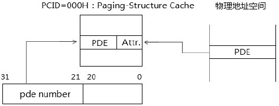

当 PDE 指向最终的 page frame 时, PDE-cache entry 也不会被建立, 实际上就没有 Paging-Structure Cache 了. 因此, 在 PAE paging 模式只有在使用 4K 页面下处理器才会建立 PDE-cache entry.

PDE-cache entry 提供了 PT 的物理基地址, PDE-cache entry 的属性来自内存中的 PDE 结构, 包括:

1) R/W 标志.

2) U/S 标志.

3) XD 标志.

4) PCD 和 PWT 标志.

由于 PAE paging 模式的 PDPTE 不存在 R/W、U/S 及 XD 标志, 详见 11.4.3 节图所示. 因此这些属性来自 PDE 结构.

## 3.3. 32 位 paging 模式下的 Paging-Structure Cache

32 位 paging 模式下只有 PDE-cache entry 要被建立, 如果 PDE 指向 page frame, PDE-cache entry 也不会被建立. 因此, 在 32 位 paging 模式下只有使用 4K 页面才会建立 PDE-cache entry.


处理器使用 32 位线性地址的[31: 22]作为 pde number 在对应的 PCID=000H 下的 Paging-Structure Cache 里建立 PDE-cache entry.

PDE-cache entry 提供 PT 的物理地址, PDE-cache entry 的属性来自内存中的 PDE 结构, 包括:

1) R/W 标志.

2) U/S 标志.

3) PCD 和 PWT 标志.

在 32 位 paging 模式下不支持 Execution Disable 功能, 因此不存在 XD 标志.

## 3.4. Paging-Structure Cache 的使用

处理器依据不同的 page size 建立不同的 TLB entry 和 Paging-Structure Cache entry, 在线性地址转换为物理地址的过程中, 处理器会进行以下的转换.

处理器在访问内存时寻找目标 page frame 有严格的先后查找次序: 首先, 在 TLB 里查找 page frame 信息, 找到就直接访问内存; 其次, **当在 TLB miss 时(TLB 找不到**), 在**Paging\-Structure Cache 里**逐级从**PDE\-entry、PDPTE\-entry 及 PML4E\-entry(顺序！！！**)里查找; 最后在 Paging-Structure Cache 里也找不到时, 就只好老老实实在内存里 walk 下去.

**Paging\-Structure Cache 的作用和目的**是: 尽量**减少在内存中的查找步骤**, **能省多少就省多少**.

### 3.4.1. 使用 TLB entry

处理器使用不同宽度的线性地址 page number(详见 11.6.1.1 节)在当前 PCID(不支持时, PCID=000H)或 global PCID 下查找对应的 TLB entry.

当找到对应的 TLB entry 时, 处理器使用 TLB entry 中的 page frame 地址加上线性地址的 page offset 得到最终的物理地址.

当处理器查找不到对应的 TLB entry 时, 使用 Paging-Structure Cache entry 进行转换, 情形如下.

### 3.4.2. 使用 PDE-cache entry

当处理器没有查找到 TLB entry 时, 使用线性地址的 PDE Number 在当前 PCID(不支持时为 000H)来查找对应的 PDE-cache entry.

如前所述, PDE number 在 IA-32e paging 模式下是线性地址的[47: 21]位, 在 PAE paging 模式下是线性地址的[31: 21]位, 在 32 位 paging 模式下是线性地址的[31: 22]位.

当找到对应的 PDE-cache entry 时, 处理器使用 PDE-cache entry 里的物理地址在物理地址空间定位 PT, 再使用线性地址的 PTE index 在 PT 里获得 PTE 表项, 得到最终的 page frame.

PTE index 在 32 位 paging 模式下是线性地址的[21: 12]位, 在 IA-32e paging 和 PAE paging 模式下是线性地址的[20: 12]位.

注意: 需要使用到 PDE-cache entry 时, 必定是使用 4K 页面来映射.

当找到 PDE-cache entry 时, 此时是使用 4K 页面映射, 而使用 2M、4M 和 1G 页面的映射方式并不存在 PDE-cache entry.

### 3.4.3. 当查找不到对应的 PDE-cache entry 时

在 32 位 paging 模式和 PAE 模式下, 在查找不到对应的 TLB entry 和 PDE-cache entry 的情况时, 处理器使用原始的方式, 在内存中的各级 table 里进行 walk, 直到查找到最终的 page frame.

1) 在 PAE paging 模式下, 线性地址的[31: 30]对应一个 PDPTE 寄存器, 在 PDPTE 寄存器里得到 PDT, 线性地址的[29: 21]对应一个 PDE 项, PDE.PS=1 时指向 2M page frame, 否则得到 PT. 线性地址的[20: 12]对应一个 PTE, 得到最终的 4K page frame.

2) 在 32 位 paging 模式下, 线性地址的[31: 22]对应一个 PDE, PDE.PS=1 时指向 4M page frame, 否则得到 PT, 线性地址的[21: 12]对应一个 PTE, 得到最终的 4K page frame.

在正确到得 page frame 后, 处理器会进行 TLB entry 和 PDE-cache entry 的建立.

### 3.4.4. 使用 PDPTE-cache entry

在 IA-32e paging 模式下, 在查找不到对应的 TLB entry 和 PDE-cache entry 时, 处理器继续使用线性地址的[47: 30]作为 pdpte number 在当前 PCID 下查找 PDPTE-cache entry.

当找到对应的 PDPTE-cache entry 时, 处理器使用 PDPTE-cache entry 里的物理地址在物理地址空间里定位 PDT, 再 walk 下去直到得到最终的 page frame.

### 3.4.5. 使用 PML4E-cache entry

在 IA-32e paging 模式下, 在查找不到对应的 TLB entry、PDE-cache entry, 以及 PDPTE-cache entry 时, 处理器继续使用线性地址的[47: 39]作为 pml4e number 在当前 PCID 下查找 PML4E-cache entry.

当找到对应的 PML4E-cache entry 时, 处理器使用 PML4E-cache entry 里的物理地址在物理地址空间里定位 PDPT, 再 walk 下去直到得到最终 page frame.

思考一下, Paging-Structure Cache 的引进, 是为了尽量减少在内存中 walk 的步骤, 从而提高页转换的效率.

在**AMD64**中似乎**没有提供类似 Paging\-Structure Cache 的技术**. 在 Intel64 上 Paging-Structure Cache 依赖于处理器的实现, 在软件层上无须关注处理器是否实现.