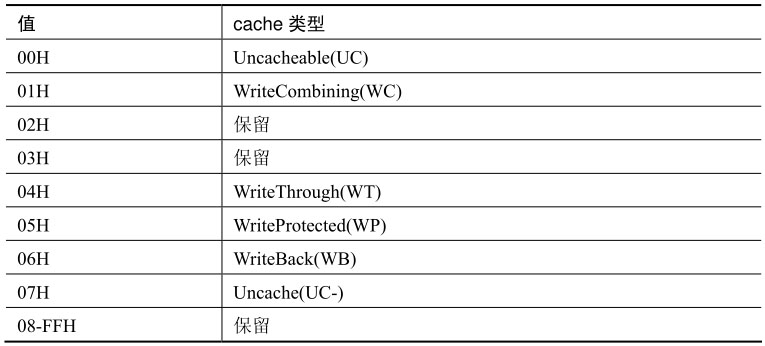
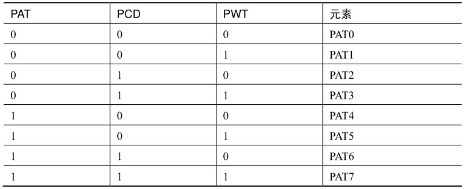
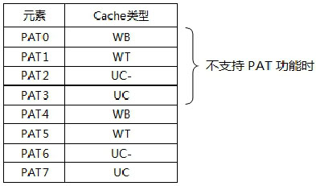

<!-- @import "[TOC]" {cmd="toc" depthFrom=1 depthTo=6 orderedList=false} -->

<!-- code_chunk_output -->

- [1. 基本原理](#1-基本原理)
  - [1.1. 检测是否支持 PAT 功能](#11-检测是否支持-pat-功能)
- [2. PAT(Page Attribute Table)](#2-patpage-attribute-table)
  - [2.1. 默认的 PAT](#21-默认的-pat)
  - [2.2. PCD(Page Cache Disable)标志位](#22-pcdpage-cache-disable标志位)
  - [2.3. PWT(Page Write Through)标志位](#23-pwtpage-write-through标志位)
- [3. PAT MSR](#3-pat-msr)
- [4. 各级 table entry 的 PCD 及 PWT 标志](#4-各级-table-entry-的-pcd-及-pwt-标志)

<!-- /code_chunk_output -->

# 1. 基本原理

在 **x86/x64** 里可以为**一个物理地址区域**定义一个**内存的 cache 类型**, **每个 cache 类型**对应**一个值**. 在 Intel 处理器上这个 cache 类型可以为以下类型.

定义一个**物理地址区域的 cache 类型**, 可以使用以下两种方法.

1) 使用 **MTRR** 来定义.

2) 使用 **page 的 PAT、PCD 与 PWT 标志**来定义.

使用 `MTRR` 可以对 `Fixed-range`和 `Variable-range` 进行定义, 详见 7.2 节描述.

## 1.1. 检测是否支持 PAT 功能

使用 `CPUID.01H: EDX[16].PAT` 位来检测**处理器是否支持 PAT 功能**, 在**不支持 PAT 功能**的处理器上将**使用默认的 cache 类型**.

在支持 PAT 功能后, 可以在**指向最终 page frame 的 table entry**(即 **PTE** 或 `PDE.PS=1` 时的 **PDE**, 或者 `PDPTE.PS=1` 时的 **PDPTE**)的 **PAT 位置位**, **开启 Page Attribute Table 定义**.

# 2. PAT(Page Attribute Table)

PAT 由**8 个元素**构成, 分别为 PAT0 到 PAT7, 如下表所示.

> PAT0 ~ PAT7 是 8 个默认值, PAT 的值是通过设置 PAT MSR 表示??

上表中的 **PAT、PCD 和 PWT** 对应于 **page 的 PAT、PCD 和 PWT 标志位**, 由这三个标志位组合为 0 到 7 的数值, **对应一个 PAT 元素**.

## 2.1. 默认的 PAT

处理器在**上电**或 **reset** 后, **PAT MSR** 内的元素使用**默认的内存 cache 类型**.

* 在**不支持 PAT 功能**时, 使用 **PCD 和 PWT 标志组合**成**2 位的值 0~3**, **对应于 PAT 的 PAT0 到 PAT3 元素(！！！**).

* 当**支持 PAT 功能**时, 可以使用 **WRMSR 指令**修改**默认 PAT** 中的 cache 类型.

> 这里说的 默认 PAT 是指 PAT MSR?

## 2.2. PCD(Page Cache Disable)标志位

PCD 标志位**指示 page 是否可被 cache**, 如下图所示.

在默认的 PAT 里

* `PCD=0` 时, 定义可被 cache 的类型.

* `PCD=1` 时, 定义 uncache(**不可 cache**)类型

此时根据 **PWT** 标志确定属于 `UC-`(弱)还是 `UC`(强).

## 2.3. PWT(Page Write Through)标志位

PWT 标志位**指示 page 是 WriteThrough 还是 WriteBack 的 cache 类型**, 如下图所示.

# 3. PAT MSR

在 **MSR** 中提供了一个 **64 位**的 **IA32_PAT** 寄存器用来**定义 PAT**, 如下图所示.

`IA32_PAT` 寄存器的**每个字节**(`8 bits`)对应一个**PAT 元素(！！！**), 所定义的 Cache 类型必须是**有效的 cache 类型(保留的必须为 0 值**).

如前面所述, 在**处理器** `power-up` 或 **reset** 时, 这个 `IA32_PAT` 里的元素使用**默认的 cache 类型**.

**IA32_PAT 寄存器的地址是 277H**, 软件可以在 **0 级权限**下使用 **WRMSR 指令**对 `IA32_PAT` 寄存器进行重新设置.

# 4. 各级 table entry 的 PCD 及 PWT 标志

**PAT** 标志**只**使用于 **page frame** 上, 而 **PCD** 和 **PWT** 标志可以使用在**所有的 table entry 结构**和**CR3**里.

因此有下面的关系.

1) **CR3** 里的 **PCD** 和 **PWT** 标志控制 **PML4T** 的 **cache 类型**(`IA-32e paging` 模式下), 或者 PDT 的 cache 类型(32 位 paging 模式下).

2) 在 PAE paging 模式下, PDPTE 在 PDPTE 寄存器里保存, 因此无须对 PDPT 进行 cache.

3) 在 `IA-32e paging` 模式下, **PML4E** 的 **PCD** 和 **PWT** 控制 **PDPT** 的 **cache 类型**.

4) 在 `IA-32e paging` 模式下, **PDPTE** 的 **PCD** 和 **PWT** 控制 **PDT** 的 **cache 类型**. 如果是 **1G 页面映射**的, **PDPTE** 的 **PAT**、**PCD** 和 **PWT** 将控制 **1G page frame** 的 **cache 类型**.

5) 在 PAE paging 模式下, 4 个 PDPTE 寄存器分别控制 PDT 的 cache 类型.

6) **PDTE** 的 **PCD** 和 **PWT** 标志控制 **PT** 的 **cache** 类型. 如果是 **2M** 或 4M 页面映射的, **PAT**、**PCD** 和 **PWT** 将控制 **page frame** 的 **cache 类型**.

7) 最后, **PTE** 的 **PAT**、**PCD** 和 **PWT** 标志将控制 4K page frame 的 **cache 类型**.

值得注意的是它们三者的排列组合必须严格按照上面的 PAT 所示、PAT, PCD, 再到 PWT 标志.