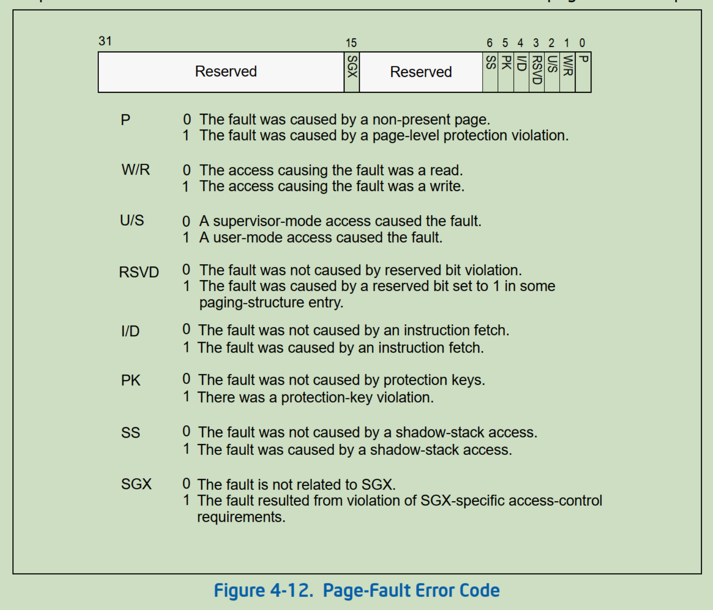

<!-- @import "[TOC]" {cmd="toc" depthFrom=1 depthTo=6 orderedList=false} -->

<!-- code_chunk_output -->

- [1. 访问权限位 U/S 的检查](#1-访问权限位-us-的检查)
  - [1.1. U/S 权限位的判定](#11-us-权限位的判定)
- [2. 读/写权限位 R/W 的检查](#2-读写权限位-rw-的检查)
  - [2.1. R/W 权限位的判定](#21-rw-权限位的判定)
- [3. 执行权限位 XD 的检查](#3-执行权限位-xd-的检查)
  - [3.1. XD 权限位的判定](#31-xd-权限位的判定)
- [4. 缺页保护 P 标志位的检查](#4-缺页保护-p-标志位的检查)
  - [4.1. P 标志位的判定](#41-p-标志位的判定)
- [5. 保留位的检查](#5-保留位的检查)

<!-- /code_chunk_output -->


在 paging 里, 处理器会对访问各级 table entry 及最终的 page frame 进行以下的检查.



1) 访问权限位 U/S 的检查.

2) 读/写权限位 R/W 的检查.

3) 执行权限位 XD 的检查.

4) 缺页保护位 P 的检查.

5) 保留位的检查.

# 1. 访问权限位 U/S 的检查

**各级 table entry** 的 U/S 标志组合起来最终决定了 page frame 的访问权限.

1) `U/S = 0` 时, 属于 Supervisor 访问权限.

2) `U/S = 1` 时, 属于 User 访问权限.

对于一个 page frame 进行读/写访问时, `U/S=0` 时, 只能在 CPL=0、1 或 2 级权限下访问. `U/S=1` 时 CPL 可以在任何权限级别下进行访问.

对于一个 page frame 进行执行访问时, U/S=0 时, 只能在 CPL=0、1 或 2 级权限下执行. `U/S=1` 时依赖于 SMEP 功能(详见 11.5.6 节描述)是否开启:

* 当 `CR4.SMEP=1` 时, 只能在 CPL=3 级权限下执行;

* 当 `CR4.SMEP=0` 时(或不支持 SMEP 时), CPL 可以在任何权限级别下执行.

## 1.1. U/S 权限位的判定

一个 page frame 的最终 U/S 由**各级 table entry** 的 U/S 进行**组合**, 另见 11.6.1.2 节所描述的 page frame 的访问权限.

> 各级 table entry 的 U/S 进行 **与** 操作

1) 在 IA-32e paging 模式下的 4K 页面映射中.

```x86asm
Page_frame.U/S = PML4E.U/S & PDPTE.U/S & PDE.U/S & PTE.U/S   ; 进行 AND 操作
```

由 PML4E、PDPTE、PDE, 以及 PTE 的 U/S 进行 AND 操作, 得出最终 4K page frame 的 U/S 标志位值.

2) 在 IA-32e paging 模式下的 2M 页面映射中.

```x86asm
Page_frame.U/S = PML4E.U/S & PDPTE.U/S & PDE.U/S  ; 进行 AND 操作
```

由 PML4E、PDPTE, 以及 PDE 的 U/S 进行 AND 操作, 得出最终 2M page frame 的 U/S 值.

3) 在 IA-32e paging 模式下的 1G 页面映射中.

```x86asm
Page_frame.U/S = PML4E.U/S & PDPTE.U/S    ; 进行 AND 操作
```

由 PML4E 和 PDPTE 的 U/S 标志进行 AND 操作, 得出最终的 1G page frame 的 U/S 值.

4) 在 PAE paging 和 32 位 paging 模式下的 4K 页面映射中.

```x86asm
Page_frame.U/S = PDE.U/S & PTE.U/S    ; 进行 AND 操作
```

由 PDE 和 PTE 的 U/S 标志进行 AND 操作, PAE 模式下 PDPTE 不存在 U/S 标志位.

5) 在 PAE paging 模式和 32 位 paging 下的 2M 和 4M 页面映射中.

```x86asm
Page_frame.U/S = PDE.U/S                                         ;  2M/4M page frame 的 U/S
```

2M 和 4M 页面 page frame 的 U/S 来自于 PDE 里的 U/S 值.

# 2. 读/写权限位 R/W 的检查

各级 table entry 的 R/W 标志位组合起来决定了最终 page frame 的读/写权限.

1) `R/W = 0` 时, page frame 是 Read-Only(**只读的**).

2) `R/W = 1` 时, page frame 是 Read/Write(**可读可写的**).

在任何权限下可以对读/写的页进行写操作. 当 `R/W = 0` 时, 在 `CPL = 3` 级权限下, 不能对 page frame 进行写操作.

在 CPL=0、1 或 2 级权限下, 依赖于是否开启 `CR0.WP`(Write Protection) 功能.

* 当 `CR0.WP = 1` 时, Supervisor 权限也不能对 Read-Only 页进行写操作;

* 当 `CR0.WP = 0` 时, Supervisor 可以对 Read-Only 页进行写操作.

## 2.1. R/W 权限位的判定

> 各级 table entry 的 R/W 进行 **与** 操作

R/W 标志位与 U/S 标志位所遭遇的情形一致. 上面 11.8.1 节里所描述符的 U/S 权限位的判定方式适合于 R/W 标志位(上面的计算式子中将 U/S 标志改为 R/W 标志位).

# 3. 执行权限位 XD 的检查

在 PAE paging 模式和 IA-32e paging 模式下, 可以使用 XD 标志位来限制对 page frame 的执行. 在 32 位 paging 模式下 page frame 总是被允许执行的.

1) `XD = 1` 时, page frame **不能被执行**.

2) `XD = 0` 时, page frame **允许执行**.

`IA32_EFER.NXE` 控制 Execution Disable 功能的开启, `IA32_EFER.NXE = 1` 时, XD 标志位有效. 否则为保留位, 必须为 0 值.

当 `IA32_EFER.NXE = 1` 并且 `XD = 1` 时的 page frame 不能执行, 否则 page frame 被允许执行. page frame 的执行检查, 还依赖于前面所述的 `CR4.SMEP` 控制位.

在 XD=0 的前提下:

* 当 `CR4.SMEP = 1` 时, 在 CPL=0、1 或 2 级权限下**不能**执行 User 权限的 page frame

* 当 `CR4.SMEP = 0` 时, 允许 Supervisor 对 User 的 page frame 执行.

## 3.1. XD 权限位的判定

> 各级 table entry 的 XD 进行 **或** 操作, 主要是因为 XD 是 (Execution Disable, 禁止执行)

同样, page frame 的 XD 值由各级 table entry 的 XD 标志组合起来决定.

1) 在 IA-32e paging 模式下的 4K 页面映射中.

```x86asm
Page_frame.XD = PML4E.XD | PDPTE.XD | PDE.XD | PTE.XD   ; 进行 OR 操作
```

由 PML4E、PDPTE、PDE, 以及 PTE 的 XD 进行 OR 操作, 得出最终 4K page frame 的 XD 标志位值.

2) 在 IA-32e paging 模式下的 2M 页面映射中.

```x86asm
Page_frame.XD = PML4E.XD | PDPTE.XD | PDE.XD             ; 进行 OR 操作
```

由 PML4E、PDPTE, 以及 PDE 的 XD 进行 OR 操作, 得出最终 2M page frame 的 XD 值.

3) 在 IA-32e paging 模式下的 1G 页面映射中.

```x86asm
Page_frame.XD = PML4E.XD | PDPTE.XD                           ; 进行 OR 操作
```

由 PML4E 和 PDPTE 的 XD 标志进行 OR 操作, 得出最终的 1G page frame 的 XD 值.

4) 在 PAE paging 模式下的 4K 页面映射中.

```x86asm
Page_frame.XD = PDE.XD | PTE.XD                                ; 进行 OR 操作
```
由 PDE 和 PTE 的 XD 标志进行 OR 操作.

5) 在 PAE paging 模式的 2M 页面映射中.

```x86asm
Page_frame.XD = PDE.XD                         ;  2M page frame 的 XD
```

2M page frame 的 XD 来自于 PDE 里的 XD 值.

由上面的 page frame XD 值来看, 只要有任何一级 table entry 的 XD 为 1 时, 所对应的 page frame 就是不可执行的.

# 4. 缺页保护 P 标志位的检查

同样, 各级 table entry 的 P 标志位组合起来决定了最终 page 是否被提交到物理地址空间中.

1) P=0 时, 不存在内存中.

2) P=1 时, 已在内存中.

处理器对访问 P=0 的 page frame 会产生 `#PF` 异常.

## 4.1. P 标志位的判定

> 各级 table entry 的 P 进行 **与** 操作

在线性地址的访问中, 仅当在转换物理地址过程中**所有 table entry** 的 `P = 1` 时, 页的转换才是成功的. 这与 U/S 标志及 R/W 标志位所遭遇的情形是一致的(在 11.8.1 节的计算式子中 U/S 标志位换为 P 标志位), 也就是所有 table entry 的 P 标志位进行与操作.

# 5. 保留位的检查

当各级 table entry 的保留位不为 0 时, table entry 是无效的, 会产生#PF 异常.

关注下列 table entry 中的保留位.

1) 11.3.2.2 节中的 32 位 paging 模式下的 4M 页面的 PDE 结构保留位.

2) 11.4.4.1 节中的 PAE paging 模式下的 2M 页面的 PDE 结构保留位.

3) 11.4.4.2 节中的 PAE paging 模式下的 4K 页面的 PDE 结构保留位.

4) 11.4.5 节中的 PAE paging 模式下的 PTE 结构保留位.

5) 11.5.2 节中的 IA-32e paging 模式下 PML4E 结构保留位.

6) 11.5.3.1 节中的 IA-32e paging 模式下 1G 页面 PDPTE 结构保留位.

7) 11.5.3.2 节中的 IA-32e paging 模式下 4K/2M 页面 PDPTE 结构保留位.

8) 11.5.4 节中的 IA-32e paging 模式下 2M 页面 PDE 结构保留位.

9) 11.5.4 节中的 IA-32e paging 模式下 4K 页面 PDE 结构保留位.

10) 11.5.5 节中的 IA-32e paging 模式下的 PTE 结构保留位.

在这些保留位检查中, 许多 table entry 的保留位依赖于 MAXPHYADDR 值.

1) 当 MAXPHYADDR 为 36 时, table entry 的 [51: 36] 为保留位.

2) 当 MAXPHYADDR 为 40 时, table entry 的 [51: 40] 为保留位.

3) 当 MAXPHYADDR 为 52 时, table entry 的 [51: 12] 为有效位.

当 IA32_EFER.NXE=1 时, bit63 是 XD 标志位, 否则为保留位, 须为 0 值.

下面的保留位检查将产生 `#GP` 异常.

1) 11.4.3 节的 PAE paging 模式下的 PDPTE 结构保留位.

2) 11.5.1.1 节的 CR3 结构中的保留位.