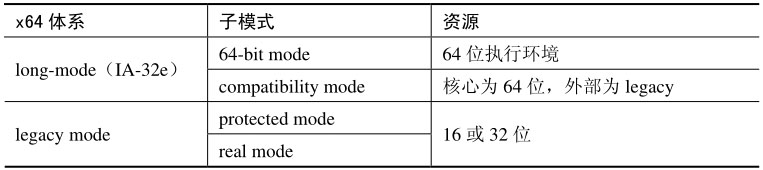

<!-- @import "[TOC]" {cmd="toc" depthFrom=1 depthTo=6 orderedList=false} -->

<!-- code_chunk_output -->

- [1 x64 体系](#1-x64-体系)
- [2 long\-mode 与 IA\-32e 模式](#2-long-mode-与-ia-32e-模式)
- [3 legacy 模式](#3-legacy-模式)
- [4 64 位模式与 compatibility 模式](#4-64-位模式与-compatibility-模式)

<!-- /code_chunk_output -->

# 1 x64 体系

x86\-64 体系是由 AMD 提出和实现的, 在原 x86 的 32 位基础上扩展为 64 位技术. 现在 x86\-64 常被称为 x64, 以区别于原来的 x86 体系. AMD64 架构被 AMD 用来标榜它的 x64 架构, Intel 虽然接纳和使用了 x64, 但现在称自己的 x64 实现为 Intel64 架构, 以区别于 AMD64.

上表显示了 x64 体系中的两大模式: long\-mode(IA\-32e)与 legacy 模式, 下面还可以区分两个子模式. 当然并没有将 virtual 8086 模式与 SMM 模式归纳进去.

# 2 long\-mode 与 IA\-32e 模式

在 x64 体系中最重要的就是引入了 long\-mode, long-mode 的开启使得处理器可以进入 64 位的执行环境. 在 Intel64 中, long-mode 被称为 IA-32e 模式, 它们是指同一事物. 虽然是同一事物, 实现上还是有细微的区别, 但并不影响整体架构的兼容.

# 3 legacy 模式

相对 long\-mode 来说, 在 x86 上原有的实模式和保护模式被统称为 legacy 模式. 实际上被称为 legacy x86 mode 模式或许更能说明问题, 本质上 long-mode 也是属于 protected mode(保护模式)的扩展.

# 4 64 位模式与 compatibility 模式

在 long\-mode 下有两个子模式: **64 位模式**和**compatibility**模式. 在 64 位模式里处理器处于 64 位的执行环境. compatibility 模式比较特别, 这也是 x64 成功之处. 从 OS 的角度看, **核心使用 64 位执行环境**, 外部对于应用程序接口使用 legacy 模式. 怎么理解这个现象呢?

在**compatibility**模式下**部分系统数据结构还是 64 位**环境. **GDTR 与 IDTR 的值不变**, GDTR.base 与 IDTR.base 仍使用 64 位值. GDT 与 IDT 中的 gate 描述符仍是 64 位结构. 运行在 compatibility 模式的代码当发生异常或者使用中断调用, 代码必须切换到 64 位模式运行.

在 compatibility 模式下, **有效的线性地址**属于 legacy 模式下的 32 位. 处理器仍使用 64 位的 paging 结构(IA\-32e paging)进行页转换.